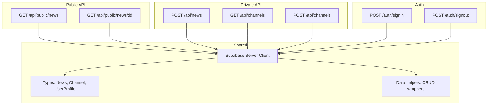
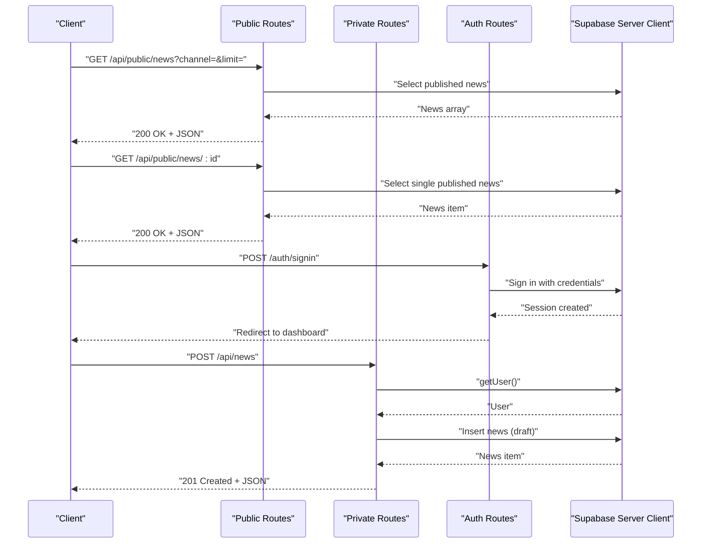
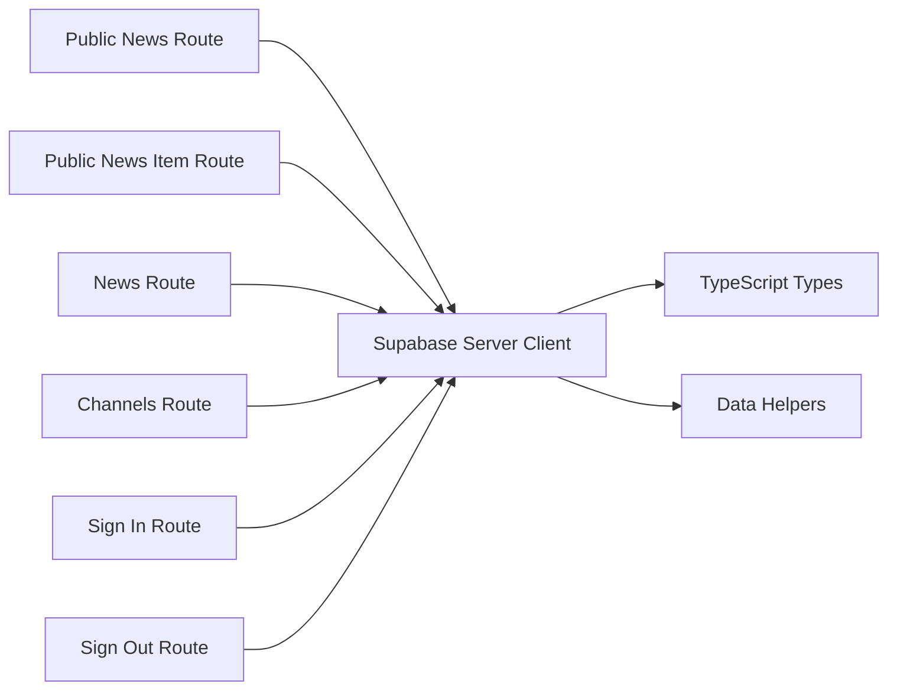

# API Reference

<cite>
**Referenced Files in This Document**
- [app/api/public/news/route.ts](file://app/api/public/news/route.ts)
- [app/api/public/news/[id]/route.ts](file://app/api/public/news/[id]/route.ts)
- [app/api/news/route.ts](file://app/api/news/route.ts)
- [app/api/channels/route.ts](file://app/api/channels/route.ts)
- [lib/supabase/server.ts](file://lib/supabase/server.ts)
- [lib/supabase/client.ts](file://lib/supabase/client.ts)
- [lib/types.ts](file://lib/types.ts)
- [lib/data.ts](file://lib/data.ts)
- [app/auth/signin/route.ts](file://app/auth/signin/route.ts)
- [app/auth/signout/route.ts](file://app/auth/signout/route.ts)
- [components/news-feed.tsx](file://components/news-feed.tsx)
- [next.config.js](file://next.config.js)
- [package.json](file://package.json)
- [ARCHITECTURE.md](file://ARCHITECTURE.md)
- [PROJECT_SUMMARY.md](file://PROJECT_SUMMARY.md)
</cite>

## Table of Contents
1. [Introduction](#introduction)
2. [Project Structure](#project-structure)
3. [Core Components](#core-components)
4. [Architecture Overview](#architecture-overview)
5. [Detailed Component Analysis](#detailed-component-analysis)
6. [Dependency Analysis](#dependency-analysis)
7. [Performance Considerations](#performance-considerations)
8. [Troubleshooting Guide](#troubleshooting-guide)
9. [Conclusion](#conclusion)
10. [Appendices](#appendices)

## Introduction
This document provides a comprehensive API reference for the RESTful endpoints exposed by the application. It covers:
- Public endpoints for retrieving published news and a single news item
- Private endpoints for managing news and channels, including authentication and authorization requirements
- Request and response schemas, error handling, and practical examples using curl and JavaScript fetch
- Security considerations, CORS configuration, rate limiting, and performance optimization
- Common use cases and integration guidance

## Project Structure
The API surface is implemented as Next.js App Router API routes under app/api/. Authentication and session handling leverage Supabase SSR client utilities. Shared TypeScript types define the data models for news, channels, and user profiles.

**Diagram sources**
- [app/api/public/news/route.ts:1-54](file://app/api/public/news/route.ts#L1-L54)
- [app/api/public/news/[id]/route.ts](file://app/api/public/news/[id]/route.ts#L1-L63)
- [app/api/news/route.ts:1-58](file://app/api/news/route.ts#L1-L58)
- [app/api/channels/route.ts:1-71](file://app/api/channels/route.ts#L1-L71)
- [app/auth/signin/route.ts:1-31](file://app/auth/signin/route.ts#L1-L31)
- [app/auth/signout/route.ts:1-14](file://app/auth/signout/route.ts#L1-L14)
- [lib/supabase/server.ts:1-30](file://lib/supabase/server.ts#L1-L30)
- [lib/types.ts:1-62](file://lib/types.ts#L1-L62)
- [lib/data.ts:1-213](file://lib/data.ts#L1-L213)

**Section sources**
- [app/api/public/news/route.ts:1-54](file://app/api/public/news/route.ts#L1-L54)
- [app/api/public/news/[id]/route.ts](file://app/api/public/news/[id]/route.ts#L1-L63)
- [app/api/news/route.ts:1-58](file://app/api/news/route.ts#L1-L58)
- [app/api/channels/route.ts:1-71](file://app/api/channels/route.ts#L1-L71)
- [lib/supabase/server.ts:1-30](file://lib/supabase/server.ts#L1-L30)
- [lib/types.ts:1-62](file://lib/types.ts#L1-L62)
- [lib/data.ts:1-213](file://lib/data.ts#L1-L213)

## Core Components
- Public news listing endpoint: GET /api/public/news with query parameters channel and limit
- Public single news endpoint: GET /api/public/news/:id
- Private news creation endpoint: POST /api/news
- Private channel listing endpoint: GET /api/channels
- Private channel creation endpoint: POST /api/channels (restricted to super_admin)
- Authentication endpoints: POST /auth/signin and POST /auth/signout
- Supabase server client for secure server-side database access
- Shared TypeScript types for News, Channel, and UserProfile
- Data helper module encapsulating CRUD operations for news and channels

**Section sources**
- [app/api/public/news/route.ts:4-53](file://app/api/public/news/route.ts#L4-L53)
- [app/api/public/news/[id]/route.ts](file://app/api/public/news/[id]/route.ts#L4-L62)
- [app/api/news/route.ts:4-57](file://app/api/news/route.ts#L4-L57)
- [app/api/channels/route.ts:4-70](file://app/api/channels/route.ts#L4-L70)
- [app/auth/signin/route.ts:4-30](file://app/auth/signin/route.ts#L4-L30)
- [app/auth/signout/route.ts:4-13](file://app/auth/signout/route.ts#L4-L13)
- [lib/supabase/server.ts:4-29](file://lib/supabase/server.ts#L4-L29)
- [lib/types.ts:14-61](file://lib/types.ts#L14-L61)
- [lib/data.ts:78-142](file://lib/data.ts#L78-L142)

## Architecture Overview
The API leverages Supabase for authentication, session management, and database access. Server-side routes use a dedicated Supabase client configured with cookie handling to enforce session-based authorization. Public endpoints return published news with minimal metadata, while private endpoints require authenticated users and enforce role-based access for sensitive operations.

**Diagram sources**
- [app/api/public/news/route.ts:5-53](file://app/api/public/news/route.ts#L5-L53)
- [app/api/public/news/[id]/route.ts](file://app/api/public/news/[id]/route.ts#L5-L62)
- [app/api/news/route.ts:4-57](file://app/api/news/route.ts#L4-L57)
- [app/auth/signin/route.ts:4-30](file://app/auth/signin/route.ts#L4-L30)
- [lib/supabase/server.ts:4-29](file://lib/supabase/server.ts#L4-L29)

## Detailed Component Analysis

### Public Endpoints

#### GET /api/public/news
- Purpose: Retrieve a paginated list of published news items, optionally filtered by channel slug.
- Query parameters:
  - channel: string (optional) – filter by channel slug
  - limit: number (optional, default 10) – maximum number of items
- Response: Array of news items with embedded channel and author metadata.
- Status codes:
  - 200 OK on success
  - 500 Internal Server Error on failure

Example request:
- curl: curl "https://your-domain.com/api/public/news?channel=tech&limit=5"
- fetch: fetch("https://your-domain.com/api/public/news?channel=tech&limit=5")

Example response (array):
- [news-item-1, news-item-2, ...]

Notes:
- Returns only published news ordered by published_at descending.
- Uses Supabase server client for secure database queries.

**Section sources**
- [app/api/public/news/route.ts:4-53](file://app/api/public/news/route.ts#L4-L53)

#### GET /api/public/news/:id
- Purpose: Retrieve a single published news item by ID and increment its view count.
- Path parameters:
  - id: string – news identifier
- Response: Single news item with embedded channel, author, and associated channels.
- Status codes:
  - 200 OK on success
  - 404 Not Found if not found or not published
  - 500 Internal Server Error on failure

Example request:
- curl: curl "https://your-domain.com/api/public/news/123"
- fetch: fetch("https://your-domain.com/api/public/news/123")

Example response (object):
- { id, title, slug, excerpt, image_url, published_at, channel, author, news_channels, ... }

Notes:
- Increments views_count after successful retrieval.
- Enforces published status.

**Section sources**
- [app/api/public/news/[id]/route.ts](file://app/api/public/news/[id]/route.ts#L4-L62)

### Private Endpoints

#### POST /api/news
- Purpose: Create a draft news item.
- Authentication: Required (session-based via Supabase).
- Request body (JSON):
  - title: string (required)
  - content: string (required)
  - excerpt: string (optional)
  - image_url: string (optional)
  - channel_id: string (required)
- Response: Created news item.
- Status codes:
  - 201 Created on success
  - 400 Bad Request if missing required fields
  - 401 Unauthorized if not authenticated
  - 500 Internal Server Error on failure

Example request:
- curl: curl -X POST "https://your-domain.com/api/news" -H "Content-Type: application/json" -d '{"title":"...","content":"...","excerpt":"...","image_url":"...","channel_id":"..."}'
- fetch: fetch("https://your-domain.com/api/news", { method: "POST", body: JSON.stringify({...}), headers: {"Content-Type": "application/json"} })

Example response (object):
- { id, title, slug, status: "draft", author_id, channel_id, ... }

**Section sources**
- [app/api/news/route.ts:4-57](file://app/api/news/route.ts#L4-L57)

#### GET /api/channels
- Purpose: List active channels.
- Authentication: Optional for listing; intended for administrative contexts.
- Response: Array of channel objects.
- Status codes:
  - 200 OK on success
  - 500 Internal Server Error on failure

Example request:
- curl: curl "https://your-domain.com/api/channels"
- fetch: fetch("https://your-domain.com/api/channels")

Example response (array):
- [{ id, name, slug, url, description, is_active, ... }, ...]

**Section sources**
- [app/api/channels/route.ts:4-24](file://app/api/channels/route.ts#L4-L24)

#### POST /api/channels
- Purpose: Create a new channel.
- Authentication: Required (session-based via Supabase).
- Authorization: Must be super_admin.
- Request body (JSON):
  - name: string (required)
  - slug: string (required)
  - url: string (optional)
  - description: string (optional)
- Response: Created channel object.
- Status codes:
  - 201 Created on success
  - 401 Unauthorized if not authenticated
  - 403 Forbidden if not super_admin
  - 500 Internal Server Error on failure

Example request:
- curl: curl -X POST "https://your-domain.com/api/channels" -H "Content-Type: application/json" -d '{"name":"...","slug":"...","url":"...","description":"..."}'
- fetch: fetch("https://your-domain.com/api/channels", { method: "POST", body: JSON.stringify({...}), headers: {"Content-Type": "application/json"} })

Example response (object):
- { id, name, slug, url, description, is_active, ... }

**Section sources**
- [app/api/channels/route.ts:26-70](file://app/api/channels/route.ts#L26-L70)

### Authentication Endpoints

#### POST /auth/signin
- Purpose: Authenticate a user with email and password.
- Request form fields:
  - email: string (required)
  - password: string (required)
- Behavior:
  - On success: redirects to dashboard
  - On errors: redirects to login with error query parameter
- Notes: Uses Supabase server client to sign in.

Example request:
- curl: curl -X POST "https://your-domain.com/auth/signin" -F "email=user@example.com" -F "password=secret"

**Section sources**
- [app/auth/signin/route.ts:4-30](file://app/auth/signin/route.ts#L4-L30)

#### POST /auth/signout
- Purpose: Sign out the current user.
- Behavior:
  - Calls Supabase sign out
  - Redirects to login

Example request:
- curl: curl -X POST "https://your-domain.com/auth/signout"

**Section sources**
- [app/auth/signout/route.ts:4-13](file://app/auth/signout/route.ts#L4-L13)

### Data Models and Schemas

#### News
- Fields: id, channel_id, author_id, title, slug, content, excerpt, image_url, status, published_at, views_count, created_at, updated_at
- Status enum: draft | published | hidden | archived

**Section sources**
- [lib/types.ts:40-54](file://lib/types.ts#L40-L54)

#### Channel
- Fields: id, name, slug, url, description, logo_url, is_active, created_at, updated_at

**Section sources**
- [lib/types.ts:14-24](file://lib/types.ts#L14-L24)

#### UserProfile
- Fields: id, email, full_name, avatar_url, role, is_active, created_at, updated_at
- Role enum: super_admin | admin | editor

**Section sources**
- [lib/types.ts:1-12](file://lib/types.ts#L1-L12)

### Request/Response Examples

- Public listing with channel filter and limit:
  - curl: curl "https://your-domain.com/api/public/news?channel=tech&limit=5"
  - fetch: fetch("https://your-domain.com/api/public/news?channel=tech&limit=5").then(r => r.json())

- Single news retrieval:
  - curl: curl "https://your-domain.com/api/public/news/123"
  - fetch: fetch("https://your-domain.com/api/public/news/123").then(r => r.json())

- Create news (authenticated):
  - curl: curl -X POST "https://your-domain.com/api/news" -H "Content-Type: application/json" -d '{"title":"...","content":"...","channel_id":"..."}'
  - fetch: fetch("https://your-domain.com/api/news", { method: "POST", body: JSON.stringify({...}), headers: {"Content-Type": "application/json"} })

- List channels:
  - curl: curl "https://your-domain.com/api/channels"
  - fetch: fetch("https://your-domain.com/api/channels").then(r => r.json())

- Create channel (super_admin):
  - curl: curl -X POST "https://your-domain.com/api/channels" -H "Content-Type: application/json" -d '{"name":"...","slug":"..."}'
  - fetch: fetch("https://your-domain.com/api/channels", { method: "POST", body: JSON.stringify({...}), headers: {"Content-Type": "application/json"} })

- Sign in:
  - curl: curl -X POST "https://your-domain.com/auth/signin" -F "email=..." -F "password=..."

- Sign out:
  - curl: curl -X POST "https://your-domain.com/auth/signout"

**Section sources**
- [app/api/public/news/route.ts:4-53](file://app/api/public/news/route.ts#L4-L53)
- [app/api/public/news/[id]/route.ts](file://app/api/public/news/[id]/route.ts#L4-L62)
- [app/api/news/route.ts:4-57](file://app/api/news/route.ts#L4-L57)
- [app/api/channels/route.ts:4-70](file://app/api/channels/route.ts#L4-L70)
- [app/auth/signin/route.ts:4-30](file://app/auth/signin/route.ts#L4-L30)
- [app/auth/signout/route.ts:4-13](file://app/auth/signout/route.ts#L4-L13)

## Dependency Analysis
The API routes depend on:
- Supabase server client for authenticated database operations
- Shared TypeScript types for request/response modeling
- Data helper module for reusable CRUD operations
- Authentication routes for session management

**Diagram sources**
- [app/api/public/news/route.ts:1-54](file://app/api/public/news/route.ts#L1-L54)
- [app/api/public/news/[id]/route.ts](file://app/api/public/news/[id]/route.ts#L1-L63)
- [app/api/news/route.ts:1-58](file://app/api/news/route.ts#L1-L58)
- [app/api/channels/route.ts:1-71](file://app/api/channels/route.ts#L1-L71)
- [app/auth/signin/route.ts:1-31](file://app/auth/signin/route.ts#L1-L31)
- [app/auth/signout/route.ts:1-14](file://app/auth/signout/route.ts#L1-L14)
- [lib/supabase/server.ts:1-30](file://lib/supabase/server.ts#L1-L30)
- [lib/types.ts:1-62](file://lib/types.ts#L1-L62)
- [lib/data.ts:1-213](file://lib/data.ts#L1-L213)

**Section sources**
- [lib/supabase/server.ts:1-30](file://lib/supabase/server.ts#L1-L30)
- [lib/types.ts:1-62](file://lib/types.ts#L1-L62)
- [lib/data.ts:1-213](file://lib/data.ts#L1-L213)

## Performance Considerations
- Use the channel and limit query parameters to constrain public listings.
- Prefer filtering by channel slug to reduce dataset size.
- Cache responses at CDN or application layer where appropriate.
- Minimize payload sizes by selecting only required fields (as implemented).
- Monitor database query plans and consider indexing on frequently filtered columns (e.g., status, published_at, slug).

[No sources needed since this section provides general guidance]

## Troubleshooting Guide
Common issues and resolutions:
- 401 Unauthorized on private endpoints:
  - Ensure the user is signed in and the session is active.
  - Verify Supabase cookies are present in the request.
- 403 Forbidden on channel creation:
  - Confirm the user has super_admin role.
- 404 Not Found on single news:
  - Verify the news exists, is published, and the ID is correct.
- 500 Internal Server Error:
  - Check server logs for detailed error messages.
  - Validate request body fields for required parameters.
- CORS issues:
  - Configure allowed origins and credentials appropriately.
- Image loading problems:
  - Ensure images are served from allowed remote patterns.

**Section sources**
- [app/api/news/route.ts:8-12](file://app/api/news/route.ts#L8-L12)
- [app/api/channels/route.ts:30-44](file://app/api/channels/route.ts#L30-L44)
- [app/api/public/news/[id]/route.ts](file://app/api/public/news/[id]/route.ts#L41-L46)
- [next.config.js:3-10](file://next.config.js#L3-L10)

## Conclusion
This API provides a clear separation between public and private endpoints, robust authentication and authorization, and well-defined schemas. By following the documented endpoints, schemas, and security practices, developers can integrate news feeds, manage content, and embed content into third-party websites effectively.

[No sources needed since this section summarizes without analyzing specific files]

## Appendices

### Authentication and Authorization
- Authentication: Supabase session-based authentication via server client.
- Authorization:
  - Private endpoints require an authenticated user session.
  - Channel creation requires super_admin role.
- Security layers include JWT, RBAC, Row Level Security, CORS, and input validation.

**Section sources**
- [app/api/news/route.ts:8-12](file://app/api/news/route.ts#L8-L12)
- [app/api/channels/route.ts:30-44](file://app/api/channels/route.ts#L30-L44)
- [ARCHITECTURE.md:474-508](file://ARCHITECTURE.md#L474-L508)
- [PROJECT_SUMMARY.md:280-289](file://PROJECT_SUMMARY.md#L280-L289)

### CORS Configuration
- Configure allowed origins and credentials to permit browser clients to call the API.
- Ensure preflight requests are handled by the runtime.

**Section sources**
- [next.config.js:3-10](file://next.config.js#L3-L10)

### Rate Limiting
- Implement rate limiting at the edge or proxy level to protect backend resources.
- Consider per-user and per-IP limits for public endpoints.

[No sources needed since this section provides general guidance]

### Monitoring and Debugging Tools
- Use server logs for error inspection.
- Enable structured logging around database operations.
- Instrument client-side fetch calls to capture network errors.
- For frontend integration, inspect the news feed component’s error handling and loading states.

**Section sources**
- [components/news-feed.tsx:38-80](file://components/news-feed.tsx#L38-L80)

### Common Use Cases
- News feed integration:
  - Use GET /api/public/news with channel and limit parameters.
  - Example integration pattern shown in the news feed component.
- Content management workflows:
  - Create drafts with POST /api/news.
  - Manage channels with GET /api/channels and POST /api/channels (super_admin).
- Third-party website integration:
  - Embed public news via the public endpoints.
  - Respect rate limits and cache policies.

**Section sources**
- [components/news-feed.tsx:42-64](file://components/news-feed.tsx#L42-L64)
- [app/api/public/news/route.ts:4-53](file://app/api/public/news/route.ts#L4-L53)
- [app/api/channels/route.ts:4-24](file://app/api/channels/route.ts#L4-L24)