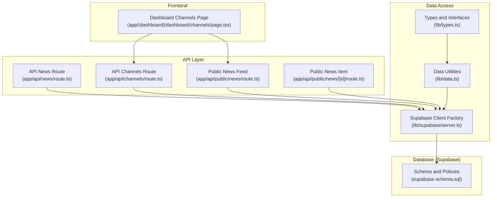
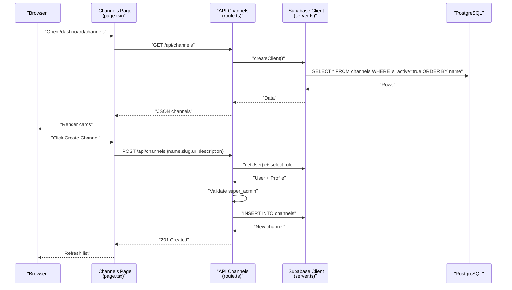
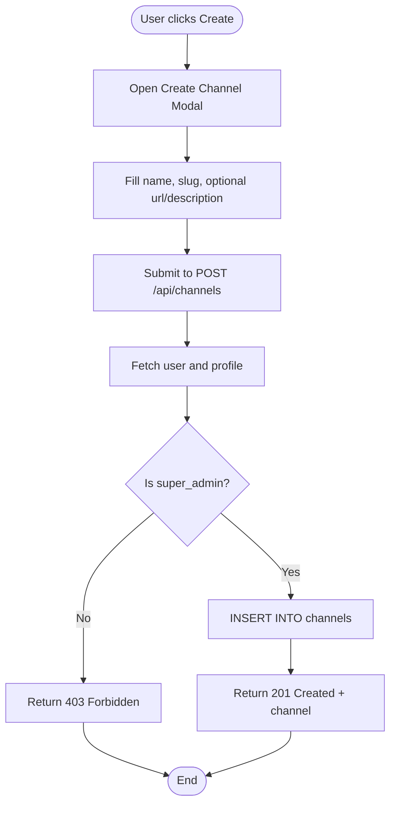
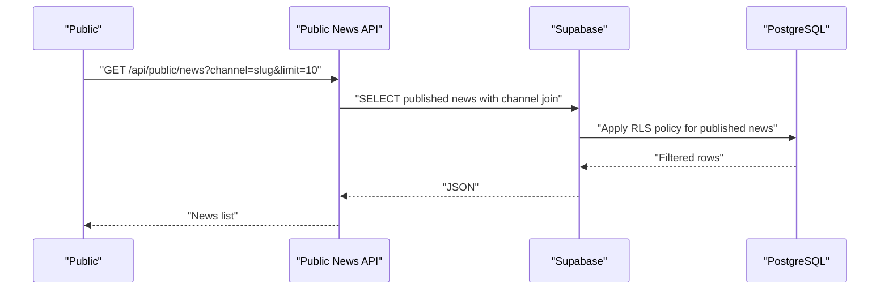
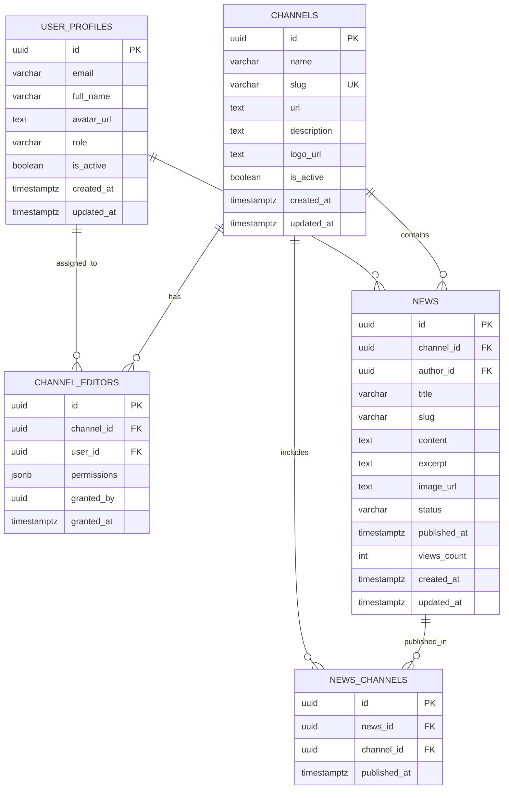
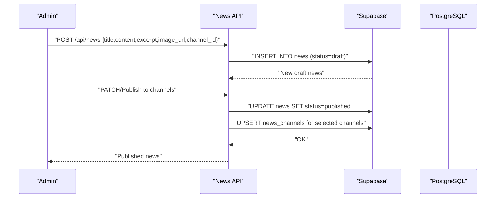
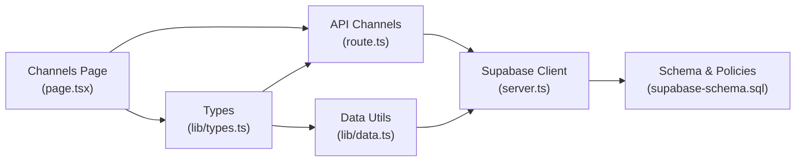

# Channel Management

<cite>
**Referenced Files in This Document**
- [app/api/channels/route.ts](file://app/api/channels/route.ts)
- [app/(dashboard)/dashboard/channels/page.tsx](file://app/(dashboard)/dashboard/channels/page.tsx)
- [lib/types.ts](file://lib/types.ts)
- [lib/data.ts](file://lib/data.ts)
- [supabase-schema.sql](file://supabase-schema.sql)
- [lib/supabase/server.ts](file://lib/supabase/server.ts)
- [app/api/news/route.ts](file://app/api/news/route.ts)
- [app/(dashboard)/dashboard/news/[id]/page.tsx](file://app/(dashboard)/dashboard/news/[id]/page.tsx)
- [app/api/public/news/route.ts](file://app/api/public/news/route.ts)
- [app/api/public/news/[id]/route.ts](file://app/api/public/news/[id]/route.ts)
</cite>

## Table of Contents
1. [Introduction](#introduction)
2. [Project Structure](#project-structure)
3. [Core Components](#core-components)
4. [Architecture Overview](#architecture-overview)
5. [Detailed Component Analysis](#detailed-component-analysis)
6. [Dependency Analysis](#dependency-analysis)
7. [Performance Considerations](#performance-considerations)
8. [Troubleshooting Guide](#troubleshooting-guide)
9. [Conclusion](#conclusion)

## Introduction
This document explains the multi-channel management functionality of the system. It covers how channels are created and configured, how visibility and access control are enforced, how news content is associated with channels, and how administrators can assign editors to channels. It also documents the public API surface for retrieving channel and news data, and provides guidance on performance, SEO, and analytics considerations.

## Project Structure
The channel management feature spans frontend UI, server-side API routes, and the Supabase data layer with Row Level Security (RLS). Key areas:
- Frontend dashboard for channel listing and creation
- API routes for channel retrieval and creation
- Data access utilities for channel and news queries
- Supabase schema defining channels, channel editors, and news relations
- Public API for channel-aware news feeds

**Diagram sources**
- [app/(dashboard)/dashboard/channels/page.tsx:1-204](file://app/(dashboard)/dashboard/channels/page.tsx#L1-L204)
- [app/api/channels/route.ts:1-71](file://app/api/channels/route.ts#L1-L71)
- [app/api/news/route.ts:1-58](file://app/api/news/route.ts#L1-L58)
- [app/api/public/news/route.ts:1-54](file://app/api/public/news/route.ts#L1-L54)
- [app/api/public/news/[id]/route.ts:1-63](file://app/api/public/news/[id]/route.ts#L1-L63)
- [lib/types.ts:1-62](file://lib/types.ts#L1-L62)
- [lib/data.ts:1-213](file://lib/data.ts#L1-L213)
- [lib/supabase/server.ts:1-30](file://lib/supabase/server.ts#L1-L30)
- [supabase-schema.sql:1-247](file://supabase-schema.sql#L1-L247)

**Section sources**
- [app/(dashboard)/dashboard/channels/page.tsx:1-204](file://app/(dashboard)/dashboard/channels/page.tsx#L1-L204)
- [app/api/channels/route.ts:1-71](file://app/api/channels/route.ts#L1-L71)
- [lib/types.ts:1-62](file://lib/types.ts#L1-L62)
- [lib/data.ts:1-213](file://lib/data.ts#L1-L213)
- [supabase-schema.sql:1-247](file://supabase-schema.sql#L1-L247)
- [lib/supabase/server.ts:1-30](file://lib/supabase/server.ts#L1-L30)
- [app/api/news/route.ts:1-58](file://app/api/news/route.ts#L1-L58)
- [app/api/public/news/route.ts:1-54](file://app/api/public/news/route.ts#L1-L54)
- [app/api/public/news/[id]/route.ts:1-63](file://app/api/public/news/[id]/route.ts#L1-L63)

## Core Components
- Channel model and editor permissions:
  - Channel entity includes identifiers, name, slug, optional URL and description, optional logo, activation flag, and timestamps.
  - ChannelEditor defines a many-to-many relationship between users and channels with granular permissions (create, edit, delete, publish).
- Data access:
  - Utilities expose channel listing, editor lookup, and news queries with channel-aware joins.
- API endpoints:
  - GET /api/channels returns active channels for public consumption.
  - POST /api/channels creates channels with super admin authorization.
  - Public news feed supports channel-scoped retrieval.
- Frontend:
  - Dashboard page lists channels and provides a modal to create new channels via the API.

**Section sources**
- [lib/types.ts:14-38](file://lib/types.ts#L14-L38)
- [lib/data.ts:20-76](file://lib/data.ts#L20-L76)
- [app/api/channels/route.ts:4-24](file://app/api/channels/route.ts#L4-L24)
- [app/api/channels/route.ts:26-70](file://app/api/channels/route.ts#L26-L70)
- [app/(dashboard)/dashboard/channels/page.tsx:6-53](file://app/(dashboard)/dashboard/channels/page.tsx#L6-L53)
- [app/api/public/news/route.ts:4-53](file://app/api/public/news/route.ts#L4-L53)

## Architecture Overview
Channel management is implemented with a clear separation of concerns:
- UI renders channel listings and creation forms.
- API routes enforce authentication and authorization.
- Data utilities encapsulate database queries.
- Supabase handles persistence, indexing, and RLS policies.

**Diagram sources**
- [app/(dashboard)/dashboard/channels/page.tsx:17-53](file://app/(dashboard)/dashboard/channels/page.tsx#L17-L53)
- [app/api/channels/route.ts:4-24](file://app/api/channels/route.ts#L4-L24)
- [app/api/channels/route.ts:26-70](file://app/api/channels/route.ts#L26-L70)
- [lib/supabase/server.ts:4-29](file://lib/supabase/server.ts#L4-L29)

## Detailed Component Analysis

### Channel Creation and Configuration
- Properties supported during creation:
  - Name, slug, URL, description.
  - Logo URL is part of the Channel model but not posted during creation in the current implementation.
  - Activation flag defaults to enabled.
- Authorization:
  - Only authenticated users whose profile role equals super_admin can create channels.
- Data persistence:
  - Insertion into the channels table with generated UUID and timestamps.
- Frontend UX:
  - Modal form collects required fields and submits to the API endpoint.

**Diagram sources**
- [app/(dashboard)/dashboard/channels/page.tsx:124-200](file://app/(dashboard)/dashboard/channels/page.tsx#L124-L200)
- [app/api/channels/route.ts:26-70](file://app/api/channels/route.ts#L26-L70)
- [lib/types.ts:14-24](file://lib/types.ts#L14-L24)

**Section sources**
- [app/api/channels/route.ts:26-70](file://app/api/channels/route.ts#L26-L70)
- [app/(dashboard)/dashboard/channels/page.tsx:124-200](file://app/(dashboard)/dashboard/channels/page.tsx#L124-L200)
- [lib/types.ts:14-24](file://lib/types.ts#L14-L24)

### Channel Visibility and Access Control
- Public visibility:
  - Active channels are publicly selectable via GET /api/channels.
  - Published news are publicly selectable via public APIs.
- Access control:
  - RLS policies restrict channel and news operations to authorized users.
  - Super admins can manage channels and channel editors.
  - Channel editors can view and manage news within their assigned channels based on permissions.

**Diagram sources**
- [app/api/public/news/route.ts:4-53](file://app/api/public/news/route.ts#L4-L53)
- [supabase-schema.sql:154-167](file://supabase-schema.sql#L154-L167)
- [supabase-schema.sql:203-206](file://supabase-schema.sql#L203-L206)

**Section sources**
- [app/api/public/news/route.ts:4-53](file://app/api/public/news/route.ts#L4-L53)
- [supabase-schema.sql:154-167](file://supabase-schema.sql#L154-L167)
- [supabase-schema.sql:203-206](file://supabase-schema.sql#L203-L206)

### Channel Editor Assignment and Permissions
- Relationship:
  - channel_editors links users to channels with JSONB permissions.
- Permission model:
  - can_create, can_edit, can_delete, can_publish.
- Authorization enforcement:
  - RLS policies allow super admins to manage channel editors.
  - Editing and publishing actions require explicit permission flags.

**Diagram sources**
- [supabase-schema.sql:4-15](file://supabase-schema.sql#L4-L15)
- [supabase-schema.sql:76-85](file://supabase-schema.sql#L76-L85)
- [supabase-schema.sql:87-103](file://supabase-schema.sql#L87-L103)
- [supabase-schema.sql:105-112](file://supabase-schema.sql#L105-L112)
- [lib/types.ts:26-38](file://lib/types.ts#L26-L38)

**Section sources**
- [lib/types.ts:26-38](file://lib/types.ts#L26-L38)
- [supabase-schema.sql:76-85](file://supabase-schema.sql#L76-L85)
- [supabase-schema.sql:188-201](file://supabase-schema.sql#L188-L201)
- [supabase-schema.sql:219-230](file://supabase-schema.sql#L219-L230)

### News Content Association with Channels
- Single-channel creation:
  - News items are initially created under a single channel.
- Multi-channel publishing:
  - A news item can be published to multiple channels via the news_channels junction table.
- Retrieval:
  - Public and internal APIs join news with channels and authors, and optionally include multi-channel associations.

**Diagram sources**
- [app/api/news/route.ts:4-57](file://app/api/news/route.ts#L4-L57)
- [lib/data.ts:182-212](file://lib/data.ts#L182-L212)
- [supabase-schema.sql:105-112](file://supabase-schema.sql#L105-L112)

**Section sources**
- [app/api/news/route.ts:4-57](file://app/api/news/route.ts#L4-L57)
- [lib/data.ts:182-212](file://lib/data.ts#L182-L212)
- [supabase-schema.sql:105-112](file://supabase-schema.sql#L105-L112)

### Public API Surface for Channels and News
- GET /api/channels
  - Returns active channels ordered by name.
- GET /api/public/news
  - Returns published news with channel and author metadata; supports channel slug and limit query parameters.
- GET /api/public/news/:id
  - Returns a single published news item and increments view count.

**Section sources**
- [app/api/channels/route.ts:4-24](file://app/api/channels/route.ts#L4-L24)
- [app/api/public/news/route.ts:4-53](file://app/api/public/news/route.ts#L4-L53)
- [app/api/public/news/[id]/route.ts:4-62](file://app/api/public/news/[id]/route.ts#L4-L62)

### Practical Examples

- Create a channel
  - Open the dashboard channels page, click “Add channel”, fill the form, submit. The endpoint validates authentication and role, then inserts a new channel record.
  - Reference: [app/(dashboard)/dashboard/channels/page.tsx:124-200](file://app/(dashboard)/dashboard/channels/page.tsx#L124-L200), [app/api/channels/route.ts:26-70](file://app/api/channels/route.ts#L26-L70)

- Configure channel branding
  - The Channel model includes logo_url; while not posted during creation in the current implementation, it can be stored and used for rendering.
  - Reference: [lib/types.ts:14-24](file://lib/types.ts#L14-L24)

- Associate news with channels
  - Create a news item under a channel; later publish it to multiple channels using the data utilities’ multi-channel publish function.
  - References: [app/api/news/route.ts:4-57](file://app/api/news/route.ts#L4-L57), [lib/data.ts:182-212](file://lib/data.ts#L182-L212)

- Remove a channel
  - The current schema enforces foreign keys with cascade deletion for channel records. Removing a channel cascades to dependent news and channel-editors entries. No dedicated removal endpoint exists in the current code; removal would occur through database operations or by deactivating the channel and deleting dependent records.
  - References: [supabase-schema.sql:5-15](file://supabase-schema.sql#L5-L15), [supabase-schema.sql:87-103](file://supabase-schema.sql#L87-L103), [supabase-schema.sql:76-85](file://supabase-schema.sql#L76-L85)

## Dependency Analysis
- UI depends on:
  - API routes for channel listing and creation.
  - Types for rendering and typing.
- API routes depend on:
  - Supabase client factory for authenticated database access.
- Data utilities depend on:
  - Supabase client and encapsulate queries for channels, editors, and news.
- Schema and policies define:
  - Foreign keys, indexes, and RLS policies governing access.

**Diagram sources**
- [app/(dashboard)/dashboard/channels/page.tsx:1-204](file://app/(dashboard)/dashboard/channels/page.tsx#L1-L204)
- [app/api/channels/route.ts:1-71](file://app/api/channels/route.ts#L1-L71)
- [lib/supabase/server.ts:1-30](file://lib/supabase/server.ts#L1-L30)
- [lib/data.ts:1-213](file://lib/data.ts#L1-L213)
- [lib/types.ts:1-62](file://lib/types.ts#L1-L62)
- [supabase-schema.sql:1-247](file://supabase-schema.sql#L1-L247)

**Section sources**
- [lib/types.ts:1-62](file://lib/types.ts#L1-L62)
- [lib/data.ts:1-213](file://lib/data.ts#L1-L213)
- [lib/supabase/server.ts:1-30](file://lib/supabase/server.ts#L1-L30)
- [supabase-schema.sql:1-247](file://supabase-schema.sql#L1-L247)

## Performance Considerations
- Indexes:
  - Channels: slug, is_active.
  - Users: email, role.
  - Channel editors: channel_id, user_id.
  - News: channel_id, author_id, status, published_at.
  - News channels: news_id, channel_id.
- Recommendations:
  - Use channel filters and pagination on public news endpoints.
  - Prefer selective field projections in queries to reduce payload size.
  - Keep slugs unique per channel to optimize lookups.

**Section sources**
- [supabase-schema.sql:114-126](file://supabase-schema.sql#L114-L126)

## Troubleshooting Guide
- Unauthorized or forbidden errors when creating channels
  - Ensure the authenticated user has the super_admin role; otherwise the endpoint returns 401 or 403.
  - Reference: [app/api/channels/route.ts:30-44](file://app/api/channels/route.ts#L30-L44)

- Channel not appearing in public feed
  - Verify the channel’s is_active flag is true; only active channels are returned by the public channels endpoint.
  - Reference: [app/api/channels/route.ts:8-12](file://app/api/channels/route.ts#L8-L12)

- News not visible publicly
  - Confirm the news status is published; RLS policies restrict public visibility to published items.
  - Reference: [supabase-schema.sql:203-206](file://supabase-schema.sql#L203-L206)

- Editor cannot edit or publish
  - Check the channel_editor permissions JSONB for the required flags; RLS enforces permission checks for editing and publishing.
  - References: [supabase-schema.sql:219-230](file://supabase-schema.sql#L219-L230), [lib/types.ts:30-35](file://lib/types.ts#L30-L35)

- Channel removal not working
  - There is no dedicated removal endpoint; rely on database-level cascading deletes or deactivation plus cleanup.
  - References: [supabase-schema.sql:5-15](file://supabase-schema.sql#L5-L15), [supabase-schema.sql:87-103](file://supabase-schema.sql#L87-L103), [supabase-schema.sql:76-85](file://supabase-schema.sql#L76-L85)

## Conclusion
The channel management system integrates a clean UI, secure API endpoints, and robust database modeling with RLS. Channels support branding, multi-channel publishing, and granular editor permissions. Public APIs enable efficient content discovery, while indexes and policies ensure performance and security. Administrators can create channels, assign editors, and control visibility, while publishers can manage content lifecycle and distribution across channels.