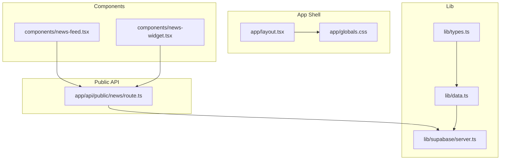
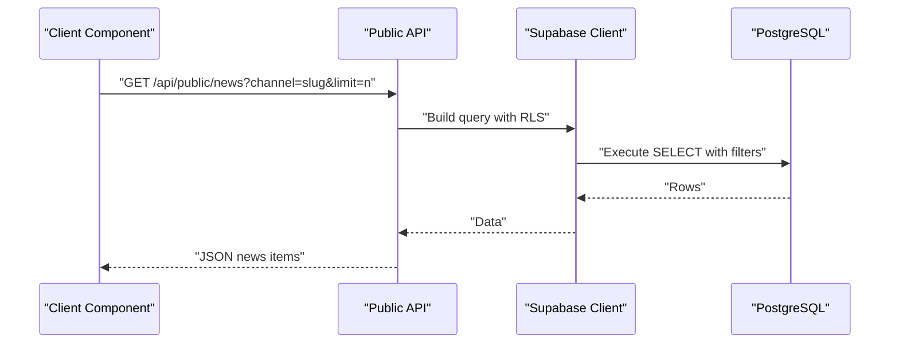
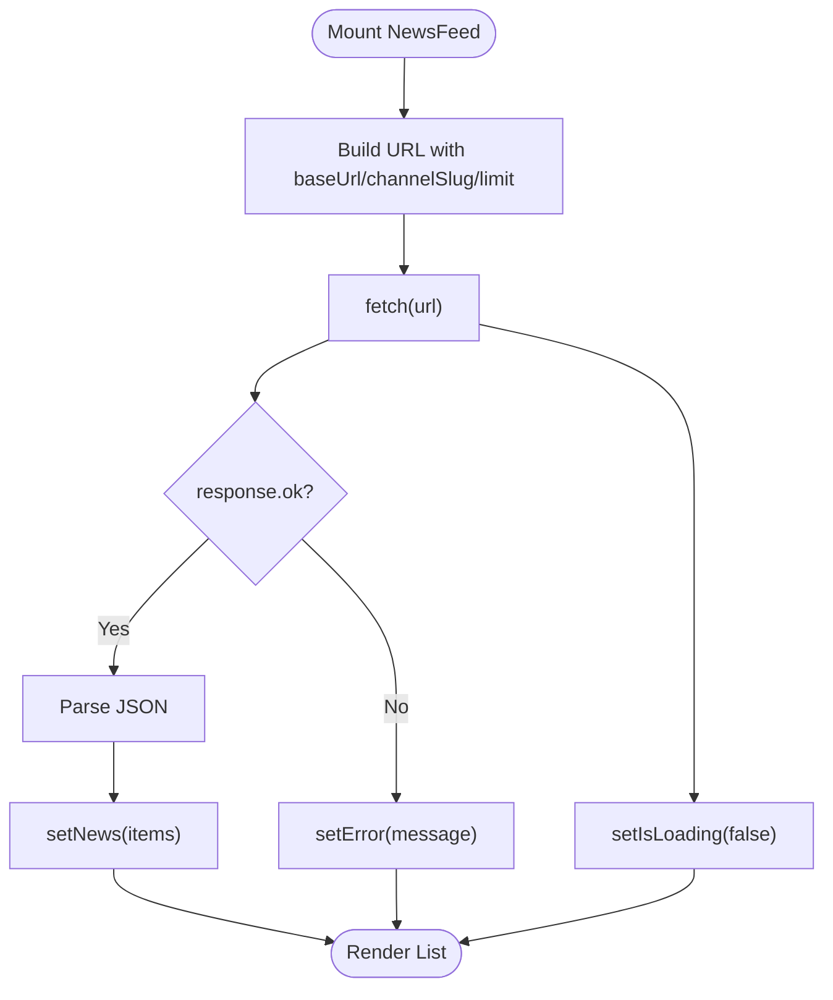
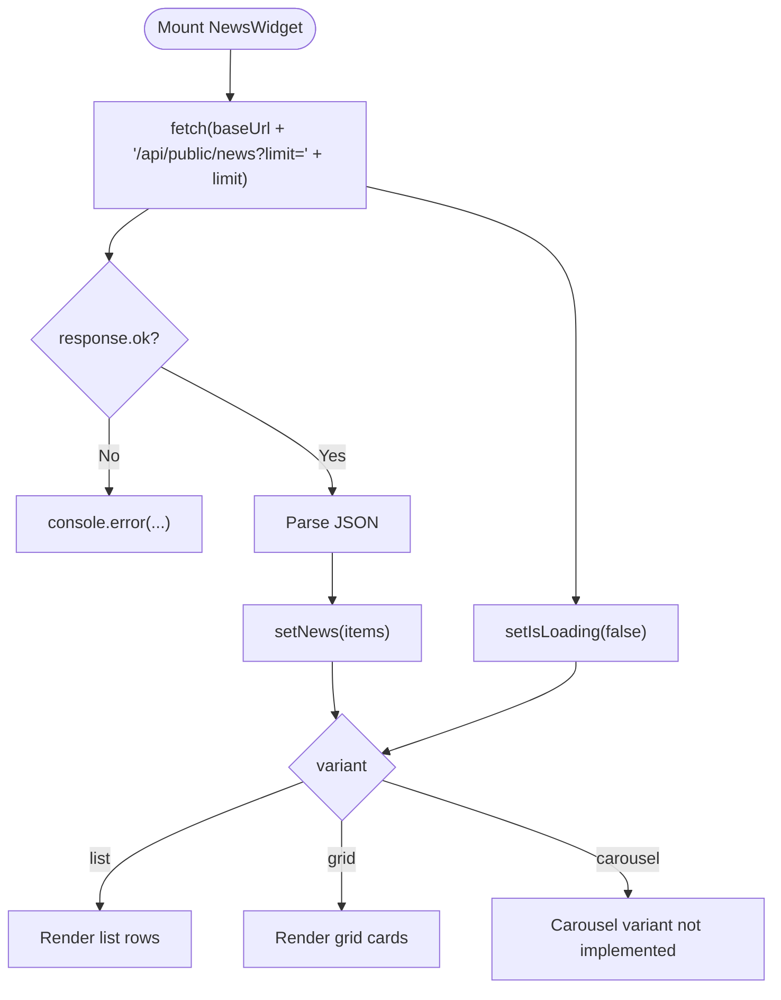
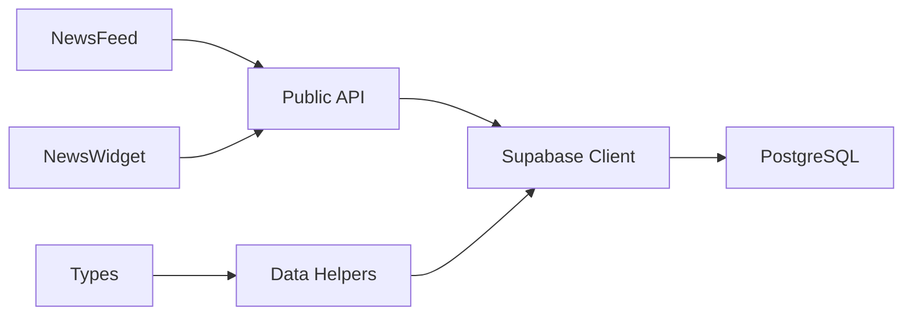

# Component Integration

<cite>
**Referenced Files in This Document**
- [news-feed.tsx](file://components/news-feed.tsx)
- [news-widget.tsx](file://components/news-widget.tsx)
- [route.ts](file://app/api/public/news/route.ts)
- [types.ts](file://lib/types.ts)
- [data.ts](file://lib/data.ts)
- [server.ts](file://lib/supabase/server.ts)
- [layout.tsx](file://app/layout.tsx)
- [globals.css](file://app/globals.css)
- [README.md](file://README.md)
- [ARCHITECTURE.md](file://ARCHITECTURE.md)
- [package.json](file://package.json)
</cite>

## Table of Contents
1. [Introduction](#introduction)
2. [Project Structure](#project-structure)
3. [Core Components](#core-components)
4. [Architecture Overview](#architecture-overview)
5. [Detailed Component Analysis](#detailed-component-analysis)
6. [Dependency Analysis](#dependency-analysis)
7. [Performance Considerations](#performance-considerations)
8. [Troubleshooting Guide](#troubleshooting-guide)
9. [Conclusion](#conclusion)
10. [Appendices](#appendices)

## Introduction
This document describes the React component integration system for displaying news feeds in Next.js applications. It focuses on two primary components:
- NewsFeed: A full-width feed with images, excerpts, and channel metadata, suitable for main content areas.
- NewsWidget: A compact sidebar widget supporting list and grid variants, ideal for sidebars and dashboards.

It documents component props, behavior, states, styling, integration patterns, and operational guidance for responsive design, accessibility, and cross-browser compatibility.

## Project Structure
The integration system centers around:
- Client-side React components under components/.
- A public REST API under app/api/public/news/route.ts.
- Shared types and server-side data helpers under lib/.
- Next.js app shell and global styles under app/.

**Diagram sources**
- [layout.tsx:1-22](file://app/layout.tsx#L1-L22)
- [globals.css:1-27](file://app/globals.css#L1-L27)
- [news-feed.tsx:1-152](file://components/news-feed.tsx#L1-L152)
- [news-widget.tsx:1-149](file://components/news-widget.tsx#L1-L149)
- [route.ts:1-54](file://app/api/public/news/route.ts#L1-L54)
- [types.ts:1-62](file://lib/types.ts#L1-L62)
- [data.ts:1-213](file://lib/data.ts#L1-L213)
- [server.ts:1-30](file://lib/supabase/server.ts#L1-L30)

**Section sources**
- [layout.tsx:1-22](file://app/layout.tsx#L1-L22)
- [globals.css:1-27](file://app/globals.css#L1-L27)
- [news-feed.tsx:1-152](file://components/news-feed.tsx#L1-L152)
- [news-widget.tsx:1-149](file://components/news-widget.tsx#L1-L149)
- [route.ts:1-54](file://app/api/public/news/route.ts#L1-L54)
- [types.ts:1-62](file://lib/types.ts#L1-L62)
- [data.ts:1-213](file://lib/data.ts#L1-L213)
- [server.ts:1-30](file://lib/supabase/server.ts#L1-L30)

## Core Components
- NewsFeed
  - Props: baseUrl, channelSlug?, limit?, showImages?, showExcerpt?, className?
  - Behavior: Fetches public news via the public API, renders a vertical list with optional images and excerpts, and links to article pages.
  - States: isLoading, error, and empty state rendering.
  - Styling: Uses Tailwind classes and respects className for overrides.
- NewsWidget
  - Props: baseUrl, limit?, variant? ('list' | 'grid'), className?
  - Behavior: Fetches latest news and renders either a list or grid layout with image thumbnails and publication dates.
  - States: Loading skeleton with animated placeholders, then renders items or empty state.
  - Styling: Tailwind-based with responsive grid support.

Key props and defaults:
- NewsFeed
  - baseUrl: string (required)
  - channelSlug: string (optional)
  - limit: number (default 5)
  - showImages: boolean (default true)
  - showExcerpt: boolean (default true)
  - className: string (optional)
- NewsWidget
  - baseUrl: string (required)
  - limit: number (default 3)
  - variant: 'list' | 'grid' | 'carousel' (default 'list')
  - className: string (optional)

Integration examples are provided in the project’s documentation and architecture guides.

**Section sources**
- [news-feed.tsx:20-36](file://components/news-feed.tsx#L20-L36)
- [news-widget.tsx:15-27](file://components/news-widget.tsx#L15-L27)
- [README.md:149-285](file://README.md#L149-L285)
- [ARCHITECTURE.md:320-422](file://ARCHITECTURE.md#L320-L422)

## Architecture Overview
The components communicate with the public API endpoint to retrieve published news. The API enforces status filters and optional channel filtering, returning a minimal payload suitable for client rendering.

**Diagram sources**
- [news-feed.tsx:41-64](file://components/news-feed.tsx#L41-L64)
- [news-widget.tsx:31-47](file://components/news-widget.tsx#L31-L47)
- [route.ts:4-53](file://app/api/public/news/route.ts#L4-L53)
- [server.ts:4-29](file://lib/supabase/server.ts#L4-L29)

**Section sources**
- [news-feed.tsx:41-64](file://components/news-feed.tsx#L41-L64)
- [news-widget.tsx:31-47](file://components/news-widget.tsx#L31-L47)
- [route.ts:4-53](file://app/api/public/news/route.ts#L4-L53)
- [server.ts:4-29](file://lib/supabase/server.ts#L4-L29)

## Detailed Component Analysis

### NewsFeed Component
- Visual appearance
  - Vertical list with optional image thumbnails and excerpts.
  - Channel tag and localized publication date.
  - Hover effects on images and links.
  - Footer link to the dashboard.
- Behavior
  - Fetches news on mount; supports channel filtering and limit.
  - Renders loading, error, and empty states.
  - Links to article pages using baseUrl and item ids.
- User interaction
  - Clickable cards and links navigate to article URLs.
- Props and defaults
  - baseUrl: string (required)
  - channelSlug: string (optional)
  - limit: number (default 5)
  - showImages: boolean (default true)
  - showExcerpt: boolean (default true)
  - className: string (optional)

**Diagram sources**
- [news-feed.tsx:41-64](file://components/news-feed.tsx#L41-L64)

**Section sources**
- [news-feed.tsx:1-152](file://components/news-feed.tsx#L1-L152)

### NewsWidget Component
- Visual appearance
  - List variant: compact rows with optional thumbnails and dates.
  - Grid variant: responsive grid with hover scaling and transitions.
  - Skeleton loader during initial load.
- Behavior
  - Fetches latest news with configurable limit.
  - Supports list and grid variants; carousel variant is declared but not implemented in the shown code.
- Props and defaults
  - baseUrl: string (required)
  - limit: number (default 3)
  - variant: 'list' | 'grid' | 'carousel' (default 'list')
  - className: string (optional)

**Diagram sources**
- [news-widget.tsx:31-47](file://components/news-widget.tsx#L31-L47)
- [news-widget.tsx:67-147](file://components/news-widget.tsx#L67-L147)

**Section sources**
- [news-widget.tsx:1-149](file://components/news-widget.tsx#L1-L149)

### API Endpoint and Data Flow
- Endpoint: GET /api/public/news
- Query parameters:
  - channel: slug to filter by channel
  - limit: number of items
- Response: Array of news items with channel and author metadata.
- Server-side query uses Supabase client with RLS policies.

**Diagram sources**
- [route.ts:4-53](file://app/api/public/news/route.ts#L4-L53)
- [server.ts:4-29](file://lib/supabase/server.ts#L4-L29)

**Section sources**
- [route.ts:1-54](file://app/api/public/news/route.ts#L1-L54)
- [server.ts:1-30](file://lib/supabase/server.ts#L1-L30)

## Dependency Analysis
- Components depend on:
  - fetch for client-side data retrieval.
  - date-fns for localized date formatting.
  - Tailwind CSS for styling.
- API depends on:
  - Supabase server client for database queries.
  - RLS policies for access control.
- Types and data helpers:
  - Shared types define the shape of news and channels.
  - Data helpers encapsulate server-side Supabase operations.

**Diagram sources**
- [news-feed.tsx:1-152](file://components/news-feed.tsx#L1-L152)
- [news-widget.tsx:1-149](file://components/news-widget.tsx#L1-L149)
- [route.ts:1-54](file://app/api/public/news/route.ts#L1-L54)
- [server.ts:1-30](file://lib/supabase/server.ts#L1-L30)
- [data.ts:1-213](file://lib/data.ts#L1-L213)
- [types.ts:1-62](file://lib/types.ts#L1-L62)

**Section sources**
- [package.json:11-27](file://package.json#L11-L27)
- [data.ts:1-213](file://lib/data.ts#L1-L213)
- [types.ts:1-62](file://lib/types.ts#L1-L62)
- [server.ts:1-30](file://lib/supabase/server.ts#L1-L30)

## Performance Considerations
- Client-side caching
  - Implement local caching (e.g., localStorage or a lightweight cache) to reduce repeated network requests for the same channel and limit combinations.
- Pagination
  - Extend the API to support pagination and lazy-load additional items as the user scrolls.
- Image optimization
  - Use modern image formats and sizes; consider lazy-loading and responsive image attributes.
- Debouncing
  - Debounce rapid prop changes (e.g., channelSlug) to avoid excessive re-fetches.
- Skeletons and virtualization
  - Use skeleton loaders (already present) and consider virtualized lists for large datasets.
- Bundle size
  - Keep dependencies minimal; date-fns is used for localization; ensure only required locales are included.

[No sources needed since this section provides general guidance]

## Troubleshooting Guide
- API errors
  - Verify baseUrl points to the correct host and that the public API endpoint is reachable.
  - Check server logs for 5xx responses and ensure Supabase credentials are configured.
- CORS and environment variables
  - Confirm NEXT_PUBLIC_SUPABASE_URL and NEXT_PUBLIC_SUPABASE_ANON_KEY are set in the environment.
- Prop configuration
  - Ensure channelSlug matches an existing channel slug; otherwise, the API will return an empty list.
  - Adjust limit to reasonable values to avoid overloading the client.
- Styling conflicts
  - Use className to override Tailwind classes; ensure your theme supports dark mode if needed.
- Accessibility
  - Ensure images have alt text; provide skip links for keyboard navigation; test focus order and screen reader compatibility.
- Cross-browser compatibility
  - Test on major browsers; ensure fetch availability or polyfill if targeting older environments.

**Section sources**
- [route.ts:46-52](file://app/api/public/news/route.ts#L46-L52)
- [server.ts:7-9](file://lib/supabase/server.ts#L7-L9)
- [README.md:71-92](file://README.md#L71-L92)

## Conclusion
The NewsFeed and NewsWidget components provide flexible, reusable building blocks for displaying news across sites. They integrate seamlessly with the public API, support responsive layouts, and offer straightforward customization via props and className. By following the performance and troubleshooting recommendations, teams can deliver fast, accessible, and maintainable news experiences.

[No sources needed since this section summarizes without analyzing specific files]

## Appendices

### Props Reference
- NewsFeed
  - baseUrl: string (required)
  - channelSlug: string (optional)
  - limit: number (default 5)
  - showImages: boolean (default true)
  - showExcerpt: boolean (default true)
  - className: string (optional)
- NewsWidget
  - baseUrl: string (required)
  - limit: number (default 3)
  - variant: 'list' | 'grid' | 'carousel' (default 'list')
  - className: string (optional)

**Section sources**
- [news-feed.tsx:20-36](file://components/news-feed.tsx#L20-L36)
- [news-widget.tsx:15-27](file://components/news-widget.tsx#L15-L27)
- [README.md:263-285](file://README.md#L263-L285)

### Usage Examples
- NewsFeed in Next.js
  - See integration example in the project documentation.
- NewsWidget in sidebars
  - See integration example in the project documentation.
- Custom styling
  - Override Tailwind classes via className; ensure dark mode compatibility.

**Section sources**
- [README.md:150-285](file://README.md#L150-L285)
- [ARCHITECTURE.md:320-422](file://ARCHITECTURE.md#L320-L422)

### Accessibility and Responsive Design Guidelines
- Accessibility
  - Provide meaningful alt text for images; ensure links are keyboard accessible; use semantic markup.
- Responsive design
  - Components use responsive Tailwind classes; adjust className to adapt to different breakpoints.
- Dark mode
  - Components include dark mode classes; ensure your theme variables are configured.

**Section sources**
- [globals.css:1-27](file://app/globals.css#L1-L27)
- [news-feed.tsx:97-149](file://components/news-feed.tsx#L97-L149)
- [news-widget.tsx:67-147](file://components/news-widget.tsx#L67-L147)