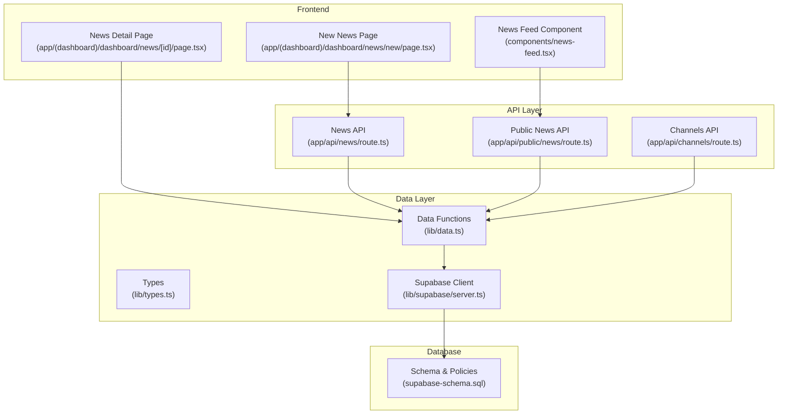
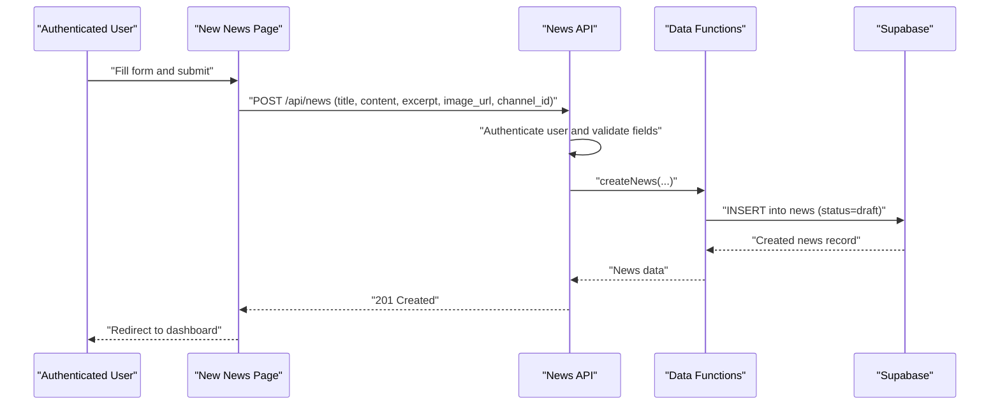
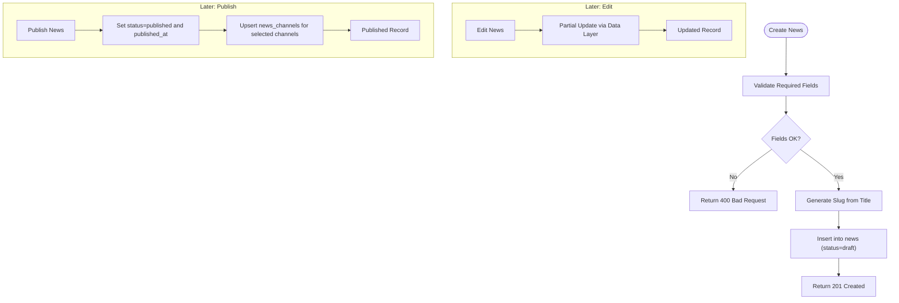
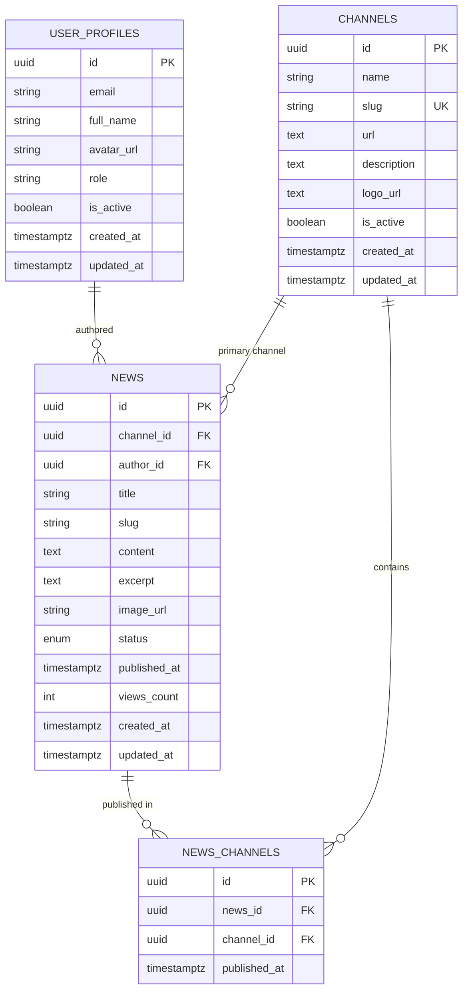
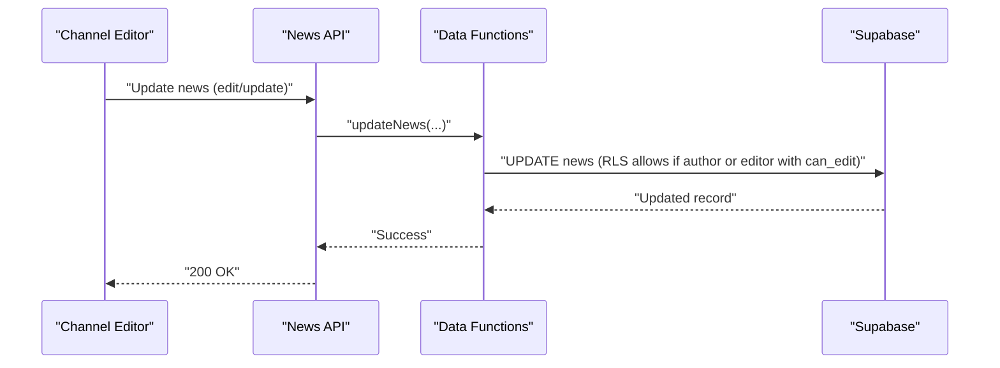
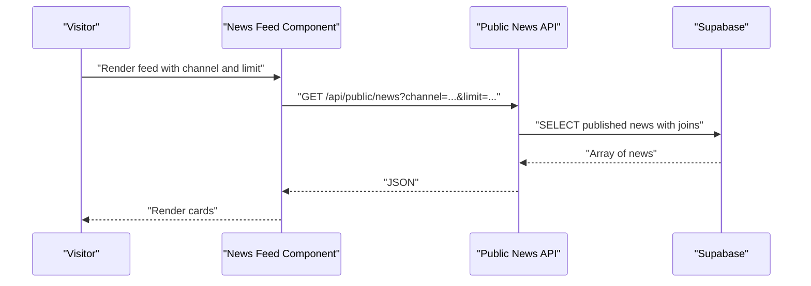
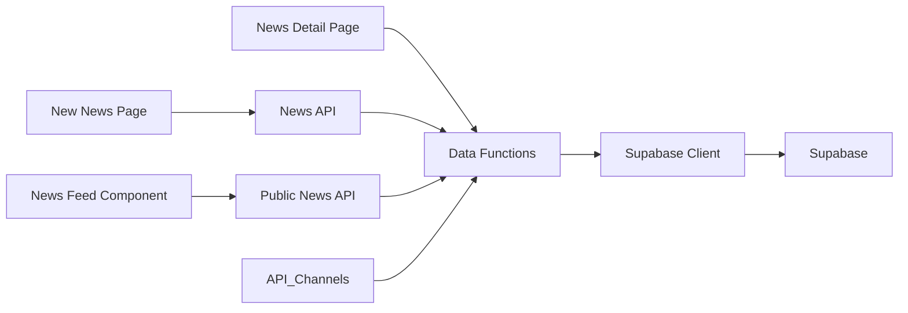

# Content Management System

<cite>
**Referenced Files in This Document**
- [app/api/news/route.ts](file://app/api/news/route.ts)
- [lib/data.ts](file://lib/data.ts)
- [lib/types.ts](file://lib/types.ts)
- [supabase-schema.sql](file://supabase-schema.sql)
- [app/api/public/news/route.ts](file://app/api/public/news/route.ts)
- [app/(dashboard)/dashboard/news/new/page.tsx](file://app/(dashboard)/dashboard/news/new/page.tsx)
- [app/(dashboard)/dashboard/news/[id]/page.tsx](file://app/(dashboard)/dashboard/news/[id]/page.tsx)
- [components/news-feed.tsx](file://components/news-feed.tsx)
- [app/api/channels/route.ts](file://app/api/channels/route.ts)
- [lib/supabase/server.ts](file://lib/supabase/server.ts)
</cite>

## Table of Contents
1. [Introduction](#introduction)
2. [Project Structure](#project-structure)
3. [Core Components](#core-components)
4. [Architecture Overview](#architecture-overview)
5. [Detailed Component Analysis](#detailed-component-analysis)
6. [Dependency Analysis](#dependency-analysis)
7. [Performance Considerations](#performance-considerations)
8. [Troubleshooting Guide](#troubleshooting-guide)
9. [Conclusion](#conclusion)

## Introduction
This document explains the complete content management system for news articles across multiple channels. It covers the end-to-end workflow for creating, editing, publishing, and managing news items, including draft creation, content editing, status management (draft, published, hidden, archived), and multi-channel publishing. It documents the API routes and data layer functions, practical examples of news creation forms, content validation, image handling, and publication workflows. It also explains the relationship between news items and channels via the news_channels junction table, the content status management system, and how different roles interact with content at various stages. Guidance is included for content moderation, approval workflows, collaborative editing processes, content organization, search functionality, and lifecycle management. Finally, troubleshooting and performance optimization tips are provided for large content volumes.

## Project Structure
The content management system spans API routes, data layer functions, frontend pages, and shared types. The backend uses Supabase for authentication, database, and row-level security (RLS). The frontend is a Next.js application with dashboard pages for content creation and viewing, and a reusable news feed component for public consumption.

**Diagram sources**
- [app/(dashboard)/dashboard/news/new/page.tsx](file://app/(dashboard)/dashboard/news/new/page.tsx#L1-L138)
- [app/(dashboard)/dashboard/news/[id]/page.tsx](file://app/(dashboard)/dashboard/news/[id]/page.tsx#L1-L114)
- [components/news-feed.tsx:1-152](file://components/news-feed.tsx#L1-L152)
- [app/api/news/route.ts:1-58](file://app/api/news/route.ts#L1-L58)
- [app/api/public/news/route.ts:1-54](file://app/api/public/news/route.ts#L1-L54)
- [app/api/channels/route.ts:1-71](file://app/api/channels/route.ts#L1-L71)
- [lib/data.ts:1-213](file://lib/data.ts#L1-L213)
- [lib/types.ts:1-62](file://lib/types.ts#L1-L62)
- [lib/supabase/server.ts:1-30](file://lib/supabase/server.ts#L1-L30)
- [supabase-schema.sql:1-247](file://supabase-schema.sql#L1-L247)

**Section sources**
- [app/api/news/route.ts:1-58](file://app/api/news/route.ts#L1-L58)
- [lib/data.ts:1-213](file://lib/data.ts#L1-L213)
- [lib/types.ts:1-62](file://lib/types.ts#L1-L62)
- [supabase-schema.sql:1-247](file://supabase-schema.sql#L1-L247)
- [app/api/public/news/route.ts:1-54](file://app/api/public/news/route.ts#L1-L54)
- [app/(dashboard)/dashboard/news/new/page.tsx](file://app/(dashboard)/dashboard/news/new/page.tsx#L1-L138)
- [app/(dashboard)/dashboard/news/[id]/page.tsx](file://app/(dashboard)/dashboard/news/[id]/page.tsx#L1-L114)
- [components/news-feed.tsx:1-152](file://components/news-feed.tsx#L1-L152)
- [app/api/channels/route.ts:1-71](file://app/api/channels/route.ts#L1-L71)
- [lib/supabase/server.ts:1-30](file://lib/supabase/server.ts#L1-L30)

## Core Components
- News API route: Handles creation of news drafts with authentication and validation, generating slugs and setting initial status to draft.
- Data layer functions: Provide typed CRUD operations for news, including creation, updates, retrieval by ID, and multi-channel publishing.
- Types: Define user roles, channel, channel editor permissions, and news entity with status enumeration.
- Schema and policies: Define tables, indexes, RLS policies, and multi-channel publishing via news_channels.
- Public API: Fetches published news with optional channel filtering and pagination.
- Dashboard pages: Provide forms for creating news and detail views for news items.
- News feed component: Renders a configurable list of published news for public consumption.

**Section sources**
- [app/api/news/route.ts:1-58](file://app/api/news/route.ts#L1-L58)
- [lib/data.ts:144-212](file://lib/data.ts#L144-L212)
- [lib/types.ts:40-61](file://lib/types.ts#L40-L61)
- [supabase-schema.sql:87-127](file://supabase-schema.sql#L87-L127)
- [app/api/public/news/route.ts:1-54](file://app/api/public/news/route.ts#L1-L54)
- [app/(dashboard)/dashboard/news/new/page.tsx](file://app/(dashboard)/dashboard/news/new/page.tsx#L1-L138)
- [app/(dashboard)/dashboard/news/[id]/page.tsx](file://app/(dashboard)/dashboard/news/[id]/page.tsx#L1-L114)
- [components/news-feed.tsx:1-152](file://components/news-feed.tsx#L1-L152)

## Architecture Overview
The system follows a layered architecture:
- Presentation layer: Next.js pages and components for dashboard and public consumption.
- API layer: Route handlers for news, public news, and channels.
- Data layer: Typed functions wrapping Supabase queries and mutations.
- Database layer: Supabase with RLS policies and indexes for performance.

**Diagram sources**
- [app/(dashboard)/dashboard/news/new/page.tsx](file://app/(dashboard)/dashboard/news/new/page.tsx#L17-L39)
- [app/api/news/route.ts:4-57](file://app/api/news/route.ts#L4-L57)
- [lib/data.ts:144-166](file://lib/data.ts#L144-L166)
- [supabase-schema.sql:87-103](file://supabase-schema.sql#L87-L103)

**Section sources**
- [app/(dashboard)/dashboard/news/new/page.tsx](file://app/(dashboard)/dashboard/news/new/page.tsx#L1-L138)
- [app/api/news/route.ts:1-58](file://app/api/news/route.ts#L1-L58)
- [lib/data.ts:144-166](file://lib/data.ts#L144-L166)
- [supabase-schema.sql:87-103](file://supabase-schema.sql#L87-L103)

## Detailed Component Analysis

### News CRUD Operations and Status Management
- Draft creation: The News API validates required fields and creates a news record with status set to draft. The slug is derived from the title.
- Editing: The data layer exposes an update function allowing partial updates to news fields.
- Status management: The news entity supports four statuses: draft, published, hidden, archived. The schema enforces the status enum.
- Multi-channel publishing: The publish function updates the news status to published, sets published_at, and inserts/upserts records into the news_channels junction table for the selected channels.

**Diagram sources**
- [app/api/news/route.ts:17-47](file://app/api/news/route.ts#L17-L47)
- [lib/data.ts:168-212](file://lib/data.ts#L168-L212)
- [supabase-schema.sql:87-112](file://supabase-schema.sql#L87-L112)

**Section sources**
- [app/api/news/route.ts:1-58](file://app/api/news/route.ts#L1-L58)
- [lib/data.ts:144-212](file://lib/data.ts#L144-L212)
- [lib/types.ts:49-49](file://lib/types.ts#L49-L49)
- [supabase-schema.sql:87-112](file://supabase-schema.sql#L87-L112)

### Multi-Channel Publishing and Relationship with Channels
- The news_channels junction table links news to channels and stores per-channel publication timestamps.
- Publishing workflow: After marking a news item as published, the system upserts entries into news_channels for each target channel.
- Retrieval: The data layer fetches a single news item with nested relations to author, channel, and news_channels, enabling display of multi-channel publication metadata.

**Diagram sources**
- [supabase-schema.sql:4-112](file://supabase-schema.sql#L4-L112)
- [lib/data.ts:129-141](file://lib/data.ts#L129-L141)
- [lib/types.ts:40-61](file://lib/types.ts#L40-L61)

**Section sources**
- [lib/data.ts:129-141](file://lib/data.ts#L129-L141)
- [lib/data.ts:182-212](file://lib/data.ts#L182-L212)
- [supabase-schema.sql:105-112](file://supabase-schema.sql#L105-L112)

### Role-Based Access Control and Permissions
- Roles: super_admin, admin, editor.
- Channel editors: A junction table with JSONB permissions controls who can create, edit, delete, or publish within a channel.
- RLS policies:
  - Published news are publicly selectable.
  - Authors and editors can view and manage their own news or news within channels they edit.
  - Super admins have broad management privileges across channels and profiles.
  - Channel editors can manage news_channels entries for news within their channels.

**Diagram sources**
- [supabase-schema.sql:203-246](file://supabase-schema.sql#L203-L246)
- [lib/types.ts:26-38](file://lib/types.ts#L26-L38)
- [lib/data.ts:168-180](file://lib/data.ts#L168-L180)

**Section sources**
- [lib/types.ts:1-12](file://lib/types.ts#L1-L12)
- [lib/types.ts:26-38](file://lib/types.ts#L26-L38)
- [supabase-schema.sql:154-246](file://supabase-schema.sql#L154-L246)

### Public Consumption and Search Functionality
- Public endpoint: Fetches published news with optional channel filtering and pagination, selecting minimal fields for performance.
- News feed component: Accepts base URL, channel slug, and limit; loads and renders a list of news items with images and excerpts.
- Indexes: Published news are ordered by published_at descending with an index to optimize retrieval.

**Diagram sources**
- [components/news-feed.tsx:41-64](file://components/news-feed.tsx#L41-L64)
- [app/api/public/news/route.ts:4-45](file://app/api/public/news/route.ts#L4-L45)
- [supabase-schema.sql:114-126](file://supabase-schema.sql#L114-L126)

**Section sources**
- [app/api/public/news/route.ts:1-54](file://app/api/public/news/route.ts#L1-L54)
- [components/news-feed.tsx:1-152](file://components/news-feed.tsx#L1-L152)
- [supabase-schema.sql:114-126](file://supabase-schema.sql#L114-L126)

### Content Moderation, Approval Workflows, and Collaborative Editing
- Collaborative editing: Channel editors can edit news within their assigned channels if permissions allow.
- Approval workflows: While explicit approval steps are not implemented in the current code, the system can support staged publishing by keeping items as draft until ready, then publishing via the publish function.
- Hidden/archived: Items can be hidden or archived to control visibility without deletion.

**Section sources**
- [lib/types.ts:26-38](file://lib/types.ts#L26-L38)
- [lib/data.ts:168-180](file://lib/data.ts#L168-L180)
- [lib/data.ts:182-212](file://lib/data.ts#L182-L212)
- [supabase-schema.sql:97-97](file://supabase-schema.sql#L97-L97)

### Practical Examples

#### News Creation Form
- The dashboard page provides a form with fields for title, excerpt, content, image URL, and channel selection. Submission sends a POST request to the news API, which validates and creates a draft.

**Section sources**
- [app/(dashboard)/dashboard/news/new/page.tsx](file://app/(dashboard)/dashboard/news/new/page.tsx#L6-L138)
- [app/api/news/route.ts:4-57](file://app/api/news/route.ts#L4-L57)

#### Content Validation
- Required fields: title, content, channel_id.
- Additional fields: excerpt and image_url are optional.
- Slug generation: Derived from title with basic sanitization.

**Section sources**
- [app/api/news/route.ts:17-30](file://app/api/news/route.ts#L17-L30)

#### Image Handling
- The news entity supports an image_url field. The dashboard detail page conditionally renders an image when present, and the news feed component optionally displays images based on props.

**Section sources**
- [lib/types.ts:47-48](file://lib/types.ts#L47-L48)
- [app/(dashboard)/dashboard/news/[id]/page.tsx](file://app/(dashboard)/dashboard/news/[id]/page.tsx#L30-L38)
- [components/news-feed.tsx:98-105](file://components/news-feed.tsx#L98-L105)

#### Publication Workflow
- The publish function updates status to published, sets published_at, and upserts news_channels entries for selected channels.

**Section sources**
- [lib/data.ts:182-212](file://lib/data.ts#L182-L212)

## Dependency Analysis
The system exhibits clear separation of concerns:
- Frontend pages depend on API routes and data functions.
- API routes depend on data functions and the Supabase client.
- Data functions encapsulate database operations and rely on Supabase client initialization.
- Database schema defines relationships and enforces constraints and policies.

**Diagram sources**
- [app/(dashboard)/dashboard/news/new/page.tsx](file://app/(dashboard)/dashboard/news/new/page.tsx#L1-L138)
- [app/(dashboard)/dashboard/news/[id]/page.tsx](file://app/(dashboard)/dashboard/news/[id]/page.tsx#L1-L114)
- [components/news-feed.tsx:1-152](file://components/news-feed.tsx#L1-L152)
- [app/api/news/route.ts:1-58](file://app/api/news/route.ts#L1-L58)
- [app/api/public/news/route.ts:1-54](file://app/api/public/news/route.ts#L1-L54)
- [app/api/channels/route.ts:1-71](file://app/api/channels/route.ts#L1-L71)
- [lib/data.ts:1-213](file://lib/data.ts#L1-L213)
- [lib/supabase/server.ts:1-30](file://lib/supabase/server.ts#L1-L30)
- [supabase-schema.sql:1-247](file://supabase-schema.sql#L1-L247)

**Section sources**
- [lib/data.ts:1-213](file://lib/data.ts#L1-L213)
- [lib/supabase/server.ts:1-30](file://lib/supabase/server.ts#L1-L30)
- [supabase-schema.sql:1-247](file://supabase-schema.sql#L1-L247)

## Performance Considerations
- Indexes: Published news are indexed by status and published_at descending, optimizing public feeds and ordering.
- Selective fields: Public API selects only necessary fields to reduce payload size.
- Pagination: Public API supports a limit parameter to constrain result sets.
- RLS overhead: Policies add checks; keep queries selective and leverage indexes.
- Image URLs: Prefer optimized external URLs to avoid storing large assets in the database.

[No sources needed since this section provides general guidance]

## Troubleshooting Guide
- Unauthorized access during news creation: Ensure the user is authenticated; the API returns 401 if not.
- Missing required fields: The API validates title, content, and channel_id; ensure these are provided.
- Slug conflicts: The schema enforces unique (channel_id, slug); change title or channel to resolve.
- Permission denied for editing/publishing: Verify channel editor permissions and that the user belongs to the correct channel.
- Public news not appearing: Confirm status is published and the public endpoint is used.
- Large content volumes: Use limit parameters, leverage indexes, and consider CDN-hosted images.

**Section sources**
- [app/api/news/route.ts:8-23](file://app/api/news/route.ts#L8-L23)
- [supabase-schema.sql:102-102](file://supabase-schema.sql#L102-L102)
- [supabase-schema.sql:203-230](file://supabase-schema.sql#L203-L230)
- [app/api/public/news/route.ts:33-45](file://app/api/public/news/route.ts#L33-L45)

## Conclusion
The content management system provides a robust foundation for creating, editing, and publishing news across multiple channels. It leverages Supabase for authentication, RLS, and scalable storage, while the data layer abstracts database operations behind typed functions. The multi-channel publishing model, combined with role-based permissions and public APIs, enables flexible editorial workflows and efficient content delivery. By following the outlined workflows, validation rules, and performance recommendations, teams can maintain organized, searchable, and collaboratively managed content at scale.