# Content Status Management

<cite>
**Referenced Files in This Document**
- [types.ts](file://lib/types.ts)
- [data.ts](file://lib/data.ts)
- [supabase-schema.sql](file://supabase-schema.sql)
- [route.ts](file://app/api/news/route.ts)
- [route.ts](file://app/api/public/news/route.ts)
- [route.ts](file://app/api/public/news/[id]/route.ts)
- [page.tsx](file://app/(dashboard)/dashboard/news/[id]/page.tsx)
- [page.tsx](file://app/(dashboard)/dashboard/news/new/page.tsx)
- [news-feed.tsx](file://components/news-feed.tsx)
- [news-widget.tsx](file://components/news-widget.tsx)
- [README.md](file://README.md)
</cite>

## Table of Contents
1. [Introduction](#introduction)
2. [Project Structure](#project-structure)
3. [Core Components](#core-components)
4. [Architecture Overview](#architecture-overview)
5. [Detailed Component Analysis](#detailed-component-analysis)
6. [Dependency Analysis](#dependency-analysis)
7. [Performance Considerations](#performance-considerations)
8. [Troubleshooting Guide](#troubleshooting-guide)
9. [Conclusion](#conclusion)
10. [Appendices](#appendices)

## Introduction
This document explains the content status management system and workflow states for news items. It covers the complete lifecycle of news items through the statuses: draft, published, hidden, and archived. It documents how status changes are managed via the updateNews function, how status impacts visibility and distribution, and how the getPublishedNews function filters content for public consumption. It also details the relationship between status management and user roles, including permission-driven access controls, multi-channel publishing, and status-based reporting. Practical examples, troubleshooting tips, and performance guidance are included.

## Project Structure
The status management system spans TypeScript types, server-side data access utilities, Supabase database schema and policies, and API endpoints for both private dashboards and public consumption. Public-facing components consume the public API to render filtered content.

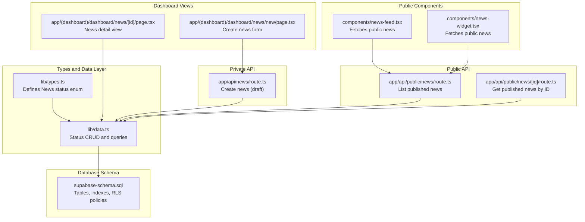

**Diagram sources**
- [types.ts:40-54](file://lib/types.ts#L40-L54)
- [data.ts:144-212](file://lib/data.ts#L144-L212)
- [supabase-schema.sql:87-127](file://supabase-schema.sql#L87-L127)
- [route.ts:4-57](file://app/api/news/route.ts#L4-L57)
- [route.ts:4-53](file://app/api/public/news/route.ts#L4-L53)
- [route.ts:5-62](file://app/api/public/news/[id]/route.ts#L5-L62)
- [page.tsx:7-113](file://app/(dashboard)/dashboard/news/[id]/page.tsx#L7-L113)
- [page.tsx:6-137](file://app/(dashboard)/dashboard/news/new/page.tsx#L6-L137)
- [news-feed.tsx:29-64](file://components/news-feed.tsx#L29-L64)
- [news-widget.tsx:22-47](file://components/news-widget.tsx#L22-L47)

**Section sources**
- [types.ts:40-54](file://lib/types.ts#L40-L54)
- [data.ts:144-212](file://lib/data.ts#L144-L212)
- [supabase-schema.sql:87-127](file://supabase-schema.sql#L87-L127)
- [route.ts:4-57](file://app/api/news/route.ts#L4-L57)
- [route.ts:4-53](file://app/api/public/news/route.ts#L4-L53)
- [route.ts:5-62](file://app/api/public/news/[id]/route.ts#L5-L62)
- [page.tsx:7-113](file://app/(dashboard)/dashboard/news/[id]/page.tsx#L7-L113)
- [page.tsx:6-137](file://app/(dashboard)/dashboard/news/new/page.tsx#L6-L137)
- [news-feed.tsx:29-64](file://components/news-feed.tsx#L29-L64)
- [news-widget.tsx:22-47](file://components/news-widget.tsx#L22-L47)

## Core Components
- Status model: The News interface defines the status field constrained to draft, published, hidden, and archived.
- Status CRUD: The data module exposes createNews (initially draft), updateNews (general updates), and publishNews (transition to published).
- Visibility and filtering: getPublishedNews and public API endpoints filter by status = published.
- Access control: Supabase RLS policies govern who can view and edit news based on authorship and channel editor permissions.
- Multi-channel publishing: The news_channels junction table supports publishing a single news item across multiple channels.

**Section sources**
- [types.ts:40-54](file://lib/types.ts#L40-L54)
- [data.ts:144-212](file://lib/data.ts#L144-L212)
- [supabase-schema.sql:87-127](file://supabase-schema.sql#L87-L127)

## Architecture Overview
The system enforces status-based visibility and access control at the database level (RLS) and augments it with application-layer helpers and API endpoints.

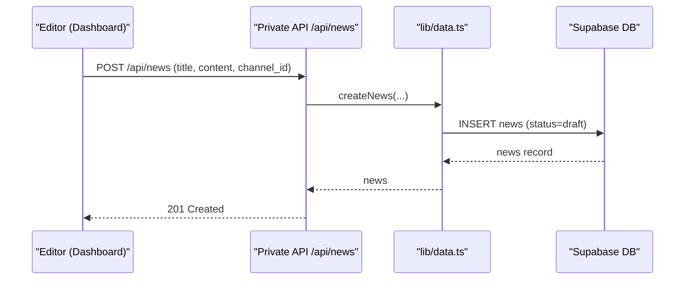

**Diagram sources**
- [route.ts:4-57](file://app/api/news/route.ts#L4-L57)
- [data.ts:144-166](file://lib/data.ts#L144-L166)

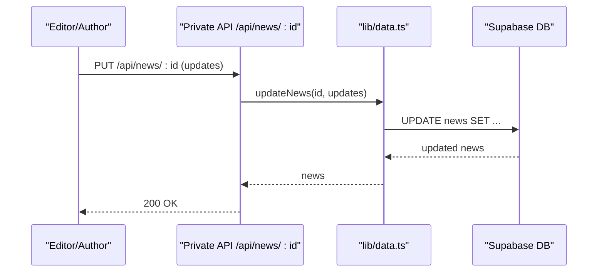

**Diagram sources**
- [data.ts:168-180](file://lib/data.ts#L168-L180)

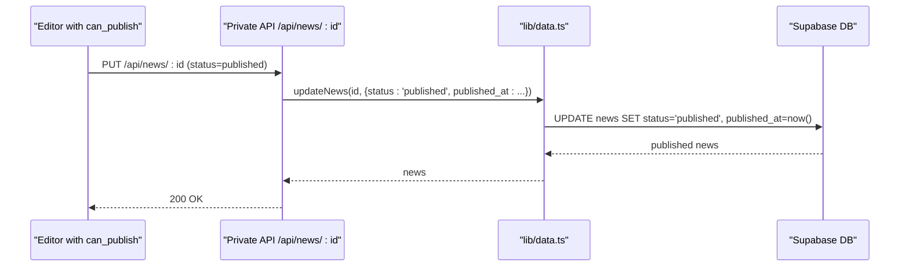

**Diagram sources**
- [data.ts:168-196](file://lib/data.ts#L168-L196)

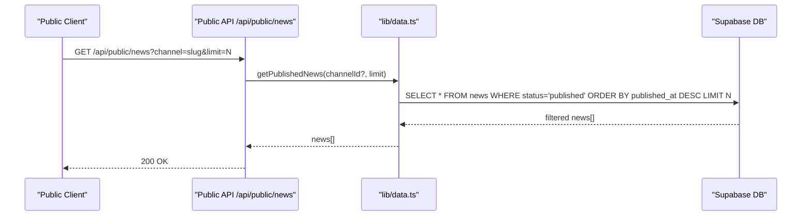

**Diagram sources**
- [route.ts:4-53](file://app/api/public/news/route.ts#L4-L53)
- [data.ts:78-108](file://lib/data.ts#L78-L108)

## Detailed Component Analysis

### Status Model and Lifecycle
- Status values: draft, published, hidden, archived.
- Initial state: createNews sets status to draft.
- Transition to published: publishNews updates status and published_at and registers multi-channel entries.
- Hidden/archived: These statuses are supported by the schema and can be applied via updateNews.

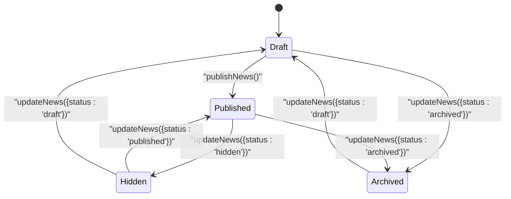

**Diagram sources**
- [types.ts:49](file://lib/types.ts#L49)
- [data.ts:144-166](file://lib/data.ts#L144-L166)
- [data.ts:168-212](file://lib/data.ts#L168-L212)

**Section sources**
- [types.ts:40-54](file://lib/types.ts#L40-L54)
- [data.ts:144-212](file://lib/data.ts#L144-L212)

### Status Filtering Mechanisms
- Private dashboard filtering: getPublishedNews filters by status = published and optionally by channel, ordering by published_at descending.
- Public API filtering: Public endpoints apply the same status filter and expose minimal fields for public consumption.

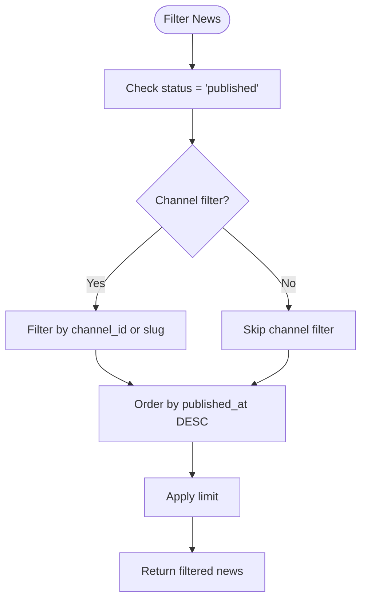

**Diagram sources**
- [data.ts:78-108](file://lib/data.ts#L78-L108)
- [route.ts:33-45](file://app/api/public/news/route.ts#L33-L45)

**Section sources**
- [data.ts:78-108](file://lib/data.ts#L78-L108)
- [route.ts:4-53](file://app/api/public/news/route.ts#L4-L53)

### Role-Based Access Controls and Permissions
- Roles: super_admin, admin, editor.
- Channel editors: JSONB permissions include can_create, can_edit, can_delete, can_publish.
- RLS policies:
  - Published news are visible to everyone.
  - Authors and editors can view and manage their own news or news in channels they edit.
  - Super admins can manage channels and channel editors.

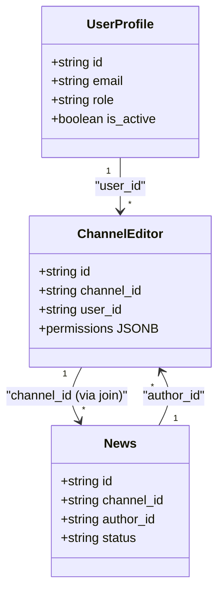

**Diagram sources**
- [types.ts:3-12](file://lib/types.ts#L3-L12)
- [types.ts:26-38](file://lib/types.ts#L26-L38)
- [types.ts:40-54](file://lib/types.ts#L40-L54)
- [supabase-schema.sql:76-85](file://supabase-schema.sql#L76-L85)
- [supabase-schema.sql:87-103](file://supabase-schema.sql#L87-L103)

**Section sources**
- [supabase-schema.sql:215-241](file://supabase-schema.sql#L215-L241)
- [README.md:101-119](file://README.md#L101-L119)

### Multi-Channel Publishing Workflow
- A single news item can be published to multiple channels.
- The publishNews function updates status and published_at, then upserts news_channels entries for the selected channels.

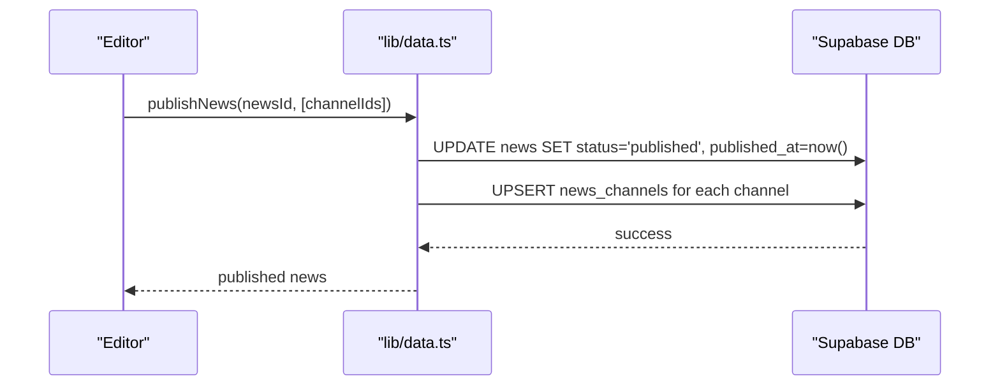

**Diagram sources**
- [data.ts:182-212](file://lib/data.ts#L182-L212)

**Section sources**
- [data.ts:182-212](file://lib/data.ts#L182-L212)
- [supabase-schema.sql:105-112](file://supabase-schema.sql#L105-L112)

### Public Consumption and View Counting
- Public endpoint GET /api/public/news/:id returns published news and increments views_count.
- Public feed components fetch from the public API and render previews.

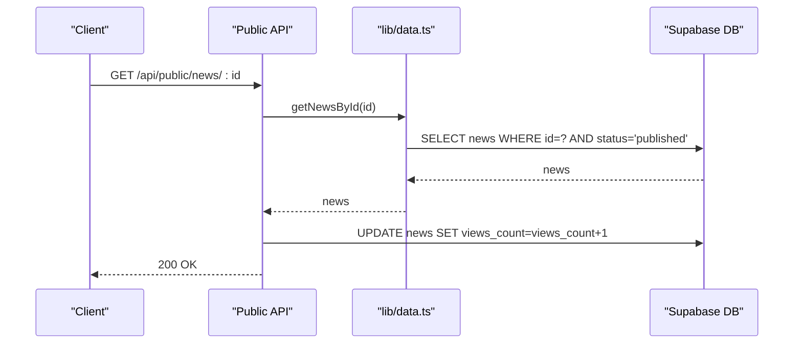

**Diagram sources**
- [route.ts:5-62](file://app/api/public/news/[id]/route.ts#L5-L62)
- [data.ts:110-142](file://lib/data.ts#L110-L142)

**Section sources**
- [route.ts:5-62](file://app/api/public/news/[id]/route.ts#L5-L62)
- [news-feed.tsx:41-64](file://components/news-feed.tsx#L41-L64)
- [news-widget.tsx:31-47](file://components/news-widget.tsx#L31-L47)

### Practical Examples

- Creating a draft:
  - Use the private API POST /api/news to insert a new news item with status set to draft.
  - Reference: [route.ts:4-57](file://app/api/news/route.ts#L4-L57), [data.ts:144-166](file://lib/data.ts#L144-L166)

- Publishing to multiple channels:
  - Call publishNews with the newsId and an array of channelIds to set status to published and register multi-channel entries.
  - Reference: [data.ts:182-212](file://lib/data.ts#L182-L212)

- Filtering published news for public consumption:
  - Use the public API GET /api/public/news with optional channel and limit parameters.
  - Reference: [route.ts:4-53](file://app/api/public/news/route.ts#L4-L53)

- Viewing a published news item:
  - Use the public API GET /api/public/news/:id to retrieve a single published item and increment views.
  - Reference: [route.ts:5-62](file://app/api/public/news/[id]/route.ts#L5-L62)

- Dashboard detail view:
  - The dashboard page fetches a news item by ID for internal viewing.
  - Reference: [page.tsx:7-113](file://app/(dashboard)/dashboard/news/[id]/page.tsx#L7-L113)

**Section sources**
- [route.ts:4-57](file://app/api/news/route.ts#L4-L57)
- [data.ts:144-212](file://lib/data.ts#L144-L212)
- [route.ts:4-53](file://app/api/public/news/route.ts#L4-L53)
- [route.ts:5-62](file://app/api/public/news/[id]/route.ts#L5-L62)
- [page.tsx:7-113](file://app/(dashboard)/dashboard/news/[id]/page.tsx#L7-L113)

## Dependency Analysis
- Types define the status domain and relationships.
- Data utilities encapsulate database operations and enforce initial status.
- Supabase schema defines tables, constraints, indexes, and RLS policies.
- API routes depend on data utilities and enforce authentication for private endpoints.
- Public components depend on public API endpoints.

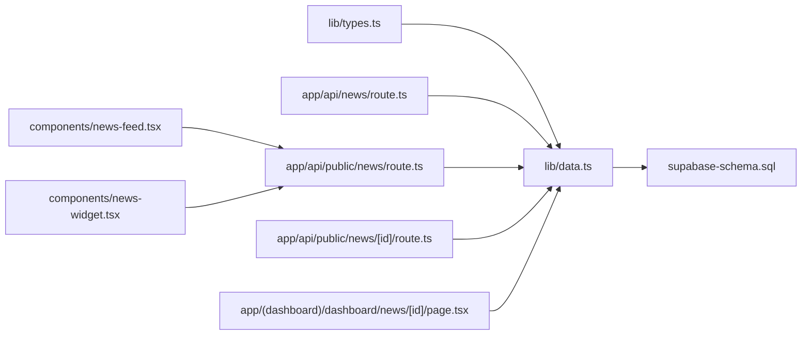

**Diagram sources**
- [types.ts:40-54](file://lib/types.ts#L40-L54)
- [data.ts:78-212](file://lib/data.ts#L78-L212)
- [supabase-schema.sql:87-127](file://supabase-schema.sql#L87-L127)
- [route.ts:4-57](file://app/api/news/route.ts#L4-L57)
- [route.ts:4-53](file://app/api/public/news/route.ts#L4-L53)
- [route.ts:5-62](file://app/api/public/news/[id]/route.ts#L5-L62)
- [page.tsx:7-113](file://app/(dashboard)/dashboard/news/[id]/page.tsx#L7-L113)
- [news-feed.tsx:29-64](file://components/news-feed.tsx#L29-L64)
- [news-widget.tsx:22-47](file://components/news-widget.tsx#L22-L47)

**Section sources**
- [types.ts:40-54](file://lib/types.ts#L40-L54)
- [data.ts:78-212](file://lib/data.ts#L78-L212)
- [supabase-schema.sql:87-127](file://supabase-schema.sql#L87-L127)
- [route.ts:4-57](file://app/api/news/route.ts#L4-L57)
- [route.ts:4-53](file://app/api/public/news/route.ts#L4-L53)
- [route.ts:5-62](file://app/api/public/news/[id]/route.ts#L5-L62)
- [page.tsx:7-113](file://app/(dashboard)/dashboard/news/[id]/page.tsx#L7-L113)
- [news-feed.tsx:29-64](file://components/news-feed.tsx#L29-L64)
- [news-widget.tsx:22-47](file://components/news-widget.tsx#L22-L47)

## Performance Considerations
- Database indexes: Status and published_at indexes support efficient filtering and sorting for published news retrieval.
- Query optimization: Public endpoints order by published_at DESC and apply limit to reduce payload size.
- RLS overhead: RLS policies add minimal overhead while ensuring correct visibility; keep filters explicit and leverage indexes.
- View counting: Incrementing views_count on demand is lightweight but consider caching popular articles if needed.

[No sources needed since this section provides general guidance]

## Troubleshooting Guide
- News not appearing in public feed:
  - Verify status is published and published_at is set.
  - Confirm public API GET /api/public/news returns published items.
  - References: [route.ts:4-53](file://app/api/public/news/route.ts#L4-L53), [data.ts:78-108](file://lib/data.ts#L78-L108)

- Unauthorized access errors:
  - Private endpoints require authentication; ensure user is logged in.
  - References: [route.ts:4-57](file://app/api/news/route.ts#L4-L57)

- Permission denied when editing:
  - Check channel editor permissions (can_edit) and authorship.
  - References: [supabase-schema.sql:215-241](file://supabase-schema.sql#L215-L241)

- Multi-channel publishing issues:
  - Ensure publishNews was called with the intended channelIds.
  - References: [data.ts:182-212](file://lib/data.ts#L182-L212)

- View count not incrementing:
  - Public API GET /api/public/news/:id increments views_count after retrieval.
  - References: [route.ts:5-62](file://app/api/public/news/[id]/route.ts#L5-L62)

**Section sources**
- [route.ts:4-53](file://app/api/public/news/route.ts#L4-L53)
- [data.ts:78-108](file://lib/data.ts#L78-L108)
- [route.ts:4-57](file://app/api/news/route.ts#L4-L57)
- [supabase-schema.sql:215-241](file://supabase-schema.sql#L215-L241)
- [data.ts:182-212](file://lib/data.ts#L182-L212)
- [route.ts:5-62](file://app/api/public/news/[id]/route.ts#L5-L62)

## Conclusion
The content status management system provides a robust foundation for managing news lifecycles with clear visibility controls and role-based permissions. Drafts can be created privately, edited collaboratively, and published across multiple channels. Public consumers receive only published content, while internal dashboards offer granular access based on authorship and channel editor permissions. The design leverages Supabase RLS, typed models, and focused API endpoints to maintain clarity and scalability.

[No sources needed since this section summarizes without analyzing specific files]

## Appendices

### Status-Based Reporting
- Published news count and recency: Use public API with limit and channel filters for reporting dashboards.
- References: [route.ts:4-53](file://app/api/public/news/route.ts#L4-L53)

### Best Practices
- Always initialize status as draft and promote to published via publishNews.
- Use channel editor permissions to delegate publishing rights safely.
- Keep published_at accurate for reliable chronological ordering.
- Leverage indexes and limits in public queries to optimize performance.
- References: [data.ts:144-212](file://lib/data.ts#L144-L212), [supabase-schema.sql:114-127](file://supabase-schema.sql#L114-L127)