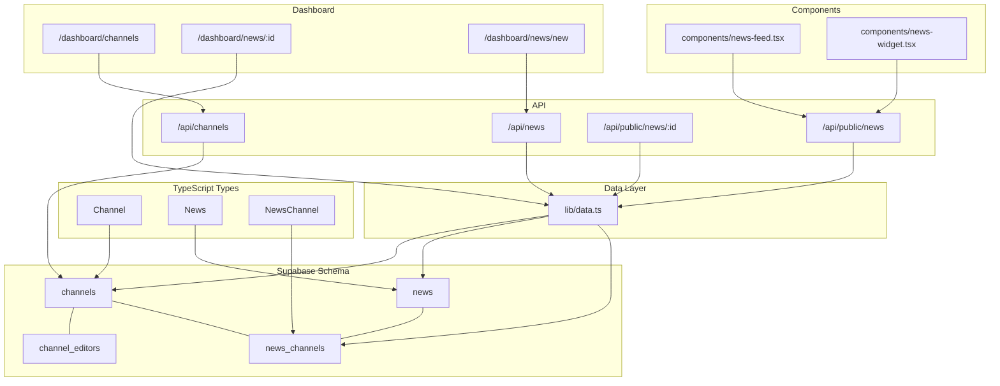
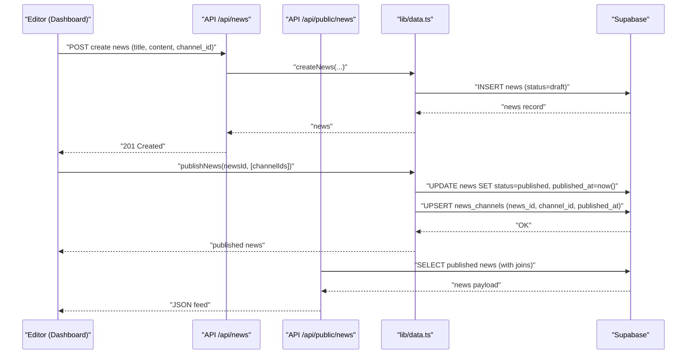
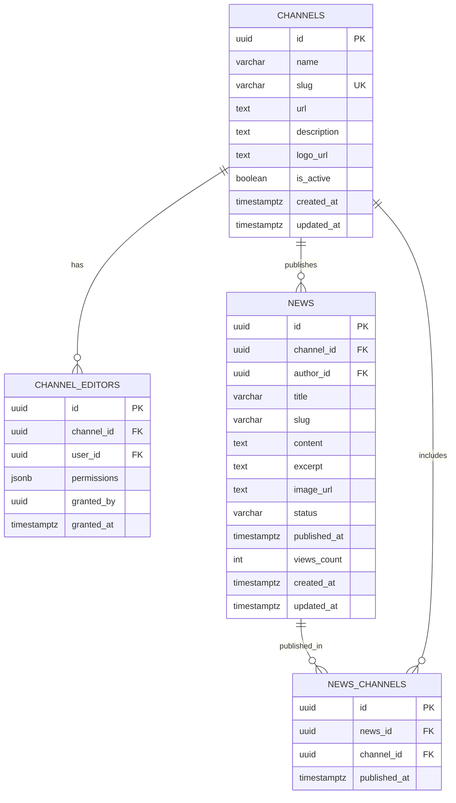
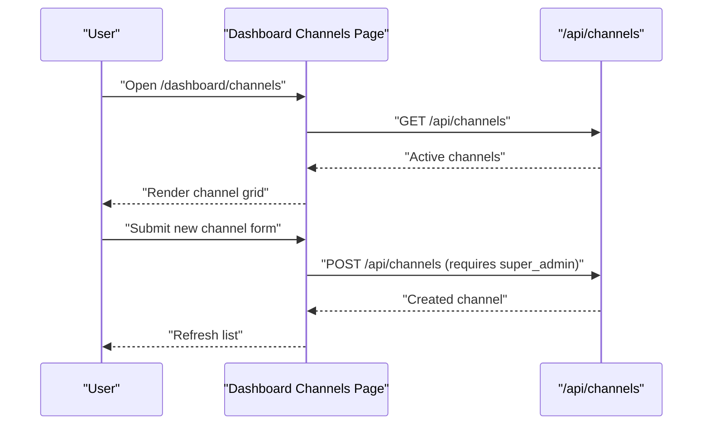
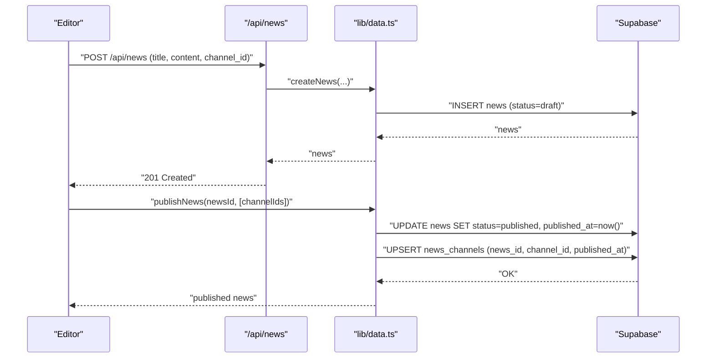
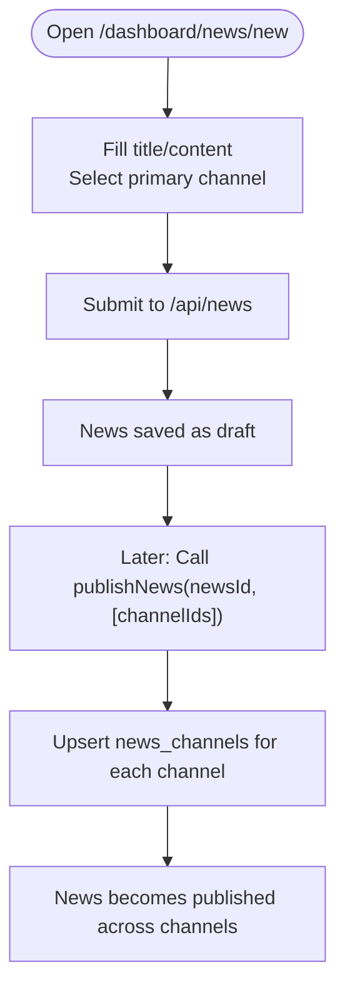
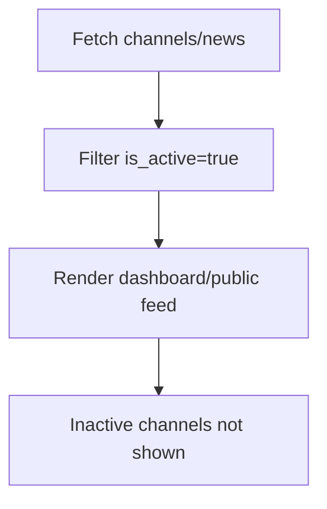
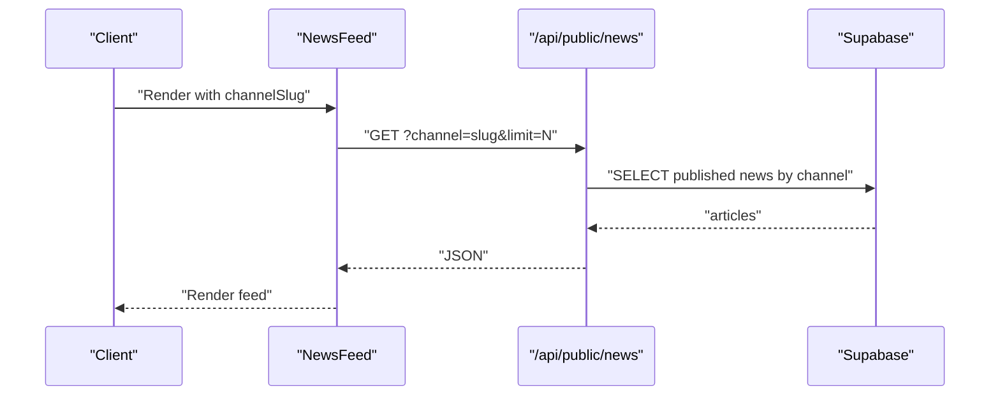
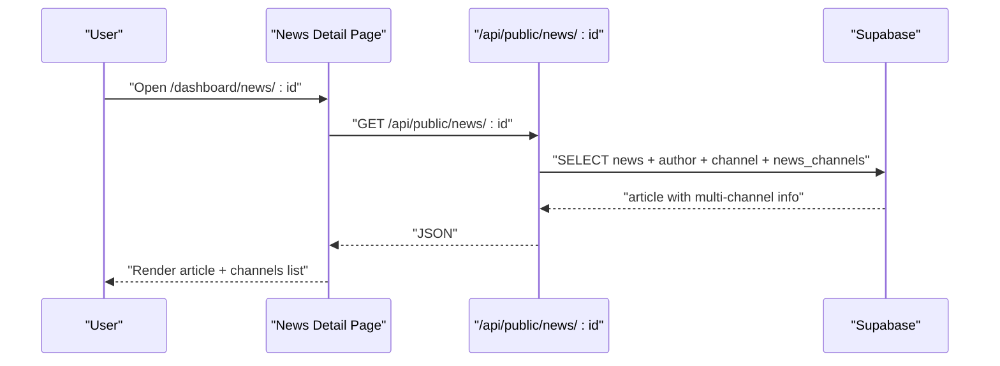
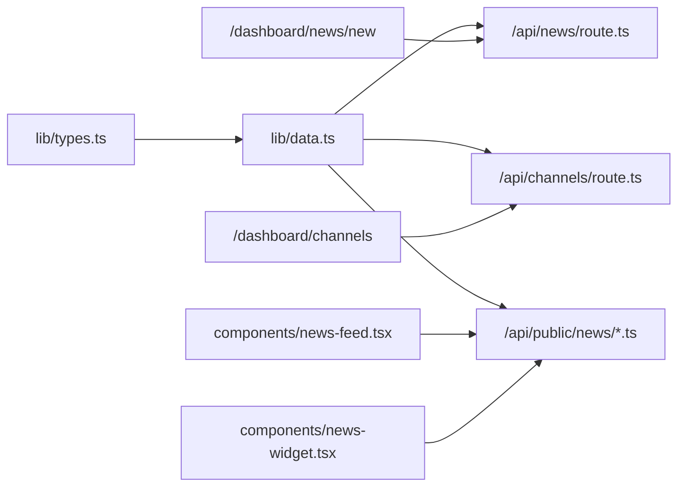

# Multi-Channel Publishing

<cite>
**Referenced Files in This Document**
- [supabase-schema.sql](file://supabase-schema.sql)
- [lib/types.ts](file://lib/types.ts)
- [lib/data.ts](file://lib/data.ts)
- [app/api/channels/route.ts](file://app/api/channels/route.ts)
- [app/api/news/route.ts](file://app/api/news/route.ts)
- [app/api/public/news/route.ts](file://app/api/public/news/route.ts)
- [app/api/public/news/[id]/route.ts](file://app/api/public/news/[id]/route.ts)
- [app/(dashboard)/dashboard/channels/page.tsx](file://app/(dashboard)/dashboard/channels/page.tsx)
- [app/(dashboard)/dashboard/news/[id]/page.tsx](file://app/(dashboard)/dashboard/news/[id]/page.tsx)
- [app/(dashboard)/dashboard/news/new/page.tsx](file://app/(dashboard)/dashboard/news/new/page.tsx)
- [components/news-feed.tsx](file://components/news-feed.tsx)
- [components/news-widget.tsx](file://components/news-widget.tsx)
</cite>

## Table of Contents
1. [Introduction](#introduction)
2. [Project Structure](#project-structure)
3. [Core Components](#core-components)
4. [Architecture Overview](#architecture-overview)
5. [Detailed Component Analysis](#detailed-component-analysis)
6. [Dependency Analysis](#dependency-analysis)
7. [Performance Considerations](#performance-considerations)
8. [Troubleshooting Guide](#troubleshooting-guide)
9. [Conclusion](#conclusion)
10. [Appendices](#appendices)

## Introduction
This document explains the multi-channel publishing system and channel management functionality. It covers how news items relate to channels via a many-to-many association through the news_channels junction table, how editors assign news to multiple channels during publishing, and how the system handles channel visibility and inactive channels. It also documents the dashboard interface for channel selection, channel-specific content distribution, bulk publishing operations, and best practices for managing channel assignments and metadata.

## Project Structure
The system is organized around:
- Supabase schema defining channels, news, channel editors, and the news_channels junction table
- TypeScript types for domain entities
- Data access layer with functions for CRUD and multi-channel publishing
- Public API endpoints for retrieving published news
- Dashboard pages for creating channels and authoring news
- Client-side components for rendering news feeds and widgets

**Diagram sources**
- [supabase-schema.sql:4-127](file://supabase-schema.sql#L4-L127)
- [lib/types.ts:14-61](file://lib/types.ts#L14-L61)
- [lib/data.ts:182-212](file://lib/data.ts#L182-L212)
- [app/api/news/route.ts:1-58](file://app/api/news/route.ts#L1-L58)
- [app/api/public/news/route.ts:1-54](file://app/api/public/news/route.ts#L1-L54)
- [app/api/public/news/[id]/route.ts:1-63](file://app/api/public/news/[id]/route.ts#L1-L63)
- [app/api/channels/route.ts:1-71](file://app/api/channels/route.ts#L1-L71)
- [app/(dashboard)/dashboard/channels/page.tsx:1-204](file://app/(dashboard)/dashboard/channels/page.tsx#L1-L204)
- [app/(dashboard)/dashboard/news/[id]/page.tsx:1-114](file://app/(dashboard)/dashboard/news/[id]/page.tsx#L1-L114)
- [app/(dashboard)/dashboard/news/new/page.tsx:1-138](file://app/(dashboard)/dashboard/news/new/page.tsx#L1-L138)
- [components/news-feed.tsx:1-152](file://components/news-feed.tsx#L1-L152)
- [components/news-widget.tsx:1-149](file://components/news-widget.tsx#L1-L149)

**Section sources**
- [supabase-schema.sql:4-127](file://supabase-schema.sql#L4-L127)
- [lib/types.ts:14-61](file://lib/types.ts#L14-L61)
- [lib/data.ts:182-212](file://lib/data.ts#L182-L212)
- [app/api/news/route.ts:1-58](file://app/api/news/route.ts#L1-L58)
- [app/api/public/news/route.ts:1-54](file://app/api/public/news/route.ts#L1-L54)
- [app/api/public/news/[id]/route.ts:1-63](file://app/api/public/news/[id]/route.ts#L1-L63)
- [app/api/channels/route.ts:1-71](file://app/api/channels/route.ts#L1-L71)
- [app/(dashboard)/dashboard/channels/page.tsx:1-204](file://app/(dashboard)/dashboard/channels/page.tsx#L1-L204)
- [app/(dashboard)/dashboard/news/[id]/page.tsx:1-114](file://app/(dashboard)/dashboard/news/[id]/page.tsx#L1-L114)
- [app/(dashboard)/dashboard/news/new/page.tsx:1-138](file://app/(dashboard)/dashboard/news/new/page.tsx#L1-L138)
- [components/news-feed.tsx:1-152](file://components/news-feed.tsx#L1-L152)
- [components/news-widget.tsx:1-149](file://components/news-widget.tsx#L1-L149)

## Core Components
- Channels: Define content distribution sites with properties such as name, slug, url, description, logo_url, and is_active.
- News: Represents articles authored by users, linked to a primary channel and tracked for publication status and timestamps.
- Channel Editors: Many-to-many relationship between channels and user profiles, with granular permissions.
- News Channels: Junction table enabling many-to-many publishing of news across multiple channels, storing per-publication timestamps.

Key relationships:
- One channel can publish many news items; each news item belongs to one primary channel but can be associated with many channels via news_channels.
- Channel editors define who can create, edit, delete, and publish within a channel.

**Section sources**
- [supabase-schema.sql:4-127](file://supabase-schema.sql#L4-L127)
- [lib/types.ts:14-61](file://lib/types.ts#L14-L61)

## Architecture Overview
The multi-channel publishing pipeline integrates the dashboard, API, and Supabase RLS policies to enable controlled, scalable content distribution.

**Diagram sources**
- [app/api/news/route.ts:1-58](file://app/api/news/route.ts#L1-L58)
- [lib/data.ts:144-212](file://lib/data.ts#L144-L212)
- [app/api/public/news/route.ts:1-54](file://app/api/public/news/route.ts#L1-L54)

## Detailed Component Analysis

### Database Schema and Entities
The schema defines four core tables:
- channels: Stores channel metadata and visibility flag.
- channel_editors: Links users to channels with permission flags.
- news: Article content with a primary channel linkage.
- news_channels: Enables multi-channel publishing with per-publication timestamps.

**Diagram sources**
- [supabase-schema.sql:4-127](file://supabase-schema.sql#L4-L127)

**Section sources**
- [supabase-schema.sql:4-127](file://supabase-schema.sql#L4-L127)
- [lib/types.ts:14-61](file://lib/types.ts#L14-L61)

### Channel Management in the Dashboard
The dashboard page lists active channels and allows creation by authorized users. It fetches channels via a public endpoint and renders channel cards with metadata.

**Diagram sources**
- [app/(dashboard)/dashboard/channels/page.tsx:1-204](file://app/(dashboard)/dashboard/channels/page.tsx#L1-L204)
- [app/api/channels/route.ts:1-71](file://app/api/channels/route.ts#L1-L71)

**Section sources**
- [app/(dashboard)/dashboard/channels/page.tsx:1-204](file://app/(dashboard)/dashboard/channels/page.tsx#L1-L204)
- [app/api/channels/route.ts:1-71](file://app/api/channels/route.ts#L1-L71)

### Creating and Publishing News
News creation sets initial status to draft. Publishing transitions status to published and records associations in news_channels via an upsert operation.

**Diagram sources**
- [app/api/news/route.ts:1-58](file://app/api/news/route.ts#L1-L58)
- [lib/data.ts:144-212](file://lib/data.ts#L144-L212)

**Section sources**
- [app/api/news/route.ts:1-58](file://app/api/news/route.ts#L1-L58)
- [lib/data.ts:144-212](file://lib/data.ts#L144-L212)

### Channel Selection and Multi-Channel Assignment
The dashboard’s “New News” page collects basic article details and requires a primary channel selection. While the current implementation posts to create a draft, the publishNews function accepts a list of channel IDs to associate the article with multiple channels. Editors can later call publishNews with the desired channel set to populate news_channels.

**Diagram sources**
- [app/(dashboard)/dashboard/news/new/page.tsx:1-138](file://app/(dashboard)/dashboard/news/new/page.tsx#L1-L138)
- [lib/data.ts:182-212](file://lib/data.ts#L182-L212)

**Section sources**
- [app/(dashboard)/dashboard/news/new/page.tsx:1-138](file://app/(dashboard)/dashboard/news/new/page.tsx#L1-L138)
- [lib/data.ts:182-212](file://lib/data.ts#L182-L212)

### Channel Visibility Controls and Inactive Channels
- Active channels are fetched by the dashboard and public endpoints using is_active=true filters.
- Public retrieval of published news is governed by RLS policies ensuring only published content is returned.
- Inactive channels are excluded from listings and public feeds, preventing distribution until reactivated.

**Diagram sources**
- [app/api/channels/route.ts:1-71](file://app/api/channels/route.ts#L1-L71)
- [app/api/public/news/route.ts:1-54](file://app/api/public/news/route.ts#L1-L54)
- [supabase-schema.sql:154-171](file://supabase-schema.sql#L154-L171)

**Section sources**
- [app/api/channels/route.ts:1-71](file://app/api/channels/route.ts#L1-L71)
- [app/api/public/news/route.ts:1-54](file://app/api/public/news/route.ts#L1-L54)
- [supabase-schema.sql:154-171](file://supabase-schema.sql#L154-L171)

### Channel-Specific Content Variations and Bulk Publishing
- The system supports distributing the same base content across multiple channels. There is no built-in per-channel content override in the schema; content is shared via news_channels.
- Bulk publishing is performed by passing multiple channel IDs to publishNews, which upserts multiple news_channels entries atomically.

Practical example:
- Create a draft article with a primary channel.
- Publish to channels A and B by invoking publishNews with [A, B].
- The article appears in both channels’ feeds and public endpoints.

**Section sources**
- [lib/data.ts:182-212](file://lib/data.ts#L182-L212)
- [app/api/public/news/route.ts:1-54](file://app/api/public/news/route.ts#L1-L54)

### Channel-Based Content Filtering and Public Distribution
- Public endpoints filter by status=published and optionally by channel slug.
- Components like NewsFeed and NewsWidget consume the public API to render channel-aware feeds.

**Diagram sources**
- [components/news-feed.tsx:1-152](file://components/news-feed.tsx#L1-L152)
- [app/api/public/news/route.ts:1-54](file://app/api/public/news/route.ts#L1-L54)

**Section sources**
- [components/news-feed.tsx:1-152](file://components/news-feed.tsx#L1-L152)
- [app/api/public/news/route.ts:1-54](file://app/api/public/news/route.ts#L1-L54)

### Viewing Multi-Channel Articles
- The single-article page aggregates author, channel, and multi-channel associations, displaying all channels where the article was published.

**Diagram sources**
- [app/(dashboard)/dashboard/news/[id]/page.tsx:1-114](file://app/(dashboard)/dashboard/news/[id]/page.tsx#L1-L114)
- [app/api/public/news/[id]/route.ts:1-63](file://app/api/public/news/[id]/route.ts#L1-L63)

**Section sources**
- [app/(dashboard)/dashboard/news/[id]/page.tsx:1-114](file://app/(dashboard)/dashboard/news/[id]/page.tsx#L1-L114)
- [app/api/public/news/[id]/route.ts:1-63](file://app/api/public/news/[id]/route.ts#L1-L63)

## Dependency Analysis
- Data layer depends on Supabase client and exposes publishNews and related helpers.
- API routes depend on the data layer and enforce authentication/authorization checks.
- Dashboard pages depend on API routes and types for rendering and forms.
- Public components depend on public API endpoints.

**Diagram sources**
- [lib/types.ts:14-61](file://lib/types.ts#L14-L61)
- [lib/data.ts:182-212](file://lib/data.ts#L182-L212)
- [app/api/news/route.ts:1-58](file://app/api/news/route.ts#L1-L58)
- [app/api/channels/route.ts:1-71](file://app/api/channels/route.ts#L1-L71)
- [app/api/public/news/route.ts:1-54](file://app/api/public/news/route.ts#L1-L54)
- [app/api/public/news/[id]/route.ts:1-63](file://app/api/public/news/[id]/route.ts#L1-L63)
- [app/(dashboard)/dashboard/news/new/page.tsx:1-138](file://app/(dashboard)/dashboard/news/new/page.tsx#L1-L138)
- [app/(dashboard)/dashboard/channels/page.tsx:1-204](file://app/(dashboard)/dashboard/channels/page.tsx#L1-L204)
- [components/news-feed.tsx:1-152](file://components/news-feed.tsx#L1-L152)
- [components/news-widget.tsx:1-149](file://components/news-widget.tsx#L1-L149)

**Section sources**
- [lib/types.ts:14-61](file://lib/types.ts#L14-L61)
- [lib/data.ts:182-212](file://lib/data.ts#L182-L212)
- [app/api/news/route.ts:1-58](file://app/api/news/route.ts#L1-L58)
- [app/api/channels/route.ts:1-71](file://app/api/channels/route.ts#L1-L71)
- [app/api/public/news/route.ts:1-54](file://app/api/public/news/route.ts#L1-L54)
- [app/api/public/news/[id]/route.ts:1-63](file://app/api/public/news/[id]/route.ts#L1-L63)
- [app/(dashboard)/dashboard/news/new/page.tsx:1-138](file://app/(dashboard)/dashboard/news/new/page.tsx#L1-L138)
- [app/(dashboard)/dashboard/channels/page.tsx:1-204](file://app/(dashboard)/dashboard/channels/page.tsx#L1-L204)
- [components/news-feed.tsx:1-152](file://components/news-feed.tsx#L1-L152)
- [components/news-widget.tsx:1-149](file://components/news-widget.tsx#L1-L149)

## Performance Considerations
- Indexes on channels (slug, is_active), news (status, published_at), and news_channels (news_id, channel_id) support efficient filtering and joins.
- Public feeds use targeted selects and pagination via limit parameters.
- Consider batching upserts for very large channel sets to reduce round trips.

[No sources needed since this section provides general guidance]

## Troubleshooting Guide
Common issues and resolutions:
- Unauthorized or forbidden actions: Ensure the user is authenticated and has appropriate roles or permissions for channel operations.
- Missing required fields when creating news: Verify title, content, and channel_id are provided.
- Upsert failures for news_channels: Confirm newsId exists and channelIds are valid; check for unique constraints on (news_id, channel_id).
- Inactive channels not appearing: Confirm is_active=true and verify filters in queries and policies.
- Public feed returns empty: Ensure status=published and optional channel slug matches existing records.

**Section sources**
- [app/api/channels/route.ts:26-44](file://app/api/channels/route.ts#L26-L44)
- [app/api/news/route.ts:14-23](file://app/api/news/route.ts#L14-L23)
- [lib/data.ts:182-212](file://lib/data.ts#L182-L212)
- [supabase-schema.sql:154-171](file://supabase-schema.sql#L154-L171)

## Conclusion
The multi-channel publishing system leverages a clean schema with channels, news, channel_editors, and news_channels to support flexible distribution. The publishNews function enables assigning a single article to multiple channels via an upsert operation on news_channels. Dashboard interfaces facilitate channel management and article creation, while public APIs and components deliver channel-aware content. Adhering to best practices for channel assignment, content duplication, and metadata management ensures reliable, scalable distribution.

[No sources needed since this section summarizes without analyzing specific files]

## Appendices

### Best Practices for Channel Assignment
- Use a primary channel for ownership and editorial control; apply publishNews to add secondary channels.
- Keep channel slugs unique and stable; avoid frequent renames to prevent broken links.
- Leverage is_active to temporarily disable distribution without deleting channel records.
- For content variants, maintain a single canonical article and rely on news_channels for distribution rather than duplicating content.

[No sources needed since this section provides general guidance]

### Channel-Specific Metadata Management
- Store channel-level metadata (name, slug, url, description, logo_url) in channels.
- Use RLS policies to control access to channel and editor data.
- Avoid embedding channel-specific content within news; instead, use news_channels to indicate distribution.

**Section sources**
- [supabase-schema.sql:4-15](file://supabase-schema.sql#L4-L15)
- [supabase-schema.sql:154-213](file://supabase-schema.sql#L154-L213)