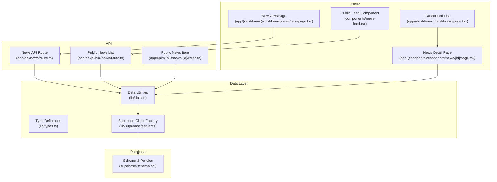
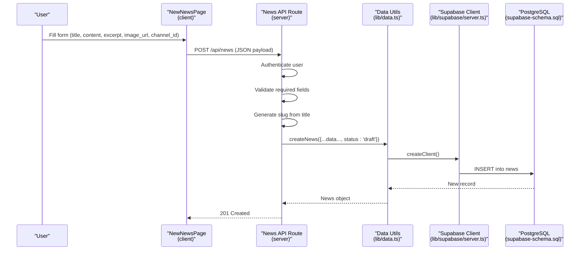
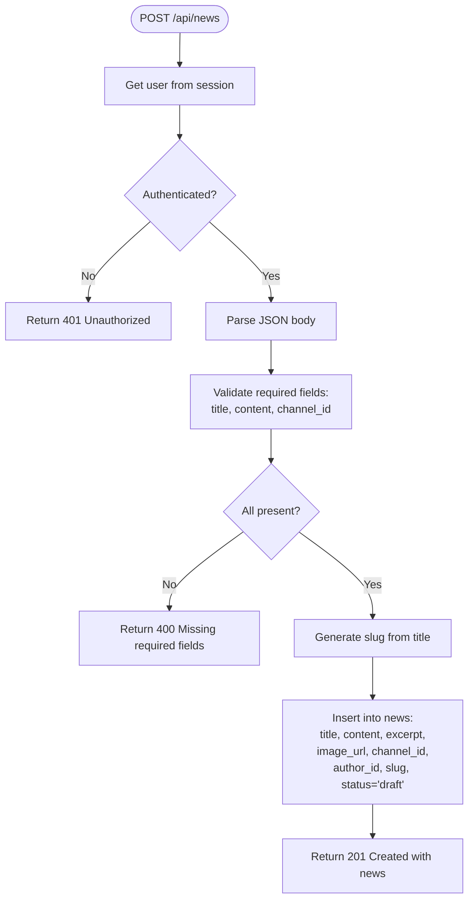
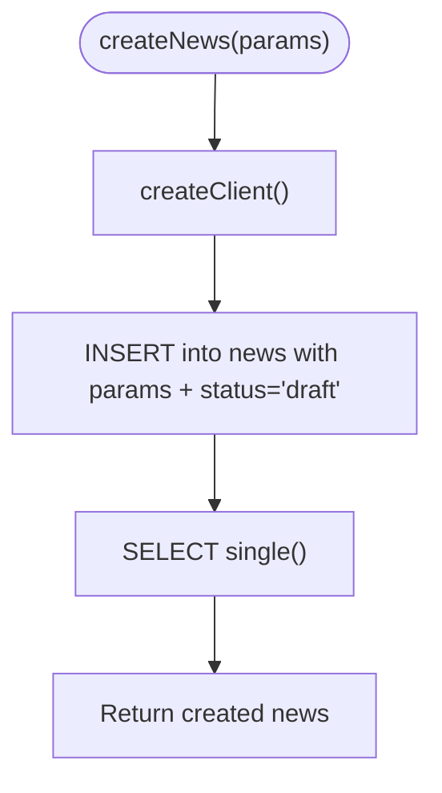
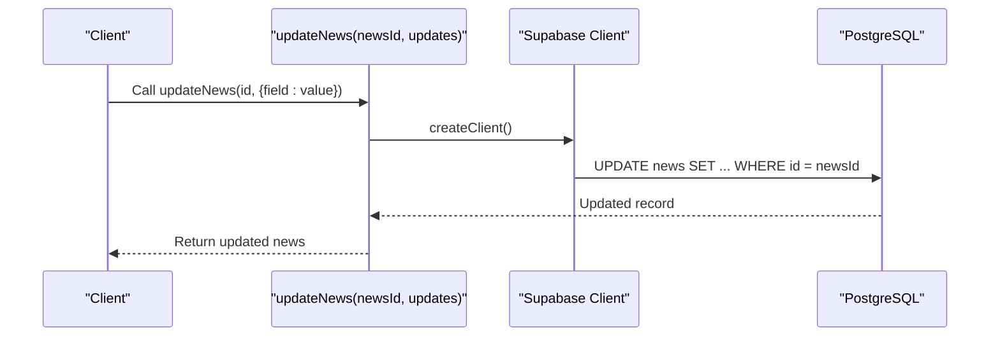
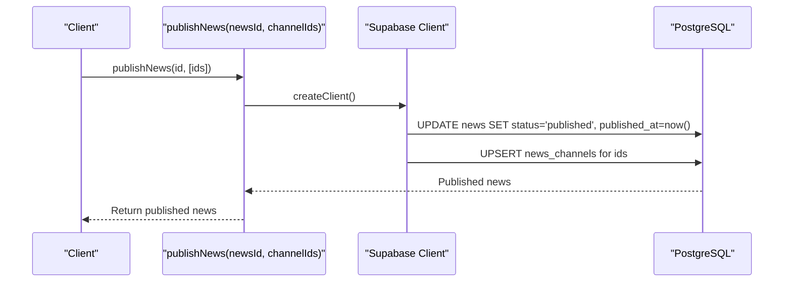
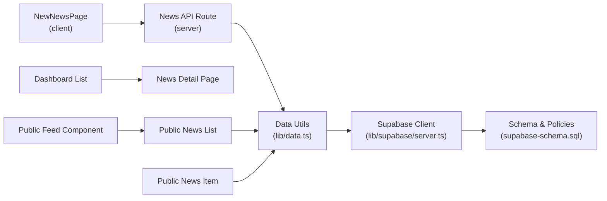

# News Creation and Editing

<cite>
**Referenced Files in This Document**
- [app/api/news/route.ts](file://app/api/news/route.ts)
- [lib/data.ts](file://lib/data.ts)
- [lib/types.ts](file://lib/types.ts)
- [lib/supabase/server.ts](file://lib/supabase/server.ts)
- [supabase-schema.sql](file://supabase-schema.sql)
- [app/(dashboard)/dashboard/news/new/page.tsx](file://app/(dashboard)/dashboard/news/new/page.tsx)
- [app/(dashboard)/dashboard/news/[id]/page.tsx](file://app/(dashboard)/dashboard/news/[id]/page.tsx)
- [app/api/public/news/route.ts](file://app/api/public/news/route.ts)
- [app/api/public/news/[id]/route.ts](file://app/api/public/news/[id]/route.ts)
- [app/(dashboard)/dashboard/page.tsx](file://app/(dashboard)/dashboard/page.tsx)
- [components/news-feed.tsx](file://components/news-feed.tsx)
</cite>

## Table of Contents
1. [Introduction](#introduction)
2. [Project Structure](#project-structure)
3. [Core Components](#core-components)
4. [Architecture Overview](#architecture-overview)
5. [Detailed Component Analysis](#detailed-component-analysis)
6. [Dependency Analysis](#dependency-analysis)
7. [Performance Considerations](#performance-considerations)
8. [Troubleshooting Guide](#troubleshooting-guide)
9. [Conclusion](#conclusion)
10. [Appendices](#appendices)

## Introduction
This document explains the complete workflow for creating and editing news articles in the system. It covers form validation, content formatting, metadata management, draft creation, updating existing content, and publishing to multiple channels. It also documents the createNews and updateNews functions, the author relationship via author_id, slug generation, and practical guidance for previewing and collaborative editing.

## Project Structure
The news creation and editing functionality spans client-side forms, server-side API routes, shared data utilities, and database schema definitions.

**Diagram sources**
- [app/(dashboard)/dashboard/news/new/page.tsx](file://app/(dashboard)/dashboard/news/new/page.tsx#L1-L138)
- [app/(dashboard)/dashboard/news/[id]/page.tsx](file://app/(dashboard)/dashboard/news/[id]/page.tsx#L1-L114)
- [app/(dashboard)/dashboard/page.tsx](file://app/(dashboard)/dashboard/page.tsx#L1-L82)
- [components/news-feed.tsx:1-151](file://components/news-feed.tsx#L1-L151)
- [app/api/news/route.ts:1-58](file://app/api/news/route.ts#L1-L58)
- [app/api/public/news/route.ts:1-54](file://app/api/public/news/route.ts#L1-L54)
- [app/api/public/news/[id]/route.ts](file://app/api/public/news/[id]/route.ts#L1-L62)
- [lib/data.ts:1-213](file://lib/data.ts#L1-L213)
- [lib/types.ts:1-62](file://lib/types.ts#L1-L62)
- [lib/supabase/server.ts:1-30](file://lib/supabase/server.ts#L1-L30)
- [supabase-schema.sql:1-258](file://supabase-schema.sql#L1-L258)

**Section sources**
- [app/(dashboard)/dashboard/news/new/page.tsx](file://app/(dashboard)/dashboard/news/new/page.tsx#L1-L138)
- [app/api/news/route.ts:1-58](file://app/api/news/route.ts#L1-L58)
- [lib/data.ts:144-180](file://lib/data.ts#L144-L180)
- [lib/types.ts:40-54](file://lib/types.ts#L40-L54)
- [lib/supabase/server.ts:1-30](file://lib/supabase/server.ts#L1-L30)
- [supabase-schema.sql:87-103](file://supabase-schema.sql#L87-L103)

## Core Components
- News API route: Handles authenticated creation of drafts with validation and slug generation.
- Data utilities: Provide createNews, updateNews, and publishNews functions for backend operations.
- Type definitions: Define the News entity and related interfaces.
- Supabase client factory: Centralized creation of authenticated Supabase clients.
- Database schema: Defines tables, constraints, indexes, and RLS policies for news and channels.
- Client forms and pages: Provide the UI for creating news and viewing details.

Key responsibilities:
- Form validation: Ensures required fields are present before creating a draft.
- Content formatting: Stores raw content; rendering uses HTML-safe display in detail pages.
- Metadata management: Maintains title, slug, excerpt, image_url, channel_id, author_id, status, timestamps.
- Draft lifecycle: News items are created with status 'draft' and later published to channels.

**Section sources**
- [app/api/news/route.ts:4-57](file://app/api/news/route.ts#L4-L57)
- [lib/data.ts:144-180](file://lib/data.ts#L144-L180)
- [lib/types.ts:40-54](file://lib/types.ts#L40-L54)
- [supabase-schema.sql:87-103](file://supabase-schema.sql#L87-L103)

## Architecture Overview
The system enforces authentication, validates inputs, persists data, and exposes both internal and public APIs.

**Diagram sources**
- [app/(dashboard)/dashboard/news/new/page.tsx](file://app/(dashboard)/dashboard/news/new/page.tsx#L17-L39)
- [app/api/news/route.ts:4-57](file://app/api/news/route.ts#L4-L57)
- [lib/data.ts:144-166](file://lib/data.ts#L144-L166)
- [lib/supabase/server.ts:4-29](file://lib/supabase/server.ts#L4-L29)
- [supabase-schema.sql:87-103](file://supabase-schema.sql#L87-L103)

## Detailed Component Analysis

### News Creation Workflow
- Authentication: The API route checks for an authenticated user before proceeding.
- Validation: Requires title, content, and channel_id; returns 400 if missing.
- Slug generation: Creates a URL-friendly slug from the title.
- Persistence: Inserts a new news record with status 'draft' and author_id set to the current user.
- Response: Returns the created news object with 201 status.

**Diagram sources**
- [app/api/news/route.ts:4-57](file://app/api/news/route.ts#L4-L57)

**Section sources**
- [app/api/news/route.ts:4-57](file://app/api/news/route.ts#L4-L57)

### createNews Function Implementation
Purpose: Encapsulate the backend insertion of a news draft with explicit typing and status assignment.

Parameters:
- title: string
- content: string
- excerpt?: string
- image_url?: string
- channel_id: string
- author_id: string
- slug: string

Behavior:
- Calls the Supabase client factory.
- Inserts a record into the news table with status set to 'draft'.
- Returns the created record or throws an error.

**Diagram sources**
- [lib/data.ts:144-166](file://lib/data.ts#L144-L166)
- [lib/supabase/server.ts:4-29](file://lib/supabase/server.ts#L4-L29)

**Section sources**
- [lib/data.ts:144-166](file://lib/data.ts#L144-L166)
- [lib/types.ts:40-54](file://lib/types.ts#L40-L54)

### Draft Creation Process
- Initial status: 'draft'
- Author association: author_id is set to the authenticated user's ID during creation.
- Channel association: channel_id links the news to a specific channel.
- Metadata: title, slug, excerpt, image_url are stored alongside content.

Practical implications:
- Drafts are private and editable until published.
- Publishing requires permission checks enforced by RLS policies.

**Section sources**
- [app/api/news/route.ts:32-45](file://app/api/news/route.ts#L32-L45)
- [lib/data.ts:144-166](file://lib/data.ts#L144-L166)
- [supabase-schema.sql:87-103](file://supabase-schema.sql#L87-L103)

### updateNews Functionality
Purpose: Modify existing news content and metadata.

Parameters:
- newsId: string (UUID)
- updates: Partial<typeof createNews.arguments[0]> (allows selective field updates)

Behavior:
- Updates the news record identified by newsId.
- Returns the updated record or throws an error.

**Diagram sources**
- [lib/data.ts:168-180](file://lib/data.ts#L168-L180)
- [lib/supabase/server.ts:4-29](file://lib/supabase/server.ts#L4-L29)

**Section sources**
- [lib/data.ts:168-180](file://lib/data.ts#L168-L180)

### Publishing to Channels
Purpose: Transition a draft to published and associate it with one or more channels.

Steps:
- Update news.status to 'published' and set published_at.
- Upsert news_channels entries for the selected channels.

**Diagram sources**
- [lib/data.ts:182-212](file://lib/data.ts#L182-L212)
- [lib/supabase/server.ts:4-29](file://lib/supabase/server.ts#L4-L29)

**Section sources**
- [lib/data.ts:182-212](file://lib/data.ts#L182-L212)

### Client-Side News Creation Form
The form captures:
- title (required)
- content (required)
- excerpt (optional)
- image_url (optional)
- channel_id (required)

Submission:
- Sends a POST request to /api/news with JSON payload.
- On success, navigates to the dashboard.

Validation highlights:
- Required fields enforced on the client side via HTML attributes.
- Additional server-side validation ensures robustness.

Preview and organization:
- The dashboard lists recent news and links to individual detail pages.
- The detail page renders images, excerpts, author info, and content.

**Section sources**
- [app/(dashboard)/dashboard/news/new/page.tsx](file://app/(dashboard)/dashboard/news/new/page.tsx#L6-L39)
- [app/(dashboard)/dashboard/page.tsx](file://app/(dashboard)/dashboard/page.tsx#L11-L82)
- [app/(dashboard)/dashboard/news/[id]/page.tsx](file://app/(dashboard)/dashboard/news/[id]/page.tsx#L1-L114)

### Content Formatting and Rendering
- Storage: Content is stored as-is in the content field.
- Rendering: The detail page displays content using a container designed for prose, with safe handling of HTML content.
- Excerpts: Optional excerpt is shown prominently when present.

Recommendations:
- Keep content readable and structured for the prose renderer.
- Use semantic markup suitable for web display.

**Section sources**
- [app/(dashboard)/dashboard/news/[id]/page.tsx](file://app/(dashboard)/dashboard/news/[id]/page.tsx#L87-L92)

### Image Upload Handling
- URL-based: The system accepts an image_url; it does not implement inline image uploads in this codebase.
- Display: If present, the image is rendered above the article header.

Guidance:
- Use external image hosting or CDN URLs.
- Ensure HTTPS URLs for security and compatibility.

**Section sources**
- [app/(dashboard)/dashboard/news/new/page.tsx](file://app/(dashboard)/dashboard/news/new/page.tsx#L89-L100)
- [app/(dashboard)/dashboard/news/[id]/page.tsx](file://app/(dashboard)/dashboard/news/[id]/page.tsx#L30-L38)

### Slug Generation
- Automatic: The slug is derived from the title using a simple transformation that replaces non-alphanumeric sequences with hyphens and trims leading/trailing hyphens.
- Uniqueness: The database enforces uniqueness of (channel_id, slug).

Best practices:
- Keep titles descriptive and concise to produce clean slugs.
- Avoid special characters that would be stripped.

**Section sources**
- [app/api/news/route.ts:25-30](file://app/api/news/route.ts#L25-L30)
- [supabase-schema.sql](file://supabase-schema.sql#L102)

### Relationship Between News Items and Authors
- Foreign key: author_id references user_profiles(id).
- Access control: RLS policies allow authors and editors to manage their own news and news they can edit via channel_editor permissions.

Implications:
- Only authenticated users can create news.
- Editors can manage news within channels they are permitted to edit.

**Section sources**
- [supabase-schema.sql](file://supabase-schema.sql#L91)
- [supabase-schema.sql:220-241](file://supabase-schema.sql#L220-L241)

### Public Preview and Integration
- Public feed endpoint: Returns published news with author and channel metadata.
- Public detail endpoint: Returns a single published news item and increments view counts.
- Client component: Provides a reusable news feed for embedding.

**Section sources**
- [app/api/public/news/route.ts:4-53](file://app/api/public/news/route.ts#L4-L53)
- [app/api/public/news/[id]/route.ts](file://app/api/public/news/[id]/route.ts#L4-L62)
- [components/news-feed.tsx:1-151](file://components/news-feed.tsx#L1-L151)

## Dependency Analysis

**Diagram sources**
- [app/(dashboard)/dashboard/news/new/page.tsx](file://app/(dashboard)/dashboard/news/new/page.tsx#L1-L138)
- [app/api/news/route.ts:1-58](file://app/api/news/route.ts#L1-L58)
- [lib/data.ts:1-213](file://lib/data.ts#L1-L213)
- [lib/supabase/server.ts:1-30](file://lib/supabase/server.ts#L1-L30)
- [supabase-schema.sql:1-258](file://supabase-schema.sql#L1-L258)
- [app/(dashboard)/dashboard/news/[id]/page.tsx](file://app/(dashboard)/dashboard/news/[id]/page.tsx#L1-L114)
- [components/news-feed.tsx:1-151](file://components/news-feed.tsx#L1-L151)
- [app/api/public/news/route.ts:1-54](file://app/api/public/news/route.ts#L1-L54)
- [app/api/public/news/[id]/route.ts](file://app/api/public/news/[id]/route.ts#L1-L62)

**Section sources**
- [lib/types.ts:40-54](file://lib/types.ts#L40-L54)
- [supabase-schema.sql:87-103](file://supabase-schema.sql#L87-L103)

## Performance Considerations
- Indexes: The schema includes indexes on frequently queried columns (e.g., published_at, status, author_id, channel_id) to optimize queries.
- RLS: Row-level security adds overhead; keep policies efficient and avoid overly complex conditions.
- Public endpoints: Limit returned fields to reduce payload sizes (already done in public endpoints).
- View counting: Incrementing views on public detail requests is simple but consider caching strategies if traffic increases.

[No sources needed since this section provides general guidance]

## Troubleshooting Guide
Common issues and resolutions:
- Unauthorized access when creating news:
  - Ensure the user is authenticated before calling the API.
  - Verify session cookies are included in the request.
  - Reference: [app/api/news/route.ts:8-12](file://app/api/news/route.ts#L8-L12)

- Missing required fields error:
  - Confirm title, content, and channel_id are provided.
  - Reference: [app/api/news/route.ts:17-23](file://app/api/news/route.ts#L17-L23)

- Slug conflicts:
  - The database enforces unique (channel_id, slug); change the title or choose another channel.
  - Reference: [supabase-schema.sql](file://supabase-schema.sql#L102)

- Updating or publishing errors:
  - Ensure the caller has appropriate permissions (author or editor with can_edit/can_publish).
  - Reference: [supabase-schema.sql:220-241](file://supabase-schema.sql#L220-L241)

- Public feed returns empty:
  - Confirm news status is 'published' and filters match channel slugs.
  - Reference: [app/api/public/news/route.ts:33-39](file://app/api/public/news/route.ts#L33-L39)

**Section sources**
- [app/api/news/route.ts:8-23](file://app/api/news/route.ts#L8-L23)
- [supabase-schema.sql](file://supabase-schema.sql#L102)
- [supabase-schema.sql:220-241](file://supabase-schema.sql#L220-L241)
- [app/api/public/news/route.ts:33-39](file://app/api/public/news/route.ts#L33-L39)

## Conclusion
The news creation and editing system provides a secure, structured workflow for drafting, editing, and publishing content. It leverages authentication, typed data utilities, and database constraints to maintain data integrity. The client-side forms and pages offer straightforward authoring experiences, while public endpoints enable seamless content consumption.

## Appendices

### Practical Examples

- Creating a news draft:
  - Submit a POST request to /api/news with JSON containing title, content, channel_id, and optional excerpt/image_url.
  - The system responds with the created draft.

- Updating existing content:
  - Call updateNews with the newsId and desired field updates (e.g., title, content, excerpt).
  - The system returns the updated record.

- Publishing to channels:
  - Call publishNews with the newsId and an array of channel IDs to publish to.
  - The system sets status to published and records publication timestamps.

- Viewing published content:
  - Use the public feed endpoint to list published news.
  - Use the public detail endpoint to fetch a single item and increment views.

**Section sources**
- [app/api/news/route.ts:4-57](file://app/api/news/route.ts#L4-L57)
- [lib/data.ts:168-212](file://lib/data.ts#L168-L212)
- [app/api/public/news/route.ts:4-53](file://app/api/public/news/route.ts#L4-L53)
- [app/api/public/news/[id]/route.ts](file://app/api/public/news/[id]/route.ts#L4-L62)