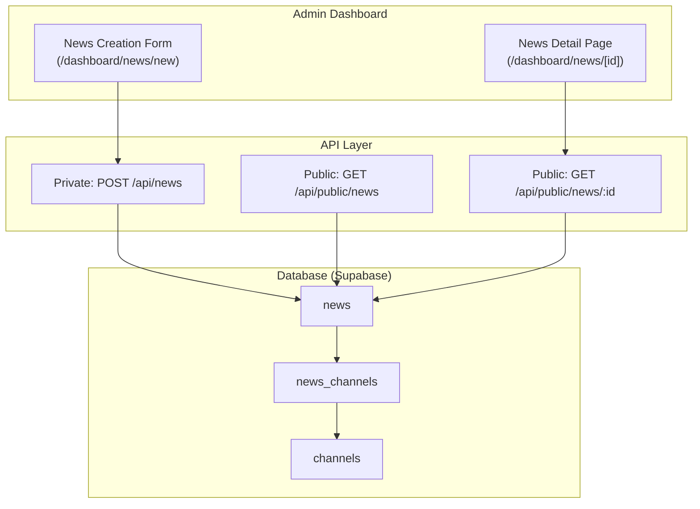
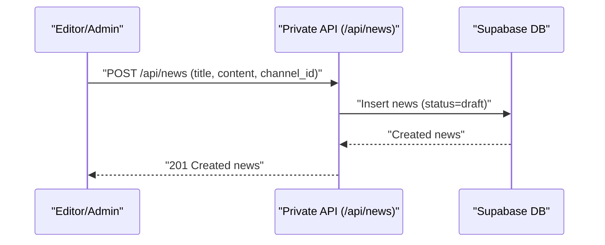
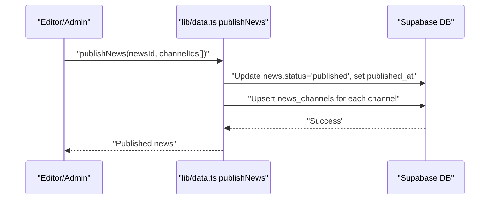
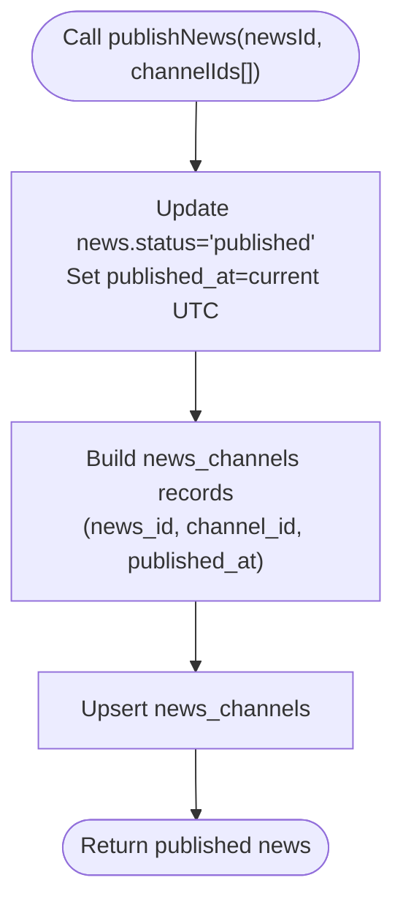
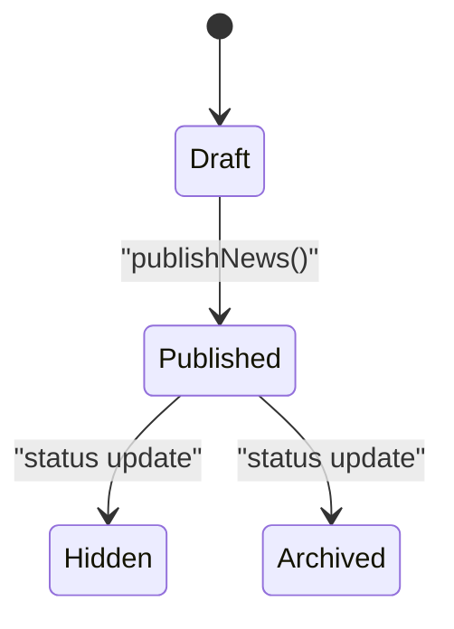
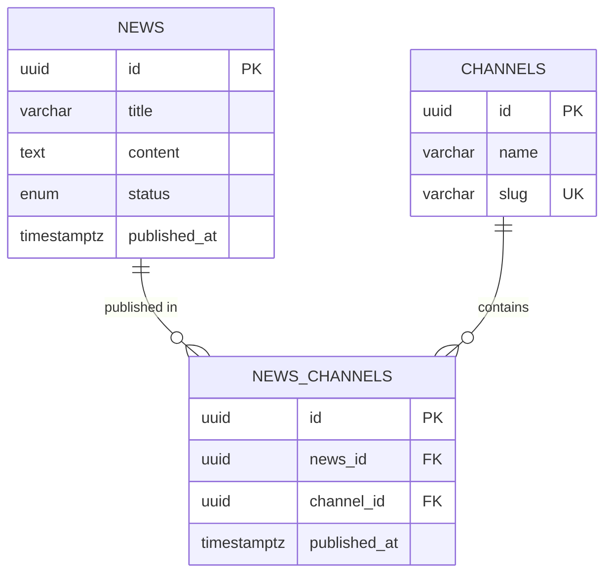
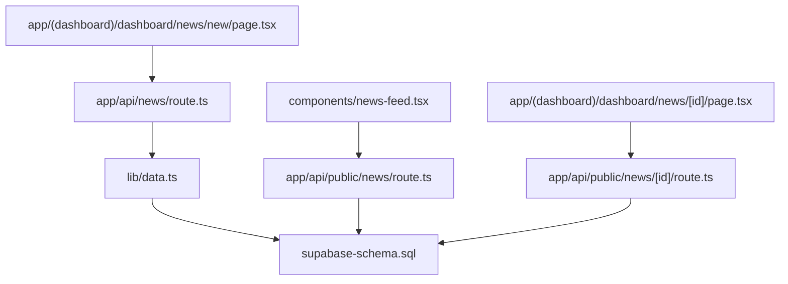

# Publication Workflow

<cite>
**Referenced Files in This Document**
- [supabase-schema.sql](file://supabase-schema.sql)
- [lib/types.ts](file://lib/types.ts)
- [lib/data.ts](file://lib/data.ts)
- [app/api/news/route.ts](file://app/api/news/route.ts)
- [app/api/public/news/route.ts](file://app/api/public/news/route.ts)
- [app/api/public/news/[id]/route.ts](file://app/api/public/news/[id]/route.ts)
- [app/(dashboard)/dashboard/news/new/page.tsx](file://app/(dashboard)/dashboard/news/new/page.tsx)
- [app/(dashboard)/dashboard/news/[id]/page.tsx](file://app/(dashboard)/dashboard/news/[id]/page.tsx)
- [components/news-feed.tsx](file://components/news-feed.tsx)
- [README.md](file://README.md)
- [PROJECT_SUMMARY.md](file://PROJECT_SUMMARY.md)
- [ARCHITECTURE.md](file://ARCHITECTURE.md)
</cite>

## Table of Contents
1. [Introduction](#introduction)
2. [Project Structure](#project-structure)
3. [Core Components](#core-components)
4. [Architecture Overview](#architecture-overview)
5. [Detailed Component Analysis](#detailed-component-analysis)
6. [Dependency Analysis](#dependency-analysis)
7. [Performance Considerations](#performance-considerations)
8. [Troubleshooting Guide](#troubleshooting-guide)
9. [Conclusion](#conclusion)
10. [Appendices](#appendices)

## Introduction
This document explains the complete news publication workflow and multi-channel publishing system. It covers how news items are created, how the publishNews function updates status and timestamps, and how the news_channels junction table enables simultaneous distribution across multiple channels. It also documents the many-to-many relationship between news and channels, the upsert operation for assigning channels, and practical examples for publication scheduling, approval workflows, and collaborative publishing. Guidance is included for troubleshooting, channel-specific content variations, and bulk publishing strategies.

## Project Structure
The system is built with Next.js App Router, TypeScript, and Supabase for database and authentication. The publication workflow spans:
- Admin creation of news via a private API endpoint
- Multi-channel assignment via the publishNews function
- Public consumption via REST endpoints and embeddable components

**Diagram sources**
- [app/(dashboard)/dashboard/news/new/page.tsx](file://app/(dashboard)/dashboard/news/new/page.tsx#L1-138)
- [app/(dashboard)/dashboard/news/[id]/page.tsx](file://app/(dashboard)/dashboard/news/[id]/page.tsx#L1-114)
- [app/api/news/route.ts:1-58](file://app/api/news/route.ts#L1-58)
- [app/api/public/news/route.ts:1-54](file://app/api/public/news/route.ts#L1-54)
- [app/api/public/news/[id]/route.ts](file://app/api/public/news/[id]/route.ts#L1-63)
- [supabase-schema.sql:87-127](file://supabase-schema.sql#L87-127)

**Section sources**
- [README.md:1-517](file://README.md#L1-L517)
- [PROJECT_SUMMARY.md:73-115](file://PROJECT_SUMMARY.md#L73-L115)
- [ARCHITECTURE.md:1-102](file://ARCHITECTURE.md#L1-L102)

## Core Components
- Data access and publication orchestration: [lib/data.ts:182-212](file://lib/data.ts#L182-L212)
- Private news creation endpoint: [app/api/news/route.ts:1-58](file://app/api/news/route.ts#L1-58)
- Public news listing endpoint: [app/api/public/news/route.ts:1-54](file://app/api/public/news/route.ts#L1-54)
- Public single news endpoint: [app/api/public/news/[id]/route.ts](file://app/api/public/news/[id]/route.ts#L1-63)
- Types for news and channel relationships: [lib/types.ts:40-62](file://lib/types.ts#L40-L62)
- Database schema for multi-channel publishing: [supabase-schema.sql:105-112](file://supabase-schema.sql#L105-L112)

Key responsibilities:
- publishNews updates the news status to published and sets published_at, then upserts news_channels entries for the selected channels.
- The public endpoints filter by status = published and order by published_at descending.
- The frontend dashboards support creating news and viewing multi-channel assignments.

**Section sources**
- [lib/data.ts:182-212](file://lib/data.ts#L182-L212)
- [app/api/news/route.ts:14-46](file://app/api/news/route.ts#L14-L46)
- [app/api/public/news/route.ts:33-34](file://app/api/public/news/route.ts#L33-L34)
- [app/api/public/news/[id]/route.ts](file://app/api/public/news/[id]/route.ts#L37-L38)
- [lib/types.ts:40-62](file://lib/types.ts#L40-L62)
- [supabase-schema.sql:105-112](file://supabase-schema.sql#L105-L112)

## Architecture Overview
The publication workflow integrates the admin UI, private API, and public API with the database. The many-to-many relationship between news and channels is persisted in news_channels, enabling a single news item to appear across multiple sites.

**Diagram sources**
- [app/api/news/route.ts:4-49](file://app/api/news/route.ts#L4-L49)
- [lib/data.ts:144-166](file://lib/data.ts#L144-L166)

**Diagram sources**
- [lib/data.ts:182-212](file://lib/data.ts#L182-L212)
- [supabase-schema.sql:105-112](file://supabase-schema.sql#L105-L112)

**Diagram sources**
- [supabase-schema.sql:105-112](file://supabase-schema.sql#L105-L112)

## Detailed Component Analysis

### publishNews Function Implementation
The publishNews function performs two atomic steps:
1. Update the news record to published and set published_at to the current UTC timestamp.
2. Upsert news_channels entries for each selected channel, recording per-channel publish timestamps.

**Diagram sources**
- [lib/data.ts:182-212](file://lib/data.ts#L182-L212)

**Section sources**
- [lib/data.ts:182-212](file://lib/data.ts#L182-L212)

### Status Transitions: From Draft to Published
- Draft creation occurs when inserting a news item; status defaults to draft.
- Publishing sets status to published and assigns published_at.
- Ordering relies on published_at descending in public queries.

**Diagram sources**
- [supabase-schema.sql:97-98](file://supabase-schema.sql#L97-L98)
- [app/api/public/news/route.ts:33-34](file://app/api/public/news/route.ts#L33-L34)

**Section sources**
- [app/api/news/route.ts:42-43](file://app/api/news/route.ts#L42-L43)
- [lib/data.ts:188-191](file://lib/data.ts#L188-L191)
- [app/api/public/news/route.ts:33-34](file://app/api/public/news/route.ts#L33-L34)

### Timestamp Management
- published_at is set during publishNews to the server’s current UTC time.
- The public feed orders items by published_at DESC to ensure correct chronological presentation.
- The single news endpoint increments views_count upon retrieval.

**Section sources**
- [lib/data.ts:188-191](file://lib/data.ts#L188-L191)
- [app/api/public/news/route.ts:33-34](file://app/api/public/news/route.ts#L33-L34)
- [app/api/public/news/[id]/route.ts](file://app/api/public/news/[id]/route.ts#L48-L53)

### Multi-Channel Publishing Mechanism
- The news_channels table stores the many-to-many relationship between news and channels.
- Each row represents a channel where a given news item is published, with its own published_at timestamp.
- The upsert operation ensures existing channel assignments are preserved while adding new ones.

**Diagram sources**
- [supabase-schema.sql:87-127](file://supabase-schema.sql#L87-127)

**Section sources**
- [supabase-schema.sql:105-112](file://supabase-schema.sql#L105-L112)
- [lib/data.ts:198-207](file://lib/data.ts#L198-L207)

### Upstream Data Access and Types
- The publishNews function uses a Supabase client to update news and upsert news_channels.
- Types define the shape of news and news_channels, including optional published_at.

**Section sources**
- [lib/data.ts:182-212](file://lib/data.ts#L182-L212)
- [lib/types.ts:40-62](file://lib/types.ts#L40-L62)

### Public Consumption and Ordering
- Public listing filters by status = published and sorts by published_at DESC.
- Single news endpoint returns the item only if published and increments views_count.

**Section sources**
- [app/api/public/news/route.ts:33-34](file://app/api/public/news/route.ts#L33-L34)
- [app/api/public/news/[id]/route.ts](file://app/api/public/news/[id]/route.ts#L37-L38)
- [app/api/public/news/[id]/route.ts](file://app/api/public/news/[id]/route.ts#L48-L53)

### Admin UI Workflows
- Creating a news item: the form posts to the private API, creating a draft.
- Viewing multi-channel assignment: the news detail page displays associated channels.

**Section sources**
- [app/(dashboard)/dashboard/news/new/page.tsx](file://app/(dashboard)/dashboard/news/new/page.tsx#L17-L39)
- [app/(dashboard)/dashboard/news/[id]/page.tsx](file://app/(dashboard)/dashboard/news/[id]/page.tsx#L94-L110)

### Public Feed Integration
- The NewsFeed component fetches public news and renders items with channel metadata and formatted dates.

**Section sources**
- [components/news-feed.tsx:29-64](file://components/news-feed.tsx#L29-L64)
- [components/news-feed.tsx:113-115](file://components/news-feed.tsx#L113-L115)

## Dependency Analysis
The publication workflow depends on:
- Supabase tables and policies for data integrity and access control
- Private and public API endpoints for ingestion and consumption
- Frontend pages for authoring and presentation
- Types for compile-time safety

**Diagram sources**
- [components/news-feed.tsx:44-46](file://components/news-feed.tsx#L44-L46)
- [app/api/public/news/route.ts:1-54](file://app/api/public/news/route.ts#L1-L54)
- [app/(dashboard)/dashboard/news/[id]/page.tsx](file://app/(dashboard)/dashboard/news/[id]/page.tsx#L1-L114)
- [app/api/public/news/[id]/route.ts](file://app/api/public/news/[id]/route.ts#L1-63)
- [app/(dashboard)/dashboard/news/new/page.tsx](file://app/(dashboard)/dashboard/news/new/page.tsx#L17-L39)
- [app/api/news/route.ts:1-58](file://app/api/news/route.ts#L1-58)
- [lib/data.ts:182-212](file://lib/data.ts#L182-L212)
- [supabase-schema.sql:87-127](file://supabase-schema.sql#L87-127)

**Section sources**
- [README.md:304-357](file://README.md#L304-L357)
- [PROJECT_SUMMARY.md:174-201](file://PROJECT_SUMMARY.md#L174-L201)

## Performance Considerations
- Indexes on published_at, channel_id, and author_id optimize public feeds and author queries.
- Limiting results and ordering by published_at reduces payload sizes.
- Using upsert minimizes write conflicts when assigning channels concurrently.

[No sources needed since this section provides general guidance]

## Troubleshooting Guide
Common issues and resolutions:
- Unauthorized or forbidden actions: verify user role and permissions; only super_admin can create channels; editors require can_publish permission for multi-channel publishing.
- Missing required fields: ensure title, content, and channel_id are provided when creating news.
- Published news not appearing: confirm status is published and published_at is set; public endpoints filter by status.
- Channel assignment not reflected: ensure publishNews was called with the intended channelIds; verify news_channels rows exist after upsert.

**Section sources**
- [app/api/news/route.ts:18-23](file://app/api/news/route.ts#L18-L23)
- [app/api/channels/route.ts:30-44](file://app/api/channels/route.ts#L30-L44)
- [lib/data.ts:182-212](file://lib/data.ts#L182-L212)
- [app/api/public/news/route.ts:33-34](file://app/api/public/news/route.ts#L33-L34)

## Conclusion
The publication workflow centers on a clean separation between creation and publishing, with robust multi-channel distribution powered by the news_channels junction table. The publishNews function encapsulates the core logic: marking items as published and timestamping, then assigning them to channels via upsert. Public consumers rely on filtered, timestamp-ordered queries to present timely content across multiple sites.

[No sources needed since this section summarizes without analyzing specific files]

## Appendices

### Practical Examples

- Create a draft news item:
  - Submit a POST request to the private news endpoint with title, content, excerpt, image_url, and channel_id.
  - The backend inserts a record with status=draft.

- Publish to multiple channels:
  - Call publishNews with the newsId and an array of channelIds.
  - The function sets status=published and published_at, then upserts news_channels rows.

- View published news:
  - Use the public endpoint to list items ordered by published_at.
  - Filter by channel slug to restrict results.

- View a single published news item:
  - Fetch by ID; the endpoint returns the item only if published and increments views_count.

**Section sources**
- [app/api/news/route.ts:14-46](file://app/api/news/route.ts#L14-L46)
- [lib/data.ts:182-212](file://lib/data.ts#L182-L212)
- [app/api/public/news/route.ts:33-34](file://app/api/public/news/route.ts#L33-L34)
- [app/api/public/news/[id]/route.ts](file://app/api/public/news/[id]/route.ts#L37-L38)
- [app/api/public/news/[id]/route.ts](file://app/api/public/news/[id]/route.ts#L48-L53)

### Publication Scheduling
- Current implementation publishes immediately upon calling publishNews.
- Future enhancements could include a scheduled_at field and a background job to transition items to published at the designated time.

[No sources needed since this section provides general guidance]

### Approval and Moderation Workflows
- Extend the status enum to include pending_review or needs_changes if desired.
- Enforce RLS policies so only authorized users can transition statuses.
- Use channel-specific permissions to control who can publish.

[No sources needed since this section provides general guidance]

### Collaborative Publishing Scenarios
- Assign multiple editors to channels via channel_editors with granular permissions.
- Use the publishNews function to distribute a single approved article across all assigned channels.

[No sources needed since this section provides general guidance]

### Channel-Specific Content Variations
- Store channel-specific variants in separate fields or use a separate content translation table.
- For now, the system publishes the same content across channels; future iterations can support per-channel content overrides.

[No sources needed since this section provides general guidance]

### Bulk Publishing Operations
- Iterate publishNews across multiple news items and channel arrays.
- Batch upserts to news_channels for each item to minimize round-trips.

[No sources needed since this section provides general guidance]

### Best Practices for Publication Timing and Distribution
- Publish during off-peak hours to reduce contention on upserts.
- Use consistent published_at timestamps across channels to avoid ordering inconsistencies.
- Monitor public feed performance with appropriate limits and caching strategies.

[No sources needed since this section provides general guidance]