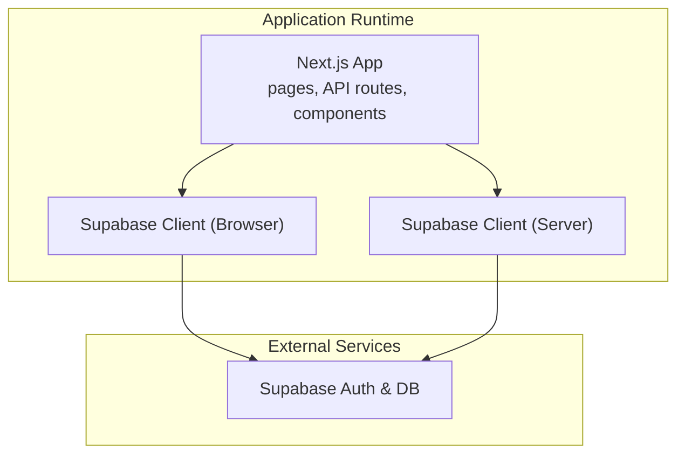
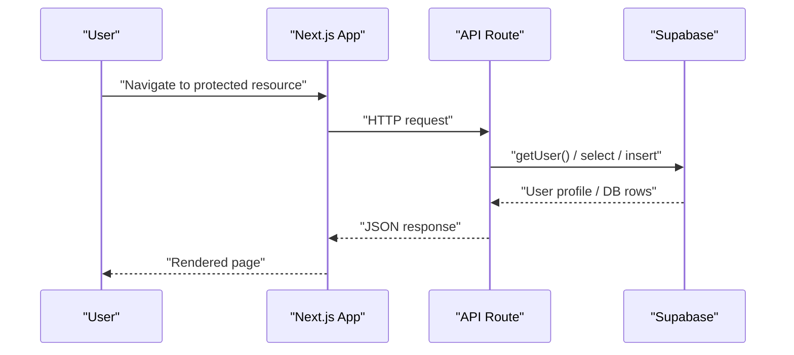
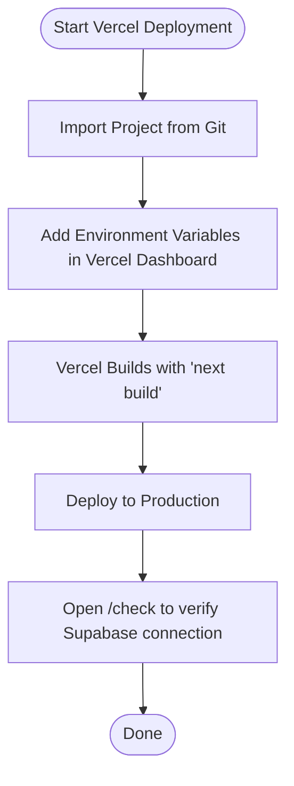
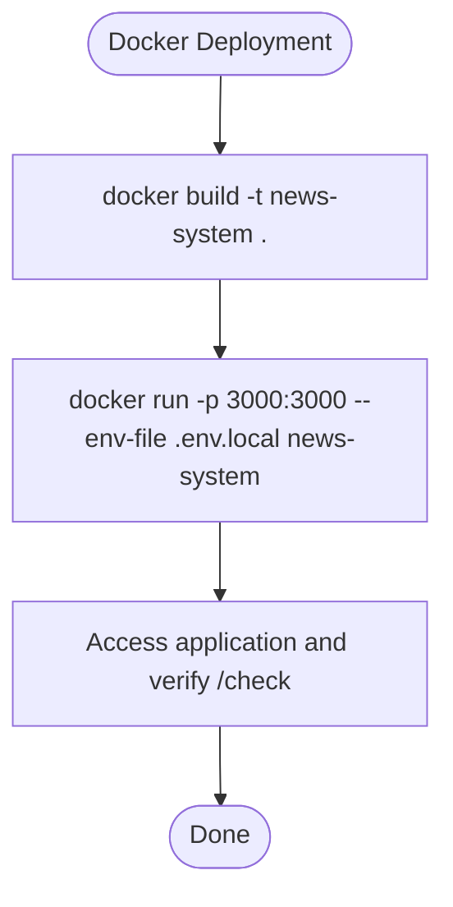
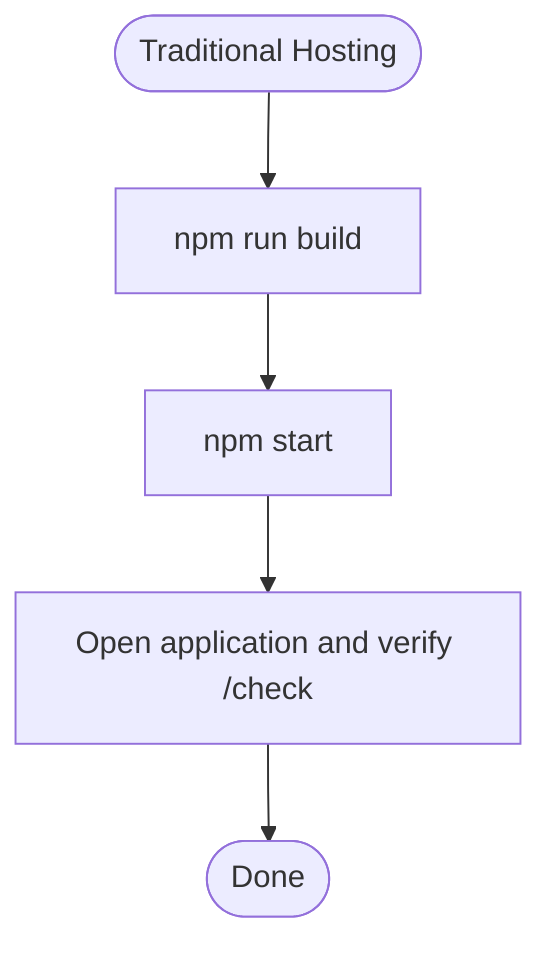
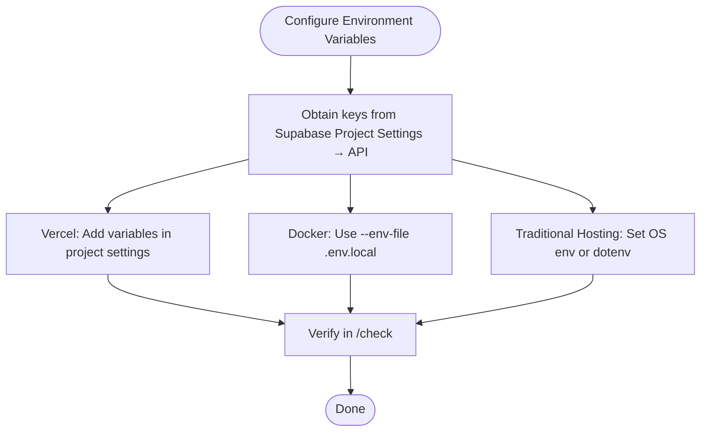
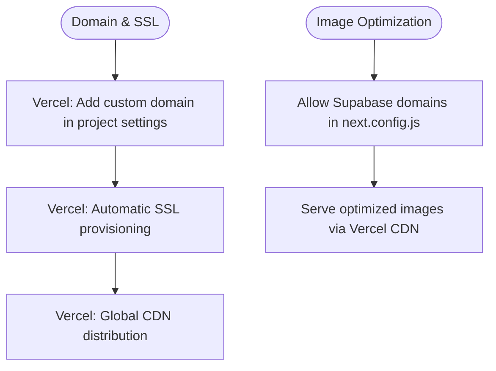
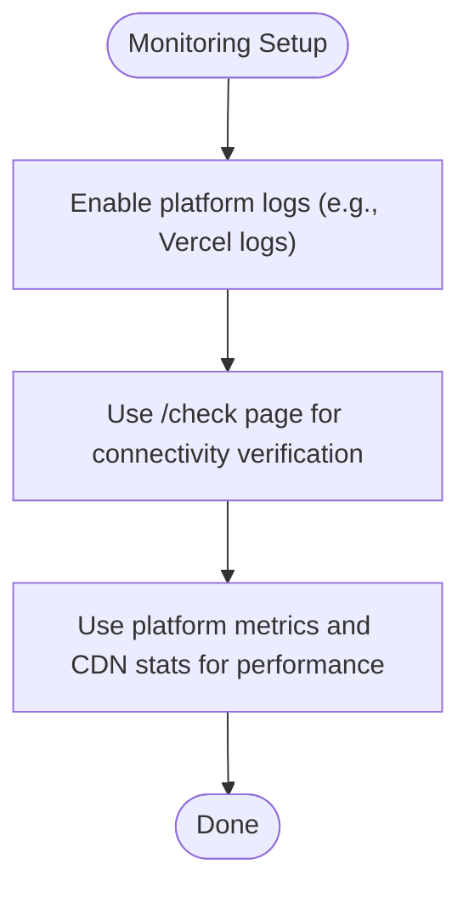
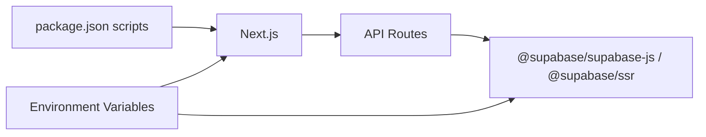

# Deployment Guide

<cite>
**Referenced Files in This Document**
- [package.json](file://package.json)
- [next.config.js](file://next.config.js)
- [vercel-env.json](file://vercel-env.json)
- [add-env-vars.sh](file://add-env-vars.sh)
- [lib/supabase/client.ts](file://lib/supabase/client.ts)
- [lib/supabase/server.ts](file://lib/supabase/server.ts)
- [app/api/channels/route.ts](file://app/api/channels/route.ts)
- [app/api/news/route.ts](file://app/api/news/route.ts)
- [app/check/page.tsx](file://app/check/page.tsx)
- [README.md](file://README.md)
</cite>

## Table of Contents
1. [Introduction](#introduction)
2. [Project Structure](#project-structure)
3. [Core Components](#core-components)
4. [Architecture Overview](#architecture-overview)
5. [Detailed Component Analysis](#detailed-component-analysis)
6. [Dependency Analysis](#dependency-analysis)
7. [Performance Considerations](#performance-considerations)
8. [Troubleshooting Guide](#troubleshooting-guide)
9. [Conclusion](#conclusion)
10. [Appendices](#appendices)

## Introduction
This guide explains how to deploy the application to production using Vercel, Docker, and traditional hosting. It also documents environment variable configuration for Supabase, application URLs, and security settings; domain and SSL configuration; CDN optimization; performance tuning; monitoring and logging; troubleshooting; and security best practices.

## Project Structure
The application is a Next.js app configured for server-side rendering and API routes. Supabase is used for authentication, session management, and database access. Environment variables are consumed via Next.js runtime helpers and the Supabase SDK.

**Diagram sources**
- [lib/supabase/client.ts:1-9](file://lib/supabase/client.ts#L1-L9)
- [lib/supabase/server.ts:1-30](file://lib/supabase/server.ts#L1-L30)
- [app/api/channels/route.ts:1-71](file://app/api/channels/route.ts#L1-L71)
- [app/api/news/route.ts:1-58](file://app/api/news/route.ts#L1-L58)

**Section sources**
- [package.json:1-30](file://package.json#L1-L30)
- [next.config.js:1-14](file://next.config.js#L1-L14)

## Core Components
- Build and runtime scripts are defined for development, building, and starting the server.
- Next.js configuration enables image optimization from Supabase domains.
- Supabase clients are created using environment variables for browser and server contexts.
- API routes enforce authentication and authorization using Supabase Auth.
- A health-check page validates Supabase connectivity.

Key deployment-relevant files:
- Scripts and dependencies: [package.json:1-30](file://package.json#L1-L30)
- Image optimization and remote patterns: [next.config.js:1-14](file://next.config.js#L1-L14)
- Supabase browser client: [lib/supabase/client.ts:1-9](file://lib/supabase/client.ts#L1-L9)
- Supabase server client: [lib/supabase/server.ts:1-30](file://lib/supabase/server.ts#L1-L30)
- Channels API (authentication and authorization): [app/api/channels/route.ts:1-71](file://app/api/channels/route.ts#L1-L71)
- News API (authentication): [app/api/news/route.ts:1-58](file://app/api/news/route.ts#L1-L58)
- Health check page: [app/check/page.tsx:1-82](file://app/check/page.tsx#L1-L82)

**Section sources**
- [package.json:1-30](file://package.json#L1-L30)
- [next.config.js:1-14](file://next.config.js#L1-L14)
- [lib/supabase/client.ts:1-9](file://lib/supabase/client.ts#L1-L9)
- [lib/supabase/server.ts:1-30](file://lib/supabase/server.ts#L1-L30)
- [app/api/channels/route.ts:1-71](file://app/api/channels/route.ts#L1-L71)
- [app/api/news/route.ts:1-58](file://app/api/news/route.ts#L1-L58)
- [app/check/page.tsx:1-82](file://app/check/page.tsx#L1-L82)

## Architecture Overview
The production runtime relies on environment variables injected by the platform (Vercel, Docker, or traditional hosting). The app uses Supabase for authentication and database access. API routes validate requests and enforce role-based access control.

**Diagram sources**
- [app/api/channels/route.ts:1-71](file://app/api/channels/route.ts#L1-L71)
- [app/api/news/route.ts:1-58](file://app/api/news/route.ts#L1-L58)
- [lib/supabase/server.ts:1-30](file://lib/supabase/server.ts#L1-L30)

## Detailed Component Analysis

### Vercel Deployment Strategy
Recommended steps:
- Connect your repository to Vercel and import the project.
- Configure environment variables in the Vercel dashboard under environment variables.
- Trigger a production deployment.

Environment variables to configure:
- NEXT_PUBLIC_SUPABASE_URL
- NEXT_PUBLIC_SUPABASE_ANON_KEY
- SUPABASE_SERVICE_ROLE_KEY

Verification:
- After deployment, visit the health check endpoint to confirm Supabase connectivity.

**Diagram sources**
- [add-env-vars.sh:1-39](file://add-env-vars.sh#L1-L39)
- [vercel-env.json:1-6](file://vercel-env.json#L1-L6)
- [app/check/page.tsx:1-82](file://app/check/page.tsx#L1-L82)

**Section sources**
- [README.md:375-383](file://README.md#L375-L383)
- [add-env-vars.sh:1-39](file://add-env-vars.sh#L1-L39)
- [vercel-env.json:1-6](file://vercel-env.json#L1-L6)
- [app/check/page.tsx:1-82](file://app/check/page.tsx#L1-L82)

### Docker Deployment Options
Build and run commands:
- Build the container image.
- Run the container with environment variables loaded from a file.

Environment variable management:
- Supply .env.local values via an env file during container startup.

**Diagram sources**
- [README.md:384-396](file://README.md#L384-L396)
- [package.json:5-10](file://package.json#L5-L10)

**Section sources**
- [README.md:384-396](file://README.md#L384-L396)
- [package.json:5-10](file://package.json#L5-L10)

### Traditional Hosting Deployment
Build and start:
- Build the application.
- Start the server in production mode.

**Diagram sources**
- [README.md:391-396](file://README.md#L391-L396)
- [package.json:5-10](file://package.json#L5-L10)

**Section sources**
- [README.md:391-396](file://README.md#L391-L396)
- [package.json:5-10](file://package.json#L5-L10)

### Environment Variable Configuration for Production
Required variables:
- NEXT_PUBLIC_SUPABASE_URL
- NEXT_PUBLIC_SUPABASE_ANON_KEY
- SUPABASE_SERVICE_ROLE_KEY

Where to find keys:
- Project URL and public/anon keys in Supabase Project Settings → API.
- Service role key in Supabase Project Settings → API.

Platform-specific notes:
- Vercel: Add variables in the project’s environment variables settings.
- Docker: Pass via --env-file or equivalent.
- Traditional hosting: Set OS-level environment variables or use a dotenv loader.

**Diagram sources**
- [README.md:71-92](file://README.md#L71-L92)
- [vercel-env.json:1-6](file://vercel-env.json#L1-L6)
- [add-env-vars.sh:5-32](file://add-env-vars.sh#L5-L32)
- [app/check/page.tsx:1-82](file://app/check/page.tsx#L1-L82)

**Section sources**
- [README.md:71-92](file://README.md#L71-L92)
- [vercel-env.json:1-6](file://vercel-env.json#L1-L6)
- [add-env-vars.sh:5-32](file://add-env-vars.sh#L5-L32)
- [lib/supabase/client.ts:1-9](file://lib/supabase/client.ts#L1-L9)
- [lib/supabase/server.ts:1-30](file://lib/supabase/server.ts#L1-L30)

### Domain Configuration, SSL, and CDN Optimization
Domain and SSL:
- Configure custom domains in Vercel’s project settings.
- Vercel automatically provisions and renews SSL certificates for custom domains.

CDN and image optimization:
- Next.js image optimization is enabled for Supabase-hosted images via remotePatterns.
- Ensure image URLs originate from allowed Supabase hosts.

**Diagram sources**
- [next.config.js:1-14](file://next.config.js#L1-L14)

**Section sources**
- [next.config.js:1-14](file://next.config.js#L1-L14)

### Monitoring, Logging, and Performance Monitoring
- Console logging: API routes log errors to the server logs.
- Health verification: Use the /check page to validate Supabase connectivity after deployment.
- For production observability, integrate platform-native logging and metrics (e.g., Vercel logs and analytics).

**Diagram sources**
- [app/check/page.tsx:1-82](file://app/check/page.tsx#L1-L82)
- [app/api/channels/route.ts:17-23](file://app/api/channels/route.ts#L17-L23)
- [app/api/news/route.ts:50-56](file://app/api/news/route.ts#L50-L56)

**Section sources**
- [app/check/page.tsx:1-82](file://app/check/page.tsx#L1-L82)
- [app/api/channels/route.ts:17-23](file://app/api/channels/route.ts#L17-L23)
- [app/api/news/route.ts:50-56](file://app/api/news/route.ts#L50-L56)

## Dependency Analysis
The application depends on Next.js and Supabase. API routes depend on Supabase for authentication and data access. Environment variables are consumed by Supabase clients.

**Diagram sources**
- [package.json:1-30](file://package.json#L1-L30)
- [lib/supabase/client.ts:1-9](file://lib/supabase/client.ts#L1-L9)
- [lib/supabase/server.ts:1-30](file://lib/supabase/server.ts#L1-L30)
- [app/api/channels/route.ts:1-71](file://app/api/channels/route.ts#L1-L71)
- [app/api/news/route.ts:1-58](file://app/api/news/route.ts#L1-L58)

**Section sources**
- [package.json:1-30](file://package.json#L1-L30)
- [lib/supabase/client.ts:1-9](file://lib/supabase/client.ts#L1-L9)
- [lib/supabase/server.ts:1-30](file://lib/supabase/server.ts#L1-L30)
- [app/api/channels/route.ts:1-71](file://app/api/channels/route.ts#L1-L71)
- [app/api/news/route.ts:1-58](file://app/api/news/route.ts#L1-L58)

## Performance Considerations
- Image optimization: Enabled for Supabase-hosted images; ensure image URLs match configured remotePatterns.
- Static generation: Use Next.js static generation where appropriate; leverage ISR for dynamic content refresh.
- Caching: Utilize Vercel’s global CDN for assets and API responses; minimize repeated Supabase queries with efficient filters and indexes.
- Database optimization: Ensure indexes exist for filtered columns used in API routes.

[No sources needed since this section provides general guidance]

## Troubleshooting Guide
Common issues and resolutions:
- Supabase connection failures:
  - Verify environment variables are present and correct in the platform settings.
  - Confirm the Supabase project is reachable and not rate-limited.
  - Use the /check page to diagnose connectivity.
- Authentication errors:
  - Ensure Supabase Auth is enabled and configured.
  - Verify user sessions and tokens are present in requests.
- Authorization failures:
  - Confirm user roles and permissions in Supabase tables.
  - Review API route checks for unauthorized or forbidden responses.
- Environment configuration problems:
  - Re-check variable names and scopes (public vs. server).
  - Validate platform-specific environment variable settings.
- Production performance optimization:
  - Monitor CDN hit rates and cache effectiveness.
  - Optimize database queries and indexes.
  - Reduce payload sizes and enable compression.

**Section sources**
- [app/check/page.tsx:1-82](file://app/check/page.tsx#L1-L82)
- [app/api/channels/route.ts:30-44](file://app/api/channels/route.ts#L30-L44)
- [app/api/news/route.ts:8-12](file://app/api/news/route.ts#L8-L12)
- [README.md](file://README.md)

## Conclusion
Deploy the application using Vercel for seamless CI/CD and global CDN distribution, or Docker/traditional hosting for self-managed deployments. Configure Supabase environment variables per platform, validate connectivity with the /check page, and optimize performance with CDN, image optimization, and efficient database queries. Integrate platform-native logging and metrics for monitoring and apply security best practices for production.

[No sources needed since this section summarizes without analyzing specific files]

## Appendices

### Environment Variables Reference
- NEXT_PUBLIC_SUPABASE_URL: Supabase project URL.
- NEXT_PUBLIC_SUPABASE_ANON_KEY: Public anonymous key for client access.
- SUPABASE_SERVICE_ROLE_KEY: Service role key for server-side operations.

**Section sources**
- [README.md:71-92](file://README.md#L71-L92)
- [vercel-env.json:1-6](file://vercel-env.json#L1-L6)
- [add-env-vars.sh:5-32](file://add-env-vars.sh#L5-L32)