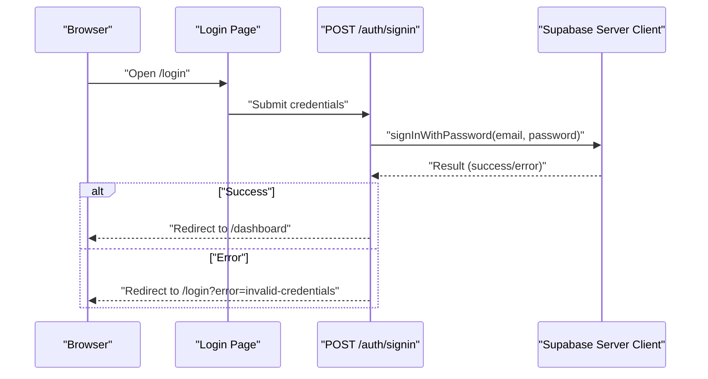

# Getting Started

<cite>
**Referenced Files in This Document**
- [README.md](file://README.md)
- [QUICKSTART.md](file://QUICKSTART.md)
- [package.json](file://package.json)
- [next.config.js](file://next.config.js)
- [supabase-schema.sql](file://supabase-schema.sql)
- [lib/supabase/client.ts](file://lib/supabase/client.ts)
- [lib/supabase/server.ts](file://lib/supabase/server.ts)
- [app/(auth)/login/page.tsx](file://app/(auth)/login/page.tsx)
- [app/auth/signin/route.ts](file://app/auth/signin/route.ts)
- [app/(dashboard)/dashboard/layout.tsx](file://app/(dashboard)/dashboard/layout.tsx)
- [add-env-vars.sh](file://add-env-vars.sh)
</cite>

## Table of Contents
1. [Introduction](#introduction)
2. [Prerequisites](#prerequisites)
3. [Installation](#installation)
4. [Supabase Project Setup](#supabase-project-setup)
5. [Environment Variables](#environment-variables)
6. [Local Development](#local-development)
7. [Initial Verification](#initial-verification)
8. [Troubleshooting](#troubleshooting)
9. [Next Steps](#next-steps)

## Introduction
This guide helps you quickly set up and configure the blog management system locally. It covers prerequisites, installation, Supabase setup, environment configuration, and initial verification steps. By the end, you will have a working development environment and be ready to manage news across multiple channels.

## Prerequisites
Before installing, ensure your environment meets the following requirements:
- Node.js 18 or higher
- A Supabase account
- A package manager (npm or yarn)

These requirements are documented in the project’s README and Quickstart documents.

**Section sources**
- [README.md:16-21](file://README.md#L16-L21)
- [QUICKSTART.md:1-10](file://QUICKSTART.md#L1-L10)

## Installation
Follow these steps to install the project locally:

1. Clone the repository and navigate into the project directory.
2. Install dependencies using your preferred package manager.

These steps are documented in both the README and Quickstart guides.

**Section sources**
- [README.md:24-36](file://README.md#L24-L36)
- [QUICKSTART.md:27-33](file://QUICKSTART.md#L27-L33)

## Supabase Project Setup
Complete the following Supabase setup tasks:

1. Create a new Supabase project.
2. Execute the database schema using the provided SQL script.
3. Configure the authentication provider.
4. Create the first super_admin user.

### Execute the Database Schema
- Open the Supabase SQL Editor and run the commands from the schema file. This creates tables, indexes, triggers, and Row Level Security (RLS) policies.

Key schema elements include:
- Tables: channels, user_profiles, channel_editors, news, news_channels
- Triggers for automatic updated_at updates
- RLS policies for secure access control

For step-by-step instructions, refer to the Quickstart guide.

**Section sources**
- [QUICKSTART.md:10-14](file://QUICKSTART.md#L10-L14)
- [supabase-schema.sql:1-247](file://supabase-schema.sql#L1-L247)

### Configure Authentication Provider
- In the Supabase Authentication section, enable the Email/Password provider. Optionally configure SMTP for email confirmations.

**Section sources**
- [QUICKSTART.md:15-19](file://QUICKSTART.md#L15-L19)
- [README.md:52-55](file://README.md#L52-L55)

### Create the First Super Admin
- Register a user via the login form.
- In the Supabase Authentication section, copy your user ID.
- In the Supabase Table Editor, locate the user_profiles table and set the role to super_admin for your user.

**Section sources**
- [README.md:56-70](file://README.md#L56-L70)
- [QUICKSTART.md:62-76](file://QUICKSTART.md#L62-L76)

## Environment Variables
Configure your environment variables by copying the example file and filling in your Supabase project values.

- Copy the example environment file to create .env.local.
- Fill in the following keys:
  - NEXT_PUBLIC_SUPABASE_URL
  - NEXT_PUBLIC_SUPABASE_ANON_KEY
  - SUPABASE_SERVICE_ROLE_KEY
  - NEXT_PUBLIC_APP_URL

Where to find the keys:
- NEXT_PUBLIC_SUPABASE_URL: Project Settings → API → Project URL
- NEXT_PUBLIC_SUPABASE_ANON_KEY: Project Settings → API → anon public
- SUPABASE_SERVICE_ROLE_KEY: Project Settings → API → service_role

You can also review the shell script that lists the variables for Vercel deployment.

**Section sources**
- [README.md:71-92](file://README.md#L71-L92)
- [QUICKSTART.md:34-46](file://QUICKSTART.md#L34-L46)
- [add-env-vars.sh:1-39](file://add-env-vars.sh#L1-L39)

## Local Development
Start the development server and verify the setup:

1. Run the development server using your package manager.
2. Open the application in your browser at the configured port.
3. Log in using the credentials you created during authentication setup.

The development script and port are documented in the project’s scripts and Quickstart guide.

**Section sources**
- [package.json:5-10](file://package.json#L5-L10)
- [QUICKSTART.md:47-55](file://QUICKSTART.md#L47-L55)
- [README.md:93-99](file://README.md#L93-L99)

## Initial Verification
Perform these checks to ensure everything is working:

- Confirm the Supabase client is initialized with the correct environment variables in both browser and server contexts.
- Verify the login page redirects appropriately after successful authentication.
- Ensure the dashboard enforces authentication and displays the user’s role.

The Supabase client initialization and authentication flow are implemented in the following files.

**Diagram sources**
- [app/(auth)/login/page.tsx:1-80](file://app/(auth)/login/page.tsx#L1-L80)
- [app/auth/signin/route.ts:1-31](file://app/auth/signin/route.ts#L1-L31)
- [lib/supabase/server.ts:1-30](file://lib/supabase/server.ts#L1-L30)

**Section sources**
- [lib/supabase/client.ts:1-9](file://lib/supabase/client.ts#L1-L9)
- [lib/supabase/server.ts:1-30](file://lib/supabase/server.ts#L1-L30)
- [app/(auth)/login/page.tsx:1-80](file://app/(auth)/login/page.tsx#L1-L80)
- [app/auth/signin/route.ts:1-31](file://app/auth/signin/route.ts#L1-L31)
- [app/(dashboard)/dashboard/layout.tsx:1-91](file://app/(dashboard)/dashboard/layout.tsx#L1-L91)

## Troubleshooting
Common setup issues and resolutions:

- Missing environment variables
  - Symptom: Application fails to connect to Supabase or authentication errors occur.
  - Resolution: Ensure .env.local exists and contains NEXT_PUBLIC_SUPABASE_URL, NEXT_PUBLIC_SUPABASE_ANON_KEY, SUPABASE_SERVICE_ROLE_KEY, and NEXT_PUBLIC_APP_URL. Re-run the development server after updating.

- Supabase client initialization errors
  - Symptom: Errors indicating missing environment variables in the browser or server client.
  - Resolution: Confirm the environment variables are present in both client.ts and server.ts. The client initialization relies on these variables.

- Authentication failures
  - Symptom: Redirects to an error page after login attempts.
  - Resolution: Verify the Email/Password provider is enabled in Supabase and that credentials match a registered user.

- Image loading restrictions
  - Symptom: Images from Supabase storage fail to load.
  - Resolution: The Next.js configuration allows remote images from Supabase domains. Ensure image URLs use HTTPS and the domain pattern matches the configured remote pattern.

- Role not taking effect
  - Symptom: Newly created users cannot access administrative features.
  - Resolution: After executing the schema, set the user’s role to super_admin in the user_profiles table in the Supabase Table Editor.

**Section sources**
- [lib/supabase/client.ts:1-9](file://lib/supabase/client.ts#L1-L9)
- [lib/supabase/server.ts:1-30](file://lib/supabase/server.ts#L1-L30)
- [next.config.js:1-14](file://next.config.js#L1-L14)
- [README.md:52-70](file://README.md#L52-L70)

## Next Steps
Once your environment is verified:
- Add additional editors via SQL inserts into the channel_editors table.
- Configure channel permissions and publish your first news items.
- Integrate the system into existing websites using the provided React components or the public API.

For detailed usage and integration examples, refer to the project’s README.

**Section sources**
- [README.md:101-303](file://README.md#L101-L303)