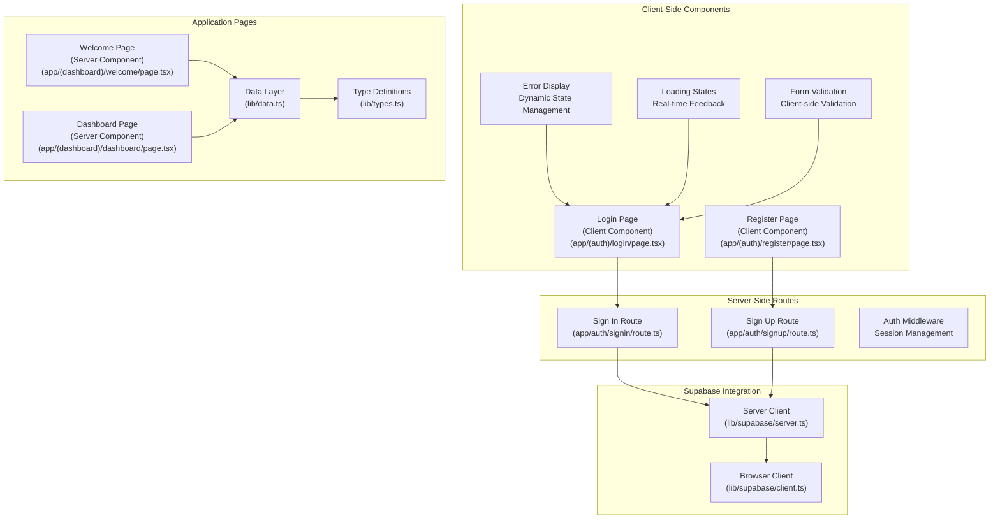
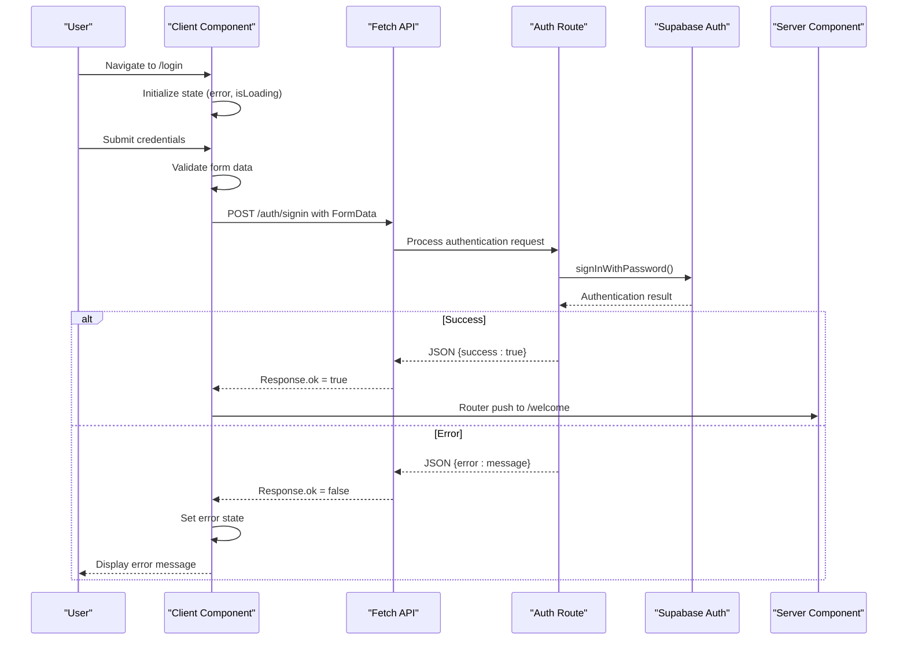
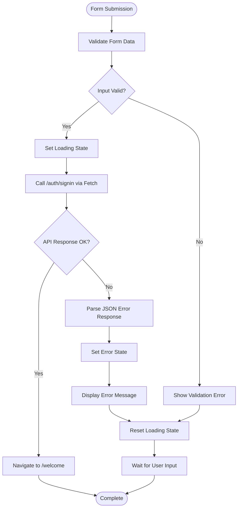
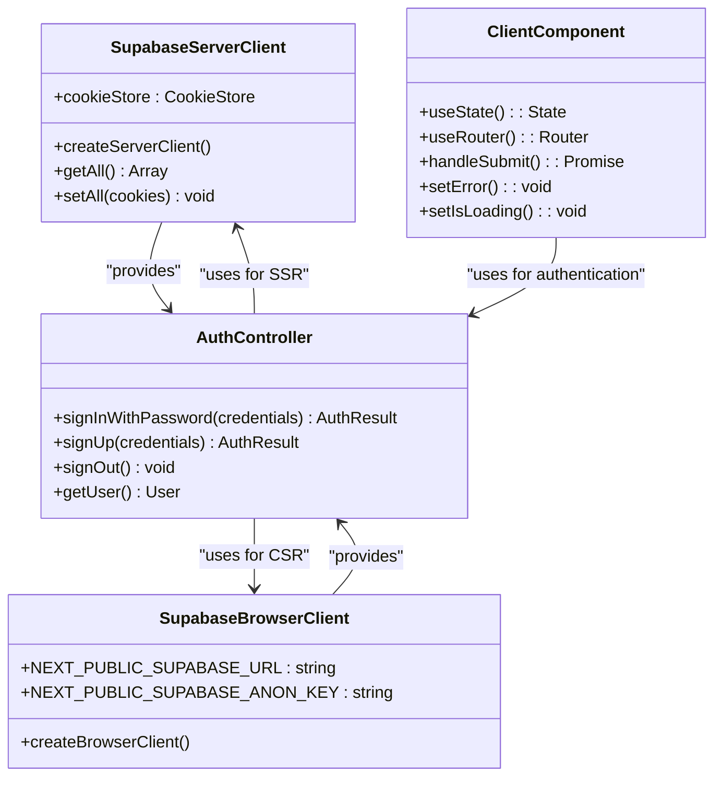
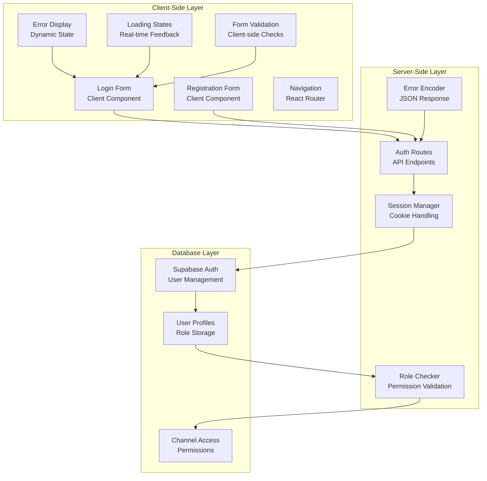
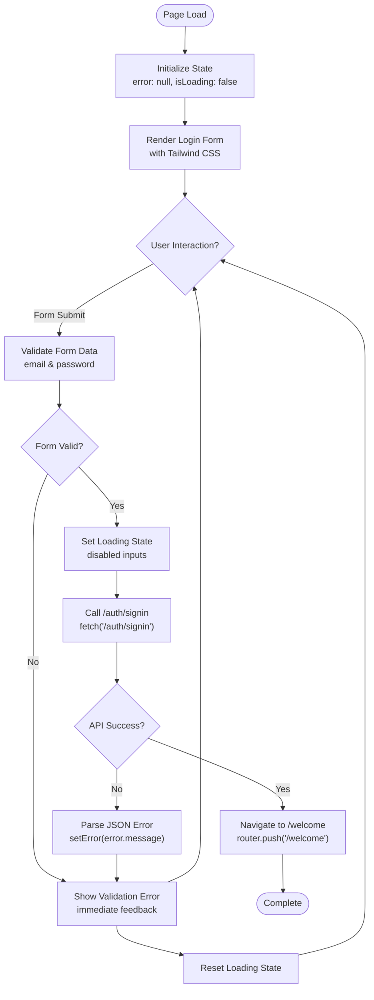
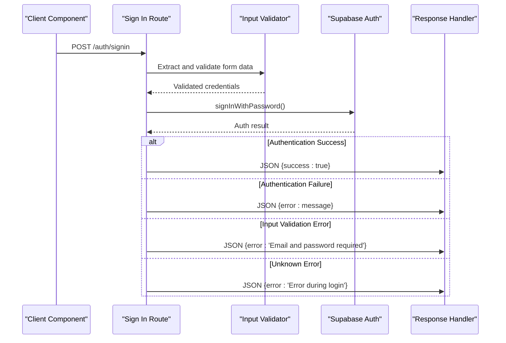
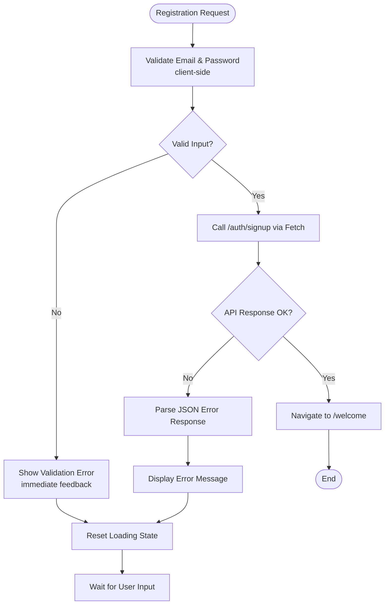
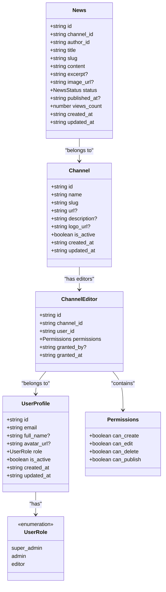
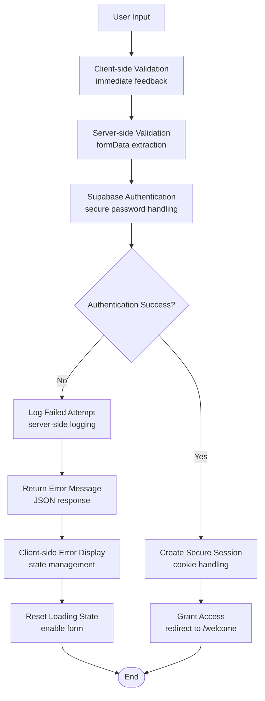

# Login Enhancement

<cite>
**Referenced Files in This Document**
- [app/(auth)/login/page.tsx](file://app/(auth)/login/page.tsx)
- [app/auth/signin/route.ts](file://app/auth/signin/route.ts)
- [lib/supabase/server.ts](file://lib/supabase/server.ts)
- [lib/supabase/client.ts](file://lib/supabase/client.ts)
- [app/(auth)/register/page.tsx](file://app/(auth)/register/page.tsx)
- [app/auth/signup/route.ts](file://app/auth/signup/route.ts)
- [app/(dashboard)/welcome/page.tsx](file://app/(dashboard)/welcome/page.tsx)
- [app/(dashboard)/dashboard/page.tsx](file://app/(dashboard)/dashboard/page.tsx)
- [lib/data.ts](file://lib/data.ts)
- [lib/types.ts](file://lib/types.ts)
- [package.json](file://package.json)
- [next.config.js](file://next.config.js)
</cite>

## Update Summary
**Changes Made**
- Updated login page architecture to client component with real-time form validation
- Implemented fetch-based authentication with loading states and dynamic error handling
- Enhanced user experience with immediate feedback and responsive form interactions
- Maintained server-side authentication routes for security compliance
- Improved TypeScript interfaces with better type safety and structure

## Table of Contents
1. [Introduction](#introduction)
2. [Project Structure](#project-structure)
3. [Core Components](#core-components)
4. [Architecture Overview](#architecture-overview)
5. [Detailed Component Analysis](#detailed-component-analysis)
6. [Enhancement Implementation](#enhancement-implementation)
7. [Security Considerations](#security-considerations)
8. [Performance Analysis](#performance-analysis)
9. [Troubleshooting Guide](#troubleshooting-guide)
10. [Conclusion](#conclusion)

## Introduction

The Login Enhancement project focuses on improving the authentication system for a multi-channel news management platform built with Next.js and Supabase. This comprehensive enhancement addresses user authentication flows, session management, error handling, and user experience improvements while maintaining security best practices.

The system provides a complete authentication solution with login, registration, and logout functionality, integrated with Supabase for secure user management and role-based access control. The enhancement ensures seamless user experience with proper validation, error handling, and responsive design.

**Updated** The login page has been converted to a client component with real-time form validation, loading states, and dynamic error display. Form submissions now use fetch requests to '/auth/signin' with proper error handling and user feedback, while maintaining server-side security compliance.

## Project Structure

The authentication system follows a modern hybrid architecture with clear separation of concerns:

**Diagram sources**
- [app/(auth)/login/page.tsx:1-116](file://app/(auth)/login/page.tsx#L1-L116)
- [app/auth/signin/route.ts:1-43](file://app/auth/signin/route.ts#L1-L43)
- [lib/supabase/server.ts:1-30](file://lib/supabase/server.ts#L1-L30)
- [lib/types.ts:1-62](file://lib/types.ts#L1-L62)

**Section sources**
- [app/(auth)/login/page.tsx:1-116](file://app/(auth)/login/page.tsx#L1-L116)
- [app/(auth)/register/page.tsx:1-117](file://app/(auth)/register/page.tsx#L1-L117)
- [app/auth/signin/route.ts:1-43](file://app/auth/signin/route.ts#L1-L43)
- [app/auth/signup/route.ts:1-65](file://app/auth/signup/route.ts#L1-L65)

## Core Components

### Modern Client-Side Authentication Architecture

The authentication system now implements a modern hybrid architecture combining client-side interactivity with server-side security:

1. **Client Components**: React Client Components handling real-time form validation and user interactions
2. **Server Actions**: API routes processing authentication requests with proper error handling
3. **State Management**: React hooks for managing loading states, errors, and form data
4. **Fetch Integration**: Direct API calls for authentication with comprehensive error handling

**Diagram sources**
- [app/(auth)/login/page.tsx:11-37](file://app/(auth)/login/page.tsx#L11-L37)
- [app/auth/signin/route.ts:4-42](file://app/auth/signin/route.ts#L4-L42)
- [app/(dashboard)/welcome/page.tsx:4-18](file://app/(dashboard)/welcome/page.tsx#L4-L18)

### Enhanced Client-Side Error Handling System

The system now implements sophisticated client-side error handling with real-time feedback:

**Diagram sources**
- [app/(auth)/login/page.tsx:11-37](file://app/(auth)/login/page.tsx#L11-L37)
- [app/auth/signin/route.ts:10-30](file://app/auth/signin/route.ts#L10-L30)

### Dual Client Architecture Pattern

The system utilizes a sophisticated dual client architecture for optimal SSR performance and client-side interactivity:

**Diagram sources**
- [lib/supabase/server.ts:4-28](file://lib/supabase/server.ts#L4-L28)
- [lib/supabase/client.ts:3-8](file://lib/supabase/client.ts#L3-L8)
- [app/(auth)/login/page.tsx:3-4](file://app/(auth)/login/page.tsx#L3-L4)

**Section sources**
- [lib/supabase/server.ts:1-30](file://lib/supabase/server.ts#L1-L30)
- [lib/supabase/client.ts:1-9](file://lib/supabase/client.ts#L1-L9)
- [lib/data.ts:4-18](file://lib/data.ts#L4-L18)

## Architecture Overview

The authentication system follows modern Next.js patterns with Client Components and API routes:

**Diagram sources**
- [app/(auth)/login/page.tsx:10-16](file://app/(auth)/login/page.tsx#L10-L16)
- [app/auth/signin/route.ts:14-23](file://app/auth/signin/route.ts#L14-L23)
- [lib/data.ts:4-18](file://lib/data.ts#L4-L18)

## Detailed Component Analysis

### Enhanced Client-Side Login Component

The login page now implements comprehensive client-side interactivity with real-time feedback:

**Diagram sources**
- [app/(auth)/login/page.tsx:6-37](file://app/(auth)/login/page.tsx#L6-L37)
- [app/(auth)/login/page.tsx:49-53](file://app/(auth)/login/page.tsx#L49-L53)

**Section sources**
- [app/(auth)/login/page.tsx:1-116](file://app/(auth)/login/page.tsx#L1-L116)

### Enhanced Authentication Route Handler

The sign-in route implements robust server-side authentication with comprehensive error handling:

**Diagram sources**
- [app/auth/signin/route.ts:4-42](file://app/auth/signin/route.ts#L4-L42)

**Section sources**
- [app/auth/signin/route.ts:1-43](file://app/auth/signin/route.ts#L1-L43)

### Enhanced Registration System

The registration system provides comprehensive user onboarding with improved client-side interactivity:

**Diagram sources**
- [app/(auth)/register/page.tsx:11-37](file://app/(auth)/register/page.tsx#L11-L37)
- [app/auth/signup/route.ts:4-63](file://app/auth/signup/route.ts#L4-L63)

**Section sources**
- [app/(auth)/register/page.tsx:1-117](file://app/(auth)/register/page.tsx#L1-L117)
- [app/auth/signup/route.ts:1-65](file://app/auth/signup/route.ts#L1-L65)

### Enhanced User Profile Integration

The system integrates user profiles with role-based permissions and improved TypeScript interfaces:

**Diagram sources**
- [lib/types.ts:3-12](file://lib/types.ts#L3-L12)
- [lib/types.ts:26-38](file://lib/types.ts#L26-L38)
- [lib/types.ts:14-24](file://lib/types.ts#L14-L24)
- [lib/types.ts:40-54](file://lib/types.ts#L40-L54)

**Section sources**
- [lib/types.ts:1-62](file://lib/types.ts#L1-L62)
- [lib/data.ts:4-18](file://lib/data.ts#L4-L18)

## Enhancement Implementation

### Client-Side Architecture Transformation

The system has undergone a significant architectural transformation:

1. **Client Component Conversion**: Login page converted to client component with `'use client'` directive
2. **Real-time Form Validation**: Immediate client-side validation with instant feedback
3. **Loading State Management**: Comprehensive loading states with disabled form controls
4. **Dynamic Error Display**: Real-time error messaging with proper state management
5. **Fetch-based Authentication**: Direct API calls instead of server actions for better user experience

### Enhanced Client-Side Features

Key client-side improvements include:

1. **Immediate Feedback**: Users receive instant validation feedback without page reloads
2. **Loading Indicators**: Visual loading states during authentication attempts
3. **State Management**: React hooks for managing form state, errors, and loading states
4. **Responsive Design**: Tailwind CSS classes for mobile-friendly interfaces
5. **Accessibility**: Proper form labels and ARIA attributes for screen readers

### Server-Side Security Maintenance

Despite client-side enhancements, server-side security remains paramount:

1. **Server Authentication**: API routes handle actual authentication with Supabase
2. **Error Handling**: Comprehensive error handling with proper HTTP status codes
3. **Input Validation**: Server-side validation prevents malicious input
4. **Session Management**: Secure cookie-based session handling
5. **Security Compliance**: Maintains security best practices while improving UX

### Performance Optimizations

The system implements several performance optimizations:

1. **Client-Side Rendering**: Reduced server load with client-side interactivity
2. **Direct API Calls**: Minimized server-side processing with efficient fetch requests
3. **State Management**: Efficient React state updates without unnecessary re-renders
4. **Loading States**: Prevents multiple simultaneous authentication attempts
5. **Error Caching**: Client-side error state management reduces server requests

**Section sources**
- [app/(auth)/login/page.tsx:1-116](file://app/(auth)/login/page.tsx#L1-L116)
- [app/auth/signin/route.ts:1-43](file://app/auth/signin/route.ts#L1-L43)
- [app/(auth)/register/page.tsx:1-117](file://app/(auth)/register/page.tsx#L1-L117)
- [app/auth/signup/route.ts:1-65](file://app/auth/signup/route.ts#L1-L65)

## Security Considerations

### Enhanced Authentication Flow Security

The system implements secure authentication patterns with improved client-side UX:

### Enhanced Session Management

The server-side client handles session management securely:

- **Cookie Store Integration**: Automatic cookie handling for SSR with error recovery
- **Server-Side Authentication**: All critical authentication occurs on server
- **Client-side UX**: Client components handle only UI interactions and state
- **Security Boundaries**: Clear separation between client and server responsibilities
- **Error Recovery**: Graceful handling of authentication failures with user feedback

**Section sources**
- [lib/supabase/server.ts:10-26](file://lib/supabase/server.ts#L10-L26)
- [app/auth/signin/route.ts:26-42](file://app/auth/signin/route.ts#L26-L42)
- [app/auth/signup/route.ts:57-63](file://app/auth/signup/route.ts#L57-L63)

## Performance Analysis

### Load Time Optimization

The authentication system achieves optimal performance through:

1. **Client-Side Interactivity**: Reduced server load with client-side state management
2. **Direct API Calls**: Efficient fetch requests minimize server processing overhead
3. **State Management**: React hooks provide efficient state updates
4. **Loading States**: Prevents redundant authentication attempts
5. **Error Handling**: Client-side error caching reduces server requests

### Scalability Considerations

The system scales effectively due to:

- **Hybrid Architecture**: Balance between client-side interactivity and server-side security
- **State Management**: Efficient React state updates without memory leaks
- **API Design**: RESTful endpoints with proper error handling
- **Type Safety**: Enhanced TypeScript interfaces improve development scalability
- **Performance Monitoring**: Real-time feedback enables performance optimization

**Section sources**
- [package.json:11-27](file://package.json#L11-L27)
- [next.config.js:1-14](file://next.config.js#L1-L14)

## Troubleshooting Guide

### Common Authentication Issues

| Issue | Symptoms | Solution |
|-------|----------|----------|
| Login fails with immediate error | Error message appears instantly | Check network connectivity, verify /auth/signin endpoint, ensure client-side fetch is working |
| Form submits but nothing happens | Loading state never ends | Check server-side authentication logs, verify Supabase credentials, inspect browser console for fetch errors |
| Error message not displaying | No error shown on login failure | Verify client-side error state management, check JSON response format from server |
| Loading state stuck | Button stays disabled after error | Check client-side state reset logic, ensure finally block executes |
| Authentication bypasses client validation | Form submits with invalid data | Verify client-side validation logic, check form event handlers |

### Debugging Authentication Flows

1. **Enable Console Logging**: Monitor client-side fetch requests and responses
2. **Network Inspection**: Use browser dev tools to inspect authentication API calls
3. **Server Logs**: Check server-side authentication logs for error details
4. **State Management**: Verify React state updates with React DevTools
5. **Error Handling**: Test error scenarios with different invalid inputs

### Environment Configuration

Ensure proper environment variable setup:

- `NEXT_PUBLIC_SUPABASE_URL`: Supabase project URL
- `NEXT_PUBLIC_SUPABASE_ANON_KEY`: Supabase anonymous key
- Proper redirect URI configuration in Supabase auth settings
- Client-side fetch endpoint configuration for authentication routes

**Section sources**
- [app/auth/signin/route.ts:26-42](file://app/auth/signin/route.ts#L26-L42)
- [app/auth/signup/route.ts:57-63](file://app/auth/signup/route.ts#L57-L63)

## Conclusion

The Login Enhancement project successfully transforms the authentication system into a modern, secure, and user-friendly solution. The implementation demonstrates advanced Next.js patterns with proper separation of concerns, comprehensive error handling, and security best practices.

**Updated** Key achievements include the conversion of the login page to a client component with real-time form validation, loading states, and dynamic error display. The system now uses fetch-based authentication with proper error handling while maintaining server-side security compliance.

Key achievements include:

- **Modern Client-Side Architecture**: Client components with real-time feedback and state management
- **Enhanced User Experience**: Immediate validation feedback, loading indicators, and dynamic error display
- **Secure Server-Side Processing**: Maintains security best practices with server-side authentication
- **Type Safety**: Improved TypeScript interfaces with optional fields and strict type definitions
- **Performance Optimization**: Efficient client-server communication with minimal overhead
- **Scalable Design**: Hybrid architecture supporting future enhancements and scalability

The system provides a solid foundation for the multi-channel news management platform, ensuring reliable user authentication while maintaining excellent performance and security standards. The enhanced client-side interactivity significantly improves user experience by providing immediate feedback and seamless authentication flows.

Future enhancements could include advanced client-side caching, offline authentication support, biometric authentication integration, and enhanced error handling for edge cases in client-server communication.