# Key Features and Capabilities

<cite>
**Referenced Files in This Document**
- [README.md](file://README.md)
- [ARCHITECTURE.md](file://ARCHITECTURE.md)
- [supabase-schema.sql](file://supabase-schema.sql)
- [lib/types.ts](file://lib/types.ts)
- [lib/data.ts](file://lib/data.ts)
- [app/api/public/news/route.ts](file://app/api/public/news/route.ts)
- [app/api/public/news/[id]/route.ts](file://app/api/public/news/[id]/route.ts)
- [app/api/news/route.ts](file://app/api/news/route.ts)
- [app/api/channels/route.ts](file://app/api/channels/route.ts)
- [components/news-feed.tsx](file://components/news-feed.tsx)
- [components/news-widget.tsx](file://components/news-widget.tsx)
- [app/(dashboard)/dashboard/page.tsx](file://app/(dashboard)/dashboard/page.tsx)
- [app/(dashboard)/dashboard/news/new/page.tsx](file://app/(dashboard)/dashboard/news/new/page.tsx)
- [app/(dashboard)/dashboard/channels/page.tsx](file://app/(dashboard)/dashboard/channels/page.tsx)
</cite>

## Table of Contents
1. [Introduction](#introduction)
2. [Multi-Channel News Management](#multi-channel-news-management)
3. [Role-Based Access Control](#role-based-access-control)
4. [Real-Time Content Distribution](#real-time-content-distribution)
5. [Flexible Component Integration](#flexible-component-integration)
6. [Dual Integration Approach](#dual-integration-approach)
7. [Adaptive Design and Dark Theme](#adaptive-design-and-dark-theme)
8. [Collaborative Editing Workflow](#collaborative-editing-workflow)
9. [Public API Endpoints](#public-api-endpoints)
10. [Conclusion](#conclusion)

## Introduction

The Blog Management System is a comprehensive multi-channel news management platform built with Next.js and Supabase. It enables organizations to operate multiple independent websites with separate content management while providing robust role-based access control, real-time content distribution, and flexible integration options for seamless third-party website embedding.

## Multi-Channel News Management

The system supports multiple independent websites through a sophisticated channel-based architecture that allows organizations to manage separate content streams with distinct branding and audiences.

### Channel Architecture

The multi-channel system is built around several core database tables that establish relationships between organizations, channels, and content:

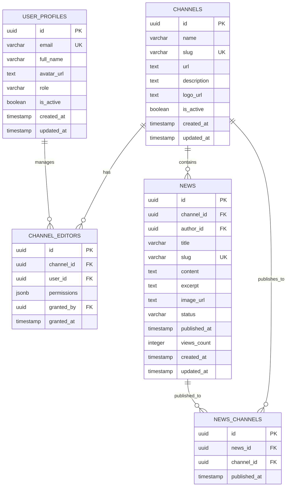

**Diagram sources**
- [supabase-schema.sql:4-112](file://supabase-schema.sql#L4-L112)

### Multi-Channel Publishing

The system enables simultaneous publication across multiple channels through the `news_channels` junction table, allowing a single news item to appear on all selected websites:

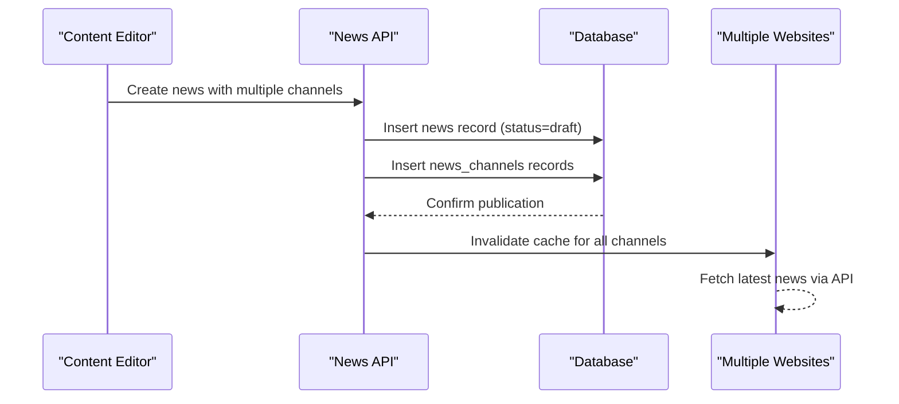

**Diagram sources**
- [lib/data.ts:182-212](file://lib/data.ts#L182-L212)
- [supabase-schema.sql:105-112](file://supabase-schema.sql#L105-L112)

**Section sources**
- [supabase-schema.sql:4-112](file://supabase-schema.sql#L4-L112)
- [lib/types.ts:14-61](file://lib/types.ts#L14-L61)

## Role-Based Access Control

The system implements a comprehensive RBAC model with three distinct user roles, each with specific permissions and capabilities for managing content across multiple channels.

### Role Definitions and Permissions

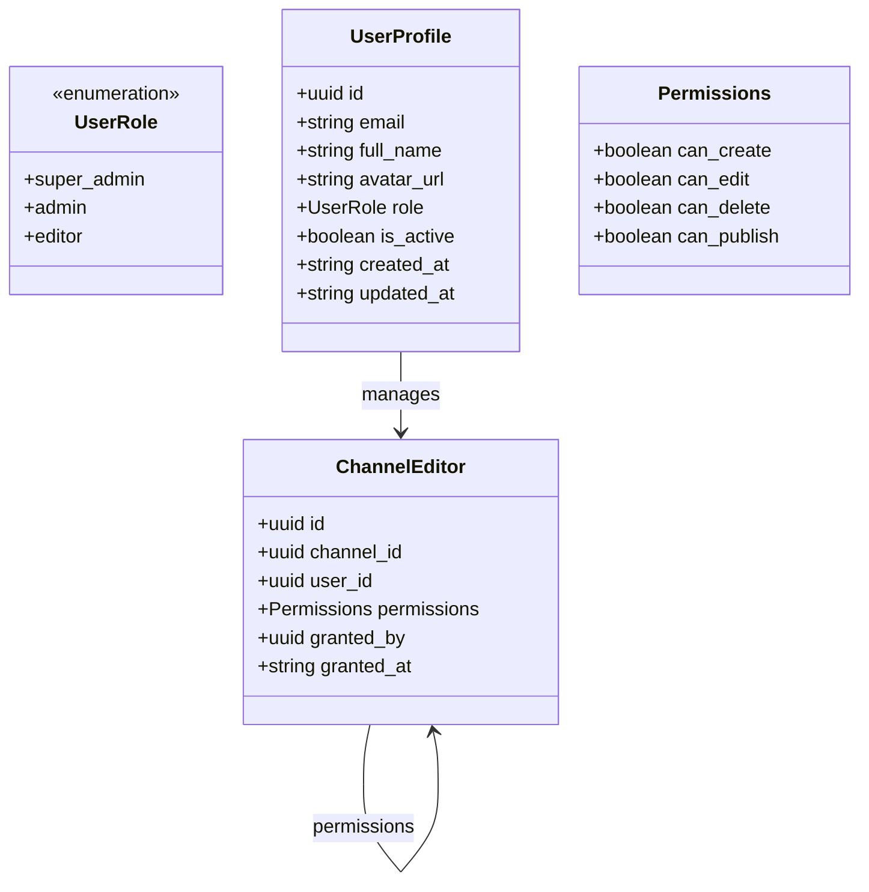

**Diagram sources**
- [lib/types.ts:1-12](file://lib/types.ts#L1-L12)
- [lib/types.ts:26-38](file://lib/types.ts#L26-L38)

### Permission Matrix

| Action | Super Admin | Admin | Editor |
|--------|-------------|-------|--------|
| Create News | ✅ Full Access | ✅ Assigned Channels | ✅ Own Drafts |
| Edit News | ✅ All News | ✅ Assigned Channels | ✅ Own News |
| Delete News | ✅ All News | ✅ Assigned Channels | ❌ No Delete |
| Publish News | ✅ All News | ✅ Assigned Channels | ❌ No Publish |
| Manage Channels | ✅ All Channels | ❌ No Access | ❌ No Access |
| Manage Editors | ✅ All Channels | ❌ No Access | ❌ No Access |

### Database-Level Security

The system enforces security through Row Level Security (RLS) policies that provide database-level protection:

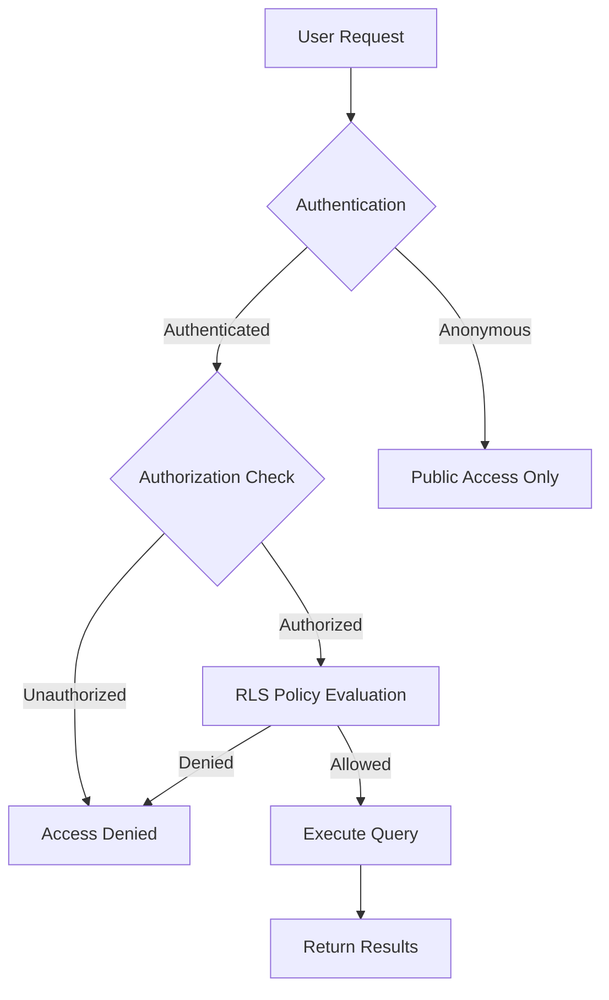

**Diagram sources**
- [supabase-schema.sql:147-257](file://supabase-schema.sql#L147-L257)

**Section sources**
- [lib/types.ts:1-12](file://lib/types.ts#L1-L12)
- [supabase-schema.sql:147-257](file://supabase-schema.sql#L147-L257)

## Real-Time Content Distribution

The system provides real-time content distribution through multiple channels, ensuring that published content appears consistently across all connected websites with minimal latency.

### Public API Architecture

The public API layer provides REST endpoints for external website integration:

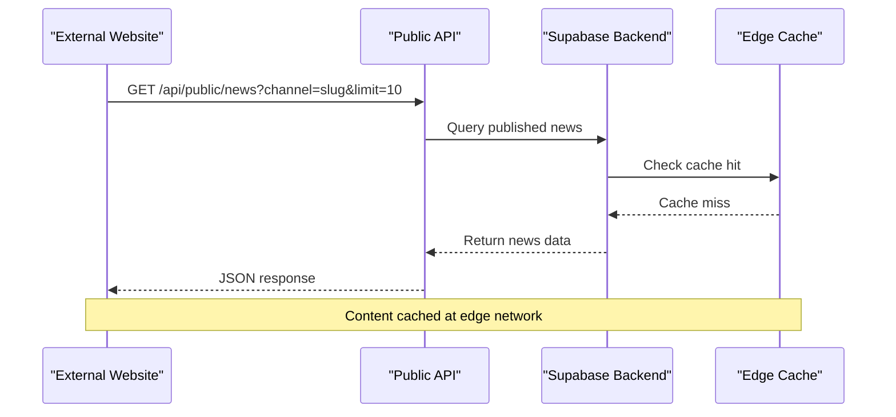

**Diagram sources**
- [app/api/public/news/route.ts:4-53](file://app/api/public/news/route.ts#L4-L53)

### Content Delivery Network

The system leverages Vercel's global CDN infrastructure for optimal content delivery:

- Edge network caching for reduced latency
- Automatic SSL certificate provisioning
- Global content distribution
- Automatic scaling based on demand

**Section sources**
- [app/api/public/news/route.ts:4-53](file://app/api/public/news/route.ts#L4-L53)
- [ARCHITECTURE.md:425-470](file://ARCHITECTURE.md#L425-L470)

## Flexible Component Integration

The system offers two primary integration approaches: React/Next.js components for modern web applications and direct API consumption for any technology stack.

### React Component Library

Two specialized components are provided for seamless integration:

#### NewsFeed Component

The NewsFeed component displays a comprehensive list of news articles with customizable display options:

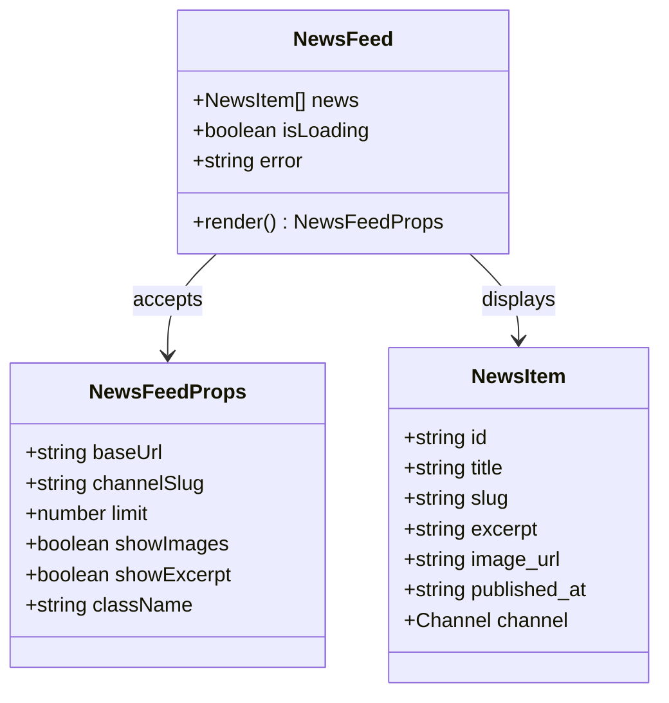

**Diagram sources**
- [components/news-feed.tsx:20-36](file://components/news-feed.tsx#L20-L36)

#### NewsWidget Component

The NewsWidget component provides a compact sidebar solution with multiple display variants:

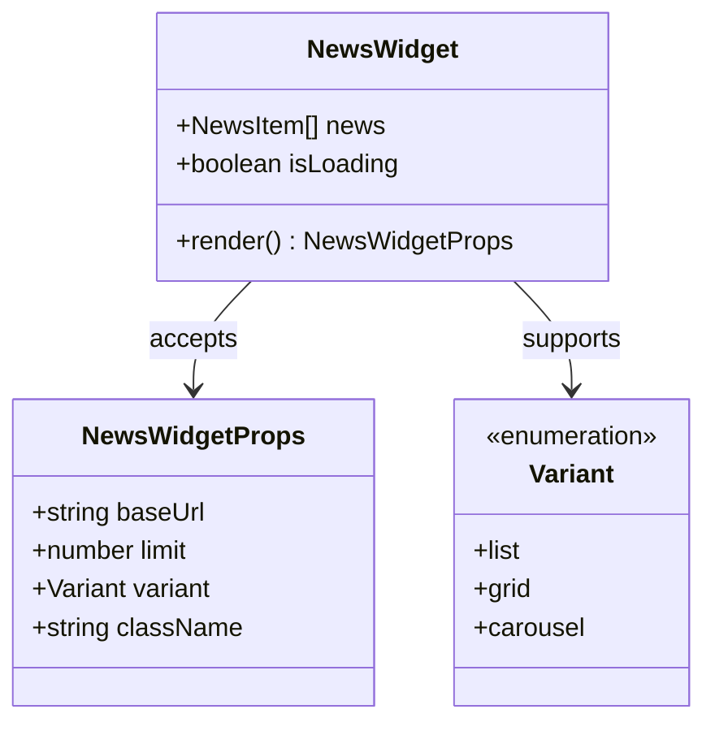

**Diagram sources**
- [components/news-widget.tsx:15-27](file://components/news-widget.tsx#L15-L27)

**Section sources**
- [components/news-feed.tsx:20-152](file://components/news-feed.tsx#L20-L152)
- [components/news-widget.tsx:15-149](file://components/news-widget.tsx#L15-L149)

## Dual Integration Approach

The system supports a comprehensive dual integration approach that accommodates both modern React/Next.js applications and traditional web development scenarios.

### React/Next.js Integration

For Next.js applications, developers can import and configure components directly:

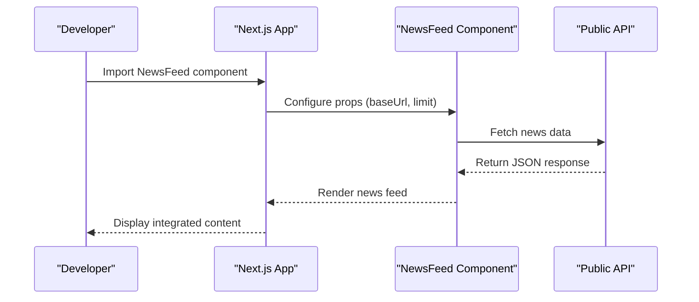

**Diagram sources**
- [components/news-feed.tsx:41-64](file://components/news-feed.tsx#L41-L64)

### REST API Integration

For non-React applications, the system provides REST API endpoints that can be consumed by any HTTP client:

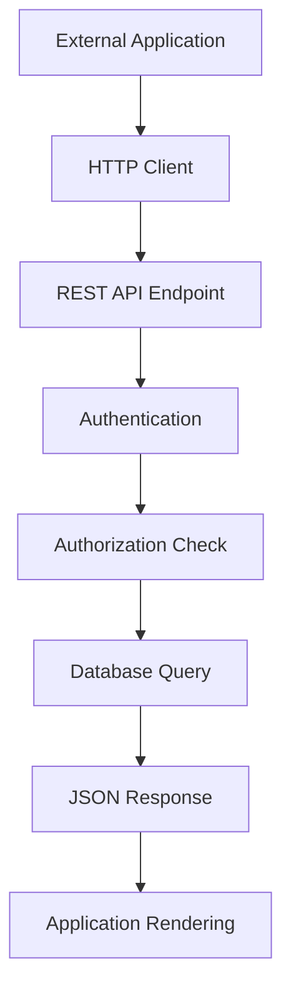

**Diagram sources**
- [app/api/public/news/route.ts:4-53](file://app/api/public/news/route.ts#L4-L53)

**Section sources**
- [README.md:149-285](file://README.md#L149-L285)
- [components/news-feed.tsx:41-64](file://components/news-feed.tsx#L41-L64)

## Adaptive Design and Dark Theme

The system implements a comprehensive adaptive design framework that ensures optimal user experience across all devices and preferences.

### Responsive Layout System

The components utilize Tailwind CSS for responsive design:

- Mobile-first approach with progressive enhancement
- Flexible grid layouts that adapt to screen size
- Touch-friendly interactive elements
- Optimized typography scales for readability

### Dark Theme Implementation

The system supports automatic dark theme detection and manual switching:

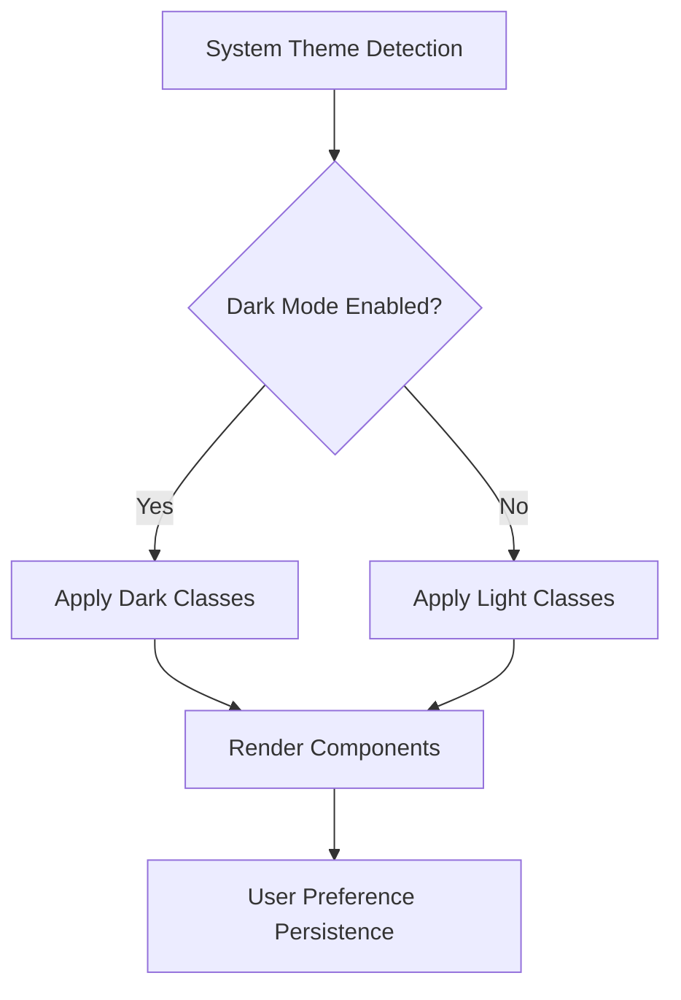

**Diagram sources**
- [components/news-feed.tsx:95-149](file://components/news-feed.tsx#L95-L149)

### Component Styling Architecture

Both NewsFeed and NewsWidget components implement consistent styling patterns:

- Semantic HTML structure for accessibility
- CSS custom properties for theme consistency
- Hover states and transitions for interactivity
- Responsive breakpoints for mobile optimization

**Section sources**
- [components/news-feed.tsx:95-151](file://components/news-feed.tsx#L95-L151)
- [components/news-widget.tsx:69-147](file://components/news-widget.tsx#L69-L147)

## Collaborative Editing Workflow

The system facilitates collaborative content creation through a structured workflow that includes draft saving, content approval processes, and multi-channel publishing capabilities.

### Draft Management System

Content creators can save drafts that remain private until ready for review:

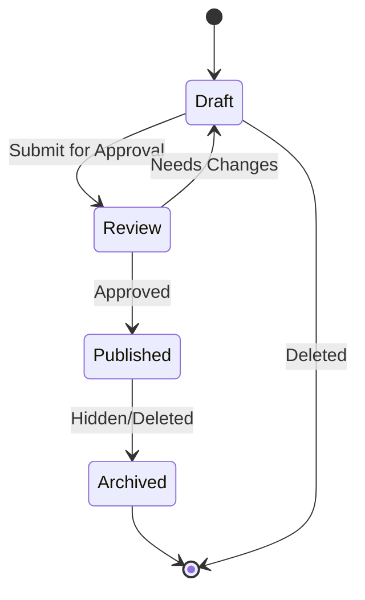

**Diagram sources**
- [lib/data.ts:144-166](file://lib/data.ts#L144-L166)

### Approval Process

The approval workflow ensures content quality through role-based validation:

1. **Draft Creation**: Editors create initial content
2. **Submission**: Content submitted for channel assignment
3. **Review**: Channel administrators review content
4. **Approval**: Authorized personnel approve publication
5. **Publishing**: Content distributed to selected channels

### Multi-Channel Publishing

The system supports simultaneous publication across multiple channels:

- Single content creation with multi-channel assignment
- Independent scheduling per channel
- Channel-specific customization options
- Real-time distribution to all connected sites

**Section sources**
- [lib/data.ts:144-212](file://lib/data.ts#L144-L212)
- [app/api/news/route.ts:4-57](file://app/api/news/route.ts#L4-L57)

## Public API Endpoints

The system exposes comprehensive public API endpoints for external website integration, providing programmatic access to news content with flexible filtering and customization options.

### Public API Endpoints

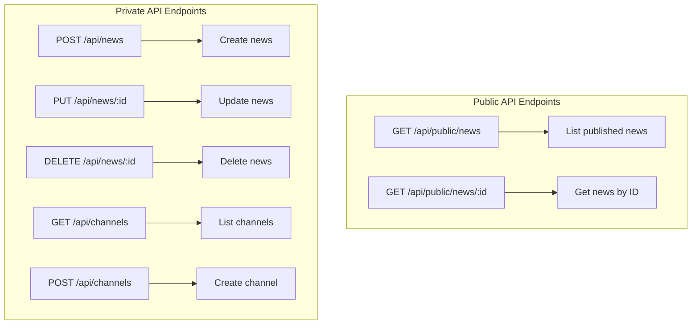

**Diagram sources**
- [app/api/public/news/route.ts:4-53](file://app/api/public/news/route.ts#L4-L53)
- [app/api/public/news/[id]/route.ts:4-L62](file://app/api/public/news/[id]/route.ts#L4-L62)

### API Response Structure

The public API returns structured JSON responses with comprehensive metadata:

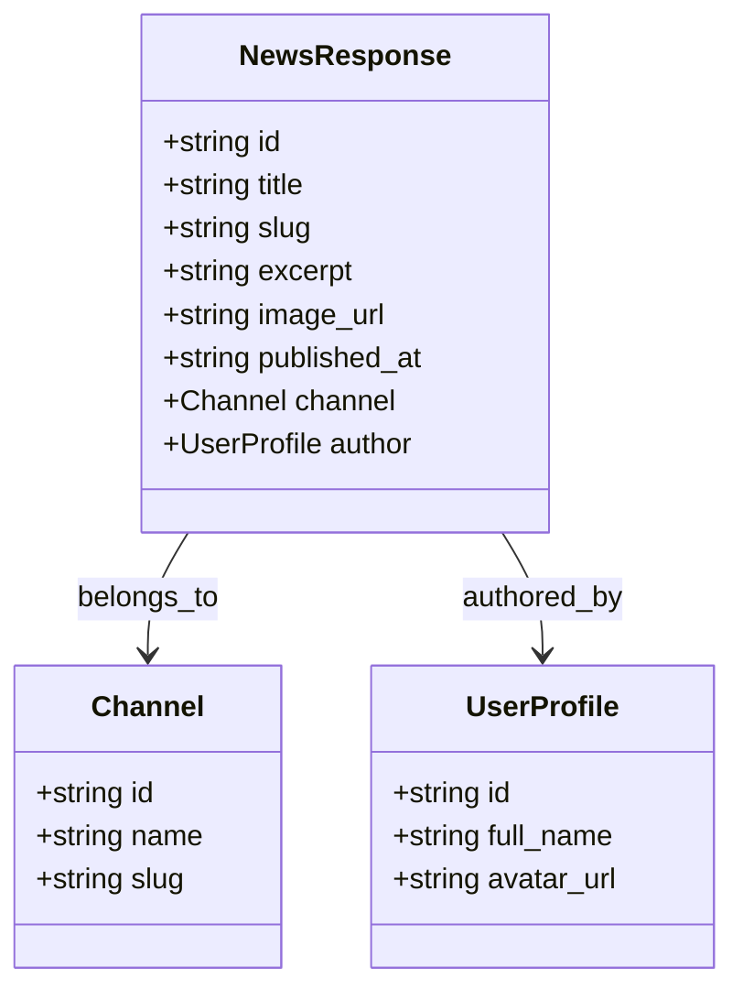

**Diagram sources**
- [app/api/public/news/route.ts:13-35](file://app/api/public/news/route.ts#L13-L35)

### Query Parameters

The public API supports flexible filtering through query parameters:

- `channel`: Filter by channel slug
- `limit`: Limit number of results (default: 10)
- Automatic pagination support for large datasets

**Section sources**
- [app/api/public/news/route.ts:4-53](file://app/api/public/news/route.ts#L4-L53)
- [app/api/public/news/[id]/route.ts:4-L62](file://app/api/public/news/[id]/route.ts#L4-L62)

## Conclusion

The Blog Management System provides a comprehensive solution for multi-channel news management with robust security, flexible integration options, and modern development practices. Its architecture supports scalable content distribution while maintaining strict access controls and providing excellent developer experience through both React components and REST APIs.

The system's adaptive design ensures optimal user experience across devices, while its collaborative workflow facilitates efficient content creation and approval processes. Organizations can seamlessly integrate the platform into existing websites or leverage the component library for modern React applications, making it suitable for diverse technical requirements and deployment scenarios.