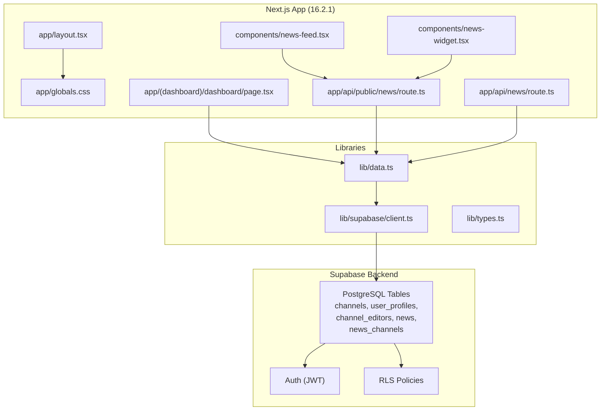
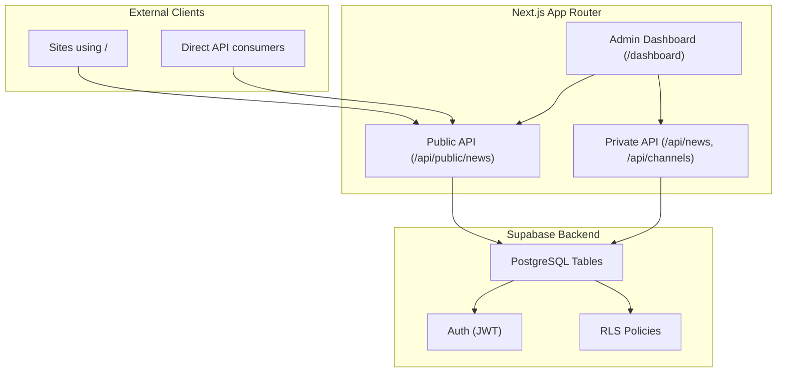
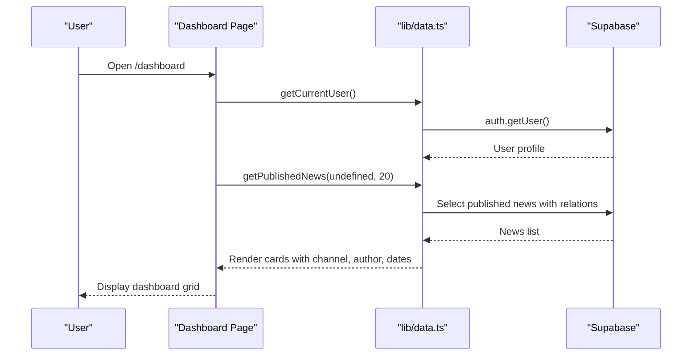
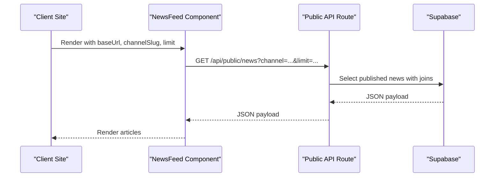
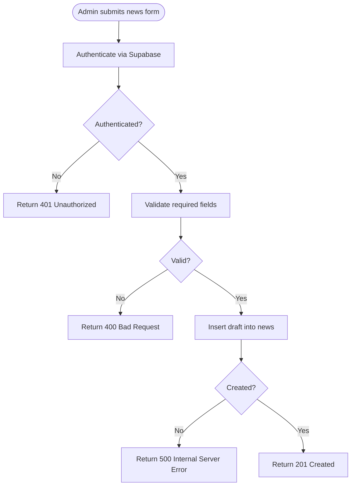
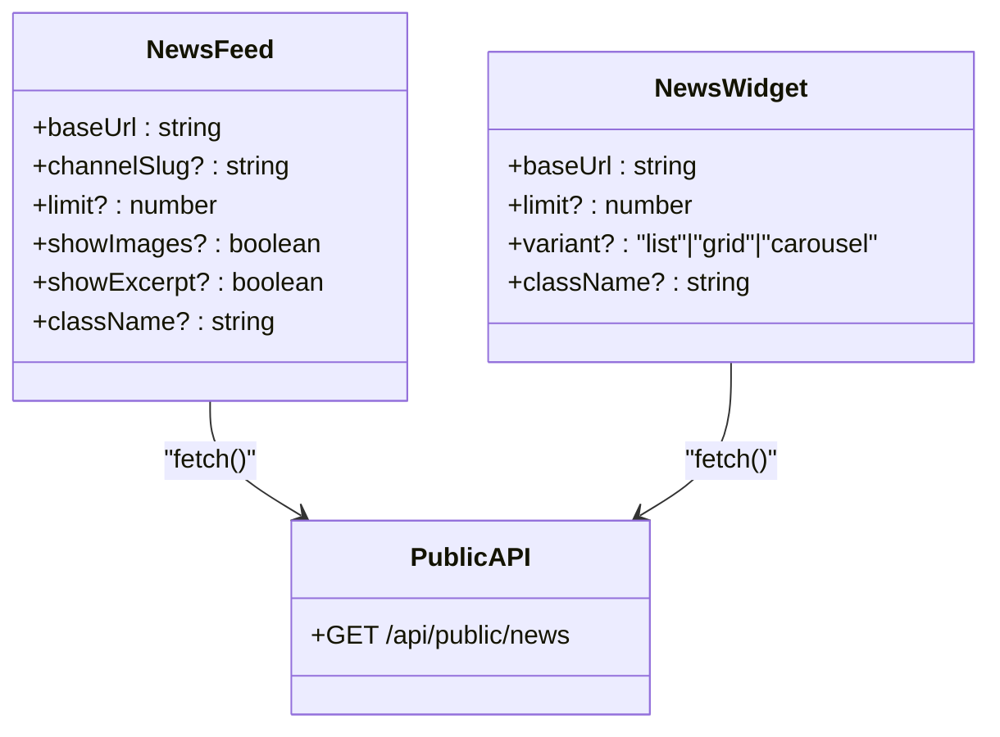
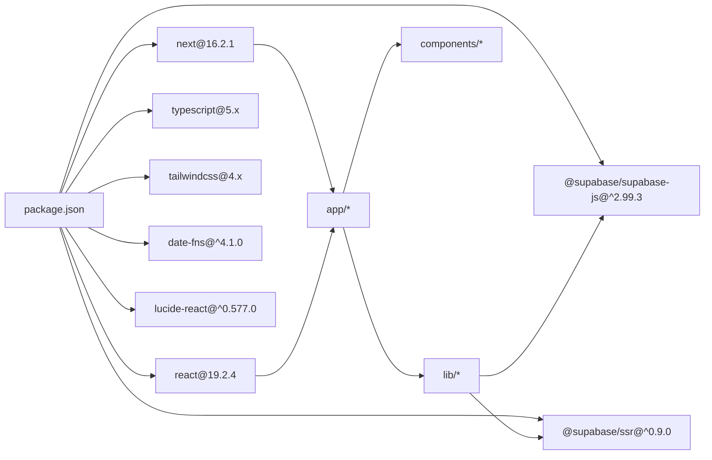

# Project Overview

<cite>
**Referenced Files in This Document**
- [README.md](file://README.md)
- [ARCHITECTURE.md](file://ARCHITECTURE.md)
- [PROJECT_SUMMARY.md](file://PROJECT_SUMMARY.md)
- [package.json](file://package.json)
- [next.config.js](file://next.config.js)
- [app/layout.tsx](file://app/layout.tsx)
- [app/globals.css](file://app/globals.css)
- [lib/types.ts](file://lib/types.ts)
- [lib/data.ts](file://lib/data.ts)
- [lib/supabase/client.ts](file://lib/supabase/client.ts)
- [app/api/public/news/route.ts](file://app/api/public/news/route.ts)
- [app/api/news/route.ts](file://app/api/news/route.ts)
- [app/(dashboard)/dashboard/page.tsx](file://app/(dashboard)/dashboard/page.tsx)
- [components/news-feed.tsx](file://components/news-feed.tsx)
- [components/news-widget.tsx](file://components/news-widget.tsx)
</cite>

## Table of Contents
1. [Introduction](#introduction)
2. [Project Structure](#project-structure)
3. [Core Components](#core-components)
4. [Architecture Overview](#architecture-overview)
5. [Detailed Component Analysis](#detailed-component-analysis)
6. [Dependency Analysis](#dependency-analysis)
7. [Performance Considerations](#performance-considerations)
8. [Troubleshooting Guide](#troubleshooting-guide)
9. [Conclusion](#conclusion)

## Introduction
This project is a centralized multi-channel news management platform designed to streamline editorial workflows across multiple websites. It provides role-based access control (RBAC) with three roles—Super Admin, Admin, and Editor—enabling granular permissions for managing channels, editors, and news content. The system integrates tightly with Supabase for authentication, database, and row-level security (RLS), while offering both a modern admin dashboard built with Next.js App Router and reusable React components for embedding news feeds on external sites.

Key capabilities include:
- Multi-channel publishing: One news item can be published to multiple channels simultaneously.
- Role-based permissions: Different access levels for creating, editing, deleting, and publishing content.
- Ready-to-use components: NewsFeed and NewsWidget for quick integration.
- REST API: Public endpoint for retrieving published news and private endpoints for administrative operations.
- Responsive design with dark mode support.

**Section sources**
- [README.md:1-15](file://README.md#L1-L15)
- [PROJECT_SUMMARY.md:5-57](file://PROJECT_SUMMARY.md#L5-L57)

## Project Structure
The project follows a modern Next.js 16.2.1 App Router structure with a clear separation between server-side API routes, client-side components, and shared libraries for Supabase integration and data access.

High-level structure highlights:
- app/: Next.js App Router pages and API routes
  - (auth)/login: Login page
  - (dashboard)/dashboard: Admin dashboard pages
  - api/: Server-side API handlers
    - public/news: Public read-only API for clients
    - news: Private CRUD endpoints for administrators
  - layout.tsx and globals.css: Root layout and global styles
- components/: Reusable React components for embedding
- lib/: Shared utilities
  - supabase/client.ts: Browser-side Supabase client factory
  - data.ts: Data access functions for Supabase
  - types.ts: TypeScript interfaces for domain entities

**Diagram sources**
- [app/layout.tsx:1-22](file://app/layout.tsx#L1-L22)
- [app/globals.css:1-27](file://app/globals.css#L1-L27)
- [app/(dashboard)/dashboard/page.tsx:1-83](file://app/(dashboard)/dashboard/page.tsx#L1-L83)
- [app/api/public/news/route.ts:1-54](file://app/api/public/news/route.ts#L1-L54)
- [app/api/news/route.ts:1-58](file://app/api/news/route.ts#L1-L58)
- [components/news-feed.tsx:1-152](file://components/news-feed.tsx#L1-L152)
- [components/news-widget.tsx:1-149](file://components/news-widget.tsx#L1-L149)
- [lib/supabase/client.ts:1-9](file://lib/supabase/client.ts#L1-L9)
- [lib/data.ts:1-213](file://lib/data.ts#L1-L213)
- [lib/types.ts:1-62](file://lib/types.ts#L1-L62)

**Section sources**
- [PROJECT_SUMMARY.md:73-115](file://PROJECT_SUMMARY.md#L73-L115)
- [package.json:11-28](file://package.json#L11-L28)
- [next.config.js:1-14](file://next.config.js#L1-L14)

## Core Components
This section introduces the building blocks of the system: domain types, data access layer, Supabase client, and UI components.

- Domain Types (TypeScript)
  - Roles: super_admin, admin, editor
  - Entities: UserProfile, Channel, ChannelEditor, News, NewsChannel
  These types define the shape of data exchanged between the frontend and backend.

- Data Access Layer
  - getCurrentUser: Retrieves current user profile from Supabase
  - getUserChannels: Lists channels assigned to a user
  - getChannelEditors: Lists editors for a given channel with permissions
  - getAllChannels: Lists active channels
  - getPublishedNews: Fetches published news with author/channel relations
  - getNewsById: Fetches a single news item with related entities
  - createNews: Creates a draft news item
  - updateNews: Updates a news item
  - publishNews: Publishes a news item to selected channels

- Supabase Client
  - Browser client configured with NEXT_PUBLIC_SUPABASE_URL and NEXT_PUBLIC_SUPABASE_ANON_KEY
  - Server client used in API routes for secure operations

- UI Components
  - NewsFeed: Embeddable feed with optional image and excerpt rendering
  - NewsWidget: Compact list/grid/carousel widget for recent news

Practical examples:
- Dashboard page renders a grid of published news items and links to edit/create actions.
- Components fetch from the public API endpoint and render responsive layouts with dark mode support.

**Section sources**
- [lib/types.ts:1-62](file://lib/types.ts#L1-L62)
- [lib/data.ts:1-213](file://lib/data.ts#L1-L213)
- [lib/supabase/client.ts:1-9](file://lib/supabase/client.ts#L1-L9)
- [app/(dashboard)/dashboard/page.tsx:1-83](file://app/(dashboard)/dashboard/page.tsx#L1-L83)
- [components/news-feed.tsx:1-152](file://components/news-feed.tsx#L1-L152)
- [components/news-widget.tsx:1-149](file://components/news-widget.tsx#L1-L149)

## Architecture Overview
The system architecture centers around a Next.js admin dashboard and public API, backed by Supabase for authentication, database, and row-level security.

**Diagram sources**
- [ARCHITECTURE.md:106-179](file://ARCHITECTURE.md#L106-L179)
- [app/api/public/news/route.ts:1-54](file://app/api/public/news/route.ts#L1-L54)
- [app/api/news/route.ts:1-58](file://app/api/news/route.ts#L1-L58)
- [app/(dashboard)/dashboard/page.tsx:1-83](file://app/(dashboard)/dashboard/page.tsx#L1-L83)

Conceptual overview for beginners:
- Multi-channel publishing: A single news item can be associated with multiple channels. When published, it appears on all selected channels.
- Role-based permissions: Super Admin controls channels and editors; Admin manages assigned channels; Editor creates drafts and edits their own content.

Technical details for experienced developers:
- Supabase integration: Uses Supabase Auth for JWT-based sessions and RLS policies to enforce row-level access control.
- API design: Public endpoints return published news; private endpoints require authentication and enforce RBAC via Supabase policies.
- Component integration: Components fetch from the public API and render responsive layouts with Tailwind CSS and dark mode support.

**Section sources**
- [README.md:101-119](file://README.md#L101-L119)
- [ARCHITECTURE.md:266-316](file://ARCHITECTURE.md#L266-L316)
- [lib/data.ts:1-213](file://lib/data.ts#L1-L213)

## Detailed Component Analysis

### Dashboard Interface
The dashboard page demonstrates the admin workflow:
- Fetches published news and displays a responsive grid
- Provides navigation to create new news items when authenticated
- Renders channel, author, and publication date information

**Diagram sources**
- [app/(dashboard)/dashboard/page.tsx:1-83](file://app/(dashboard)/dashboard/page.tsx#L1-L83)
- [lib/data.ts:4-18](file://lib/data.ts#L4-L18)
- [lib/data.ts:78-108](file://lib/data.ts#L78-L108)

**Section sources**
- [app/(dashboard)/dashboard/page.tsx:1-83](file://app/(dashboard)/dashboard/page.tsx#L1-L83)

### Public API Workflow
The public API serves published news to external clients and widgets:
- Accepts query parameters: channel slug and limit
- Returns structured data with nested author and channel information
- Enforced by Supabase RLS to only expose published content

**Diagram sources**
- [components/news-feed.tsx:29-64](file://components/news-feed.tsx#L29-L64)
- [app/api/public/news/route.ts:4-53](file://app/api/public/news/route.ts#L4-L53)
- [lib/data.ts:78-108](file://lib/data.ts#L78-L108)

**Section sources**
- [app/api/public/news/route.ts:1-54](file://app/api/public/news/route.ts#L1-L54)
- [components/news-feed.tsx:1-152](file://components/news-feed.tsx#L1-L152)

### Private API Workflow (Administrative)
Private endpoints handle creation and updates of news items:
- Require authenticated users via Supabase Auth
- Validate input and insert/update records in the news table
- Publishing associates a news item with multiple channels via news_channels

**Diagram sources**
- [app/api/news/route.ts:4-57](file://app/api/news/route.ts#L4-L57)
- [lib/data.ts:144-166](file://lib/data.ts#L144-L166)

**Section sources**
- [app/api/news/route.ts:1-58](file://app/api/news/route.ts#L1-L58)
- [lib/data.ts:144-166](file://lib/data.ts#L144-L166)

### Component Integration Patterns
Both NewsFeed and NewsWidget follow a consistent pattern:
- Client-side components using React hooks
- Fetch from the public API endpoint
- Handle loading, empty, and error states
- Support customization via props (limit, variants, visibility toggles)

**Diagram sources**
- [components/news-feed.tsx:20-27](file://components/news-feed.tsx#L20-L27)
- [components/news-widget.tsx:15-20](file://components/news-widget.tsx#L15-L20)
- [app/api/public/news/route.ts:4-53](file://app/api/public/news/route.ts#L4-L53)

**Section sources**
- [components/news-feed.tsx:1-152](file://components/news-feed.tsx#L1-L152)
- [components/news-widget.tsx:1-149](file://components/news-widget.tsx#L1-L149)

## Dependency Analysis
Technology stack and module-level dependencies:
- Next.js 16.2.1 with App Router for routing and SSR
- React 19.2.4 with TypeScript for type-safe UI
- Tailwind CSS 4 for styling and responsive design
- Supabase SDKs (@supabase/ssr, @supabase/supabase-js) for client/server integration
- date-fns for date formatting
- lucide-react for icons

**Diagram sources**
- [package.json:11-28](file://package.json#L11-L28)

**Section sources**
- [package.json:11-28](file://package.json#L11-L28)
- [next.config.js:1-14](file://next.config.js#L1-L14)

## Performance Considerations
- Next.js App Router enables efficient SSR/SSG where appropriate.
- Supabase indexing and RLS policies are configured to optimize queries.
- Components implement client-side caching via local state and minimal re-renders.
- Public API supports pagination via limit parameter to control payload sizes.
- Remote image optimization is enabled for Supabase-hosted assets.

[No sources needed since this section provides general guidance]

## Troubleshooting Guide
Common issues and resolutions:
- Environment variables missing: Ensure NEXT_PUBLIC_SUPABASE_URL, NEXT_PUBLIC_SUPABASE_ANON_KEY, and SUPABASE_SERVICE_ROLE_KEY are configured.
- Authentication failures: Verify Supabase Auth provider (Email/Password) is enabled and user sessions are active.
- Permission errors: Confirm user role and channel editor permissions in Supabase tables.
- CORS issues: Public API is configured for cross-origin requests; verify client origins if integrating externally.
- Component rendering problems: Check baseUrl prop passed to NewsFeed/NewsWidget and confirm the public API endpoint is reachable.

**Section sources**
- [README.md:71-98](file://README.md#L71-L98)
- [app/api/public/news/route.ts:4-53](file://app/api/public/news/route.ts#L4-L53)
- [components/news-feed.tsx:41-64](file://components/news-feed.tsx#L41-L64)

## Conclusion
This multi-channel news management system delivers a production-ready solution combining a modern Next.js admin dashboard, reusable React components, and a robust Supabase backend with role-based access control and row-level security. It supports scalable, multi-site publishing workflows, offers flexible integration patterns, and maintains strong security and performance characteristics suitable for immediate deployment.

[No sources needed since this section summarizes without analyzing specific files]