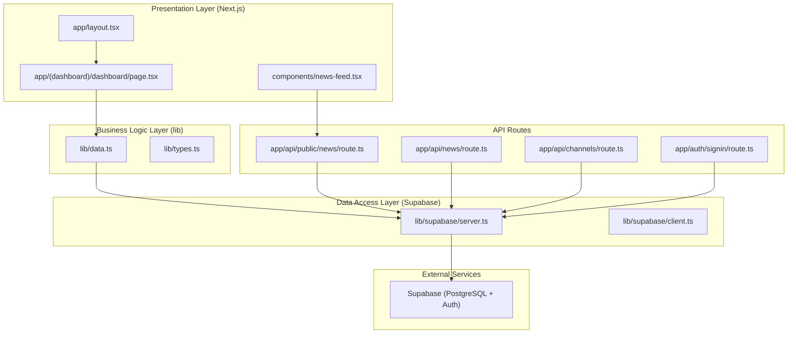
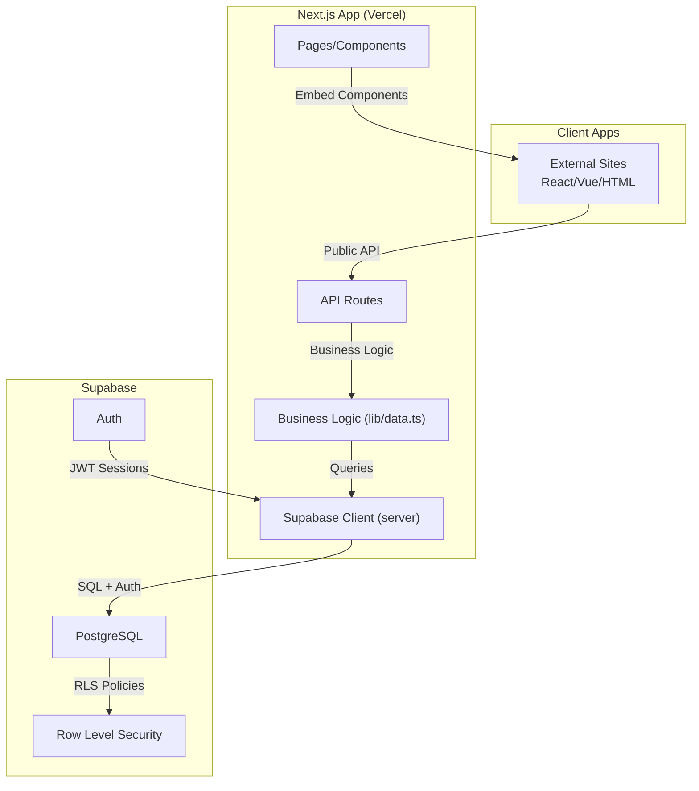
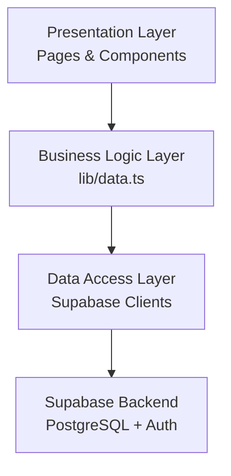
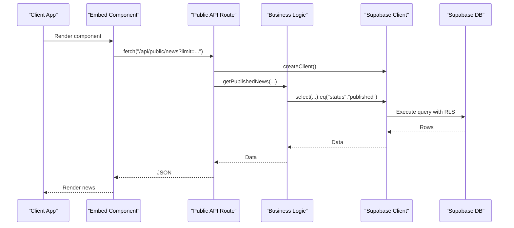
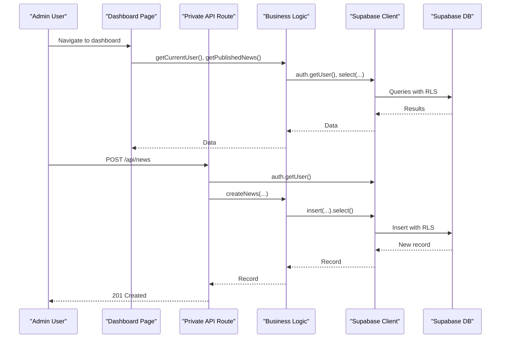
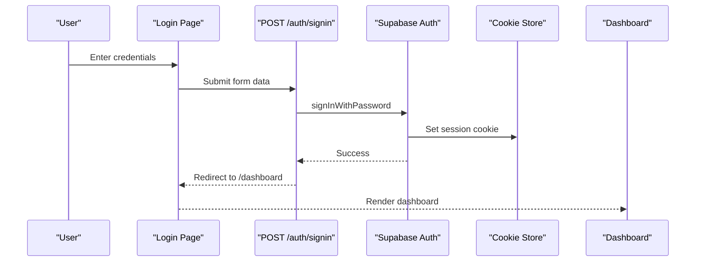
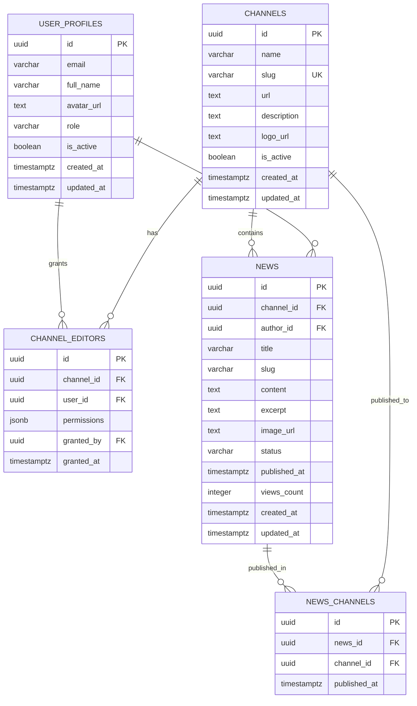
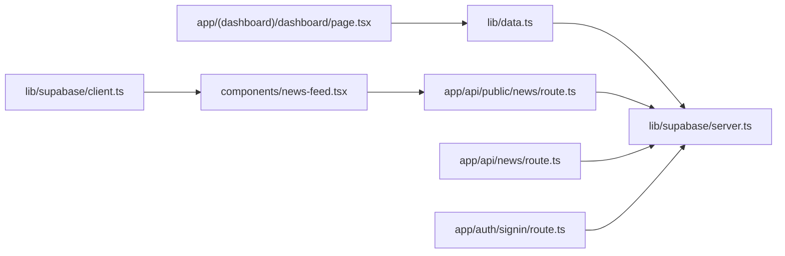
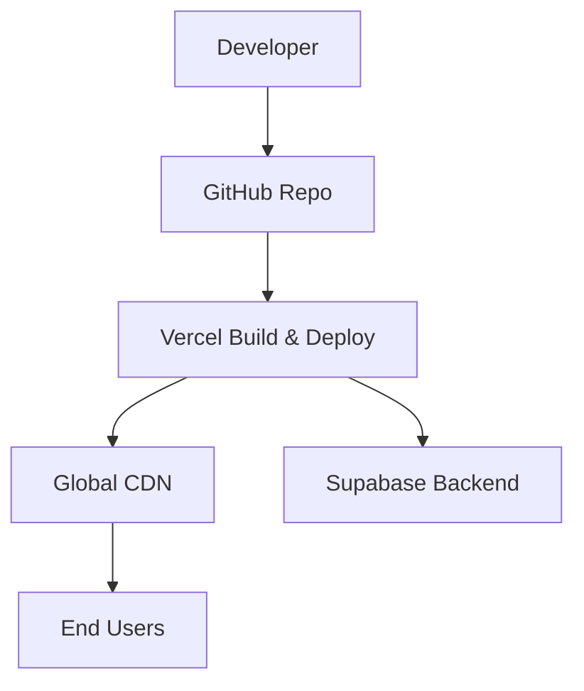

# System Architecture

<cite>
**Referenced Files in This Document**
- [README.md](file://README.md)
- [ARCHITECTURE.md](file://ARCHITECTURE.md)
- [app/layout.tsx](file://app/layout.tsx)
- [app/api/public/news/route.ts](file://app/api/public/news/route.ts)
- [app/api/news/route.ts](file://app/api/news/route.ts)
- [app/api/channels/route.ts](file://app/api/channels/route.ts)
- [app/auth/signin/route.ts](file://app/auth/signin/route.ts)
- [app/(dashboard)/dashboard/page.tsx](file://app/(dashboard)/dashboard/page.tsx)
- [lib/supabase/server.ts](file://lib/supabase/server.ts)
- [lib/supabase/client.ts](file://lib/supabase/client.ts)
- [lib/data.ts](file://lib/data.ts)
- [lib/types.ts](file://lib/types.ts)
- [components/news-feed.tsx](file://components/news-feed.tsx)
- [next.config.js](file://next.config.js)
- [package.json](file://package.json)
- [supabase-schema.sql](file://supabase-schema.sql)
</cite>

## Table of Contents
1. [Introduction](#introduction)
2. [Project Structure](#project-structure)
3. [Core Components](#core-components)
4. [Architecture Overview](#architecture-overview)
5. [Detailed Component Analysis](#detailed-component-analysis)
6. [Dependency Analysis](#dependency-analysis)
7. [Performance Considerations](#performance-considerations)
8. [Troubleshooting Guide](#troubleshooting-guide)
9. [Conclusion](#conclusion)
10. [Appendices](#appendices)

## Introduction
This document explains the system architecture of the blog management system. It focuses on the high-level design using Next.js App Router with server-side rendering, Supabase backend services, and a React component architecture. The system follows a layered architecture pattern:
- Presentation layer: Next.js pages and components
- Business logic layer: lib/data.ts functions
- Data access layer: Supabase client abstractions

It also documents how frontend components communicate with API routes and Supabase, the cloud-native deployment model on Vercel with Supabase-managed services, real-time capabilities, separation of public and private interfaces, and the technical decisions behind Next.js App Router, TypeScript, and Supabase.

## Project Structure
The repository organizes code by feature and layer:
- app/: Next.js App Router pages, API routes, and shared layouts
- lib/: shared business logic and Supabase client helpers
- components/: reusable React components for embedding on external sites
- supabase-schema.sql: database schema and RLS policies



**Diagram sources**
- [app/layout.tsx:1-22](file://app/layout.tsx#L1-L22)
- [app/(dashboard)/dashboard/page.tsx:1-83](file://app/(dashboard)/dashboard/page.tsx#L1-L83)
- [components/news-feed.tsx:1-152](file://components/news-feed.tsx#L1-L152)
- [lib/data.ts:1-213](file://lib/data.ts#L1-L213)
- [lib/types.ts:1-62](file://lib/types.ts#L1-L62)
- [lib/supabase/server.ts:1-30](file://lib/supabase/server.ts#L1-L30)
- [lib/supabase/client.ts:1-9](file://lib/supabase/client.ts#L1-L9)
- [app/api/public/news/route.ts:1-54](file://app/api/public/news/route.ts#L1-L54)
- [app/api/news/route.ts:1-58](file://app/api/news/route.ts#L1-L58)
- [app/api/channels/route.ts:1-71](file://app/api/channels/route.ts#L1-L71)
- [app/auth/signin/route.ts:1-31](file://app/auth/signin/route.ts#L1-L31)

**Section sources**
- [README.md:16-100](file://README.md#L16-L100)
- [ARCHITECTURE.md:106-180](file://ARCHITECTURE.md#L106-L180)

## Core Components
- Supabase server client: encapsulates server-side Supabase initialization with cookie handling for SSR and API routes.
- Supabase browser client: encapsulates client-side Supabase initialization for components.
- Business logic module: centralized functions for data access and CRUD operations against Supabase.
- API routes: public and private endpoints for news, channels, and authentication.
- Dashboard page: server-rendered page consuming business logic to render published news.
- Public components: embeddable React components that call public API endpoints.

Key responsibilities:
- lib/supabase/server.ts and lib/supabase/client.ts abstract Supabase client creation and environment variable usage.
- lib/data.ts orchestrates queries, joins, and validations for domain operations.
- app/api/* routes enforce authentication and authorization, delegate to lib/data.ts, and return JSON responses.
- components/news-feed.tsx performs client-side fetch to public API and renders news items.

**Section sources**
- [lib/supabase/server.ts:1-30](file://lib/supabase/server.ts#L1-L30)
- [lib/supabase/client.ts:1-9](file://lib/supabase/client.ts#L1-L9)
- [lib/data.ts:1-213](file://lib/data.ts#L1-L213)
- [app/api/public/news/route.ts:1-54](file://app/api/public/news/route.ts#L1-L54)
- [app/api/news/route.ts:1-58](file://app/api/news/route.ts#L1-L58)
- [app/api/channels/route.ts:1-71](file://app/api/channels/route.ts#L1-L71)
- [app/auth/signin/route.ts:1-31](file://app/auth/signin/route.ts#L1-L31)
- [app/(dashboard)/dashboard/page.tsx:1-83](file://app/(dashboard)/dashboard/page.tsx#L1-L83)
- [components/news-feed.tsx:1-152](file://components/news-feed.tsx#L1-L152)

## Architecture Overview
The system employs a layered architecture with clear separation of concerns:
- Presentation layer: Next.js App Router pages and components
- Business logic layer: lib/data.ts functions
- Data access layer: Supabase client abstractions
- API boundary: Next.js API routes for public and private endpoints
- External services: Supabase for authentication, database, and row-level security



**Diagram sources**
- [app/api/public/news/route.ts:1-54](file://app/api/public/news/route.ts#L1-L54)
- [lib/data.ts:1-213](file://lib/data.ts#L1-L213)
- [lib/supabase/server.ts:1-30](file://lib/supabase/server.ts#L1-L30)
- [supabase-schema.sql:147-200](file://supabase-schema.sql#L147-L200)

## Detailed Component Analysis

### Layered Architecture Pattern
The system follows a three-layer pattern:
- Presentation layer: Next.js pages and components (e.g., dashboard page, embeddable components)
- Business logic layer: lib/data.ts functions encapsulate data retrieval and mutations
- Data access layer: lib/supabase/server.ts and lib/supabase/client.ts initialize Supabase clients



**Diagram sources**
- [app/(dashboard)/dashboard/page.tsx:1-83](file://app/(dashboard)/dashboard/page.tsx#L1-L83)
- [components/news-feed.tsx:1-152](file://components/news-feed.tsx#L1-L152)
- [lib/data.ts:1-213](file://lib/data.ts#L1-L213)
- [lib/supabase/server.ts:1-30](file://lib/supabase/server.ts#L1-L30)
- [lib/supabase/client.ts:1-9](file://lib/supabase/client.ts#L1-L9)

**Section sources**
- [lib/data.ts:1-213](file://lib/data.ts#L1-L213)
- [lib/supabase/server.ts:1-30](file://lib/supabase/server.ts#L1-L30)
- [lib/supabase/client.ts:1-9](file://lib/supabase/client.ts#L1-L9)

### Public API Endpoints Flow
Public endpoints serve unauthenticated consumers (external sites) and rely on Supabase RLS for access control.



**Diagram sources**
- [components/news-feed.tsx:41-64](file://components/news-feed.tsx#L41-L64)
- [app/api/public/news/route.ts:4-53](file://app/api/public/news/route.ts#L4-L53)
- [lib/data.ts:78-108](file://lib/data.ts#L78-L108)
- [lib/supabase/server.ts:4-29](file://lib/supabase/server.ts#L4-L29)

**Section sources**
- [app/api/public/news/route.ts:1-54](file://app/api/public/news/route.ts#L1-L54)
- [lib/data.ts:78-108](file://lib/data.ts#L78-L108)
- [components/news-feed.tsx:1-152](file://components/news-feed.tsx#L1-L152)

### Private Admin Interfaces Flow
Private endpoints require authentication and enforce role-based access control.



**Diagram sources**
- [app/(dashboard)/dashboard/page.tsx:7-9](file://app/(dashboard)/dashboard/page.tsx#L7-L9)
- [app/api/news/route.ts:4-57](file://app/api/news/route.ts#L4-L57)
- [lib/data.ts:144-166](file://lib/data.ts#L144-L166)
- [lib/supabase/server.ts:4-29](file://lib/supabase/server.ts#L4-L29)

**Section sources**
- [app/api/news/route.ts:1-58](file://app/api/news/route.ts#L1-L58)
- [lib/data.ts:144-166](file://lib/data.ts#L144-L166)
- [app/(dashboard)/dashboard/page.tsx:1-83](file://app/(dashboard)/dashboard/page.tsx#L1-L83)

### Authentication Flow
Authentication uses Supabase Auth with JWT tokens and session cookies.



**Diagram sources**
- [app/auth/signin/route.ts:4-30](file://app/auth/signin/route.ts#L4-L30)
- [lib/supabase/server.ts:4-29](file://lib/supabase/server.ts#L4-L29)

**Section sources**
- [app/auth/signin/route.ts:1-31](file://app/auth/signin/route.ts#L1-L31)
- [lib/supabase/server.ts:1-30](file://lib/supabase/server.ts#L1-L30)

### Data Model and RLS
The database schema supports multi-channel publishing and role-based access control enforced by RLS policies.



**Diagram sources**
- [supabase-schema.sql:4-112](file://supabase-schema.sql#L4-L112)

**Section sources**
- [supabase-schema.sql:147-200](file://supabase-schema.sql#L147-L200)
- [lib/types.ts:1-62](file://lib/types.ts#L1-L62)

### Real-Time Capabilities
Supabase Realtime enables live updates for subscribed clients. While the current codebase primarily uses REST API endpoints and server-rendered pages, integrating Supabase Realtime would involve:
- Subscribing to table changes in server components or client components
- Updating local state and re-rendering UI without full reloads
- Managing subscription lifecycles during component mounts/unmounts

This capability complements the existing architecture by enabling near-real-time updates for dashboards and embedded feeds.

[No sources needed since this section provides general guidance]

### Separation of Concerns: Public vs Private
- Public API endpoints (/api/public/*) are unauthenticated and rely on RLS for access control. They expose read-only data for embedding on external sites.
- Private API endpoints (/api/news, /api/channels) require authentication and enforce role-based authorization (e.g., super_admin only for creating channels).

```mermaid
flowchart TD
Start(["Incoming Request"]) --> Path{"Path"}
Path --> |"/api/public/news*"| Pub["Public Endpoint"]
Path --> |"/api/news" or "/api/channels"| Priv["Private Endpoint"]
Pub --> RLS["RLS Policies"]
RLS --> ReturnPub["Return Public Data"]
Priv --> Auth["Verify Auth + Role"]
Auth --> |Authorized| DBWrite["DB Write/Read"]
Auth --> |Unauthorized| Deny["401/403"]
DBWrite --> ReturnPriv["Return Data"]
```

**Diagram sources**
- [app/api/public/news/route.ts:4-53](file://app/api/public/news/route.ts#L4-L53)
- [app/api/news/route.ts:8-12](file://app/api/news/route.ts#L8-L12)
- [app/api/channels/route.ts:30-44](file://app/api/channels/route.ts#L30-L44)

**Section sources**
- [app/api/public/news/route.ts:1-54](file://app/api/public/news/route.ts#L1-L54)
- [app/api/news/route.ts:1-58](file://app/api/news/route.ts#L1-L58)
- [app/api/channels/route.ts:1-71](file://app/api/channels/route.ts#L1-L71)

### Technical Decision Rationale
- Next.js App Router: Enables server-side rendering, API routes, and modern routing patterns for scalable, SEO-friendly pages.
- TypeScript: Provides strong typing across components, API routes, and business logic for safer refactoring and fewer runtime errors.
- Supabase: Offers backend-as-a-service with built-in authentication, database, and RLS, reducing operational overhead while maintaining flexibility.

**Section sources**
- [package.json:11-27](file://package.json#L11-L27)
- [README.md:37-100](file://README.md#L37-L100)

## Dependency Analysis
The following diagram shows key dependencies among components and layers.



**Diagram sources**
- [components/news-feed.tsx:1-152](file://components/news-feed.tsx#L1-L152)
- [app/api/public/news/route.ts:1-54](file://app/api/public/news/route.ts#L1-L54)
- [app/(dashboard)/dashboard/page.tsx:1-83](file://app/(dashboard)/dashboard/page.tsx#L1-L83)
- [lib/data.ts:1-213](file://lib/data.ts#L1-L213)
- [lib/supabase/server.ts:1-30](file://lib/supabase/server.ts#L1-L30)
- [lib/supabase/client.ts:1-9](file://lib/supabase/client.ts#L1-L9)
- [app/api/news/route.ts:1-58](file://app/api/news/route.ts#L1-L58)
- [app/auth/signin/route.ts:1-31](file://app/auth/signin/route.ts#L1-L31)

**Section sources**
- [lib/data.ts:1-213](file://lib/data.ts#L1-L213)
- [lib/supabase/server.ts:1-30](file://lib/supabase/server.ts#L1-L30)
- [lib/supabase/client.ts:1-9](file://lib/supabase/client.ts#L1-L9)
- [app/api/public/news/route.ts:1-54](file://app/api/public/news/route.ts#L1-L54)
- [app/api/news/route.ts:1-58](file://app/api/news/route.ts#L1-L58)
- [app/auth/signin/route.ts:1-31](file://app/auth/signin/route.ts#L1-L31)
- [components/news-feed.tsx:1-152](file://components/news-feed.tsx#L1-L152)

## Performance Considerations
- Use server-side rendering for initial page loads to improve perceived performance and SEO.
- Leverage Supabase indexing and RLS policies to optimize query performance.
- Minimize payload sizes by selecting only required fields in queries.
- Cache frequently accessed public data at the CDN edge via Vercel for reduced latency.
- Keep API routes thin; delegate business logic to lib/data.ts for reuse and testing.

[No sources needed since this section provides general guidance]

## Troubleshooting Guide
Common areas to check:
- Environment variables for Supabase URL and keys in Next.js runtime.
- Cookie handling in server components for authentication persistence.
- Supabase RLS policies preventing access to expected rows.
- Network and CORS configurations for API routes.

**Section sources**
- [lib/supabase/server.ts:4-29](file://lib/supabase/server.ts#L4-L29)
- [app/api/public/news/route.ts:4-53](file://app/api/public/news/route.ts#L4-L53)
- [supabase-schema.sql:147-200](file://supabase-schema.sql#L147-L200)

## Conclusion
The blog management system leverages Next.js App Router for a modern, server-rendered frontend, Supabase for robust backend services, and a clean layered architecture separating presentation, business logic, and data access. Public and private interfaces are clearly separated, with Supabase RLS enforcing access control. The deployment model on Vercel integrates seamlessly with Supabase-managed services, enabling fast, secure delivery to global audiences.

[No sources needed since this section summarizes without analyzing specific files]

## Appendices

### Cloud-Native Deployment Architecture
The system is designed for cloud-native deployment:
- Vercel hosts the Next.js application with automatic builds and global CDN distribution.
- Supabase manages PostgreSQL, authentication, and RLS policies as managed services.
- Environment variables are configured per environment for isolation and security.



**Diagram sources**
- [README.md:375-396](file://README.md#L375-L396)

**Section sources**
- [README.md:375-396](file://README.md#L375-L396)

### Component Lifecycle and Real-Time Integration
Future enhancements can integrate Supabase Realtime:
- Subscribe to table changes in server components for pre-rendered updates.
- Use client-side subscriptions for interactive dashboards and live feeds.
- Manage subscription cleanup to prevent memory leaks.

[No sources needed since this section provides general guidance]