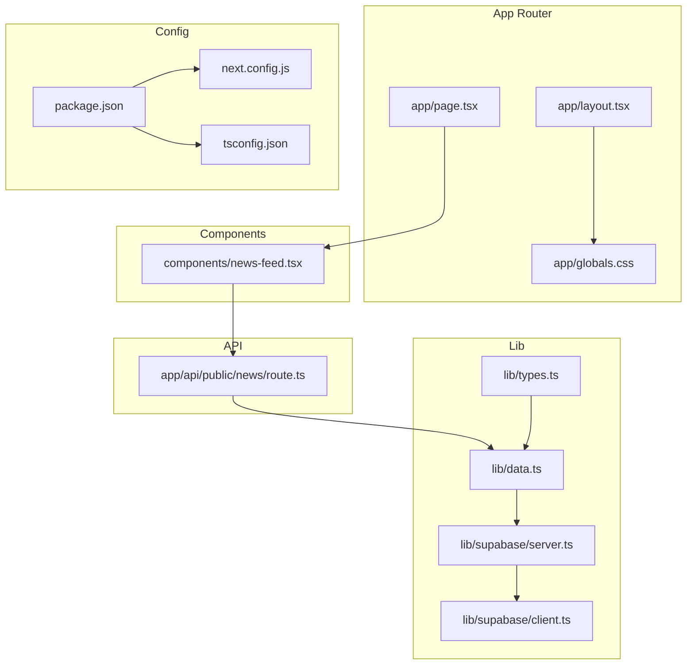
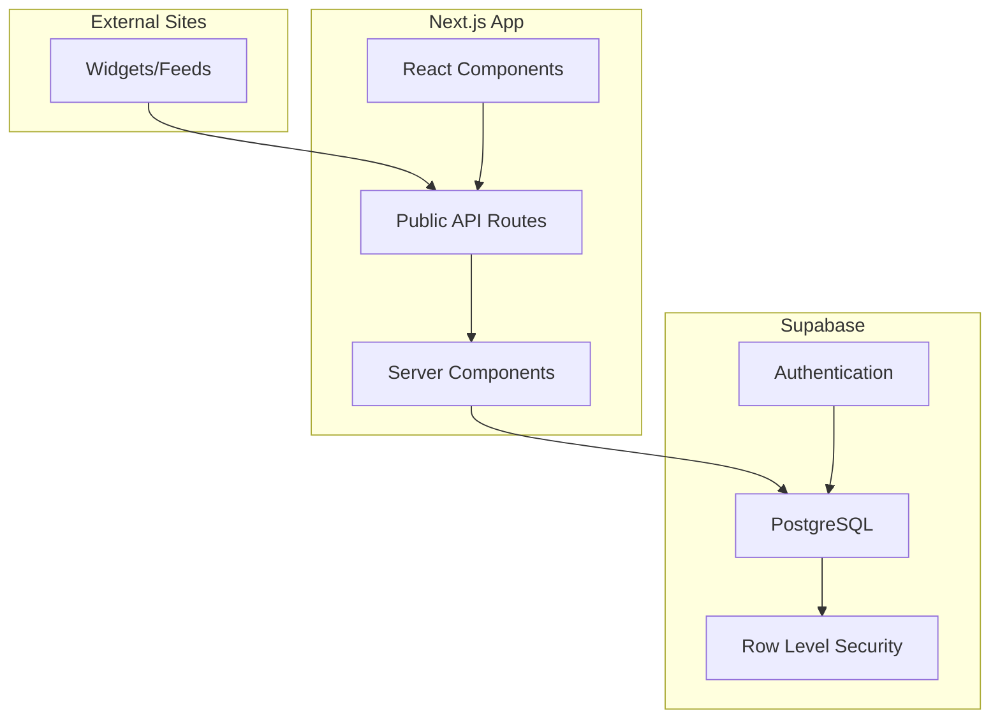
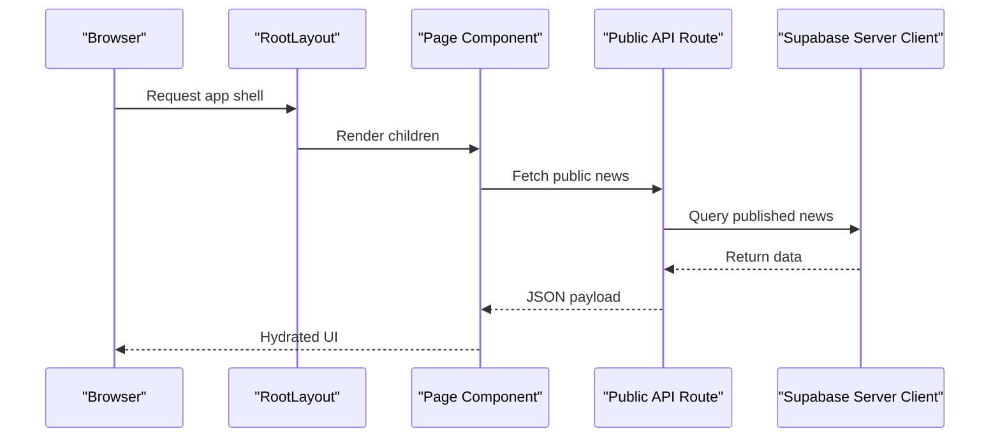
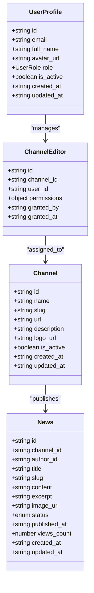
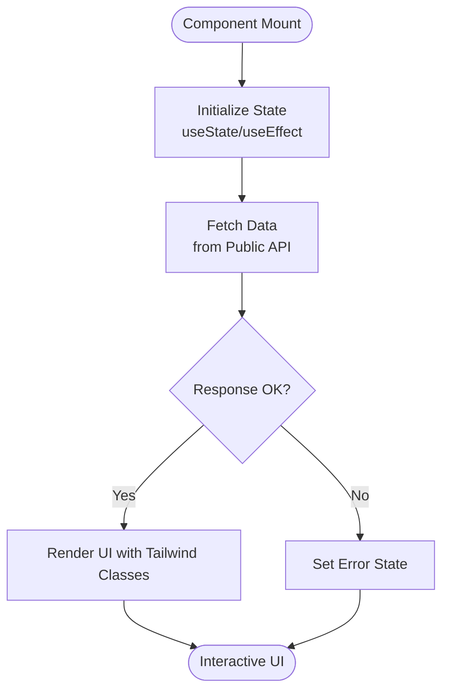
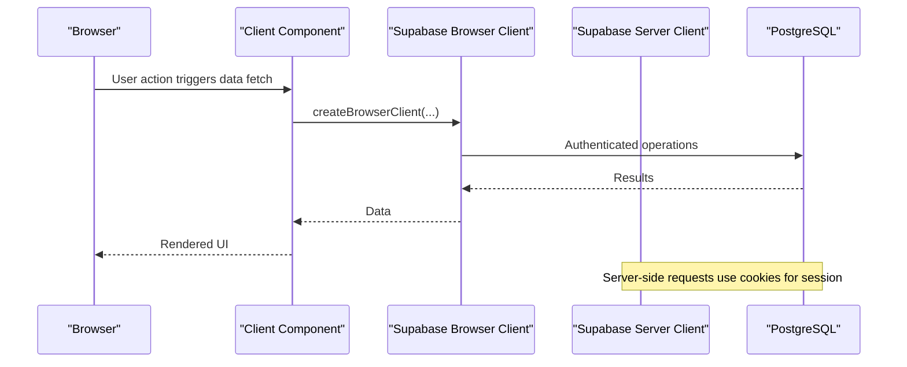
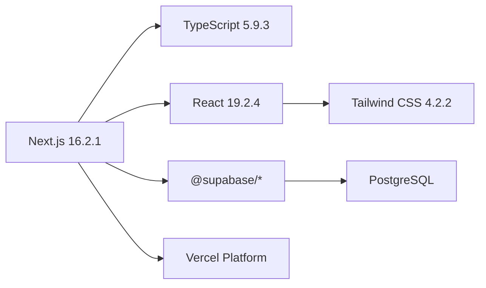

# Technology Stack

<cite>
**Referenced Files in This Document**
- [package.json](file://package.json)
- [next.config.js](file://next.config.js)
- [tsconfig.json](file://tsconfig.json)
- [lib/types.ts](file://lib/types.ts)
- [lib/supabase/client.ts](file://lib/supabase/client.ts)
- [lib/supabase/server.ts](file://lib/supabase/server.ts)
- [lib/data.ts](file://lib/data.ts)
- [app/layout.tsx](file://app/layout.tsx)
- [app/globals.css](file://app/globals.css)
- [components/news-feed.tsx](file://components/news-feed.tsx)
- [app/api/public/news/route.ts](file://app/api/public/news/route.ts)
- [vercel-env.json](file://vercel-env.json)
- [README.md](file://README.md)
- [ARCHITECTURE.md](file://ARCHITECTURE.md)
</cite>

## Table of Contents
1. [Introduction](#introduction)
2. [Project Structure](#project-structure)
3. [Core Components](#core-components)
4. [Architecture Overview](#architecture-overview)
5. [Detailed Component Analysis](#detailed-component-analysis)
6. [Dependency Analysis](#dependency-analysis)
7. [Performance Considerations](#performance-considerations)
8. [Troubleshooting Guide](#troubleshooting-guide)
9. [Conclusion](#conclusion)

## Introduction
This document presents the complete technology stack used in the blog management system. It covers Next.js 16.2.1 with App Router and server-side rendering, TypeScript 5.9.3 for type safety, React 19.2.4 with modern hooks and concurrent features, Tailwind CSS 4.2.2 for utility-first styling, Supabase integration for PostgreSQL, authentication, and real-time capabilities, Vercel deployment, and development tooling including ESLint and build optimization. Version compatibility and upgrade paths are addressed, along with performance considerations and how these technologies work together to deliver a cohesive development experience.

## Project Structure
The project follows a modern Next.js App Router structure with a clear separation of concerns:
- Application shell and global styles live under app/.
- Shared UI components are in components/.
- Type-safe data access and Supabase clients are in lib/.
- Public API routes are under app/api/.

**Diagram sources**
- [app/layout.tsx:1-22](file://app/layout.tsx#L1-L22)
- [app/globals.css:1-27](file://app/globals.css#L1-L27)
- [components/news-feed.tsx:1-152](file://components/news-feed.tsx#L1-L152)
- [lib/types.ts:1-62](file://lib/types.ts#L1-L62)
- [lib/supabase/client.ts:1-9](file://lib/supabase/client.ts#L1-L9)
- [lib/supabase/server.ts:1-30](file://lib/supabase/server.ts#L1-L30)
- [lib/data.ts:1-213](file://lib/data.ts#L1-L213)
- [app/api/public/news/route.ts:1-54](file://app/api/public/news/route.ts#L1-L54)
- [package.json:1-30](file://package.json#L1-L30)
- [next.config.js:1-14](file://next.config.js#L1-L14)
- [tsconfig.json:1-42](file://tsconfig.json#L1-L42)

**Section sources**
- [package.json:1-30](file://package.json#L1-L30)
- [next.config.js:1-14](file://next.config.js#L1-L14)
- [tsconfig.json:1-42](file://tsconfig.json#L1-L42)
- [app/layout.tsx:1-22](file://app/layout.tsx#L1-L22)
- [app/globals.css:1-27](file://app/globals.css#L1-L27)
- [lib/types.ts:1-62](file://lib/types.ts#L1-L62)
- [lib/supabase/client.ts:1-9](file://lib/supabase/client.ts#L1-L9)
- [lib/supabase/server.ts:1-30](file://lib/supabase/server.ts#L1-L30)
- [lib/data.ts:1-213](file://lib/data.ts#L1-L213)
- [components/news-feed.tsx:1-152](file://components/news-feed.tsx#L1-L152)
- [app/api/public/news/route.ts:1-54](file://app/api/public/news/route.ts#L1-L54)

## Core Components
- Next.js 16.2.1: Provides the React framework, App Router for file-based routing, and server-side rendering capabilities. The configuration enables secure image remote patterns for Supabase storage.
- TypeScript 5.9.3: Enforces strict type safety across the codebase with incremental compilation, isolated modules, and JSX transform configured for React.
- React 19.2.4: Utilized with modern hooks and concurrent features for component composition and state management.
- Tailwind CSS 4.2.2: Implements utility-first styling with custom theme tokens and dark mode support via prefers-color-scheme media queries.
- Supabase: Integrates PostgreSQL database, authentication, and server-side client management for secure data access.
- Vercel: Deployment platform offering global CDN, automatic HTTPS, and seamless CI/CD integration.

**Section sources**
- [package.json:11-27](file://package.json#L11-L27)
- [next.config.js:1-14](file://next.config.js#L1-L14)
- [tsconfig.json:2-29](file://tsconfig.json#L2-L29)
- [app/layout.tsx:1-22](file://app/layout.tsx#L1-L22)
- [app/globals.css:1-27](file://app/globals.css#L1-L27)
- [lib/supabase/client.ts:1-9](file://lib/supabase/client.ts#L1-L9)
- [lib/supabase/server.ts:1-30](file://lib/supabase/server.ts#L1-L30)
- [README.md:375-397](file://README.md#L375-L397)

## Architecture Overview
The system architecture centers around Next.js App Router, with a public API layer serving content to external sites and internal dashboards. Supabase provides authentication, row-level security, and database operations. Components integrate via REST APIs or React components.

**Diagram sources**
- [app/api/public/news/route.ts:1-54](file://app/api/public/news/route.ts#L1-L54)
- [lib/data.ts:1-213](file://lib/data.ts#L1-L213)
- [lib/supabase/server.ts:1-30](file://lib/supabase/server.ts#L1-L30)
- [lib/supabase/client.ts:1-9](file://lib/supabase/client.ts#L1-L9)
- [components/news-feed.tsx:1-152](file://components/news-feed.tsx#L1-L152)
- [ARCHITECTURE.md:1-102](file://ARCHITECTURE.md#L1-L102)

## Detailed Component Analysis

### Next.js App Router and Server-Side Rendering
- File-based routing with App Router organizes pages and API routes under app/.
- Server Components enable server-side rendering and secure data fetching.
- Global metadata and layout are defined centrally for consistent presentation.

**Diagram sources**
- [app/layout.tsx:1-22](file://app/layout.tsx#L1-L22)
- [app/api/public/news/route.ts:1-54](file://app/api/public/news/route.ts#L1-L54)
- [lib/data.ts:78-108](file://lib/data.ts#L78-L108)
- [lib/supabase/server.ts:1-30](file://lib/supabase/server.ts#L1-L30)

**Section sources**
- [app/layout.tsx:1-22](file://app/layout.tsx#L1-L22)
- [app/api/public/news/route.ts:1-54](file://app/api/public/news/route.ts#L1-L54)
- [lib/data.ts:78-108](file://lib/data.ts#L78-L108)
- [lib/supabase/server.ts:1-30](file://lib/supabase/server.ts#L1-L30)

### TypeScript Integration and Type Safety
- Strict compiler options enforce type safety across the application.
- Centralized type definitions model domain entities and relationships.
- Generic patterns and interfaces ensure consistent data contracts for API and database operations.

**Diagram sources**
- [lib/types.ts:1-62](file://lib/types.ts#L1-L62)

**Section sources**
- [tsconfig.json:2-29](file://tsconfig.json#L2-L29)
- [lib/types.ts:1-62](file://lib/types.ts#L1-L62)

### React 19.2.4 and Component Composition
- Client components leverage modern hooks for data fetching and state management.
- Components are designed with props interfaces to ensure predictable behavior and reusability.
- Dark mode styling integrates seamlessly with Tailwind utilities.

**Diagram sources**
- [components/news-feed.tsx:37-88](file://components/news-feed.tsx#L37-L88)

**Section sources**
- [components/news-feed.tsx:1-152](file://components/news-feed.tsx#L1-L152)

### Tailwind CSS 4.2.2 and Theming
- Utility-first CSS with custom theme tokens for background and foreground.
- Dark mode support via prefers-color-scheme media queries.
- Responsive design patterns integrated directly in component classes.

**Section sources**
- [app/globals.css:1-27](file://app/globals.css#L1-L27)

### Supabase Integration
- Browser client creation for client-side operations.
- Server client creation with cookie handling for secure server-side data access.
- Data access layer encapsulates database queries and transformations.
- Environment variables configured for Supabase URLs and keys.

**Diagram sources**
- [lib/supabase/client.ts:1-9](file://lib/supabase/client.ts#L1-L9)
- [lib/supabase/server.ts:1-30](file://lib/supabase/server.ts#L1-L30)
- [lib/data.ts:1-213](file://lib/data.ts#L1-L213)
- [vercel-env.json:1-6](file://vercel-env.json#L1-L6)

**Section sources**
- [lib/supabase/client.ts:1-9](file://lib/supabase/client.ts#L1-L9)
- [lib/supabase/server.ts:1-30](file://lib/supabase/server.ts#L1-L30)
- [lib/data.ts:1-213](file://lib/data.ts#L1-L213)
- [vercel-env.json:1-6](file://vercel-env.json#L1-L6)

### Public API Layer
- REST endpoints serve public news feeds with optional channel filtering and pagination.
- Server-side query construction ensures efficient database access and consistent data shaping.

**Section sources**
- [app/api/public/news/route.ts:1-54](file://app/api/public/news/route.ts#L1-L54)
- [lib/data.ts:78-108](file://lib/data.ts#L78-L108)

## Dependency Analysis
The technology stack exhibits strong cohesion and low coupling:
- Next.js manages routing and rendering while delegating data access to Supabase.
- TypeScript enforces contracts across boundaries, reducing runtime errors.
- Tailwind provides consistent styling without tight coupling to component logic.
- Supabase centralizes authentication and data persistence, simplifying server logic.

**Diagram sources**
- [package.json:11-27](file://package.json#L11-L27)
- [next.config.js:1-14](file://next.config.js#L1-L14)
- [tsconfig.json:2-29](file://tsconfig.json#L2-L29)
- [README.md:375-397](file://README.md#L375-L397)

**Section sources**
- [package.json:11-27](file://package.json#L11-L27)
- [next.config.js:1-14](file://next.config.js#L1-L14)
- [tsconfig.json:2-29](file://tsconfig.json#L2-L29)
- [README.md:375-397](file://README.md#L375-L397)

## Performance Considerations
- Next.js App Router and Server Components enable efficient server-side rendering and selective hydration, improving initial load performance.
- TypeScript strict mode and incremental builds reduce development overhead and prevent costly runtime errors.
- Tailwind CSS 4.2.2 offers utility-first styling with minimal CSS bloat; ensure purge configuration is optimized for production.
- Supabase provides scalable database operations with row-level security policies and efficient query patterns.
- Vercel’s Edge Network and global CDN deliver fast content delivery and automatic HTTPS.

[No sources needed since this section provides general guidance]

## Troubleshooting Guide
Common issues and resolutions:
- Environment variables: Ensure NEXT_PUBLIC_SUPABASE_URL, NEXT_PUBLIC_SUPABASE_ANON_KEY, and SUPABASE_SERVICE_ROLE_KEY are correctly configured in the deployment environment.
- Image loading: Configure remotePatterns in next.config.js to allow Supabase storage domains.
- API errors: Verify public API routes handle query parameters and return appropriate status codes.
- Authentication: Confirm Supabase Auth provider is enabled and JWT tokens are properly managed.

**Section sources**
- [vercel-env.json:1-6](file://vercel-env.json#L1-L6)
- [next.config.js:1-14](file://next.config.js#L1-L14)
- [app/api/public/news/route.ts:46-52](file://app/api/public/news/route.ts#L46-L52)
- [README.md:52-92](file://README.md#L52-L92)

## Conclusion
The blog management system leverages a modern, type-safe, and developer-friendly stack. Next.js 16.2.1 with App Router provides robust routing and SSR, TypeScript 5.9.3 ensures reliability, React 19.2.4 delivers flexible UI composition, Tailwind CSS 4.2.2 streamlines styling, and Supabase integrates authentication and database operations seamlessly. Vercel deployment enhances performance and scalability. Together, these technologies create a cohesive development experience with strong performance characteristics and maintainability.