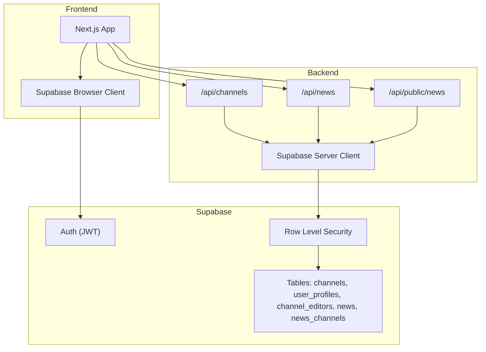
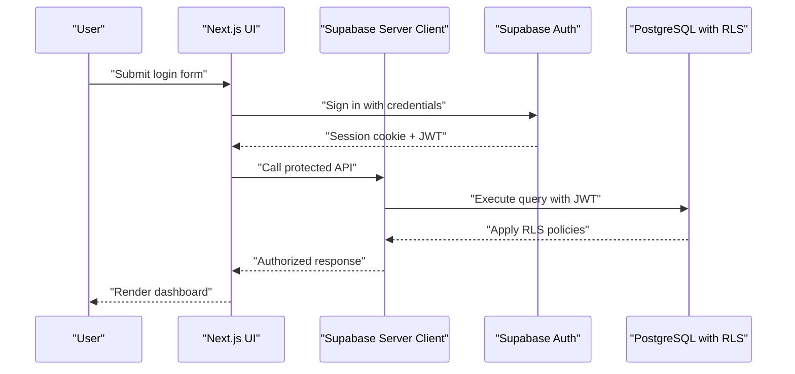
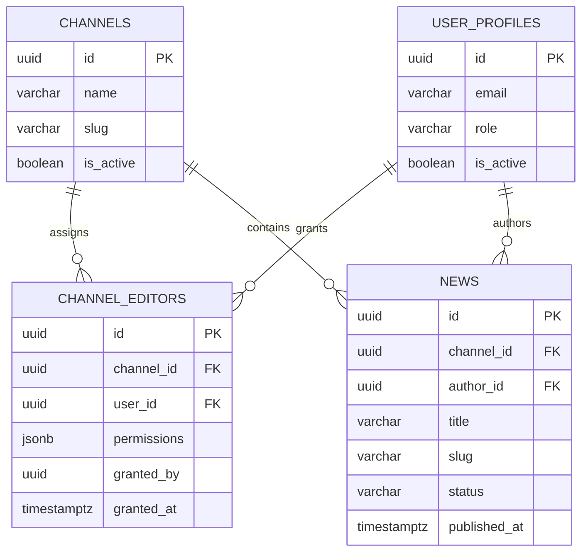
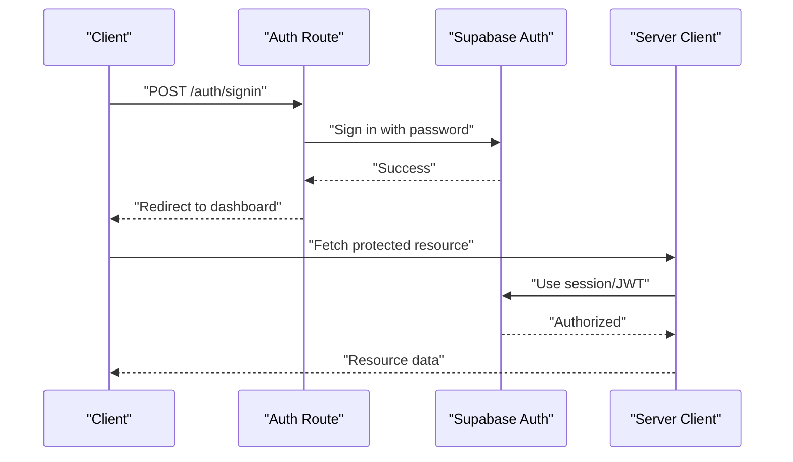
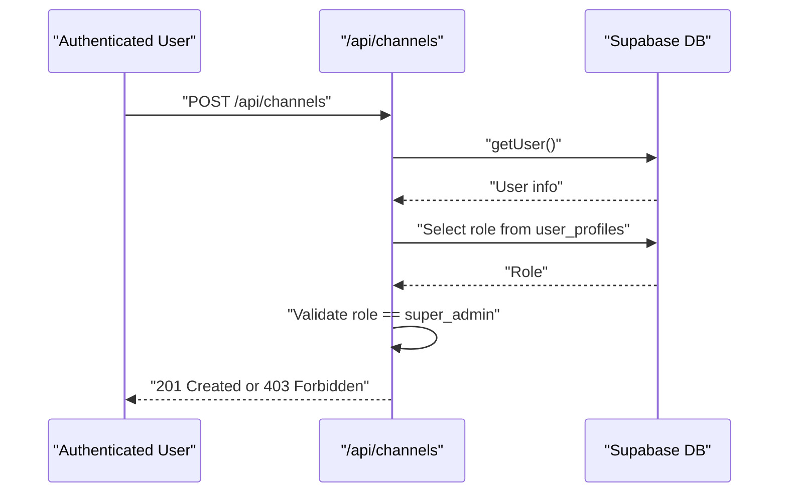
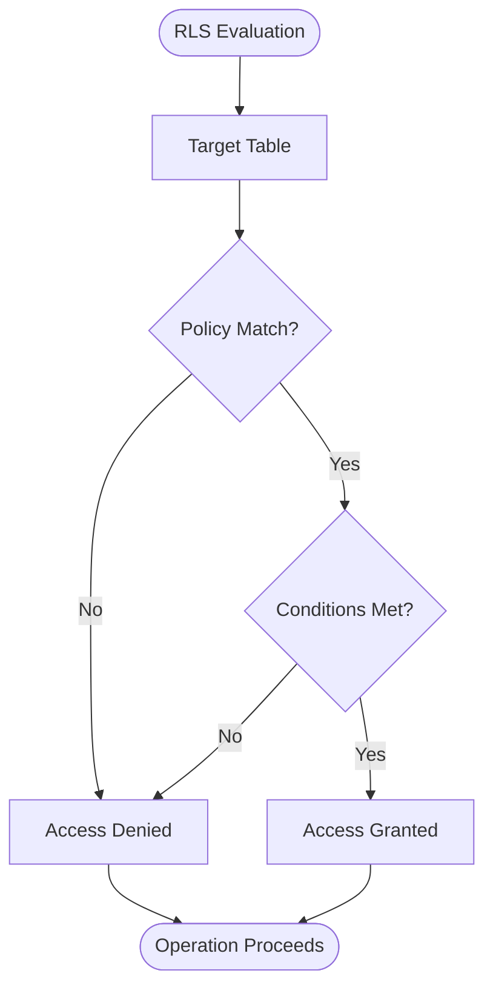
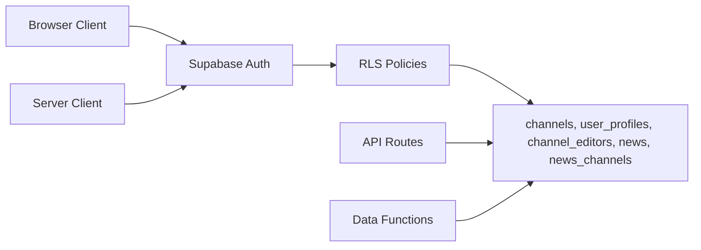

# User Roles and Permissions

<cite>
**Referenced Files in This Document**
- [lib/types.ts](file://lib/types.ts)
- [lib/supabase/server.ts](file://lib/supabase/server.ts)
- [lib/supabase/client.ts](file://lib/supabase/client.ts)
- [lib/data.ts](file://lib/data.ts)
- [app/auth/signin/route.ts](file://app/auth/signin/route.ts)
- [app/auth/signout/route.ts](file://app/auth/signout/route.ts)
- [app/api/channels/route.ts](file://app/api/channels/route.ts)
- [app/api/news/route.ts](file://app/api/news/route.ts)
- [app/api/public/news/route.ts](file://app/api/public/news/route.ts)
- [supabase-schema.sql](file://supabase-schema.sql)
- [fix-rls-policies.sql](file://fix-rls-policies.sql)
</cite>

## Table of Contents
1. [Introduction](#introduction)
2. [Project Structure](#project-structure)
3. [Core Components](#core-components)
4. [Architecture Overview](#architecture-overview)
5. [Detailed Component Analysis](#detailed-component-analysis)
6. [Dependency Analysis](#dependency-analysis)
7. [Performance Considerations](#performance-considerations)
8. [Troubleshooting Guide](#troubleshooting-guide)
9. [Conclusion](#conclusion)
10. [Appendices](#appendices)

## Introduction
This document explains the hierarchical access control system for user roles and permissions. It covers the three-tier role structure, permission matrix, channel editor assignment model, Row Level Security (RLS) enforcement, JWT-based authentication and session management, practical assignment scenarios, and security best practices. It also outlines how administrative actions can be tracked via the system’s data model.

## Project Structure
The roles and permissions system spans frontend and backend components:
- Types define the role model and data structures for channels, editors, and news.
- Supabase client libraries enable secure server-side and browser-side interactions.
- API routes enforce role-based access checks for sensitive operations.
- Supabase RLS policies enforce row-level access controls on all relevant tables.
- Public APIs expose read-only content filtered by published status.

**Diagram sources**
- [lib/supabase/client.ts:1-9](file://lib/supabase/client.ts#L1-L9)
- [lib/supabase/server.ts:1-30](file://lib/supabase/server.ts#L1-L30)
- [app/api/channels/route.ts:1-71](file://app/api/channels/route.ts#L1-L71)
- [app/api/news/route.ts:1-58](file://app/api/news/route.ts#L1-L58)
- [app/api/public/news/route.ts:1-54](file://app/api/public/news/route.ts#L1-L54)
- [supabase-schema.sql:147-257](file://supabase-schema.sql#L147-L257)

**Section sources**
- [lib/types.ts:1-62](file://lib/types.ts#L1-L62)
- [lib/supabase/server.ts:1-30](file://lib/supabase/server.ts#L1-L30)
- [lib/supabase/client.ts:1-9](file://lib/supabase/client.ts#L1-L9)
- [app/api/channels/route.ts:1-71](file://app/api/channels/route.ts#L1-L71)
- [app/api/news/route.ts:1-58](file://app/api/news/route.ts#L1-L58)
- [app/api/public/news/route.ts:1-54](file://app/api/public/news/route.ts#L1-L54)
- [supabase-schema.sql:147-257](file://supabase-schema.sql#L147-L257)

## Core Components
- Role model and data structures:
  - Role enumeration defines three tiers: super_admin, admin, editor.
  - ChannelEditor includes granular permissions: can_create, can_edit, can_delete, can_publish.
  - News status supports draft, published, hidden, archived.
- Authentication and session management:
  - Sign-in and sign-out routes integrate with Supabase Auth to issue and revoke sessions.
  - Server and browser clients encapsulate Supabase configuration and cookie handling.
- Permission enforcement:
  - API routes validate roles for privileged operations (e.g., channel creation requires super_admin).
  - Data access functions query channel assignments and related metadata.
- RLS policies:
  - Policies govern visibility and modification of channels, user profiles, channel_editors, news, and news_channels.

**Section sources**
- [lib/types.ts:1-62](file://lib/types.ts#L1-L62)
- [app/auth/signin/route.ts:1-31](file://app/auth/signin/route.ts#L1-L31)
- [app/auth/signout/route.ts:1-14](file://app/auth/signout/route.ts#L1-L14)
- [lib/supabase/server.ts:1-30](file://lib/supabase/server.ts#L1-L30)
- [lib/supabase/client.ts:1-9](file://lib/supabase/client.ts#L1-L9)
- [lib/data.ts:1-213](file://lib/data.ts#L1-L213)
- [supabase-schema.sql:147-257](file://supabase-schema.sql#L147-L257)

## Architecture Overview
The system enforces a layered access control model:
- Application-level checks in API routes validate user roles for sensitive operations.
- Database-level RLS policies restrict row access based on user identity and assigned permissions.
- JWT tokens carry authenticated identity to both server and browser clients.

**Diagram sources**
- [app/auth/signin/route.ts:1-31](file://app/auth/signin/route.ts#L1-L31)
- [lib/supabase/server.ts:1-30](file://lib/supabase/server.ts#L1-L30)
- [supabase-schema.sql:147-257](file://supabase-schema.sql#L147-L257)

## Detailed Component Analysis

### Role Model and Permission Matrix
- Roles:
  - super_admin: Full system access, including managing channels and user profiles.
  - admin: Channel-specific management for content creation and publication.
  - editor: Content creation and editing limited to assigned channels.
- ChannelEditor permissions:
  - can_create, can_edit, can_delete, can_publish control granular capabilities per channel.
- Permission matrix summary:
  - super_admin: All operations across channels and profiles.
  - admin: Create/edit/publish within assigned channels; limited profile management.
  - editor: Create drafts; edit own content; limited to assigned channels.

**Section sources**
- [lib/types.ts:1-62](file://lib/types.ts#L1-L62)
- [supabase-schema.sql:76-85](file://supabase-schema.sql#L76-L85)

### Channel Editor Assignment and Inheritance
- Assignment mechanism:
  - channel_editors table links users to channels with JSONB permissions.
  - Super_admin can manage channel editors and grant permissions.
- Permission inheritance:
  - Access to a news item derives from either authorship or channel_editor permissions for that item’s channel.
  - Editing and publishing rights depend on the can_edit and can_publish flags respectively.

**Diagram sources**
- [supabase-schema.sql:4-112](file://supabase-schema.sql#L4-L112)
- [lib/types.ts:26-38](file://lib/types.ts#L26-L38)

**Section sources**
- [supabase-schema.sql:76-85](file://supabase-schema.sql#L76-L85)
- [lib/types.ts:26-38](file://lib/types.ts#L26-L38)

### JWT Token-Based Authentication and Session Management
- Login flow:
  - Credentials validated by Supabase Auth; successful login sets a session cookie and returns a JWT.
- Session persistence:
  - Server client reads and writes cookies to maintain session state across requests.
- Logout:
  - Session is terminated server-side; client is redirected to the login page.

**Diagram sources**
- [app/auth/signin/route.ts:1-31](file://app/auth/signin/route.ts#L1-L31)
- [lib/supabase/server.ts:1-30](file://lib/supabase/server.ts#L1-L30)

**Section sources**
- [app/auth/signin/route.ts:1-31](file://app/auth/signin/route.ts#L1-L31)
- [app/auth/signout/route.ts:1-14](file://app/auth/signout/route.ts#L1-L14)
- [lib/supabase/server.ts:1-30](file://lib/supabase/server.ts#L1-L30)
- [lib/supabase/client.ts:1-9](file://lib/supabase/client.ts#L1-L9)

### API-Level Authorization Examples
- Channel creation:
  - Requires authenticated user and super_admin role.
- News creation:
  - Requires authenticated user; inserts a draft article authored by the current user.
- Public news feed:
  - Returns published articles; filters by optional channel slug.

**Diagram sources**
- [app/api/channels/route.ts:26-44](file://app/api/channels/route.ts#L26-L44)

**Section sources**
- [app/api/channels/route.ts:1-71](file://app/api/channels/route.ts#L1-L71)
- [app/api/news/route.ts:1-58](file://app/api/news/route.ts#L1-L58)
- [app/api/public/news/route.ts:1-54](file://app/api/public/news/route.ts#L1-L54)

### Row Level Security (RLS) Policies
- Channels:
  - Selectable by everyone when active.
  - All operations allowed for super_admin.
- User profiles:
  - Selectable by everyone; self-update allowed; super_admin can manage all.
- Channel editors:
  - Selectable by everyone; super_admin can manage assignments.
- News:
  - Published articles visible to everyone.
  - Authors and editors can view and manage content within assigned channels; editing requires can_edit; publishing requires can_publish.
- News channels:
  - Selectable by everyone; editors can manage cross-channel publishing via news ownership.

**Diagram sources**
- [supabase-schema.sql:154-257](file://supabase-schema.sql#L154-L257)

**Section sources**
- [supabase-schema.sql:147-257](file://supabase-schema.sql#L147-L257)
- [fix-rls-policies.sql:62-123](file://fix-rls-policies.sql#L62-L123)

### Practical Role Assignment Scenarios and Inheritance Patterns
- Scenario 1: Assign an editor to a channel with publish rights
  - Super_admin inserts a record into channel_editors with can_publish enabled.
  - The editor can then publish articles to that channel.
- Scenario 2: Restrict delete rights for a collaborator
  - Super_admin grants can_delete=false while keeping can_edit=true.
  - The collaborator can edit but not delete articles.
- Scenario 3: Admin manages multiple channels
  - Super_admin assigns admin role at the user_profiles level.
  - Admin can manage channels and content within assigned scopes.
- Inheritance pattern:
  - Access to a news item is granted if the user is the author OR assigned as an editor to the item’s channel with appropriate permissions.

**Section sources**
- [supabase-schema.sql:76-85](file://supabase-schema.sql#L76-L85)
- [supabase-schema.sql:231-241](file://supabase-schema.sql#L231-L241)

### Audit Trail and Activity Tracking
- Built-in timestamps:
  - user_profiles, channels, news, news_channels include created_at and updated_at fields.
- Session and grant provenance:
  - channel_editors records include granted_by and granted_at for tracking who assigned permissions and when.
- Recommendations:
  - Log administrative actions at the application level (e.g., insert/update/delete logs) to capture intent and context beyond database timestamps.
  - Use database triggers or application-level auditing to record role changes and permission modifications.

**Section sources**
- [supabase-schema.sql:17-28](file://supabase-schema.sql#L17-L28)
- [supabase-schema.sql:4-15](file://supabase-schema.sql#L4-L15)
- [supabase-schema.sql:86-103](file://supabase-schema.sql#L86-L103)
- [supabase-schema.sql:105-112](file://supabase-schema.sql#L105-L112)
- [supabase-schema.sql:76-85](file://supabase-schema.sql#L76-L85)

## Dependency Analysis
- Role enforcement depends on:
  - Supabase Auth for identity and JWT.
  - Supabase RLS for database-level access control.
  - Application routes for higher-level policy checks (e.g., super_admin-only endpoints).
- Data access functions depend on:
  - channel_editors joins for determining editor permissions.
  - user_profiles for role and metadata.
  - news and news_channels for content and multi-channel publishing.

**Diagram sources**
- [supabase-schema.sql:147-257](file://supabase-schema.sql#L147-L257)
- [app/api/channels/route.ts:30-44](file://app/api/channels/route.ts#L30-L44)
- [lib/data.ts:20-64](file://lib/data.ts#L20-L64)

**Section sources**
- [app/api/channels/route.ts:1-71](file://app/api/channels/route.ts#L1-L71)
- [lib/data.ts:1-213](file://lib/data.ts#L1-L213)
- [supabase-schema.sql:147-257](file://supabase-schema.sql#L147-L257)

## Performance Considerations
- Indexes:
  - Channels: slug, is_active.
  - User profiles: email, role.
  - Channel editors: channel_id, user_id.
  - News: channel_id, author_id, status, published_at.
  - News channels: news_id, channel_id.
- Recommendations:
  - Keep permission queries selective using indexed columns.
  - Avoid N+1 queries by using joins and pre-fetching related data.
  - Cache frequently accessed channel lists and user channel memberships where appropriate.

**Section sources**
- [supabase-schema.sql:114-126](file://supabase-schema.sql#L114-L126)

## Troubleshooting Guide
- Unauthorized or forbidden responses:
  - Verify user is authenticated and has the required role.
  - Confirm RLS policies allow the operation for the current user.
- Permission denied errors:
  - Check channel_editors permissions for can_edit and can_publish flags.
  - Ensure the user is assigned to the correct channel for the target news item.
- Session issues:
  - Confirm cookies are readable/writable by the server client.
  - Re-authenticate if the session is invalid or expired.

**Section sources**
- [app/api/channels/route.ts:30-44](file://app/api/channels/route.ts#L30-L44)
- [supabase-schema.sql:231-241](file://supabase-schema.sql#L231-L241)
- [lib/supabase/server.ts:1-30](file://lib/supabase/server.ts#L1-L30)

## Conclusion
The system combines explicit role-based authorization at the application layer with robust database-level RLS to enforce fine-grained access control. The three-tier role structure, combined with channel editor assignments and granular permissions, enables scalable content management. JWT-based authentication and Supabase session handling provide secure identity management. By leveraging built-in timestamps and grant provenance, administrators can track changes and maintain accountability.

## Appendices

### Permission Matrix Reference
- super_admin
  - Channels: create, update, delete
  - User profiles: view, update, delete
  - Channel editors: manage assignments
  - News: create, edit, delete, publish
- admin
  - Channels: manage assigned channels
  - News: create, edit, publish within assigned channels
  - Profile management: limited (as per policy)
- editor
  - News: create drafts, edit own content within assigned channels
  - Publishing: allowed only if can_publish is true for the assigned channel

**Section sources**
- [lib/types.ts:1-62](file://lib/types.ts#L1-L62)
- [supabase-schema.sql:159-171](file://supabase-schema.sql#L159-L171)
- [supabase-schema.sql:231-241](file://supabase-schema.sql#L231-L241)