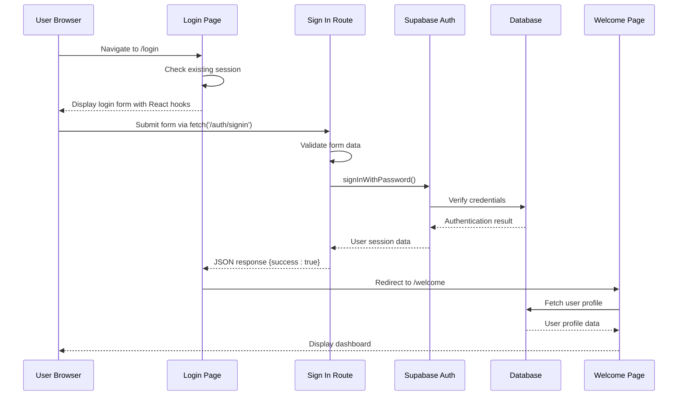
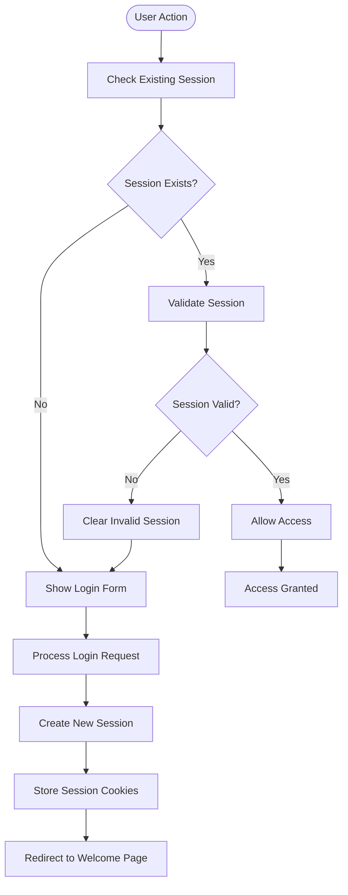
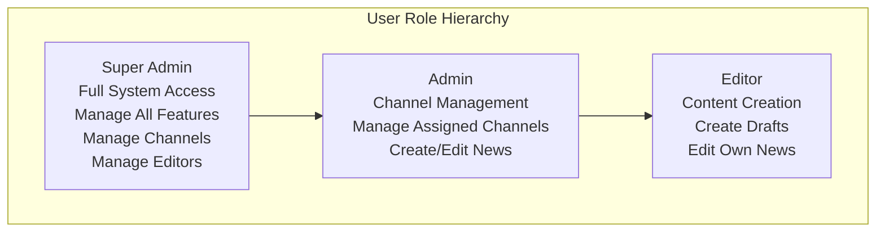
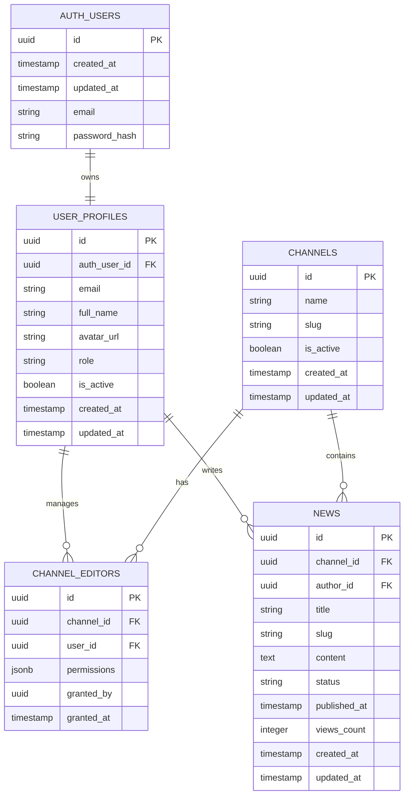
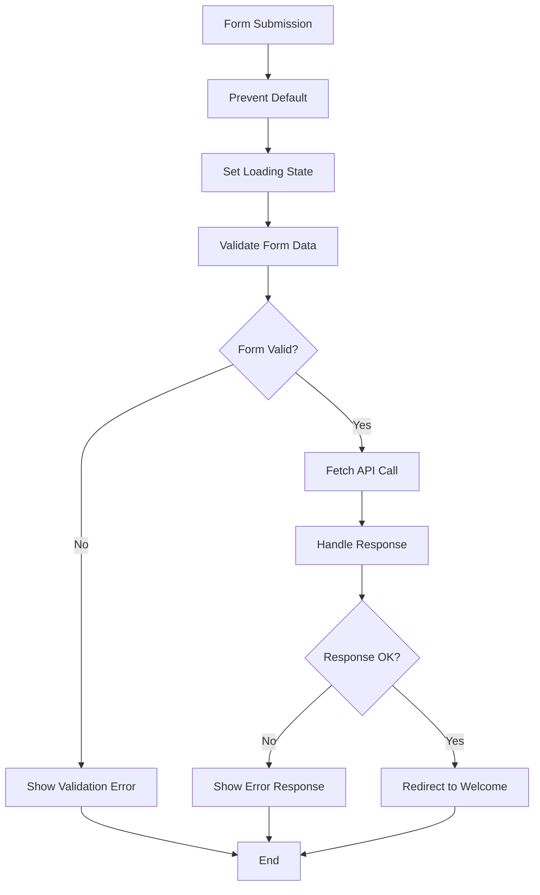
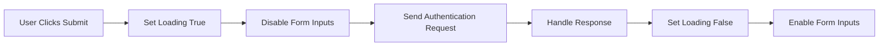
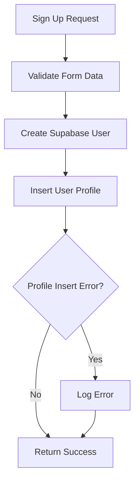

# Authentication System

<cite>
**Referenced Files in This Document**
- [app/auth/signin/route.ts](file://app/auth/signin/route.ts)
- [app/auth/signup/route.ts](file://app/auth/signup/route.ts)
- [app/auth/signout/route.ts](file://app/auth/signout/route.ts)
- [app/(auth)/login/page.tsx](file://app/(auth)/login/page.tsx)
- [app/(auth)/register/page.tsx](file://app/(auth)/register/page.tsx)
- [app/(dashboard)/welcome/page.tsx](file://app/(dashboard)/welcome/page.tsx)
- [app/(dashboard)/dashboard/layout.tsx](file://app/(dashboard)/dashboard/layout.tsx)
- [lib/supabase/server.ts](file://lib/supabase/server.ts)
- [lib/supabase/client.ts](file://lib/supabase/client.ts)
- [lib/types.ts](file://lib/types.ts)
- [supabase-schema.sql](file://supabase-schema.sql)
- [ARCHITECTURE.md](file://ARCHITECTURE.md)
</cite>

## Update Summary
**Changes Made**
- Updated authentication flow to reflect client-side form handling with React hooks
- Modified authentication routes to return JSON responses instead of redirects
- Updated client components to use fetch API for form submission
- Enhanced error handling with real-time validation and loading states
- Updated manual user profile creation in backend routes with JSON responses
- Revised authentication architecture to show client-server interaction via fetch

## Table of Contents
1. [Introduction](#introduction)
2. [System Architecture](#system-architecture)
3. [Authentication Flow](#authentication-flow)
4. [Core Components](#core-components)
5. [Security Implementation](#security-implementation)
6. [User Roles and Permissions](#user-roles-and-permissions)
7. [Database Schema](#database-schema)
8. [Client-Side Form Handling](#client-side-form-handling)
9. [JSON Response Handling](#json-response-handling)
10. [Real-Time Validation and Loading States](#real-time-validation-and-loading-states)
11. [Manual User Profile Creation](#manual-user-profile-creation)
12. [Troubleshooting Guide](#troubleshooting-guide)
13. [Conclusion](#conclusion)

## Introduction

The authentication system in this Next.js blog application is built on top of Supabase Auth, providing secure user registration, login, and session management capabilities. The system follows modern authentication best practices with server-side session handling, role-based access control, and comprehensive error management.

The application implements a multi-layered authentication approach where user credentials are validated against Supabase's authentication service, and user roles are managed through a dedicated user profiles table with automatic provisioning during account creation. Recent enhancements have significantly improved the error handling system, providing users with clear feedback and better troubleshooting capabilities.

**Updated** The system now features client-side form handling with React hooks, real-time validation, and loading states for improved user experience.

## System Architecture

The authentication system follows a client-server architecture pattern with clear separation of concerns between frontend presentation, backend API routes, and database operations. The system now uses client-side form handling with fetch API for improved responsiveness.

```mermaid
graph TB
subgraph "Client Layer"
LoginPage[Login Page<br/>(React Client Component)]
RegisterPage[Register Page<br/>(React Client Component)]
Dashboard[Dashboard]
WelcomePage[Welcome Page]
end
subgraph "API Layer"
SignInRoute[Sign In Route<br/>(JSON Response)]
SignUpRoute[Sign Up Route<br/>(JSON Response)]
SignOutRoute[Sign Out Route<br/>(Redirect)]
end
subgraph "Supabase Integration"
SupabaseServer[Supabase Server Client]
SupabaseAuth[Supabase Auth Service]
SupabaseCookies[Cookie Management]
end
subgraph "Database Layer"
UserProfiles[User Profiles Table<br/>(Trigger-based)]
AuthUsers[Auth Users Table]
Channels[Channels Table]
News[News Table]
end
LoginPage --> SignInRoute
RegisterPage --> SignUpRoute
SignInRoute --> SupabaseServer
SignUpRoute --> SupabaseServer
SignOutRoute --> SupabaseServer
SupabaseServer --> SupabaseAuth
SupabaseServer --> SupabaseCookies
SupabaseAuth --> AuthUsers
SupabaseServer --> UserProfiles
UserProfiles --> Channels
UserProfiles --> News
```

**Diagram sources**
- [app/(auth)/login/page.tsx:1-116](file://app/(auth)/login/page.tsx#L1-L116)
- [app/(auth)/register/page.tsx:1-117](file://app/(auth)/register/page.tsx#L1-L117)
- [app/auth/signin/route.ts:1-44](file://app/auth/signin/route.ts#L1-L44)
- [app/auth/signup/route.ts:1-65](file://app/auth/signup/route.ts#L1-L65)

## Authentication Flow

The authentication process follows a well-defined sequence that ensures security and user experience optimization, with enhanced error handling and real-time feedback throughout the flow.



**Diagram sources**
- [app/(auth)/login/page.tsx:11-37](file://app/(auth)/login/page.tsx#L11-L37)
- [app/auth/signin/route.ts:4-44](file://app/auth/signin/route.ts#L4-L44)
- [app/(dashboard)/welcome/page.tsx:1-59](file://app/(dashboard)/welcome/page.tsx#L1-L59)

**Section sources**
- [app/(auth)/login/page.tsx:1-116](file://app/(auth)/login/page.tsx#L1-L116)
- [app/auth/signin/route.ts:1-44](file://app/auth/signin/route.ts#L1-L44)

## Core Components

### Authentication Routes

The system implements three primary authentication routes that handle user lifecycle management with JSON responses instead of redirects:

#### Sign In Route
The sign-in endpoint processes user credentials and establishes authenticated sessions with comprehensive error handling, returning JSON responses for client-side processing.

**Updated** Enhanced with improved error detection and standardized JSON error responses

**Section sources**
- [app/auth/signin/route.ts:1-44](file://app/auth/signin/route.ts#L1-L44)

#### Sign Up Route
The sign-up endpoint creates new user accounts and initializes user profiles with robust error handling and JSON responses for client-side processing.

**Updated** Enhanced with manual user profile creation and JSON response handling

**Section sources**
- [app/auth/signup/route.ts:1-65](file://app/auth/signup/route.ts#L1-L65)

#### Sign Out Route
The sign-out endpoint terminates user sessions and redirects to the login page with proper error handling.

**Section sources**
- [app/auth/signout/route.ts:1-14](file://app/auth/signout/route.ts#L1-L14)

### Supabase Client Configuration

The system uses specialized client configurations for different environments:

#### Server-Side Client
Configured for server component usage with cookie persistence and enhanced error handling.

**Section sources**
- [lib/supabase/server.ts:1-30](file://lib/supabase/server.ts#L1-L30)

#### Browser-Side Client
Configured for client-side operations with public environment variables.

**Section sources**
- [lib/supabase/client.ts:1-9](file://lib/supabase/client.ts#L1-L9)

### Authentication Pages

The frontend authentication interface consists of three main pages with enhanced error display capabilities and real-time feedback:

#### Login Page
Provides user authentication interface with React hooks, form validation, error handling, and dynamic error message display with loading states.

**Updated** Enhanced with client-side form handling, real-time validation, and loading states

**Section sources**
- [app/(auth)/login/page.tsx:1-116](file://app/(auth)/login/page.tsx#L1-L116)

#### Registration Page
Handles new user account creation with React hooks, validation, redirect logic, and comprehensive error feedback with loading states.

**Updated** Enhanced with client-side form handling, real-time validation, and loading states

**Section sources**
- [app/(auth)/register/page.tsx:1-117](file://app/(auth)/register/page.tsx#L1-L117)

#### Welcome Page
Displays user information and provides navigation to the dashboard after successful authentication.

**Section sources**
- [app/(dashboard)/welcome/page.tsx:1-59](file://app/(dashboard)/welcome/page.tsx#L1-L59)

## Security Implementation

The authentication system implements multiple layers of security to protect user data and maintain system integrity.

### Session Management

The system uses Supabase's built-in session management with automatic cookie handling and token refresh mechanisms.



**Diagram sources**
- [app/(auth)/login/page.tsx:8-12](file://app/(auth)/login/page.tsx#L8-L12)
- [app/(dashboard)/dashboard/layout.tsx:11-15](file://app/(dashboard)/dashboard/layout.tsx#L11-L15)

### Role-Based Access Control

The system implements hierarchical role-based access control with automatic role assignment for new users.

**Section sources**
- [lib/types.ts:1-12](file://lib/types.ts#L1-L12)
- [supabase-schema.sql:24](file://supabase-schema.sql#L24)

## User Roles and Permissions

The authentication system supports three distinct user roles with progressively increasing privileges:



**Diagram sources**
- [ARCHITECTURE.md:297-315](file://ARCHITECTURE.md#L297-L315)
- [lib/types.ts:1](file://lib/types.ts#L1)

### Automatic Role Assignment

The system automatically assigns roles during user registration:
- First user receives super_admin role
- Subsequent users receive editor role by default

**Section sources**
- [supabase-schema.sql:53-74](file://supabase-schema.sql#L53-L74)

## Database Schema

The authentication system relies on a well-structured database schema with proper relationships and constraints.



**Diagram sources**
- [supabase-schema.sql:4-28](file://supabase-schema.sql#L4-L28)
- [supabase-schema.sql:76-85](file://supabase-schema.sql#L76-L85)
- [supabase-schema.sql:87-103](file://supabase-schema.sql#L87-L103)

**Section sources**
- [supabase-schema.sql:17-28](file://supabase-schema.sql#L17-L28)
- [supabase-schema.sql:76-85](file://supabase-schema.sql#L76-L85)
- [supabase-schema.sql:87-103](file://supabase-schema.sql#L87-L103)

## Client-Side Form Handling

The authentication system now implements client-side form handling using React hooks for improved user experience and real-time validation.

### React Hook Implementation

Both login and registration pages use React's useState hook for state management and Next.js router for navigation:



**Diagram sources**
- [app/(auth)/login/page.tsx:11-37](file://app/(auth)/login/page.tsx#L11-L37)
- [app/(auth)/register/page.tsx:11-37](file://app/(auth)/register/page.tsx#L11-L37)

### Form Submission Flow

The client components use fetch API to submit forms directly to authentication routes:

**Section sources**
- [app/(auth)/login/page.tsx:20-36](file://app/(auth)/login/page.tsx#L20-L36)
- [app/(auth)/register/page.tsx:20-36](file://app/(auth)/register/page.tsx#L20-L36)

## JSON Response Handling

The authentication routes now return JSON responses instead of performing redirects, enabling client-side navigation and error handling.

### Response Structure

Authentication routes return standardized JSON responses:

| Response Type | Status Code | Response Body | Purpose |
|---------------|-------------|---------------|---------|
| Success | 200 | `{ success: true, message: '...' }` | Successful authentication/registration |
| Validation Error | 400 | `{ error: 'Email и пароль обязательны' }` | Missing form fields |
| Authentication Error | 401 | `{ error: 'Неверные учетные данные' }` | Invalid credentials |
| Server Error | 500 | `{ error: 'Произошла ошибка при входе' }` | Internal server errors |

### Client-Side Response Processing

Client components handle JSON responses with proper error extraction:

**Section sources**
- [app/auth/signin/route.ts:10-35](file://app/auth/signin/route.ts#L10-L35)
- [app/auth/signup/route.ts:10-56](file://app/auth/signup/route.ts#L10-L56)
- [app/(auth)/login/page.tsx:26-31](file://app/(auth)/login/page.tsx#L26-L31)
- [app/(auth)/register/page.tsx:26-31](file://app/(auth)/register/page.tsx#L26-L31)

## Real-Time Validation and Loading States

The client-side implementation provides real-time validation and loading states for enhanced user experience.

### State Management

Both login and registration pages use React state for:
- Error messages: `useState<string | null>(null)`
- Loading states: `useState(false)`
- Form data capture

### Loading State Implementation

Loading states are managed through button disabling and dynamic text:



**Diagram sources**
- [app/(auth)/login/page.tsx:13-36](file://app/(auth)/login/page.tsx#L13-L36)
- [app/(auth)/register/page.tsx:13-36](file://app/(auth)/register/page.tsx#L13-L36)

### Error Display Mechanisms

Error messages are displayed in real-time with styled containers:

**Section sources**
- [app/(auth)/login/page.tsx:49-53](file://app/(auth)/login/page.tsx#L49-L53)
- [app/(auth)/register/page.tsx:49-53](file://app/(auth)/register/page.tsx#L49-L53)

## Manual User Profile Creation

The sign-up route now includes manual user profile creation in addition to Supabase's automatic trigger-based creation.

### Profile Creation Logic

The sign-up route performs both Supabase authentication and manual database insertion:



**Diagram sources**
- [app/auth/signup/route.ts:32-50](file://app/auth/signup/route.ts#L32-L50)

### Profile Structure

Manually created profiles include essential user information:

**Section sources**
- [app/auth/signup/route.ts:34-49](file://app/auth/signup/route.ts#L34-L49)
- [supabase-schema.sql:19-28](file://supabase-schema.sql#L19-L28)

## Troubleshooting Guide

### Common Authentication Issues

#### Client-Side Form Handling Issues
- **Symptoms**: Forms don't submit, no error messages appear
- **Causes**: React hooks not properly configured, fetch API errors
- **Solutions**: Verify React client component setup, check network tab for API errors
- **Error Messages**: JSON parsing errors, network timeouts

#### JSON Response Handling Problems
- **Symptoms**: Success responses not handled, navigation not triggered
- **Causes**: Incorrect response status handling, JSON parsing errors
- **Solutions**: Verify response.ok checks, ensure proper JSON parsing
- **Error Messages**: `Произошла ошибка при входе`, `Ошибка регистрации`

#### Loading State Issues
- **Symptoms**: Buttons stay disabled, no visual feedback
- **Causes**: State not properly reset, finally block not executed
- **Solutions**: Ensure loading state is reset in finally blocks
- **Error Messages**: None (visual feedback issues)

#### Session Management Issues
- **Symptoms**: Logged out unexpectedly, session not persisting
- **Causes**: Cookie restrictions, browser privacy settings, server configuration
- **Solutions**: Enable third-party cookies, check browser settings, verify server configuration
- **Error Messages**: `inactive`

#### Role Access Problems
- **Symptoms**: Insufficient permissions for requested action
- **Causes**: User role restrictions, permission misconfiguration
- **Solutions**: Verify user role, check permission settings, contact administrator

**Section sources**
- [app/(dashboard)/dashboard/layout.tsx:23-26](file://app/(dashboard)/dashboard/layout.tsx#L23-L26)
- [app/(dashboard)/welcome/page.tsx:9-11](file://app/(dashboard)/welcome/page.tsx#L9-L11)

## Conclusion

The authentication system provides a robust, scalable foundation for user management in the blog application. Its implementation leverages Supabase's proven authentication infrastructure while adding custom role-based access control, comprehensive error handling, and enhanced user feedback mechanisms.

**Updated** Key improvements include client-side form handling with React hooks, real-time validation, loading states, and JSON response handling for better user experience and more responsive authentication flows.

Key strengths of the system include:
- Secure session management with automatic cookie handling
- Hierarchical role-based access control with automatic role assignment
- Comprehensive error handling and user feedback mechanisms with JSON responses
- Clean separation of concerns between frontend and backend components
- Extensible architecture supporting future authentication enhancements
- Real-time validation and loading states for improved user experience
- Client-side form handling with React hooks for better responsiveness
- Manual user profile creation for enhanced control over user initialization
- Standardized JSON response patterns across all authentication endpoints

The system successfully balances security requirements with user experience, providing reliable authentication services essential for content management workflows. The recent migration to client-side form handling significantly improves user experience by providing immediate feedback, real-time validation, and responsive form interactions while maintaining robust security and error handling capabilities.