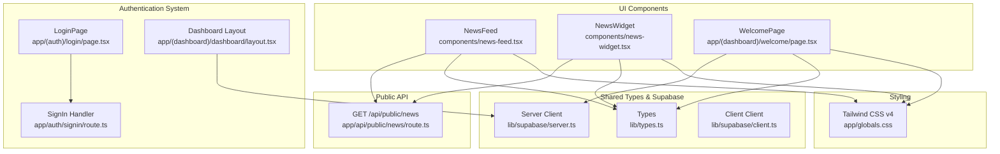
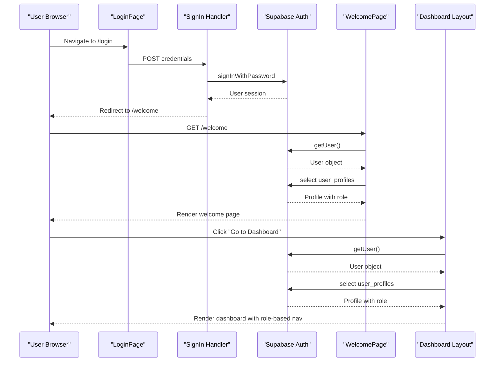
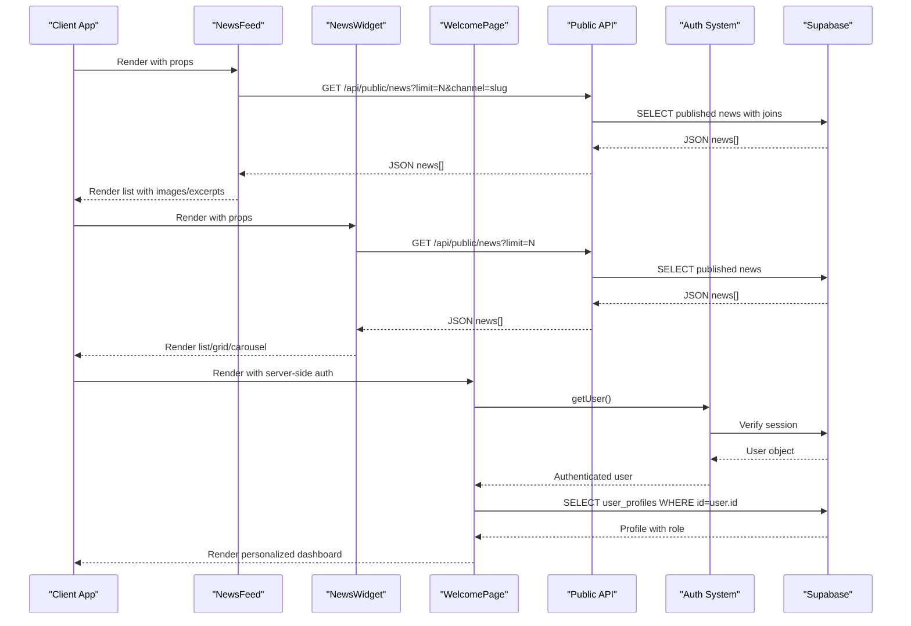
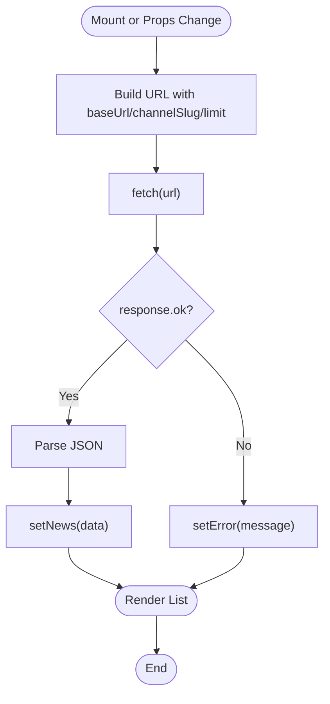
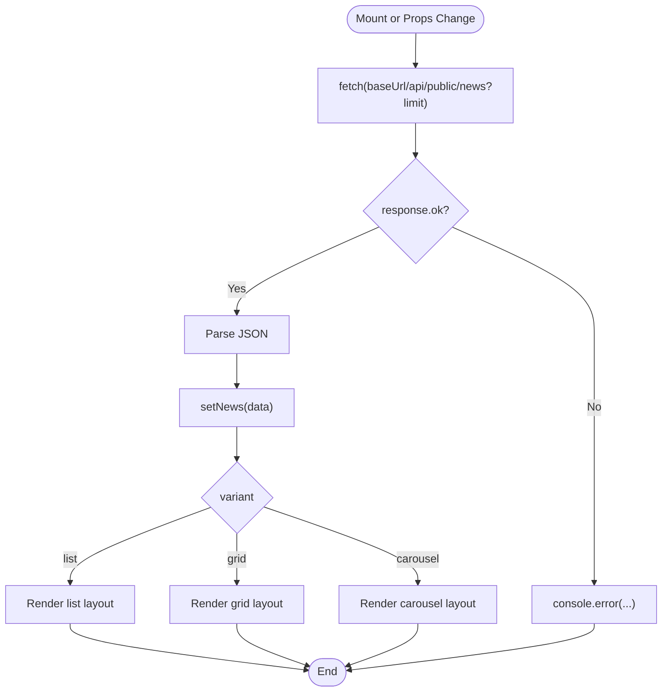
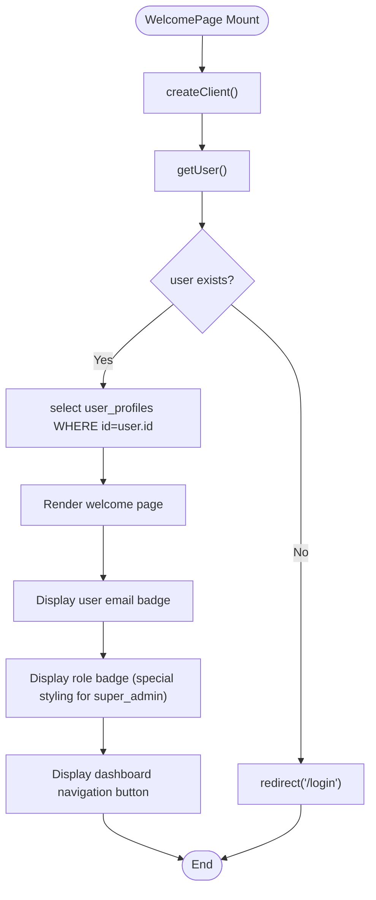
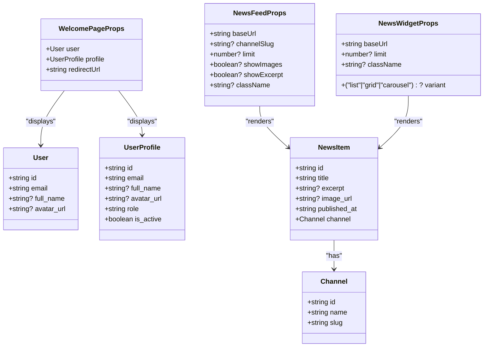
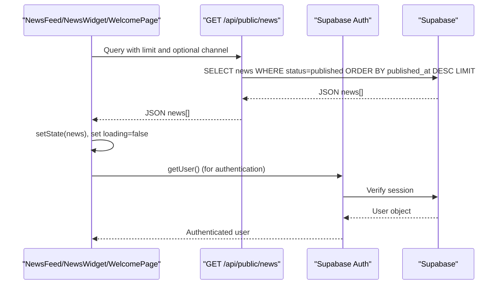
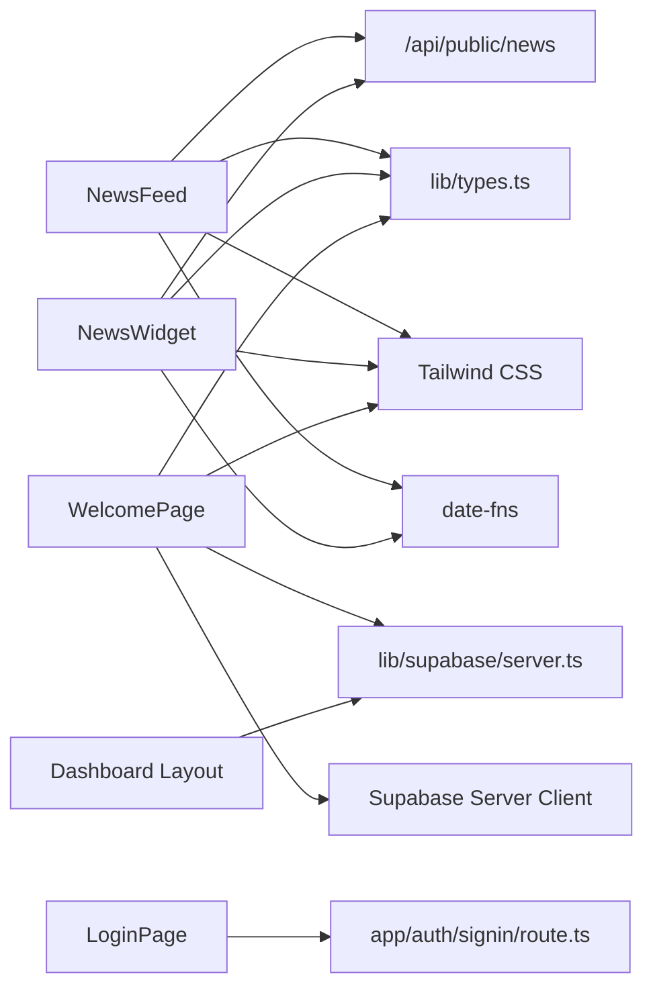

# Component Architecture

<cite>
**Referenced Files in This Document**
- [news-feed.tsx](file://components/news-feed.tsx)
- [news-widget.tsx](file://components/news-widget.tsx)
- [types.ts](file://lib/types.ts)
- [data.ts](file://lib/data.ts)
- [route.ts](file://app/api/public/news/route.ts)
- [page.tsx](file://app/(dashboard)/welcome/page.tsx)
- [layout.tsx](file://app/(dashboard)/dashboard/layout.tsx)
- [page.tsx](file://app/(dashboard)/dashboard/page.tsx)
- [page.tsx](file://app/(auth)/login/page.tsx)
- [route.ts](file://app/auth/signin/route.ts)
- [server.ts](file://lib/supabase/server.ts)
- [client.ts](file://lib/supabase/client.ts)
- [globals.css](file://app/globals.css)
- [package.json](file://package.json)
- [README.md](file://README.md)
- [ARCHITECTURE.md](file://ARCHITECTURE.md)
</cite>

## Update Summary
**Changes Made**
- Added documentation for the new WelcomePage component (app/(dashboard)/welcome/page.tsx)
- Enhanced authentication flow documentation with server-side session verification
- Updated dashboard navigation patterns and role-based access control
- Added comprehensive authentication component analysis
- Expanded component composition patterns to include authentication flows

## Table of Contents
1. [Introduction](#introduction)
2. [Project Structure](#project-structure)
3. [Core Components](#core-components)
4. [Authentication System](#authentication-system)
5. [Architecture Overview](#architecture-overview)
6. [Detailed Component Analysis](#detailed-component-analysis)
7. [Dependency Analysis](#dependency-analysis)
8. [Performance Considerations](#performance-considerations)
9. [Troubleshooting Guide](#troubleshooting-guide)
10. [Conclusion](#conclusion)
11. [Appendices](#appendices)

## Introduction
This document explains the React component architecture for reusable UI components focused on displaying news feeds and widgets, along with a comprehensive authentication system. It covers the NewsFeed and NewsWidget components, their props, TypeScript interfaces, lifecycle, data fetching, styling, and integration patterns across Next.js pages, external websites, and third-party frameworks. The documentation now includes the new WelcomePage component that provides personalized user dashboard experience with server-side authentication verification, role-based information display, and seamless navigation to the main dashboard.

## Project Structure
The components live under the components directory and integrate with a public API layer, shared types, and a robust authentication system. Styling relies on Tailwind CSS v4 configured globally.

**Diagram sources**
- [news-feed.tsx:1-152](file://components/news-feed.tsx#L1-L152)
- [news-widget.tsx:1-149](file://components/news-widget.tsx#L1-L149)
- [page.tsx:1-59](file://app/(dashboard)/welcome/page.tsx#L1-L59)
- [page.tsx:1-80](file://app/(auth)/login/page.tsx#L1-L80)
- [route.ts:1-31](file://app/auth/signin/route.ts#L1-L31)
- [layout.tsx:1-91](file://app/(dashboard)/dashboard/layout.tsx#L1-L91)
- [route.ts:1-54](file://app/api/public/news/route.ts#L1-L54)
- [types.ts:1-62](file://lib/types.ts#L1-L62)
- [server.ts:1-30](file://lib/supabase/server.ts#L1-L30)
- [client.ts:1-9](file://lib/supabase/client.ts#L1-L9)
- [globals.css:1-27](file://app/globals.css#L1-L27)

**Section sources**
- [news-feed.tsx:1-152](file://components/news-feed.tsx#L1-L152)
- [news-widget.tsx:1-149](file://components/news-widget.tsx#L1-L149)
- [page.tsx:1-59](file://app/(dashboard)/welcome/page.tsx#L1-L59)
- [page.tsx:1-80](file://app/(auth)/login/page.tsx#L1-L80)
- [route.ts:1-31](file://app/auth/signin/route.ts#L1-L31)
- [layout.tsx:1-91](file://app/(dashboard)/dashboard/layout.tsx#L1-L91)
- [route.ts:1-54](file://app/api/public/news/route.ts#L1-L54)
- [types.ts:1-62](file://lib/types.ts#L1-L62)
- [server.ts:1-30](file://lib/supabase/server.ts#L1-L30)
- [client.ts:1-9](file://lib/supabase/client.ts#L1-L9)
- [globals.css:1-27](file://app/globals.css#L1-L27)

## Core Components
- NewsFeed: A full-width feed of news items with optional images and excerpts, configurable via props and styled with Tailwind.
- NewsWidget: A compact sidebar widget with list, grid, and carousel variants, optimized for small screens and quick integration.
- WelcomePage: A personalized user dashboard welcome component with server-side authentication verification and role-based information display.

Key props and behavior:
- NewsFeed props include baseUrl, channelSlug, limit, showImages, showExcerpt, className.
- NewsWidget props include baseUrl, limit, variant, className.
- WelcomePage handles server-side authentication, user profile retrieval, and role-based navigation.
- Both components fetch from the public API endpoint and render loading, empty, and error states.

**Section sources**
- [news-feed.tsx:20-36](file://components/news-feed.tsx#L20-L36)
- [news-widget.tsx:15-27](file://components/news-widget.tsx#L15-L27)
- [page.tsx:4-17](file://app/(dashboard)/welcome/page.tsx#L4-L17)
- [route.ts:4-53](file://app/api/public/news/route.ts#L4-L53)

## Authentication System
The application implements a comprehensive authentication system using Supabase with server-side session verification and role-based access control.

### Authentication Flow
1. **Login Page**: Validates user credentials and redirects authenticated users to welcome page
2. **Welcome Page**: Performs server-side authentication verification and displays user information
3. **Dashboard Layout**: Implements middleware-style authentication checks and role-based navigation
4. **Session Management**: Uses Supabase server client for secure session handling

### Role-Based Access Control
- **super_admin**: Full access to all features, channel management, and editor management
- **admin**: Access to assigned channels, create/edit news functionality
- **editor**: Create drafts and edit own news only

**Diagram sources**
- [page.tsx:5-12](file://app/(auth)/login/page.tsx#L5-L12)
- [route.ts:4-25](file://app/auth/signin/route.ts#L4-L25)
- [page.tsx:4-17](file://app/(dashboard)/welcome/page.tsx#L4-L17)
- [layout.tsx:9-26](file://app/(dashboard)/dashboard/layout.tsx#L9-L26)

**Section sources**
- [page.tsx:1-80](file://app/(auth)/login/page.tsx#L1-L80)
- [route.ts:1-31](file://app/auth/signin/route.ts#L1-L31)
- [page.tsx:1-59](file://app/(dashboard)/welcome/page.tsx#L1-L59)
- [layout.tsx:1-91](file://app/(dashboard)/dashboard/layout.tsx#L1-L91)

## Architecture Overview
The components communicate with the public API layer and authentication system, which queries the database and returns structured news data. The components handle client-side state and rendering with robust server-side authentication verification.

**Diagram sources**
- [news-feed.tsx:41-64](file://components/news-feed.tsx#L41-L64)
- [news-widget.tsx:31-47](file://components/news-widget.tsx#L31-L47)
- [page.tsx:4-17](file://app/(dashboard)/welcome/page.tsx#L4-L17)
- [route.ts:5-53](file://app/api/public/news/route.ts#L5-L53)

## Detailed Component Analysis

### NewsFeed Component
- Purpose: Display a scrollable list of news items with optional images and excerpts.
- Props:
  - baseUrl: Base URL of the news application.
  - channelSlug?: Filter by channel slug.
  - limit?: Number of items to fetch (default 5).
  - showImages?: Whether to render images (default true).
  - showExcerpt?: Whether to render excerpts (default true).
  - className?: Additional Tailwind classes.
- State:
  - news: Array of news items.
  - isLoading: Boolean indicating network activity.
  - error: String or null for error messages.
- Lifecycle:
  - On mount and when props change, fetches data from the public API.
  - Renders loading, error, or empty states before rendering the list.
- Rendering:
  - Uses Tailwind for responsive layout, dark mode support, and hover effects.
  - Links navigate to internal news URLs constructed from baseUrl and item ids.
- Accessibility:
  - Uses semantic headings and links; images include alt text.
- Styling:
  - Responsive flex layout; dark mode variants via Tailwind dark: prefix.

**Diagram sources**
- [news-feed.tsx:41-64](file://components/news-feed.tsx#L41-L64)
- [news-feed.tsx:66-88](file://components/news-feed.tsx#L66-L88)

**Section sources**
- [news-feed.tsx:1-152](file://components/news-feed.tsx#L1-L152)
- [route.ts:4-53](file://app/api/public/news/route.ts#L4-L53)

### NewsWidget Component
- Purpose: Compact sidebar integration with multiple display variants.
- Props:
  - baseUrl: Base URL of the news application.
  - limit?: Number of items to fetch (default 3).
  - variant?: 'list' | 'grid' | 'carousel' (default 'list').
  - className?: Additional Tailwind classes.
- State:
  - news: Array of news items.
  - isLoading: Boolean indicating network activity.
- Lifecycle:
  - On mount and when props change, fetches data from the public API.
  - Renders a skeleton loader while loading.
- Rendering:
  - List variant: Vertical list with optional thumbnails and dates.
  - Grid variant: Responsive grid with hover scaling and transitions.
  - Carousel variant: Not implemented in current code; placeholder remains.
- Styling:
  - Uses Tailwind utilities for spacing, shadows, and responsive grids.

**Diagram sources**
- [news-widget.tsx:31-47](file://components/news-widget.tsx#L31-L47)
- [news-widget.tsx:67-115](file://components/news-widget.tsx#L67-L115)
- [news-widget.tsx:119-147](file://components/news-widget.tsx#L119-L147)

**Section sources**
- [news-widget.tsx:1-149](file://components/news-widget.tsx#L1-L149)
- [route.ts:4-53](file://app/api/public/news/route.ts#L4-L53)

### WelcomePage Component
- Purpose: Provide personalized user dashboard experience with server-side authentication verification and role-based information display.
- Authentication:
  - Performs server-side authentication verification using Supabase server client.
  - Redirects unauthenticated users to login page.
  - Retrieves user profile information from user_profiles table.
- Information Display:
  - Shows user email in green badge.
  - Displays user role in blue badge with special styling for super_admin.
  - Provides direct navigation to main dashboard.
- Navigation:
  - Seamless transition from authentication flow to dashboard experience.
  - Maintains consistent styling with dark mode support.
- Styling:
  - Centered card layout with responsive design.
  - Color-coded badges for different information types.
  - Dark mode compatible with Tailwind dark: variants.

**Diagram sources**
- [page.tsx:4-17](file://app/(dashboard)/welcome/page.tsx#L4-L17)
- [page.tsx:19-54](file://app/(dashboard)/welcome/page.tsx#L19-L54)

**Section sources**
- [page.tsx:1-59](file://app/(dashboard)/welcome/page.tsx#L1-L59)

### Authentication Components

#### LoginPage Component
- Purpose: Handle user authentication with form validation and error handling.
- Features:
  - Form-based authentication using email/password.
  - Redirects authenticated users to welcome page.
  - Input validation and error message handling.
  - Responsive form design with Tailwind styling.
- Integration:
  - Submits to /auth/signin route for processing.
  - Supports dark mode and accessibility features.

#### SignIn Handler
- Purpose: Process authentication requests and manage session creation.
- Features:
  - Extracts form data from request.
  - Validates required fields.
  - Calls Supabase auth service for authentication.
  - Handles authentication errors and redirects.
  - Manages successful authentication redirection.

**Section sources**
- [page.tsx:1-80](file://app/(auth)/login/page.tsx#L1-L80)
- [route.ts:1-31](file://app/auth/signin/route.ts#L1-L31)

### Prop Interfaces and Type Safety
- NewsFeedProps and NewsWidgetProps define the contract for component consumption.
- WelcomePageProps interface includes authentication state and user profile data.
- Shared types (UserProfile, Channel, News, ChannelEditor) are defined in lib/types.ts and used by server-side data utilities in lib/data.ts.
- Authentication types include User and UserProfile interfaces for type safety.

**Diagram sources**
- [news-feed.tsx:20-27](file://components/news-feed.tsx#L20-L27)
- [news-widget.tsx:15-20](file://components/news-widget.tsx#L15-L20)
- [page.tsx:13-17](file://app/(dashboard)/welcome/page.tsx#L13-L17)
- [types.ts:14-24](file://lib/types.ts#L14-L24)

**Section sources**
- [news-feed.tsx:20-27](file://components/news-feed.tsx#L20-L27)
- [news-widget.tsx:15-20](file://components/news-widget.tsx#L15-L20)
- [page.tsx:13-17](file://app/(dashboard)/welcome/page.tsx#L13-L17)
- [types.ts:14-24](file://lib/types.ts#L14-L24)

### Data Fetching and API Integration
- Public API endpoint: GET /api/public/news with query params channel and limit.
- The API selects published news with channel and author joins, returning a JSON array suitable for client components.
- Components handle network errors and empty lists gracefully.
- Authentication system uses Supabase server client for secure database operations.

**Diagram sources**
- [route.ts:5-53](file://app/api/public/news/route.ts#L5-L53)
- [news-feed.tsx:41-64](file://components/news-feed.tsx#L41-L64)
- [news-widget.tsx:31-47](file://components/news-widget.tsx#L31-L47)
- [page.tsx:4-17](file://app/(dashboard)/welcome/page.tsx#L4-L17)

**Section sources**
- [route.ts:1-54](file://app/api/public/news/route.ts#L1-L54)

### Styling, Responsive Design, and Accessibility
- Tailwind CSS v4 is configured globally and used extensively for component styling.
- Dark mode support via Tailwind dark: variants throughout all components.
- Responsive layouts using flex and grid utilities.
- Accessibility considerations:
  - Semantic headings and links.
  - Alt attributes for images.
  - Focus-friendly interactive elements.
  - Proper form labeling and error messaging.
- Color-coded information display for improved user experience.

**Section sources**
- [globals.css:1-27](file://app/globals.css#L1-L27)
- [news-feed.tsx:97-139](file://components/news-feed.tsx#L97-L139)
- [news-widget.tsx:69-147](file://components/news-widget.tsx#L69-L147)
- [page.tsx:20-54](file://app/(dashboard)/welcome/page.tsx#L20-L54)

### Component Composition Patterns
- Both components accept a baseUrl and construct internal navigation links, enabling reuse across domains.
- className allows consumers to inject additional Tailwind classes for branding or layout adjustments.
- Variants in NewsWidget demonstrate composition via conditional rendering blocks.
- Authentication components demonstrate server-side rendering patterns with client-side navigation.
- WelcomePage demonstrates personalized content delivery based on user roles.

**Section sources**
- [news-feed.tsx:118-135](file://components/news-feed.tsx#L118-L135)
- [news-widget.tsx:67-147](file://components/news-widget.tsx#L67-L147)
- [page.tsx:19-54](file://app/(dashboard)/welcome/page.tsx#L19-L54)

### Usage Scenarios and Integration
- Next.js pages: Import components and pass baseUrl, channelSlug, limit, and variant as needed.
- External websites: Use the public API endpoint directly via fetch or include the components in a static site.
- Third-party frameworks: Adapt the API calls and rendering logic to match framework conventions.
- Authentication flows: Implement server-side authentication verification for secure dashboard access.
- Role-based navigation: Customize dashboard navigation based on user roles and permissions.

Examples and patterns are documented in the project's README and ARCHITECTURE files.

**Section sources**
- [README.md:160-198](file://README.md#L160-L198)
- [ARCHITECTURE.md:322-379](file://ARCHITECTURE.md#L322-L379)

## Dependency Analysis
- Components depend on:
  - React hooks for state and side effects.
  - date-fns for localized date formatting.
  - Tailwind CSS for styling.
  - Supabase server client for authentication and database operations.
- API dependency:
  - Public endpoint GET /api/public/news.
  - Authentication endpoints for user management.
- Shared types:
  - lib/types.ts defines data contracts used by server-side utilities.
  - lib/supabase/server.ts provides server-side Supabase client configuration.

**Diagram sources**
- [news-feed.tsx:1-6](file://components/news-feed.tsx#L1-L6)
- [news-widget.tsx:1-6](file://components/news-widget.tsx#L1-L6)
- [page.tsx:1-2](file://app/(dashboard)/welcome/page.tsx#L1-L2)
- [page.tsx:1-3](file://app/(auth)/login/page.tsx#L1-L3)
- [route.ts:1-31](file://app/auth/signin/route.ts#L1-L31)
- [layout.tsx:1-2](file://app/(dashboard)/dashboard/layout.tsx#L1-L2)
- [route.ts:1-54](file://app/api/public/news/route.ts#L1-L54)
- [types.ts:1-62](file://lib/types.ts#L1-L62)
- [server.ts:1-30](file://lib/supabase/server.ts#L1-L30)

**Section sources**
- [package.json:11-27](file://package.json#L11-L27)
- [news-feed.tsx:1-6](file://components/news-feed.tsx#L1-L6)
- [news-widget.tsx:1-6](file://components/news-widget.tsx#L1-L6)
- [page.tsx:1-2](file://app/(dashboard)/welcome/page.tsx#L1-L2)
- [page.tsx:1-3](file://app/(auth)/login/page.tsx#L1-L3)
- [route.ts:1-31](file://app/auth/signin/route.ts#L1-L31)
- [layout.tsx:1-2](file://app/(dashboard)/dashboard/layout.tsx#L1-L2)

## Performance Considerations
- Network requests are triggered on mount and when props change; consider memoizing or debouncing frequent prop changes to reduce unnecessary fetches.
- Limit prop controls payload size; keep reasonable defaults to balance UX and performance.
- Images are lazy-loaded via browser behavior; ensure adequate alt text for accessibility.
- Skeleton loaders in NewsWidget improve perceived performance during initial load.
- Server-side authentication verification reduces client-side computation overhead.
- Role-based navigation prevents unnecessary component rendering for unauthorized users.

## Troubleshooting Guide
Common issues and resolutions:
- Network errors:
  - Verify baseUrl correctness and network connectivity.
  - Check API endpoint availability and query parameters.
- Empty results:
  - Confirm channelSlug exists and news are published.
  - Adjust limit or remove filters.
- Authentication failures:
  - Verify Supabase environment variables are correctly configured.
  - Check user session validity and cookie settings.
  - Ensure user_profiles table has correct role assignments.
- Styling inconsistencies:
  - Ensure Tailwind is properly configured and className overrides are compatible.
  - Verify dark mode preferences and Tailwind dark: variants are present.
- Role-based access issues:
  - Confirm user role values match expected enum values.
  - Check database triggers for automatic role assignment.
  - Verify Row Level Security policies are correctly configured.

**Section sources**
- [news-feed.tsx:56-60](file://components/news-feed.tsx#L56-L60)
- [news-widget.tsx:39-43](file://components/news-widget.tsx#L39-L43)
- [page.tsx:9-11](file://app/(dashboard)/welcome/page.tsx#L9-L11)
- [layout.tsx:23-26](file://app/(dashboard)/dashboard/layout.tsx#L23-L26)

## Conclusion
The NewsFeed and NewsWidget components provide a robust, type-safe, and accessible foundation for displaying news across diverse environments. The addition of the WelcomePage component enhances the user experience with personalized authentication flows and role-based information display. The comprehensive authentication system ensures secure access to dashboard features with proper session management and role-based navigation. Their props-driven design, public API integration, and Tailwind-based styling enable flexible reuse and easy customization. By following the patterns outlined here, teams can integrate these components into Next.js applications, external websites, and third-party frameworks with confidence.

## Appendices

### API Endpoint Reference
- GET /api/public/news
  - Query parameters:
    - channel: string (optional)
    - limit: number (optional)
  - Response: Array of news items with channel and author metadata.
- Authentication endpoints:
  - POST /auth/signin: User authentication with email/password
  - POST /auth/signout: User logout and session termination

**Section sources**
- [route.ts:4-53](file://app/api/public/news/route.ts#L4-L53)
- [route.ts:1-31](file://app/auth/signin/route.ts#L1-L31)

### Component Prop Reference
- NewsFeedProps
  - baseUrl: string
  - channelSlug?: string
  - limit?: number
  - showImages?: boolean
  - showExcerpt?: boolean
  - className?: string
- NewsWidgetProps
  - baseUrl: string
  - limit?: number
  - variant?: 'list' | 'grid' | 'carousel'
  - className?: string
- WelcomePageProps
  - user: User (authenticated user object)
  - profile: UserProfile (user profile with role)
  - redirectUrl?: string (destination for navigation)

**Section sources**
- [news-feed.tsx:20-27](file://components/news-feed.tsx#L20-L27)
- [news-widget.tsx:15-20](file://components/news-widget.tsx#L15-L20)
- [page.tsx:13-17](file://app/(dashboard)/welcome/page.tsx#L13-L17)

### Authentication Flow Reference
- LoginPage: Handles user authentication form submission
- SignIn Handler: Processes authentication requests and manages sessions
- WelcomePage: Performs server-side authentication verification
- Dashboard Layout: Implements middleware-style authentication checks
- Role-based navigation: Conditional rendering based on user roles

**Section sources**
- [page.tsx:1-80](file://app/(auth)/login/page.tsx#L1-L80)
- [route.ts:1-31](file://app/auth/signin/route.ts#L1-L31)
- [page.tsx:1-59](file://app/(dashboard)/welcome/page.tsx#L1-L59)
- [layout.tsx:1-91](file://app/(dashboard)/dashboard/layout.tsx#L1-L91)