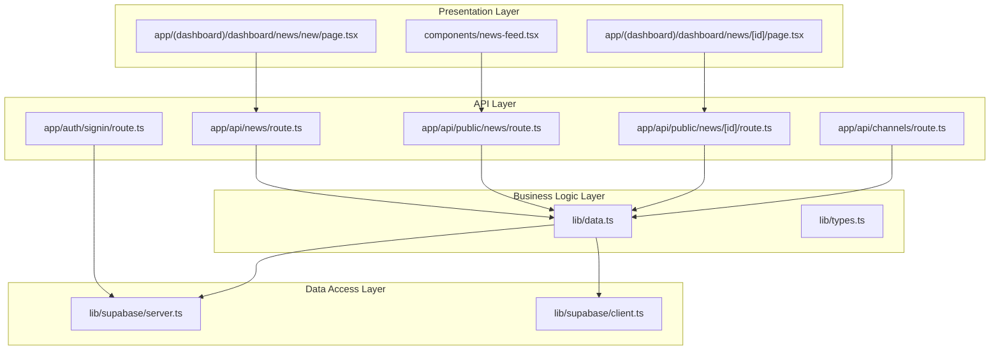
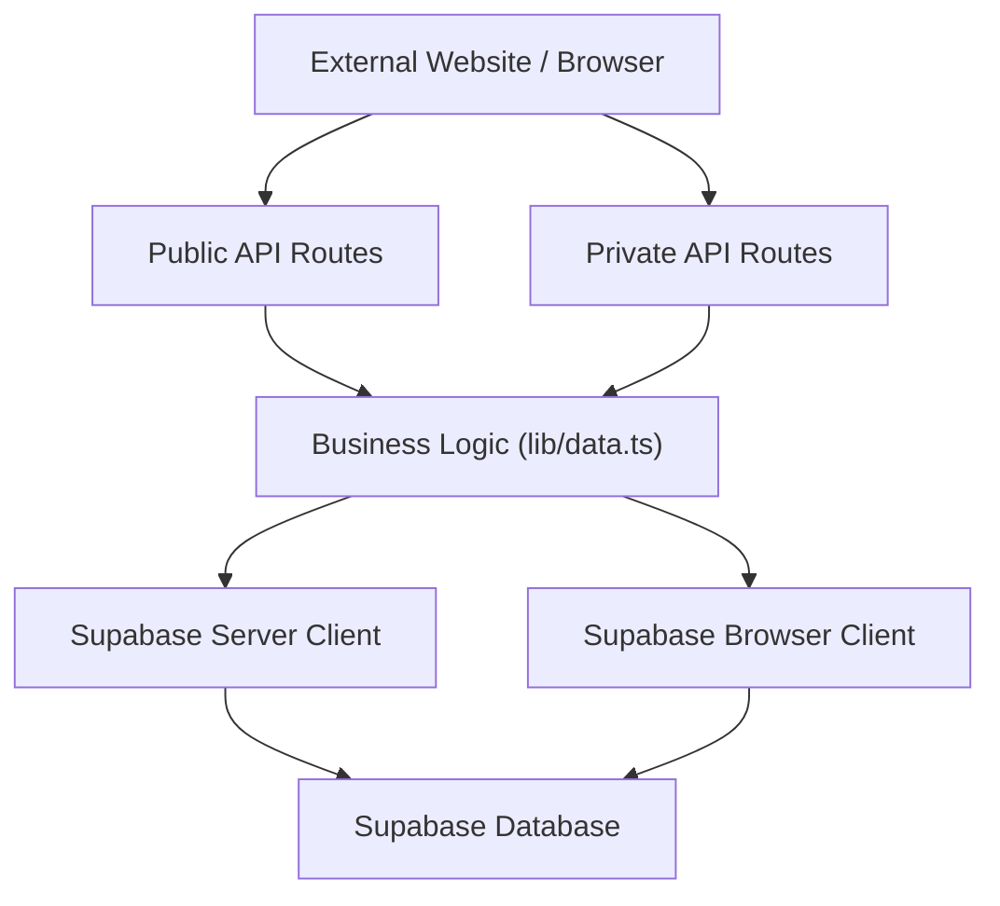
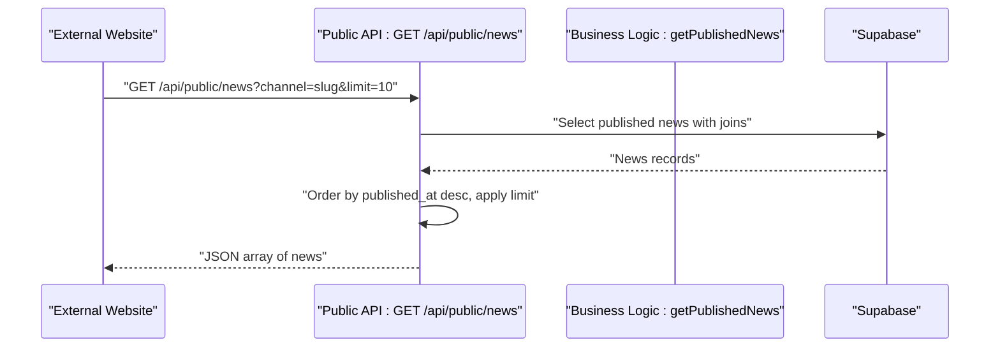
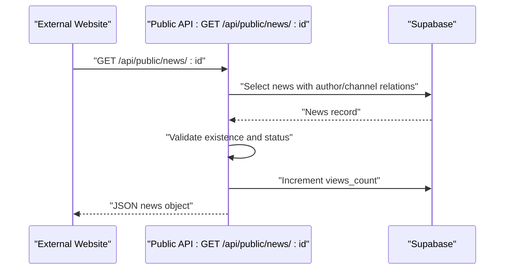
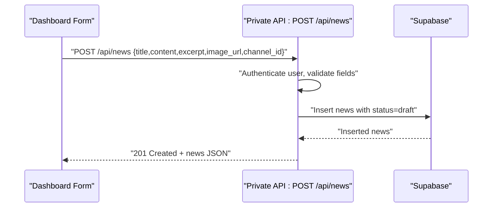
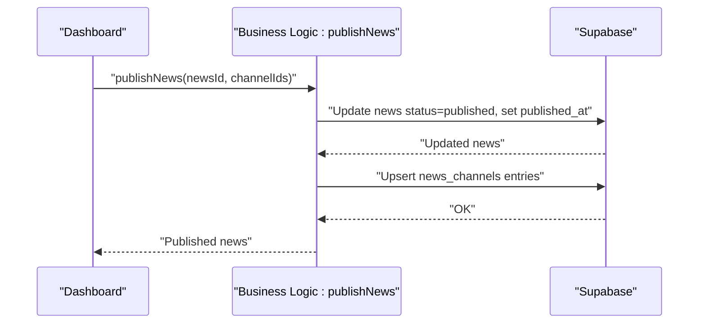
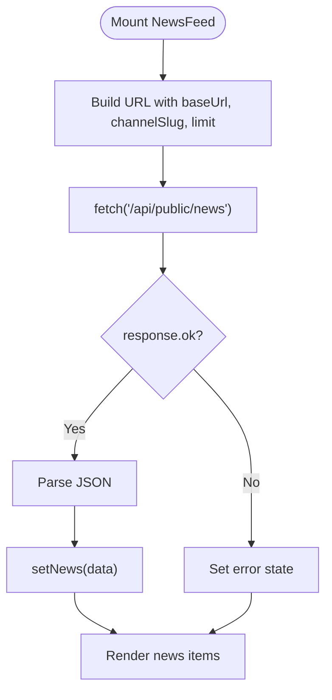
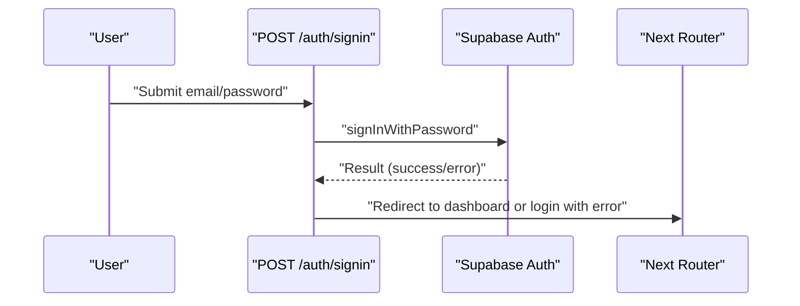
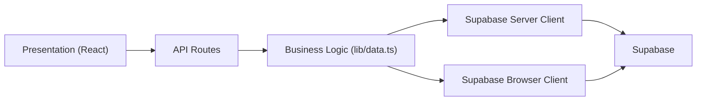

# Data Flow Architecture

<cite>
**Referenced Files in This Document**
- [app/api/news/route.ts](file://app/api/news/route.ts)
- [app/api/public/news/route.ts](file://app/api/public/news/route.ts)
- [app/api/public/news/[id]/route.ts](file://app/api/public/news/[id]/route.ts)
- [app/api/channels/route.ts](file://app/api/channels/route.ts)
- [app/auth/signin/route.ts](file://app/auth/signin/route.ts)
- [lib/data.ts](file://lib/data.ts)
- [lib/supabase/server.ts](file://lib/supabase/server.ts)
- [lib/supabase/client.ts](file://lib/supabase/client.ts)
- [lib/types.ts](file://lib/types.ts)
- [components/news-feed.tsx](file://components/news-feed.tsx)
- [app/(dashboard)/dashboard/news/new/page.tsx](file://app/(dashboard)/dashboard/news/new/page.tsx)
- [app/(dashboard)/dashboard/news/[id]/page.tsx](file://app/(dashboard)/dashboard/news/[id]/page.tsx)
- [README.md](file://README.md)
</cite>

## Table of Contents
1. [Introduction](#introduction)
2. [Project Structure](#project-structure)
3. [Core Components](#core-components)
4. [Architecture Overview](#architecture-overview)
5. [Detailed Component Analysis](#detailed-component-analysis)
6. [Dependency Analysis](#dependency-analysis)
7. [Performance Considerations](#performance-considerations)
8. [Troubleshooting Guide](#troubleshooting-guide)
9. [Conclusion](#conclusion)

## Introduction
This document explains the data flow architecture and API layer design of the news management system. It covers the layered architecture with a presentation layer (React components), a business logic layer (data.ts), and a data access layer (Supabase client). It documents the three-tier data flow: user interactions through React components → API routes → database operations. It also details CRUD workflows for news management, the multi-channel publishing pipeline, public API data flows, request-response patterns, error propagation, data transformation layers, caching and invalidation strategies, real-time update mechanisms, validation and security measures, and the separation between authenticated private APIs and public APIs.

## Project Structure
The system follows a layered architecture:
- Presentation Layer: React components and pages that render UI and trigger data operations.
- Business Logic Layer: Utility functions in lib/data.ts that encapsulate domain operations and coordinate Supabase interactions.
- Data Access Layer: Supabase client wrappers in lib/supabase/server.ts and lib/supabase/client.ts that abstract database connectivity and session handling.
- API Layer: Next.js App Router API routes under app/api/ that enforce authentication, authorization, validation, and orchestrate business logic.

**Diagram sources**
- [components/news-feed.tsx:1-152](file://components/news-feed.tsx#L1-L152)
- [app/(dashboard)/dashboard/news/new/page.tsx:1-138](file://app/(dashboard)/dashboard/news/new/page.tsx#L1-L138)
- [app/(dashboard)/dashboard/news/[id]/page.tsx:1-114](file://app/(dashboard)/dashboard/news/[id]/page.tsx#L1-L114)
- [lib/data.ts:1-213](file://lib/data.ts#L1-L213)
- [lib/types.ts:1-62](file://lib/types.ts#L1-L62)
- [app/api/news/route.ts:1-58](file://app/api/news/route.ts#L1-L58)
- [app/api/public/news/route.ts:1-54](file://app/api/public/news/route.ts#L1-L54)
- [app/api/public/news/[id]/route.ts:1-63](file://app/api/public/news/[id]/route.ts#L1-L63)
- [app/api/channels/route.ts:1-71](file://app/api/channels/route.ts#L1-L71)
- [app/auth/signin/route.ts:1-31](file://app/auth/signin/route.ts#L1-L31)
- [lib/supabase/server.ts:1-30](file://lib/supabase/server.ts#L1-L30)
- [lib/supabase/client.ts:1-9](file://lib/supabase/client.ts#L1-L9)

**Section sources**
- [README.md:361-374](file://README.md#L361-L374)
- [lib/types.ts:1-62](file://lib/types.ts#L1-L62)

## Core Components
- Supabase server client: Provides authenticated database access with cookie-based session handling for server-side operations.
- Supabase browser client: Provides unauthenticated client access for browser-side operations.
- Business logic module: Encapsulates CRUD and multi-channel publishing operations, enforcing domain rules and returning normalized data.
- Public API routes: Expose read-only endpoints for external clients and websites.
- Private API routes: Enforce authentication and role-based authorization for administrative actions.
- Presentation components: Fetch and render data via public API endpoints or trigger private API mutations.

Key responsibilities:
- Authentication and authorization enforcement in API routes.
- Data validation and transformation in API routes and business logic.
- Multi-channel publishing coordination in business logic.
- Public API response shaping and pagination/filtering.
- Presentation components orchestrating user interactions and rendering.

**Section sources**
- [lib/supabase/server.ts:1-30](file://lib/supabase/server.ts#L1-L30)
- [lib/supabase/client.ts:1-9](file://lib/supabase/client.ts#L1-L9)
- [lib/data.ts:144-212](file://lib/data.ts#L144-L212)
- [app/api/news/route.ts:4-57](file://app/api/news/route.ts#L4-L57)
- [app/api/public/news/route.ts:4-53](file://app/api/public/news/route.ts#L4-L53)
- [app/api/public/news/[id]/route.ts:4-62](file://app/api/public/news/[id]/route.ts#L4-L62)
- [app/api/channels/route.ts:4-70](file://app/api/channels/route.ts#L4-L70)
- [components/news-feed.tsx:41-64](file://components/news-feed.tsx#L41-L64)

## Architecture Overview
The system implements a clean layered architecture:
- Presentation Layer: React components and pages handle user interactions and render data.
- Business Logic Layer: Centralized functions in lib/data.ts encapsulate domain operations and coordinate Supabase queries.
- Data Access Layer: Supabase client abstractions manage authentication and database connectivity.
- API Layer: Next.js API routes act as gatekeepers for data access, enforcing security, validation, and transformation.

**Diagram sources**
- [app/api/public/news/route.ts:1-54](file://app/api/public/news/route.ts#L1-L54)
- [app/api/news/route.ts:1-58](file://app/api/news/route.ts#L1-L58)
- [lib/data.ts:1-213](file://lib/data.ts#L1-L213)
- [lib/supabase/server.ts:1-30](file://lib/supabase/server.ts#L1-L30)
- [lib/supabase/client.ts:1-9](file://lib/supabase/client.ts#L1-L9)

## Detailed Component Analysis

### Public API Data Flow: List News
This flow serves external websites and widgets by exposing paginated, filtered news lists.

**Diagram sources**
- [app/api/public/news/route.ts:4-53](file://app/api/public/news/route.ts#L4-L53)
- [lib/data.ts:78-108](file://lib/data.ts#L78-L108)

**Section sources**
- [app/api/public/news/route.ts:4-53](file://app/api/public/news/route.ts#L4-L53)
- [lib/data.ts:78-108](file://lib/data.ts#L78-L108)

### Public API Data Flow: Get News by ID
This flow increments view counts and returns a single published news item.

**Diagram sources**
- [app/api/public/news/[id]/route.ts:4-62](file://app/api/public/news/[id]/route.ts#L4-L62)

**Section sources**
- [app/api/public/news/[id]/route.ts:4-62](file://app/api/public/news/[id]/route.ts#L4-L62)

### Private API Data Flow: Create News (Draft)
Administrative creation of a draft news item.

**Diagram sources**
- [app/api/news/route.ts:4-57](file://app/api/news/route.ts#L4-L57)

**Section sources**
- [app/api/news/route.ts:4-57](file://app/api/news/route.ts#L4-L57)

### Private API Data Flow: Publish News Across Channels
Multi-channel publishing workflow.

**Diagram sources**
- [lib/data.ts:182-212](file://lib/data.ts#L182-L212)

**Section sources**
- [lib/data.ts:182-212](file://lib/data.ts#L182-L212)

### Presentation Layer: News Feed Component
Fetches and renders public news using the public API.

**Diagram sources**
- [components/news-feed.tsx:41-64](file://components/news-feed.tsx#L41-L64)

**Section sources**
- [components/news-feed.tsx:41-64](file://components/news-feed.tsx#L41-L64)

### Authentication Flow
Handles user sign-in and redirects based on success or failure.

**Diagram sources**
- [app/auth/signin/route.ts:4-30](file://app/auth/signin/route.ts#L4-L30)

**Section sources**
- [app/auth/signin/route.ts:4-30](file://app/auth/signin/route.ts#L4-L30)

## Dependency Analysis
The system exhibits clear layering with low coupling between presentation and data access:
- Presentation components depend on API endpoints and types.
- API routes depend on business logic and Supabase server client.
- Business logic depends on Supabase server and browser clients and exports typed models.
- Supabase clients abstract database connectivity and session handling.

**Diagram sources**
- [components/news-feed.tsx:1-152](file://components/news-feed.tsx#L1-L152)
- [app/api/news/route.ts:1-58](file://app/api/news/route.ts#L1-L58)
- [lib/data.ts:1-213](file://lib/data.ts#L1-L213)
- [lib/supabase/server.ts:1-30](file://lib/supabase/server.ts#L1-L30)
- [lib/supabase/client.ts:1-9](file://lib/supabase/client.ts#L1-L9)

**Section sources**
- [lib/types.ts:1-62](file://lib/types.ts#L1-L62)
- [lib/data.ts:1-213](file://lib/data.ts#L1-L213)

## Performance Considerations
- Pagination and filtering: Public API endpoints accept a limit parameter and optional channel filter to reduce payload sizes.
- Selective field projection: Queries use explicit column selection and join projections to minimize data transfer.
- Single-item increment: View count increments occur after initial read to avoid race conditions.
- Caching: No explicit caching layer is present; consider CDN caching for public endpoints and short-lived cache for frequently accessed lists.
- Indexing: Ensure database indexes exist on status, published_at, and foreign keys for optimal query performance.
- Batch operations: Multi-channel publishing uses upsert to efficiently insert multiple channel associations.

[No sources needed since this section provides general guidance]

## Troubleshooting Guide
Common issues and resolutions:
- Unauthorized access: Private API routes return 401 if user is not authenticated; ensure session cookies are present.
- Forbidden access: Some private routes require super_admin role; verify user role in user_profiles.
- Validation errors: Missing required fields in private API routes return 400; ensure title, content, and channel_id are provided.
- Not found errors: Public API returns 404 when news is not found or not published; confirm news ID and status.
- Internal errors: Catch-all 500 responses indicate server-side failures; check logs and database connectivity.
- Data shape mismatches: Business logic returns normalized data; verify frontend expects correct field names and types.

**Section sources**
- [app/api/news/route.ts:8-23](file://app/api/news/route.ts#L8-L23)
- [app/api/channels/route.ts:30-44](file://app/api/channels/route.ts#L30-L44)
- [app/api/public/news/[id]/route.ts:41-46](file://app/api/public/news/[id]/route.ts#L41-L46)
- [app/api/public/news/route.ts:46-52](file://app/api/public/news/route.ts#L46-L52)

## Conclusion
The system’s layered architecture cleanly separates concerns across presentation, business logic, and data access layers. The API layer enforces authentication, authorization, and validation while delegating domain logic to business functions. The public API enables external integrations with robust read operations, while private APIs support administrative workflows including multi-channel publishing. Security is reinforced through Supabase RLS policies and role-based access checks. Performance can be further optimized with CDN caching, indexing, and selective data projections. The documented flows and error-handling patterns provide a solid foundation for extending the system with additional features and channels.