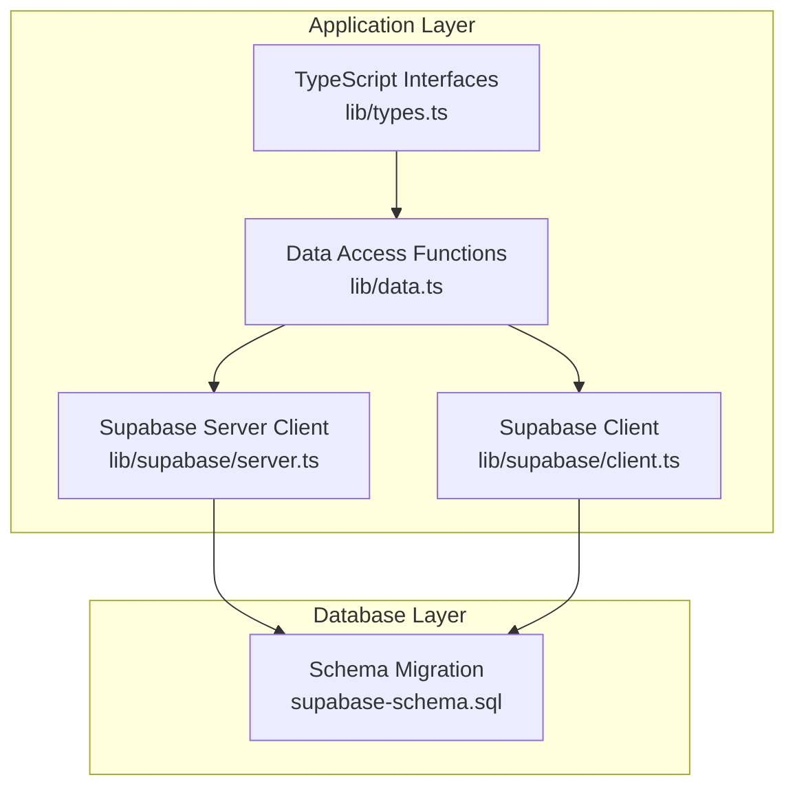
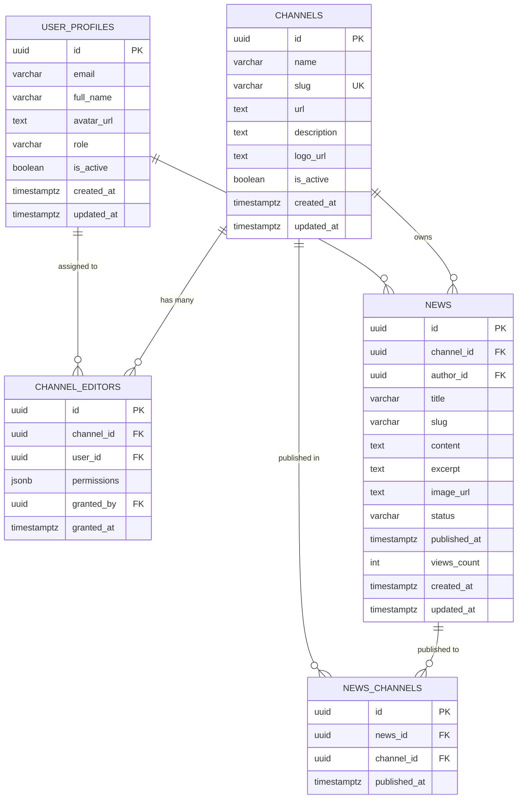
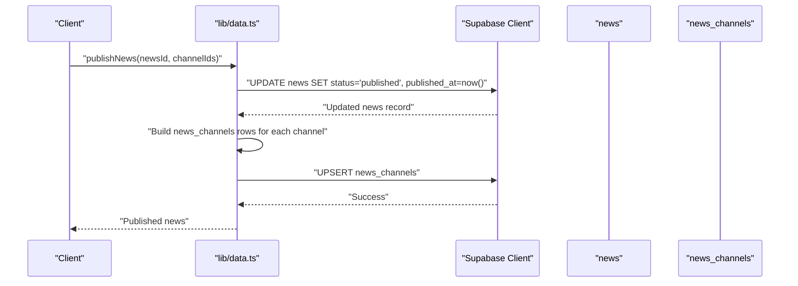
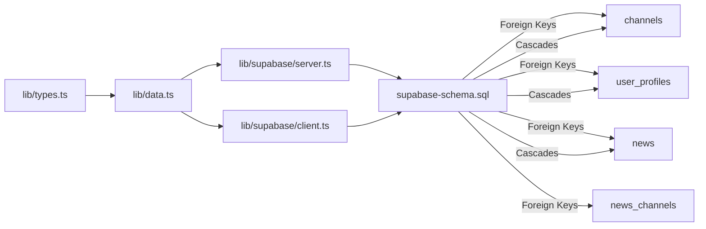

# Database Schema Design

<cite>
**Referenced Files in This Document**
- [supabase-schema.sql](file://supabase-schema.sql)
- [lib/types.ts](file://lib/types.ts)
- [lib/data.ts](file://lib/data.ts)
- [lib/supabase/server.ts](file://lib/supabase/server.ts)
- [lib/supabase/client.ts](file://lib/supabase/client.ts)
- [README.md](file://README.md)
- [ARCHITECTURE.md](file://ARCHITECTURE.md)
- [PROJECT_SUMMARY.md](file://PROJECT_SUMMARY.md)
</cite>

## Table of Contents
1. [Introduction](#introduction)
2. [Project Structure](#project-structure)
3. [Core Components](#core-components)
4. [Architecture Overview](#architecture-overview)
5. [Detailed Component Analysis](#detailed-component-analysis)
6. [Dependency Analysis](#dependency-analysis)
7. [Performance Considerations](#performance-considerations)
8. [Troubleshooting Guide](#troubleshooting-guide)
9. [Conclusion](#conclusion)
10. [Appendices](#appendices)

## Introduction
This document provides comprehensive data model documentation for the blog management system’s database schema. It focuses on the entity relationship design among channels, user_profiles, news, channel_editors, and news_channels. The schema supports multi-channel publishing via a many-to-many relationship through news_channels, enforces role-based permissions via channel_editors, and ensures referential integrity with cascading deletes. Business constraints such as unique slugs, status enumerations, and permission JSONB fields are documented alongside performance considerations and Row Level Security (RLS) policies.

## Project Structure
The database schema is defined declaratively in a SQL migration script and consumed by the Next.js application through Supabase client libraries. The application code defines TypeScript interfaces mirroring the schema and exposes data access functions for CRUD operations and multi-channel publishing.

**Diagram sources**
- [lib/types.ts:1-62](file://lib/types.ts#L1-L62)
- [lib/data.ts:1-213](file://lib/data.ts#L1-L213)
- [lib/supabase/server.ts:1-30](file://lib/supabase/server.ts#L1-L30)
- [lib/supabase/client.ts:1-9](file://lib/supabase/client.ts#L1-L9)
- [supabase-schema.sql:1-258](file://supabase-schema.sql#L1-L258)

**Section sources**
- [lib/types.ts:1-62](file://lib/types.ts#L1-L62)
- [lib/data.ts:1-213](file://lib/data.ts#L1-L213)
- [lib/supabase/server.ts:1-30](file://lib/supabase/server.ts#L1-L30)
- [lib/supabase/client.ts:1-9](file://lib/supabase/client.ts#L1-L9)
- [supabase-schema.sql:1-258](file://supabase-schema.sql#L1-L258)

## Core Components
This section documents each table’s primary keys, foreign keys, unique constraints, indexes, and business rules.

- channels
  - Purpose: Stores sites/news sources with branding and activation status.
  - Primary key: id (UUID)
  - Unique constraints: slug (unique)
  - Indexes: slug, is_active
  - Fields: id, name, slug, url, description, logo_url, is_active, created_at, updated_at
  - Constraints: is_active defaults to true; updated_at managed by trigger

- user_profiles
  - Purpose: Extends Supabase auth users with roles and metadata.
  - Primary key: id (UUID, references auth.users)
  - Fields: id, email, full_name, avatar_url, role (check constraint), is_active, created_at, updated_at
  - Constraints: role restricted to ('super_admin','admin','editor'); is_active defaults to true; updated_at managed by trigger
  - Triggers: Auto-populates on auth user creation; auto-promotes first user to super_admin

- channel_editors
  - Purpose: Many-to-many mapping between channels and users with granular permissions.
  - Primary key: id (UUID)
  - Foreign keys: channel_id -> channels(id) (ON DELETE CASCADE), user_id -> user_profiles(id) (ON DELETE CASCADE), granted_by -> user_profiles(id)
  - Unique constraints: (channel_id, user_id)
  - Fields: id, channel_id, user_id, permissions (JSONB), granted_by, granted_at
  - Permissions JSONB default: can_create=true, can_edit=true, can_delete=false, can_publish=false

- news
  - Purpose: Stores articles with content, status, and publication metadata.
  - Primary key: id (UUID)
  - Foreign keys: channel_id -> channels(id) (ON DELETE CASCADE), author_id -> user_profiles(id)
  - Unique constraints: (channel_id, slug)
  - Fields: id, channel_id, author_id, title, slug, content, excerpt, image_url, status (check), published_at, views_count, created_at, updated_at
  - Constraints: status defaults to 'draft'; updated_at managed by trigger

- news_channels
  - Purpose: Enables multi-channel publishing by linking news to multiple channels.
  - Primary key: id (UUID)
  - Foreign keys: news_id -> news(id) (ON DELETE CASCADE), channel_id -> channels(id) (ON DELETE CASCADE)
  - Unique constraints: (news_id, channel_id)
  - Fields: id, news_id, channel_id, published_at

- Audit and lifecycle
  - created_at and updated_at timestamps are present across all tables.
  - updated_at is automatically maintained via triggers.
  - Soft deletion is not implemented; deletions cascade via foreign keys.

- Validation and constraints
  - Enum-like constraints enforced via CHECK clauses for role and status.
  - Unique composite constraints prevent duplicate slugs per channel and duplicate channel-user mappings.
  - JSONB permissions field stores granular capabilities.

**Section sources**
- [supabase-schema.sql:4-15](file://supabase-schema.sql#L4-L15)
- [supabase-schema.sql:17-28](file://supabase-schema.sql#L17-L28)
- [supabase-schema.sql:76-85](file://supabase-schema.sql#L76-L85)
- [supabase-schema.sql:87-103](file://supabase-schema.sql#L87-L103)
- [supabase-schema.sql:105-112](file://supabase-schema.sql#L105-L112)
- [supabase-schema.sql:128-146](file://supabase-schema.sql#L128-L146)

## Architecture Overview
The database architecture centers on a multi-channel publishing model with explicit permission mapping and RLS policies.

**Diagram sources**
- [supabase-schema.sql:4-15](file://supabase-schema.sql#L4-L15)
- [supabase-schema.sql:17-28](file://supabase-schema.sql#L17-L28)
- [supabase-schema.sql:76-85](file://supabase-schema.sql#L76-L85)
- [supabase-schema.sql:87-103](file://supabase-schema.sql#L87-L103)
- [supabase-schema.sql:105-112](file://supabase-schema.sql#L105-L112)

## Detailed Component Analysis

### Entity Definitions and Constraints
- channels
  - Unique slug per site ensures SEO-friendly and conflict-free URLs.
  - is_active flag enables deactivation without data loss.
  - Indexes on slug and is_active support fast filtering and lookups.

- user_profiles
  - Role-based access control with constrained values.
  - Auto-triggered population from Supabase auth users.
  - First user auto-promoted to super_admin for initial setup.

- channel_editors
  - Composite unique index prevents duplicate assignments.
  - JSONB permissions enable fine-grained capability flags.
  - Cascading delete ensures cleanup when channel or user is removed.

- news
  - Composite unique index (channel_id, slug) ensures uniqueness per channel.
  - Status enumeration controls visibility and lifecycle.
  - published_at tracks publication timing for sorting.

- news_channels
  - Junction table enabling multi-channel publishing.
  - published_at records when a news item was published to a channel.

**Section sources**
- [supabase-schema.sql:4-15](file://supabase-schema.sql#L4-L15)
- [supabase-schema.sql:17-28](file://supabase-schema.sql#L17-L28)
- [supabase-schema.sql:76-85](file://supabase-schema.sql#L76-L85)
- [supabase-schema.sql:87-103](file://supabase-schema.sql#L87-L103)
- [supabase-schema.sql:105-112](file://supabase-schema.sql#L105-L112)

### Application Integration and Data Access
- Types
  - TypeScript interfaces mirror schema fields and enums for compile-time safety.
  - Permissions are modeled as a JSON-compatible object in the interface.

- Data Access Functions
  - getCurrentUser retrieves the authenticated user’s profile.
  - getUserChannels fetches channels associated with a user via channel_editors join.
  - getChannelEditors fetches editors for a channel with embedded user details.
  - getAllChannels lists active channels ordered by name.
  - getPublishedNews filters by status and sorts by published_at descending.
  - getNewsById loads a news item with author, channel, and multi-channel publishing details.
  - createNews inserts a new article with default status 'draft'.
  - updateNews updates article fields.
  - publishNews sets status to 'published', records published_at, and upserts news_channels entries for selected channels.

- Supabase Clients
  - Server-side client uses Next.js cookies for session persistence.
  - Client-side browser client used for public endpoints.

**Section sources**
- [lib/types.ts:1-62](file://lib/types.ts#L1-L62)
- [lib/data.ts:1-213](file://lib/data.ts#L1-L213)
- [lib/supabase/server.ts:1-30](file://lib/supabase/server.ts#L1-L30)
- [lib/supabase/client.ts:1-9](file://lib/supabase/client.ts#L1-L9)

### Multi-Channel Publishing Workflow
The publishNews function demonstrates the multi-channel publishing flow.

**Diagram sources**
- [lib/data.ts:182-212](file://lib/data.ts#L182-L212)
- [supabase-schema.sql:105-112](file://supabase-schema.sql#L105-L112)

### Data Lifecycle and Auditing
- created_at and updated_at timestamps are present on all tables.
- updated_at is automatically refreshed via triggers on insert/update.
- No soft deletion mechanism is implemented; deletions cascade via foreign keys.

**Section sources**
- [supabase-schema.sql:128-146](file://supabase-schema.sql#L128-L146)

### Business Rules and Validation
- Role validation: user_profiles.role must be one of ('super_admin','admin','editor').
- Status validation: news.status must be one of ('draft','published','hidden','archived').
- Unique constraints:
  - channels.slug must be unique.
  - (channel_id, slug) must be unique in news.
  - (channel_id, user_id) must be unique in channel_editors.
  - (news_id, channel_id) must be unique in news_channels.
- Permission defaults: channel_editors.permissions defaults to JSON with can_create and can_edit enabled.

**Section sources**
- [supabase-schema.sql:23-24](file://supabase-schema.sql#L23-L24)
- [supabase-schema.sql:96-98](file://supabase-schema.sql#L96-L98)
- [supabase-schema.sql:7-8](file://supabase-schema.sql#L7-L8)
- [supabase-schema.sql:101-102](file://supabase-schema.sql#L101-L102)
- [supabase-schema.sql:83-84](file://supabase-schema.sql#L83-L84)
- [supabase-schema.sql:110-111](file://supabase-schema.sql#L110-L111)

### Security and Access Control
- Row Level Security (RLS) is enabled on all tables.
- Policies:
  - channels: select allowed for active channels; super_admin can manage all.
  - user_profiles: select allowed; users can update their own profile; super_admin can manage all.
  - channel_editors: select allowed; super_admin can manage all.
  - news: select allowed for published items; authors/editors can view/manage their own; editors can manage if permissions allow.
  - news_channels: select allowed; editors can manage if they have access to the news’ channel.

**Section sources**
- [supabase-schema.sql:147-152](file://supabase-schema.sql#L147-L152)
- [supabase-schema.sql:154-171](file://supabase-schema.sql#L154-L171)
- [supabase-schema.sql:173-194](file://supabase-schema.sql#L173-L194)
- [supabase-schema.sql:196-213](file://supabase-schema.sql#L196-L213)
- [supabase-schema.sql:215-241](file://supabase-schema.sql#L215-L241)
- [supabase-schema.sql:243-257](file://supabase-schema.sql#L243-L257)

## Dependency Analysis
The application depends on Supabase for database connectivity and authentication. The schema defines foreign keys and cascading behavior that the application relies on for data integrity.

**Diagram sources**
- [lib/types.ts:1-62](file://lib/types.ts#L1-L62)
- [lib/data.ts:1-213](file://lib/data.ts#L1-L213)
- [lib/supabase/server.ts:1-30](file://lib/supabase/server.ts#L1-L30)
- [lib/supabase/client.ts:1-9](file://lib/supabase/client.ts#L1-L9)
- [supabase-schema.sql:4-15](file://supabase-schema.sql#L4-L15)
- [supabase-schema.sql:17-28](file://supabase-schema.sql#L17-L28)
- [supabase-schema.sql:87-103](file://supabase-schema.sql#L87-L103)
- [supabase-schema.sql:105-112](file://supabase-schema.sql#L105-L112)

**Section sources**
- [lib/types.ts:1-62](file://lib/types.ts#L1-L62)
- [lib/data.ts:1-213](file://lib/data.ts#L1-L213)
- [lib/supabase/server.ts:1-30](file://lib/supabase/server.ts#L1-L30)
- [lib/supabase/client.ts:1-9](file://lib/supabase/client.ts#L1-L9)
- [supabase-schema.sql:4-15](file://supabase-schema.sql#L4-L15)
- [supabase-schema.sql:17-28](file://supabase-schema.sql#L17-L28)
- [supabase-schema.sql:87-103](file://supabase-schema.sql#L87-L103)
- [supabase-schema.sql:105-112](file://supabase-schema.sql#L105-L112)

## Performance Considerations
- Indexes
  - channels: slug, is_active
  - user_profiles: email, role
  - channel_editors: channel_id, user_id
  - news: channel_id, author_id, status, published_at (descending)
  - news_channels: news_id, channel_id
- Recommendations
  - Consider adding partial indexes for is_active=true on channels and status='published' on news for filtered queries.
  - Monitor slow queries and add targeted indexes for frequent filters and joins.
  - Use LIMIT and pagination for listing endpoints to reduce result sizes.

**Section sources**
- [supabase-schema.sql:114-126](file://supabase-schema.sql#L114-L126)

## Troubleshooting Guide
- Authentication and Authorization
  - Ensure user_profiles are populated via Supabase auth triggers.
  - Verify RLS policies match expected behavior; test with super_admin privileges when debugging access issues.
- Data Integrity
  - Unique constraint violations occur when inserting duplicate slugs per channel or duplicate channel-user/editor mappings.
  - Status and role values must match the allowed enumerations.
- Cascading Behavior
  - Deleting a channel removes channel_editors and news via CASCADE.
  - Deleting a user removes channel_editors via CASCADE; news remains but author_id may be orphaned depending on application logic.
- Multi-Channel Publishing
  - Upsert into news_channels requires valid news_id and channel_id combinations; ensure both exist before publishing.

**Section sources**
- [supabase-schema.sql:30-51](file://supabase-schema.sql#L30-L51)
- [supabase-schema.sql:53-74](file://supabase-schema.sql#L53-L74)
- [supabase-schema.sql:76-85](file://supabase-schema.sql#L76-L85)
- [supabase-schema.sql:87-103](file://supabase-schema.sql#L87-L103)
- [supabase-schema.sql:105-112](file://supabase-schema.sql#L105-L112)

## Conclusion
The blog management system’s database schema provides a robust foundation for multi-channel publishing with explicit permission mapping and strong referential integrity. The combination of unique constraints, enum checks, JSONB permissions, and RLS policies ensures predictable behavior and secure access control. The provided indexes and triggers support efficient querying and automatic lifecycle management.

## Appendices

### Appendix A: Field Reference
- channels: id, name, slug, url, description, logo_url, is_active, created_at, updated_at
- user_profiles: id, email, full_name, avatar_url, role, is_active, created_at, updated_at
- channel_editors: id, channel_id, user_id, permissions, granted_by, granted_at
- news: id, channel_id, author_id, title, slug, content, excerpt, image_url, status, published_at, views_count, created_at, updated_at
- news_channels: id, news_id, channel_id, published_at

**Section sources**
- [supabase-schema.sql:4-15](file://supabase-schema.sql#L4-L15)
- [supabase-schema.sql:17-28](file://supabase-schema.sql#L17-L28)
- [supabase-schema.sql:76-85](file://supabase-schema.sql#L76-L85)
- [supabase-schema.sql:87-103](file://supabase-schema.sql#L87-L103)
- [supabase-schema.sql:105-112](file://supabase-schema.sql#L105-L112)

### Appendix B: Relationship Summary
- channels ↔ user_profiles: many-to-many via channel_editors
- channels → news: one-to-many
- user_profiles → news: one-to-many (authorship)
- news ↔ channels: many-to-many via news_channels

**Section sources**
- [supabase-schema.sql:76-85](file://supabase-schema.sql#L76-L85)
- [supabase-schema.sql:87-103](file://supabase-schema.sql#L87-L103)
- [supabase-schema.sql:105-112](file://supabase-schema.sql#L105-L112)