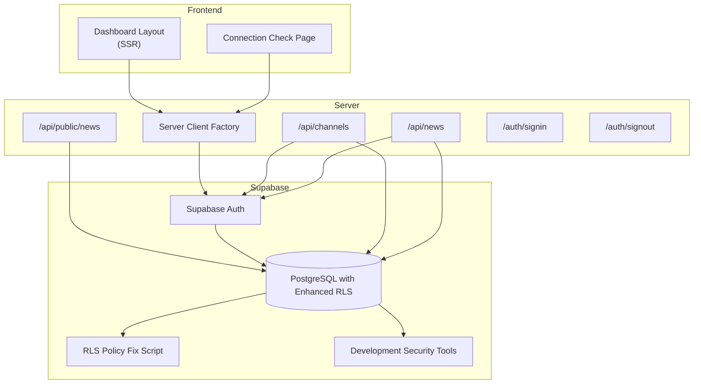
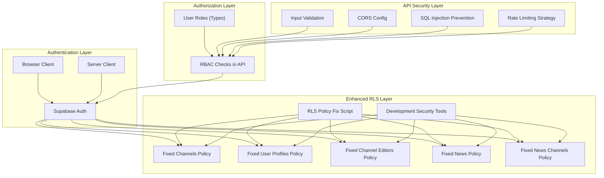
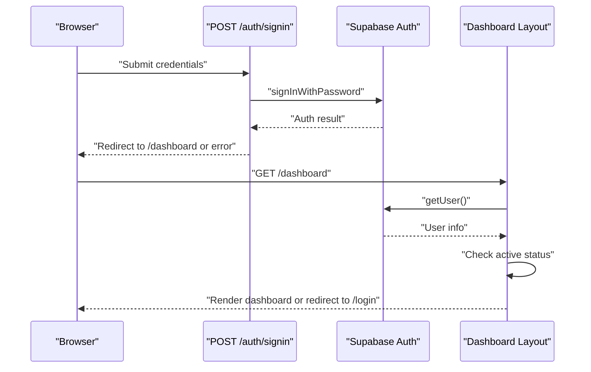
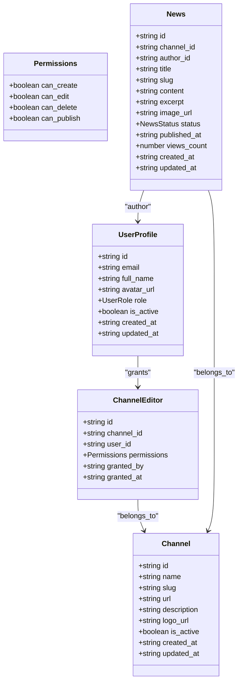
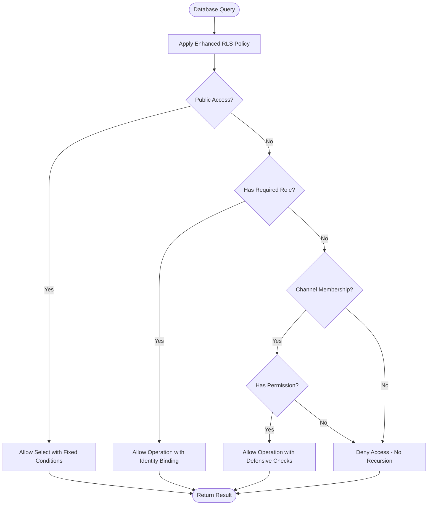
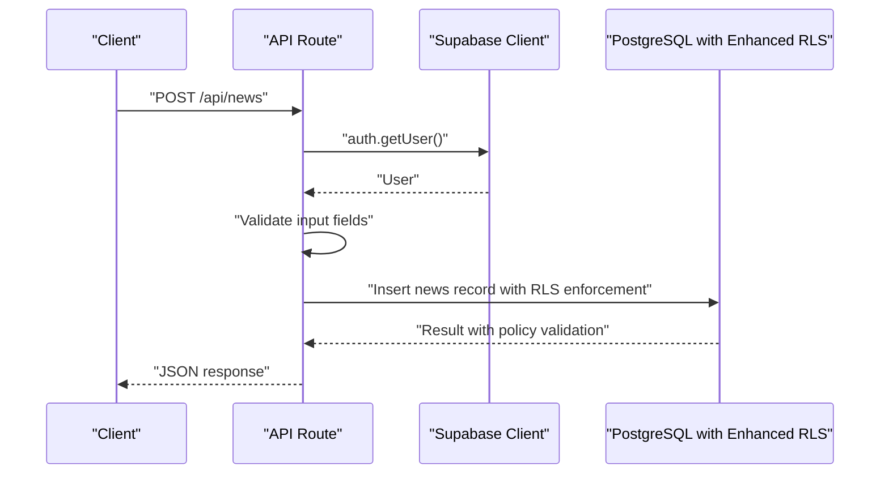
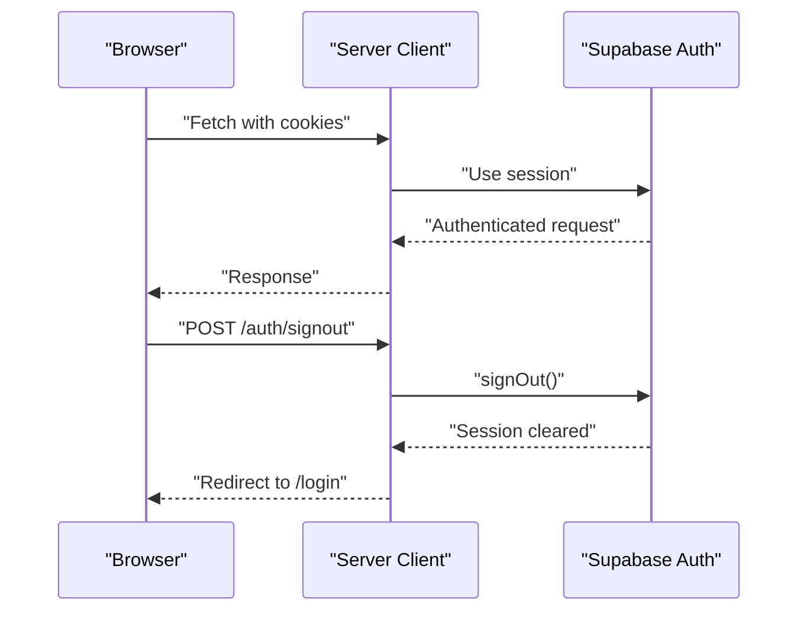
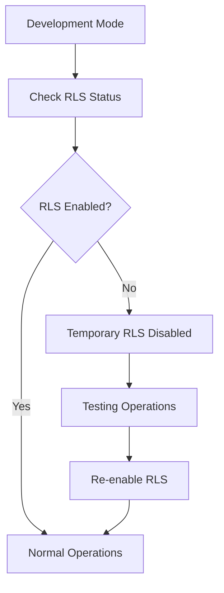
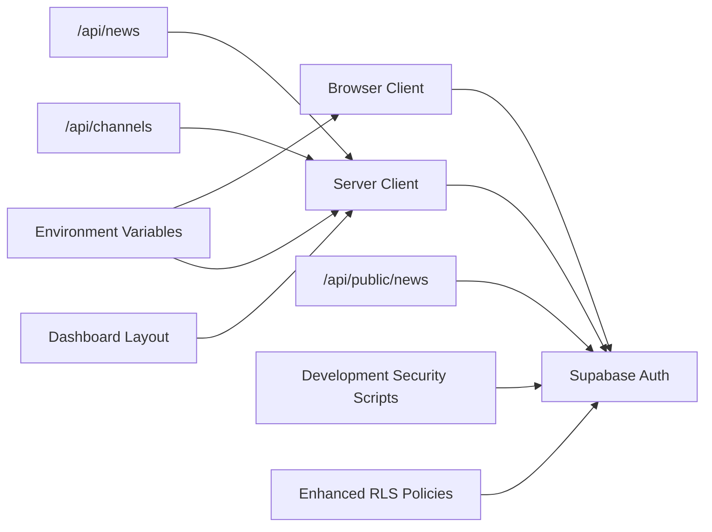

# Security Architecture

<cite>
**Referenced Files in This Document**
- [client.ts](file://lib/supabase/client.ts)
- [server.ts](file://lib/supabase/server.ts)
- [route.ts](file://app/auth/signin/route.ts)
- [route.ts](file://app/auth/signout/route.ts)
- [layout.tsx](file://app/(dashboard)/dashboard/layout.tsx)
- [page.tsx](file://app/check/page.tsx)
- [route.ts](file://app/api/channels/route.ts)
- [route.ts](file://app/api/news/route.ts)
- [route.ts](file://app/api/public/news/route.ts)
- [types.ts](file://lib/types.ts)
- [supabase-schema.sql](file://supabase-schema.sql)
- [fix-rls-policies.sql](file://fix-rls-policies.sql)
- [disable-rls-temp.sql](file://disable-rls-temp.sql)
- [next.config.js](file://next.config.js)
- [add-env-vars.sh](file://add-env-vars.sh)
- [package.json](file://package.json)
</cite>

## Update Summary
**Changes Made**
- Added comprehensive documentation for RLS policy fixes in fix-rls-policies.sql
- Documented temporary security disabling mechanism via disable-rls-temp.sql
- Enhanced database security section with improved policy implementations
- Updated troubleshooting guide with RLS-related debugging procedures
- Added development security measures documentation

## Table of Contents
1. [Introduction](#introduction)
2. [Project Structure](#project-structure)
3. [Core Components](#core-components)
4. [Architecture Overview](#architecture-overview)
5. [Detailed Component Analysis](#detailed-component-analysis)
6. [Database Security Enhancements](#database-security-enhancements)
7. [Development Security Measures](#development-security-measures)
8. [Dependency Analysis](#dependency-analysis)
9. [Performance Considerations](#performance-considerations)
10. [Troubleshooting Guide](#troubleshooting-guide)
11. [Conclusion](#conclusion)
12. [Appendices](#appendices)

## Introduction
This document describes the multi-layered security architecture of the application. It covers:
- Authentication via Supabase Auth with JWT tokens and secure cookie handling
- Authorization using role-based access control (RBAC) with roles super_admin, admin, and editor
- Enhanced Row-Level Security (RLS) policies with infinite recursion fixes and development security measures
- API security controls including CORS, input validation, SQL injection prevention, and rate limiting strategies
- Session lifecycle management, token refresh, and logout procedures
- Best practices, threat mitigations, and compliance considerations for cloud-native deployments

**Updated** Enhanced with comprehensive RLS policy fixes and development security measures to address infinite recursion issues and provide safe development environments.

## Project Structure
Security-relevant components are organized by responsibility:
- Supabase client abstractions for browser and server environments
- API routes implementing authentication checks, authorization gates, and input validation
- Database schema with enhanced RLS policies and typed domain models
- Environment configuration and deployment helpers
- Development security utilities for testing and debugging

**Diagram sources**
- [server.ts:1-30](file://lib/supabase/server.ts#L1-L30)
- [client.ts:1-9](file://lib/supabase/client.ts#L1-L9)
- [layout.tsx:1-91](file://app/(dashboard)/dashboard/layout.tsx#L1-L91)
- [page.tsx:1-82](file://app/check/page.tsx#L1-L82)
- [route.ts:1-71](file://app/api/channels/route.ts#L1-L71)
- [route.ts:1-58](file://app/api/news/route.ts#L1-L58)
- [route.ts:1-54](file://app/api/public/news/route.ts#L1-L54)
- [route.ts:1-31](file://app/auth/signin/route.ts#L1-L31)
- [route.ts:1-14](file://app/auth/signout/route.ts#L1-L14)
- [supabase-schema.sql:147-258](file://supabase-schema.sql#L147-L258)
- [fix-rls-policies.sql:1-124](file://fix-rls-policies.sql#L1-L124)
- [disable-rls-temp.sql:1-9](file://disable-rls-temp.sql#L1-L9)

**Section sources**
- [client.ts:1-9](file://lib/supabase/client.ts#L1-L9)
- [server.ts:1-30](file://lib/supabase/server.ts#L1-L30)
- [layout.tsx:1-91](file://app/(dashboard)/dashboard/layout.tsx#L1-L91)
- [page.tsx:1-82](file://app/check/page.tsx#L1-L82)
- [route.ts:1-71](file://app/api/channels/route.ts#L1-L71)
- [route.ts:1-58](file://app/api/news/route.ts#L1-L58)
- [route.ts:1-54](file://app/api/public/news/route.ts#L1-L54)
- [route.ts:1-31](file://app/auth/signin/route.ts#L1-L31)
- [route.ts:1-14](file://app/auth/signout/route.ts#L1-L14)
- [supabase-schema.sql:147-258](file://supabase-schema.sql#L147-L258)

## Core Components
- Supabase Browser Client: Provides client-side access to Supabase using public environment variables.
- Supabase Server Client: Manages server-side Supabase access with cookie-based session persistence and secure cookie handling.
- Authentication Routes: Handle login and logout flows using Supabase Auth.
- Dashboard SSR Guard: Enforces authenticated access and active user status for protected pages.
- API Routes: Implement RBAC checks and input validation for channel and news operations.
- Enhanced Database Schema and Policies: Define RLS policies for channels, user profiles, channel editors, news, and news_channels with infinite recursion fixes.
- Development Security Tools: Temporary RLS disabling scripts for testing and debugging.
- Types: Define user roles and domain entities for compile-time safety.

**Section sources**
- [client.ts:1-9](file://lib/supabase/client.ts#L1-L9)
- [server.ts:1-30](file://lib/supabase/server.ts#L1-L30)
- [route.ts:1-31](file://app/auth/signin/route.ts#L1-L31)
- [route.ts:1-14](file://app/auth/signout/route.ts#L1-L14)
- [layout.tsx:1-91](file://app/(dashboard)/dashboard/layout.tsx#L1-L91)
- [route.ts:1-71](file://app/api/channels/route.ts#L1-L71)
- [route.ts:1-58](file://app/api/news/route.ts#L1-L58)
- [types.ts:1-62](file://lib/types.ts#L1-L62)
- [supabase-schema.sql:147-258](file://supabase-schema.sql#L147-L258)
- [fix-rls-policies.sql:1-124](file://fix-rls-policies.sql#L1-L124)
- [disable-rls-temp.sql:1-9](file://disable-rls-temp.sql#L1-L9)

## Architecture Overview
The security model follows a four-layer approach with enhanced database security:

- Authentication (Supabase Auth with JWT tokens): Users authenticate via Supabase Auth. Sessions are stored in secure cookies managed by the server client. The dashboard SSR guard ensures only authenticated users can access protected pages.
- Authorization (RBAC): Roles super_admin, admin, and editor govern access to resources. Super_admin has full privileges; admin and editor access is enforced via API checks and enhanced RLS policies.
- Enhanced Row-Level Security (RLS): Database-level policies with infinite recursion fixes restrict visibility and actions based on user identity and channel membership.
- API Security: Input validation, SQL injection prevention via ORM/SDK, CORS configuration, and rate limiting strategies protect endpoints.

**Diagram sources**
- [client.ts:1-9](file://lib/supabase/client.ts#L1-L9)
- [server.ts:1-30](file://lib/supabase/server.ts#L1-L30)
- [types.ts:1-62](file://lib/types.ts#L1-L62)
- [route.ts:1-71](file://app/api/channels/route.ts#L1-L71)
- [route.ts:1-58](file://app/api/news/route.ts#L1-L58)
- [supabase-schema.sql:147-258](file://supabase-schema.sql#L147-L258)
- [fix-rls-policies.sql:1-124](file://fix-rls-policies.sql#L1-L124)
- [disable-rls-temp.sql:1-9](file://disable-rls-temp.sql#L1-L9)
- [next.config.js:1-14](file://next.config.js#L1-L14)

## Detailed Component Analysis

### Authentication Implementation (Supabase Auth with JWT and Secure Cookies)
- Browser client initialization uses public environment variables for Supabase URL and anonymous key.
- Server client integrates with Next.js cookies to persist and refresh Supabase Auth sessions securely.
- Login route validates presence of credentials, authenticates via Supabase, and redirects accordingly.
- Logout route invokes Supabase sign-out and redirects to the login page.
- Dashboard SSR guard retrieves the current user and enforces active status; inactive users are logged out and redirected.

**Diagram sources**
- [client.ts:1-9](file://lib/supabase/client.ts#L1-L9)
- [server.ts:1-30](file://lib/supabase/server.ts#L1-L30)
- [route.ts:1-31](file://app/auth/signin/route.ts#L1-L31)
- [layout.tsx:1-91](file://app/(dashboard)/dashboard/layout.tsx#L1-L91)

**Section sources**
- [client.ts:1-9](file://lib/supabase/client.ts#L1-L9)
- [server.ts:1-30](file://lib/supabase/server.ts#L1-L30)
- [route.ts:1-31](file://app/auth/signin/route.ts#L1-L31)
- [route.ts:1-14](file://app/auth/signout/route.ts#L1-L14)
- [layout.tsx:1-91](file://app/(dashboard)/dashboard/layout.tsx#L1-L91)

### Authorization Model (RBAC with Roles)
- Role definitions: super_admin, admin, editor.
- Super_admin can manage channels and user profiles.
- Editor access is governed by channel_editor permissions and news ownership.
- API routes enforce role checks for administrative operations.

**Diagram sources**
- [types.ts:1-62](file://lib/types.ts#L1-L62)

**Section sources**
- [types.ts:1-62](file://lib/types.ts#L1-L62)
- [route.ts:1-71](file://app/api/channels/route.ts#L1-L71)

## Database Security Enhancements

### Enhanced Row-Level Security (RLS) Policies with Infinite Recursion Fixes
The database security has been significantly enhanced with comprehensive RLS policy fixes that address infinite recursion issues and provide robust access control:

#### Fixed Policy Architecture
- **Public channels**: Visible to everyone when active, preventing recursive policy evaluation
- **Super admin privileges**: Full management rights with explicit role verification
- **User profile access**: Controlled selective access with proper identity binding
- **Channel editor management**: Global visibility with super admin oversight
- **News publication**: Published content accessible to all, with granular author/editor controls
- **Multi-channel publishing**: Proper junction table security with cascading access controls

#### Infinite Recursion Prevention
The enhanced policies eliminate recursive evaluation by:
- Using explicit EXISTS clauses instead of correlated subqueries
- Implementing proper identity binding with auth.uid() comparisons
- Adding defensive checks to prevent policy evaluation loops
- Ensuring policy conditions are non-circular and self-contained

**Diagram sources**
- [fix-rls-policies.sql:1-124](file://fix-rls-policies.sql#L1-L124)
- [supabase-schema.sql:147-258](file://supabase-schema.sql#L147-L258)

**Section sources**
- [fix-rls-policies.sql:1-124](file://fix-rls-policies.sql#L1-L124)
- [supabase-schema.sql:147-258](file://supabase-schema.sql#L147-L258)

### API Security Controls
- Input validation: API routes validate required fields and reject malformed requests.
- SQL injection prevention: Supabase SDK performs parameterized queries; avoid raw SQL.
- CORS configuration: Next.js images remote pattern allows Supabase assets.
- Rate limiting: Implement at the platform level (e.g., Vercel) or integrate a dedicated service.

**Diagram sources**
- [route.ts:1-58](file://app/api/news/route.ts#L1-L58)
- [server.ts:1-30](file://lib/supabase/server.ts#L1-L30)

**Section sources**
- [route.ts:1-58](file://app/api/news/route.ts#L1-L58)
- [route.ts:1-54](file://app/api/public/news/route.ts#L1-L54)
- [next.config.js:1-14](file://next.config.js#L1-L14)

### Session Management, Token Refresh, and Logout
- Session persistence: Server client reads and writes cookies to maintain session state.
- Token refresh: Supabase handles automatic token refresh behind the scenes.
- Logout: Server-side sign-out clears the session and redirects to the login page.

**Diagram sources**
- [server.ts:1-30](file://lib/supabase/server.ts#L1-L30)
- [route.ts:1-14](file://app/auth/signout/route.ts#L1-L14)

**Section sources**
- [server.ts:1-30](file://lib/supabase/server.ts#L1-L30)
- [route.ts:1-14](file://app/auth/signout/route.ts#L1-L14)

## Development Security Measures

### Temporary RLS Disabling for Testing
The application provides development-specific security measures to facilitate testing and debugging:

#### Development Security Scripts
- **disable-rls-temp.sql**: Temporarily disables RLS across all tables for testing purposes
- **fix-rls-policies.sql**: Comprehensive RLS policy fixes to resolve infinite recursion issues
- **Safe Development Environment**: Allows developers to test functionality without RLS constraints

#### Security Considerations
- **Temporary Usage Only**: These scripts are intended for development environments only
- **Immediate Re-enablement**: RLS should be re-enabled after development testing
- **Production Safety**: Production environments must maintain full RLS protection
- **Access Control**: Development scripts should be restricted to authorized personnel only

**Diagram sources**
- [disable-rls-temp.sql:1-9](file://disable-rls-temp.sql#L1-L9)
- [fix-rls-policies.sql:1-124](file://fix-rls-policies.sql#L1-L124)

**Section sources**
- [disable-rls-temp.sql:1-9](file://disable-rls-temp.sql#L1-L9)
- [fix-rls-policies.sql:1-124](file://fix-rls-policies.sql#L1-L124)

## Dependency Analysis
- Frontend depends on Supabase browser client for basic operations.
- Server routes depend on the server client to access Supabase Auth and RLS-protected tables.
- API routes depend on Supabase Auth for user identity and on enhanced RLS for data access.
- Environment variables are consumed by both clients and server routes.
- Development security scripts provide additional layers for testing and debugging.

**Diagram sources**
- [client.ts:1-9](file://lib/supabase/client.ts#L1-L9)
- [server.ts:1-30](file://lib/supabase/server.ts#L1-L30)
- [route.ts:1-58](file://app/api/news/route.ts#L1-L58)
- [route.ts:1-71](file://app/api/channels/route.ts#L1-L71)
- [route.ts:1-54](file://app/api/public/news/route.ts#L1-L54)
- [layout.tsx:1-91](file://app/(dashboard)/dashboard/layout.tsx#L1-L91)
- [disable-rls-temp.sql:1-9](file://disable-rls-temp.sql#L1-L9)
- [fix-rls-policies.sql:1-124](file://fix-rls-policies.sql#L1-L124)

**Section sources**
- [client.ts:1-9](file://lib/supabase/client.ts#L1-L9)
- [server.ts:1-30](file://lib/supabase/server.ts#L1-L30)
- [route.ts:1-58](file://app/api/news/route.ts#L1-L58)
- [route.ts:1-71](file://app/api/channels/route.ts#L1-L71)
- [route.ts:1-54](file://app/api/public/news/route.ts#L1-L54)
- [layout.tsx:1-91](file://app/(dashboard)/dashboard/layout.tsx#L1-L91)

## Performance Considerations
- Prefer RLS for access control to minimize application-level checks and reduce round-trips.
- Use indexes defined in the schema to optimize queries on frequently filtered columns.
- Validate inputs early in API routes to fail fast and reduce unnecessary database work.
- Offload rate limiting to the platform or CDN to avoid application bottlenecks.
- **Enhanced Performance**: Fixed RLS policies improve query performance by eliminating infinite recursion loops.

## Troubleshooting Guide
- Authentication failures: Verify environment variables for Supabase URL and keys; confirm cookie handling in server client.
- Unauthorized or forbidden responses: Confirm user role and channel editor permissions; ensure RLS policies match expectations.
- Public API access issues: Check CORS configuration for image domains and policy visibility rules.
- Session not persisting: Ensure cookies are readable/writable by the server client and that middleware refreshes sessions if needed.
- **RLS Policy Issues**: Use fix-rls-policies.sql to resolve infinite recursion problems; check policy syntax and dependencies.
- **Development Testing**: Use disable-rls-temp.sql temporarily for testing, but ensure immediate re-enablement.
- **Policy Debugging**: Monitor Supabase logs for RLS policy violations and recursive evaluation errors.

**Section sources**
- [add-env-vars.sh:1-40](file://add-env-vars.sh#L1-L40)
- [page.tsx:1-82](file://app/check/page.tsx#L1-L82)
- [server.ts:1-30](file://lib/supabase/server.ts#L1-L30)
- [route.ts:1-71](file://app/api/channels/route.ts#L1-L71)
- [route.ts:1-58](file://app/api/news/route.ts#L1-L58)
- [next.config.js:1-14](file://next.config.js#L1-L14)
- [fix-rls-policies.sql:1-124](file://fix-rls-policies.sql#L1-L124)
- [disable-rls-temp.sql:1-9](file://disable-rls-temp.sql#L1-L9)

## Conclusion
The application employs a robust, multi-layered security model with enhanced database security:
- Authentication via Supabase Auth with secure cookie management
- Authorization through RBAC with explicit role checks
- **Enhanced Database-level RLS policies** ensuring channel-specific visibility and content access control with infinite recursion fixes
- API-level input validation and SQL injection prevention
- **Development security measures** for safe testing and debugging
- Practical session management and logout procedures

The recent enhancements to RLS policies address critical infinite recursion issues while maintaining comprehensive security coverage. The addition of development security tools provides safe testing environments without compromising production security. Adhering to these patterns and continuously validating environment configuration and policy alignment will maintain a secure, compliant, and cloud-native deployment.

## Appendices
- Environment variables required for Supabase integration
- Supabase SDK and Next.js dependencies
- **Enhanced RLS policy scripts for maintenance and development**
- **Development security guidelines and best practices**

**Section sources**
- [add-env-vars.sh:1-40](file://add-env-vars.sh#L1-L40)
- [package.json:1-30](file://package.json#L1-L30)
- [fix-rls-policies.sql:1-124](file://fix-rls-policies.sql#L1-L124)
- [disable-rls-temp.sql:1-9](file://disable-rls-temp.sql#L1-L9)