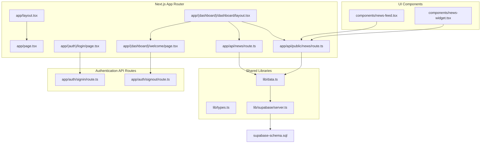
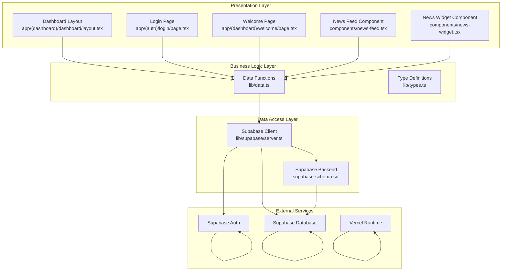
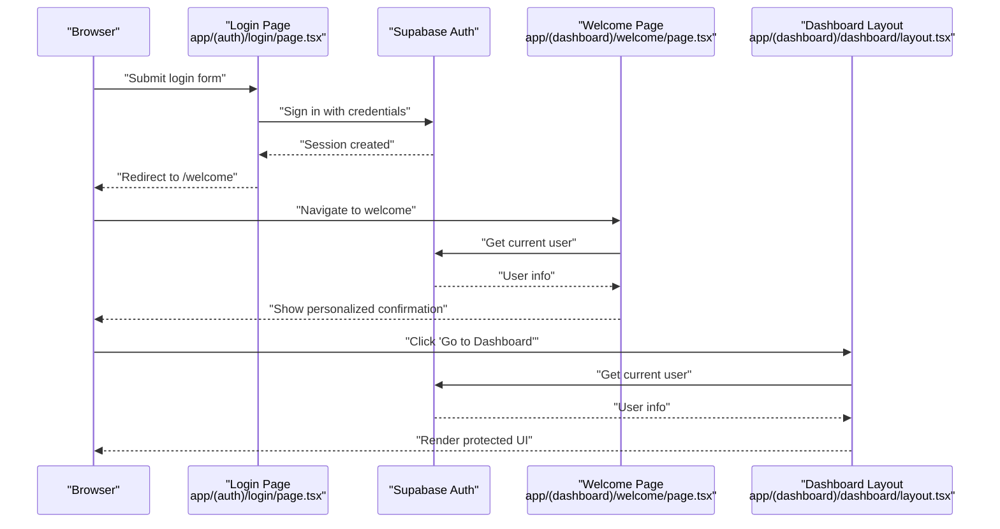
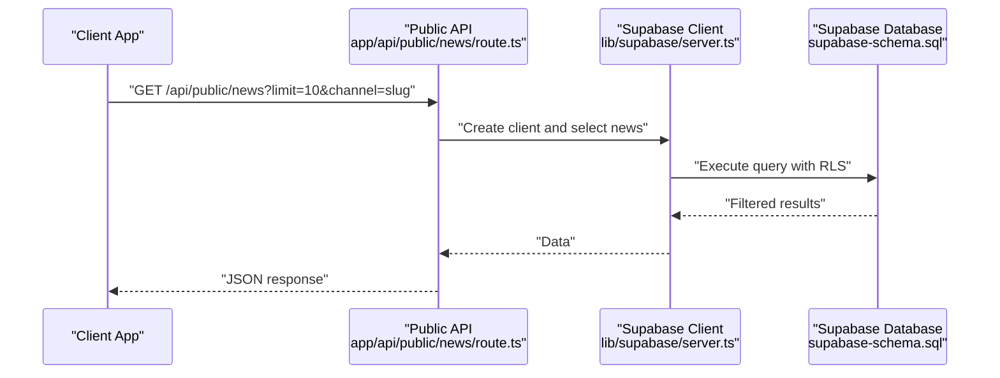
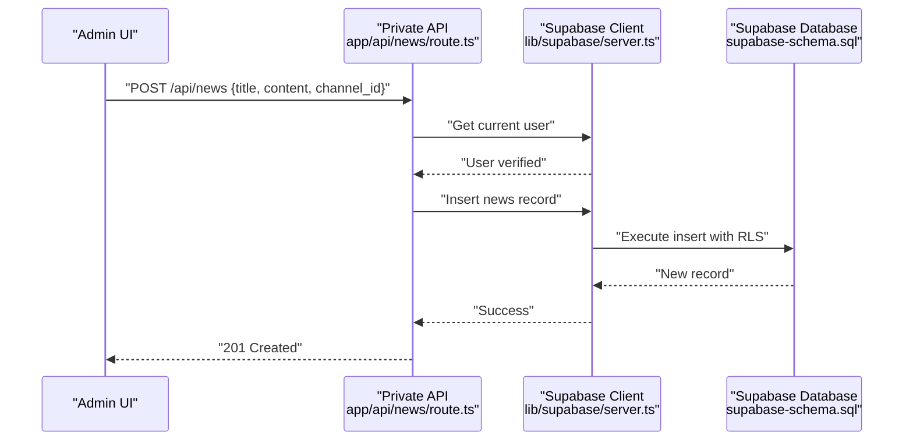
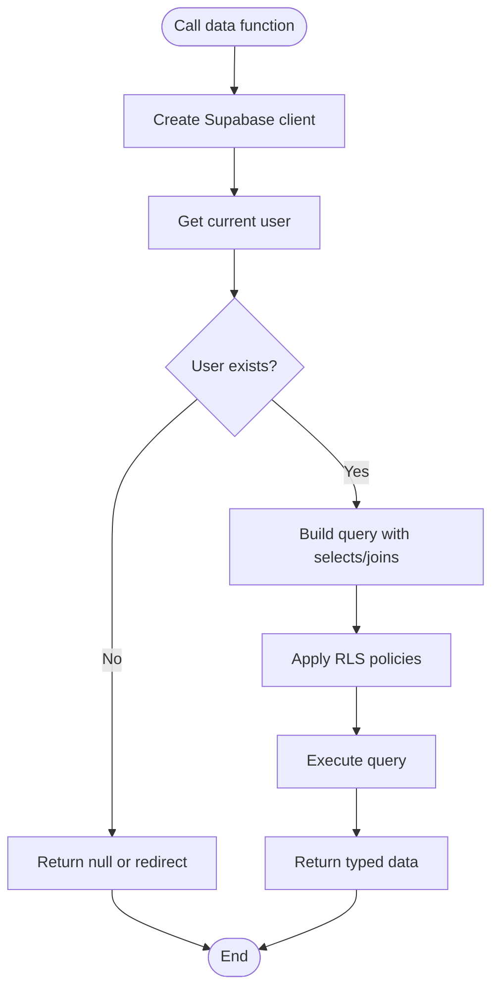
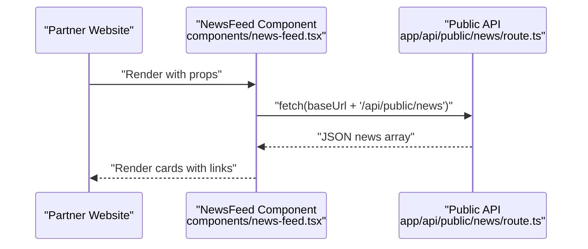
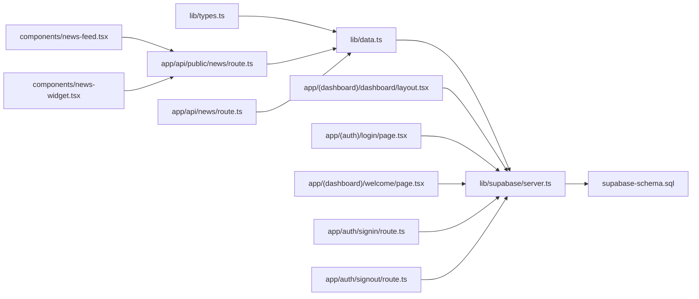

# System Architecture

<cite>
**Referenced Files in This Document**
- [README.md](file://README.md)
- [package.json](file://package.json)
- [next.config.js](file://next.config.js)
- [ARCHITECTURE.md](file://ARCHITECTURE.md)
- [DOCUMENTATION_GUIDE.md](file://DOCUMENTATION_GUIDE.md)
- [FILES.md](file://FILES.md)
- [FINAL_SUMMARY.md](file://FINAL_SUMMARY.md)
- [NEXT_STEPS.md](file://NEXT_STEPS.md)
- [PROJECT_SUMMARY.md](file://PROJECT_SUMMARY.md)
- [QUICKSTART.md](file://QUICKSTART.md)
- [supabase-schema.sql](file://supabase-schema.sql)
- [lib/types.ts](file://lib/types.ts)
- [lib/data.ts](file://lib/data.ts)
- [lib/supabase/server.ts](file://lib/supabase/server.ts)
- [app/layout.tsx](file://app/layout.tsx)
- [app/page.tsx](file://app/page.tsx)
- [app/(auth)/login/page.tsx](file://app/(auth)/login/page.tsx)
- [app/(dashboard)/dashboard/layout.tsx](file://app/(dashboard)/dashboard/layout.tsx)
- [app/(dashboard)/welcome/page.tsx](file://app/(dashboard)/welcome/page.tsx)
- [app/auth/signin/route.ts](file://app/auth/signin/route.ts)
- [app/auth/signout/route.ts](file://app/auth/signout/route.ts)
- [app/api/public/news/route.ts](file://app/api/public/news/route.ts)
- [app/api/news/route.ts](file://app/api/news/route.ts)
- [components/news-feed.tsx](file://components/news-feed.tsx)
- [components/news-widget.tsx](file://components/news-widget.tsx)
</cite>

## Update Summary
**Changes Made**
- Updated authentication flow documentation to reflect the new redirect behavior from `/dashboard` to `/welcome`
- Added documentation for the new welcome page component that provides personalized user confirmation
- Enhanced authentication sequence diagrams to show the improved user experience flow
- Updated component interaction diagrams to include the welcome page in the authentication flow

## Table of Contents
1. [Introduction](#introduction)
2. [Project Structure](#project-structure)
3. [Core Components](#core-components)
4. [Architecture Overview](#architecture-overview)
5. [Detailed Component Analysis](#detailed-component-analysis)
6. [Dependency Analysis](#dependency-analysis)
7. [Performance Considerations](#performance-considerations)
8. [Troubleshooting Guide](#troubleshooting-guide)
9. [Conclusion](#conclusion)
10. [Appendices](#appendices)

## Introduction
This document describes the system architecture of a multi-channel news management platform built with Next.js App Router. The platform supports server-side rendering for SEO and performance, while enabling client-side interactivity for dynamic user experiences. It integrates Supabase for authentication, relational data storage, and Row Level Security (RLS) policies to enforce fine-grained access control. The system is designed for cloud-native deployment on Vercel with scalable infrastructure patterns.

Key architectural goals:
- Layered architecture separating presentation, business logic, and data access
- Supabase-driven authentication, database, and RLS policies
- Public and private APIs for internal administration and external integrations
- Reusable React components for embedding news feeds on partner websites
- Production-ready deployment topology with Vercel

## Project Structure
The repository follows Next.js App Router conventions with a strict separation of routes, API handlers, shared libraries, and UI components.

**Diagram sources**
- [app/layout.tsx:1-22](file://app/layout.tsx#L1-L22)
- [app/page.tsx:1-102](file://app/page.tsx#L1-L102)
- [app/(auth)/login/page.tsx:1-80](file://app/(auth)/login/page.tsx#L1-L80)
- [app/(dashboard)/dashboard/layout.tsx:1-91](file://app/(dashboard)/dashboard/layout.tsx#L1-L91)
- [app/(dashboard)/welcome/page.tsx:1-59](file://app/(dashboard)/welcome/page.tsx#L1-L59)
- [app/auth/signin/route.ts:1-31](file://app/auth/signin/route.ts#L1-L31)
- [app/auth/signout/route.ts:1-14](file://app/auth/signout/route.ts#L1-L14)
- [app/api/public/news/route.ts:1-54](file://app/api/public/news/route.ts#L1-L54)
- [app/api/news/route.ts:1-58](file://app/api/news/route.ts#L1-L58)
- [lib/types.ts:1-62](file://lib/types.ts#L1-L62)
- [lib/data.ts:1-213](file://lib/data.ts#L1-L213)
- [lib/supabase/server.ts:1-30](file://lib/supabase/server.ts#L1-L30)
- [components/news-feed.tsx:1-152](file://components/news-feed.tsx#L1-L152)
- [components/news-widget.tsx:1-149](file://components/news-widget.tsx#L1-L149)
- [supabase-schema.sql:1-200](file://supabase-schema.sql#L1-L200)

**Section sources**
- [README.md:16-100](file://README.md#L16-L100)
- [package.json:1-30](file://package.json#L1-L30)
- [next.config.js:1-14](file://next.config.js#L1-L14)

## Core Components
- Presentation layer (React components):
  - Dashboard layout and navigation
  - Login page with form submission to Supabase Auth
  - Welcome page with personalized user confirmation
  - Public news feed and widget components for embedding
- Business logic layer (data.ts):
  - Typed CRUD operations for channels, editors, and news
  - User profile retrieval and channel membership queries
- Data access layer (Supabase client):
  - Server-side Supabase client configured with cookie handling
  - Environment-driven configuration for Supabase URL and keys

**Section sources**
- [lib/types.ts:1-62](file://lib/types.ts#L1-L62)
- [lib/data.ts:1-213](file://lib/data.ts#L1-L213)
- [lib/supabase/server.ts:1-30](file://lib/supabase/server.ts#L1-L30)
- [components/news-feed.tsx:1-152](file://components/news-feed.tsx#L1-L152)
- [components/news-widget.tsx:1-149](file://components/news-widget.tsx#L1-L149)

## Architecture Overview
The system employs a layered architecture:
- Presentation layer: Next.js App Router pages and React components
- Business logic layer: Shared data functions encapsulating Supabase queries
- Data access layer: Supabase client with RLS enforcement

**Diagram sources**
- [app/(dashboard)/dashboard/layout.tsx:1-91](file://app/(dashboard)/dashboard/layout.tsx#L1-L91)
- [app/(auth)/login/page.tsx:1-80](file://app/(auth)/login/page.tsx#L1-L80)
- [app/(dashboard)/welcome/page.tsx:1-59](file://app/(dashboard)/welcome/page.tsx#L1-L59)
- [components/news-feed.tsx:1-152](file://components/news-feed.tsx#L1-L152)
- [components/news-widget.tsx:1-149](file://components/news-widget.tsx#L1-L149)
- [lib/data.ts:1-213](file://lib/data.ts#L1-L213)
- [lib/types.ts:1-62](file://lib/types.ts#L1-L62)
- [lib/supabase/server.ts:1-30](file://lib/supabase/server.ts#L1-L30)
- [supabase-schema.sql:1-200](file://supabase-schema.sql#L1-L200)

## Detailed Component Analysis

### Enhanced Authentication Flow with Welcome Page
The system now features an improved authentication flow that provides a more personalized user experience. The login page redirects authenticated users to a welcome page that displays confirmation and user information before accessing the main dashboard.

**Updated** The authentication flow now includes a welcome page that provides personalized confirmation and information before accessing the main application interface.

**Diagram sources**
- [app/(auth)/login/page.tsx:1-80](file://app/(auth)/login/page.tsx#L1-L80)
- [app/(dashboard)/welcome/page.tsx:1-59](file://app/(dashboard)/welcome/page.tsx#L1-L59)
- [app/(dashboard)/dashboard/layout.tsx:1-91](file://app/(dashboard)/dashboard/layout.tsx#L1-L91)
- [lib/supabase/server.ts:1-30](file://lib/supabase/server.ts#L1-L30)

**Section sources**
- [README.md:287-303](file://README.md#L287-L303)
- [lib/supabase/server.ts:1-30](file://lib/supabase/server.ts#L1-L30)
- [app/(auth)/login/page.tsx:1-80](file://app/(auth)/login/page.tsx#L1-L80)
- [app/(dashboard)/welcome/page.tsx:1-59](file://app/(dashboard)/welcome/page.tsx#L1-L59)
- [app/(dashboard)/dashboard/layout.tsx:1-91](file://app/(dashboard)/dashboard/layout.tsx#L1-L91)

### Public API for News Retrieval
Public consumers can fetch published news via a REST endpoint. The API performs server-side queries with RLS policies applied.

**Diagram sources**
- [app/api/public/news/route.ts:1-54](file://app/api/public/news/route.ts#L1-L54)
- [lib/supabase/server.ts:1-30](file://lib/supabase/server.ts#L1-L30)
- [supabase-schema.sql:147-200](file://supabase-schema.sql#L147-L200)

**Section sources**
- [README.md:361-374](file://README.md#L361-L374)
- [app/api/public/news/route.ts:1-54](file://app/api/public/news/route.ts#L1-L54)

### Private API for News Management
Administrative actions require authentication. The private API validates the user session and enforces role-based permissions.

**Diagram sources**
- [app/api/news/route.ts:1-58](file://app/api/news/route.ts#L1-L58)
- [lib/supabase/server.ts:1-30](file://lib/supabase/server.ts#L1-L30)
- [supabase-schema.sql:147-200](file://supabase-schema.sql#L147-L200)

**Section sources**
- [README.md:367-374](file://README.md#L367-L374)
- [app/api/news/route.ts:1-58](file://app/api/news/route.ts#L1-L58)

### Data Access Layer and RLS Policies
The data access layer encapsulates all database interactions through typed functions. Supabase RLS policies ensure data isolation and access control across roles.

**Diagram sources**
- [lib/data.ts:1-213](file://lib/data.ts#L1-L213)
- [lib/supabase/server.ts:1-30](file://lib/supabase/server.ts#L1-L30)
- [supabase-schema.sql:147-200](file://supabase-schema.sql#L147-L200)

**Section sources**
- [lib/data.ts:1-213](file://lib/data.ts#L1-L213)
- [supabase-schema.sql:147-200](file://supabase-schema.sql#L147-L200)

### React Components for Embedding
The public-facing components fetch data from the public API and render news lists or widgets with optional images and excerpts.

**Diagram sources**
- [components/news-feed.tsx:1-152](file://components/news-feed.tsx#L1-L152)
- [app/api/public/news/route.ts:1-54](file://app/api/public/news/route.ts#L1-L54)

**Section sources**
- [README.md:149-285](file://README.md#L149-L285)
- [components/news-feed.tsx:1-152](file://components/news-feed.tsx#L1-L152)
- [components/news-widget.tsx:1-149](file://components/news-widget.tsx#L1-L149)

## Dependency Analysis
The system exhibits clean separation of concerns with explicit dependencies between layers.

**Diagram sources**
- [lib/types.ts:1-62](file://lib/types.ts#L1-L62)
- [lib/data.ts:1-213](file://lib/data.ts#L1-L213)
- [lib/supabase/server.ts:1-30](file://lib/supabase/server.ts#L1-L30)
- [supabase-schema.sql:1-200](file://supabase-schema.sql#L1-L200)
- [app/api/public/news/route.ts:1-54](file://app/api/public/news/route.ts#L1-L54)
- [app/api/news/route.ts:1-58](file://app/api/news/route.ts#L1-L58)
- [app/(dashboard)/dashboard/layout.tsx:1-91](file://app/(dashboard)/dashboard/layout.tsx#L1-L91)
- [app/(auth)/login/page.tsx:1-80](file://app/(auth)/login/page.tsx#L1-L80)
- [app/(dashboard)/welcome/page.tsx:1-59](file://app/(dashboard)/welcome/page.tsx#L1-L59)
- [app/auth/signin/route.ts:1-31](file://app/auth/signin/route.ts#L1-L31)
- [app/auth/signout/route.ts:1-14](file://app/auth/signout/route.ts#L1-L14)
- [components/news-feed.tsx:1-152](file://components/news-feed.tsx#L1-L152)
- [components/news-widget.tsx:1-149](file://components/news-widget.tsx#L1-L149)

**Section sources**
- [package.json:11-28](file://package.json#L11-L28)
- [next.config.js:1-14](file://next.config.js#L1-L14)

## Performance Considerations
- Database indexing: Indexes on frequently filtered and sorted columns (e.g., channels.slug, news.status, news.published_at) improve query performance.
- RLS overhead: RLS policies are enforced server-side; keep queries selective and avoid unnecessary joins to minimize overhead.
- Client-side caching: Public components can cache results per channel and limit to reduce network requests.
- Image optimization: Next.js image optimization is configured for Supabase-hosted images.
- CDN and edge: Vercel's global edge network reduces latency for API and static assets.

## Troubleshooting Guide
Common issues and resolutions:
- Authentication failures: Verify environment variables for Supabase URL and keys; ensure cookies are readable by the server.
- Unauthorized API responses: Confirm the user is signed in and has appropriate role/permissions; check RLS policy bindings.
- CORS and image errors: Ensure Next.js image remote patterns include Supabase domains.
- Database connectivity: Validate Supabase project URL and service role key; confirm database is reachable and migrations applied.

**Section sources**
- [README.md:71-92](file://README.md#L71-L92)
- [next.config.js:1-14](file://next.config.js#L1-L14)
- [lib/supabase/server.ts:1-30](file://lib/supabase/server.ts#L1-L30)

## Conclusion
The blog management system leverages Next.js App Router for a modern, cloud-native architecture. Supabase provides a cohesive backend for authentication, relational data, and RLS policies. The layered design ensures maintainability, while the public/private API boundaries support both internal dashboards and external integrations. The enhanced authentication flow with the welcome page provides a more personalized user experience. Deployment on Vercel enables scalable, globally distributed delivery with minimal operational overhead.

## Appendices

### Technology Stack and Integration Points
- Frontend: Next.js 16, React 19, TypeScript
- Styling: Tailwind CSS
- Icons: Lucide React
- Date formatting: date-fns
- Supabase: @supabase/ssr, @supabase/supabase-js
- Build and linting: ESLint, PostCSS, Autoprefixer

**Section sources**
- [package.json:11-28](file://package.json#L11-L28)

### Infrastructure and Deployment
- Platform: Vercel (recommended)
- Environment variables: Supabase URL, anonymous key, service role key, app URL
- Remote image optimization: Supabase domain patterns
- Database schema: Supabase-managed tables, triggers, indexes, and RLS policies

**Section sources**
- [README.md:375-397](file://README.md#L375-L397)
- [next.config.js:1-14](file://next.config.js#L1-L14)
- [supabase-schema.sql:1-200](file://supabase-schema.sql#L1-L200)