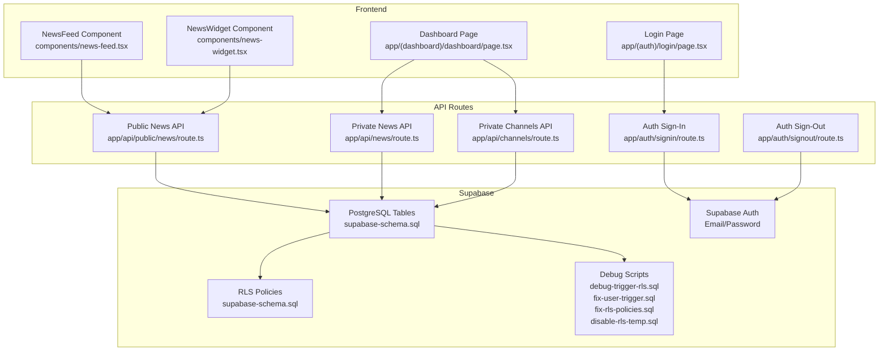
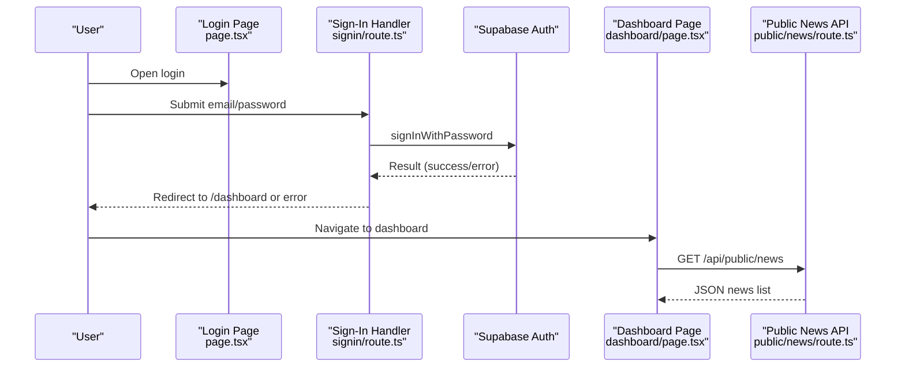
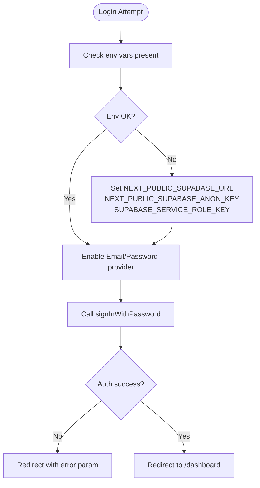
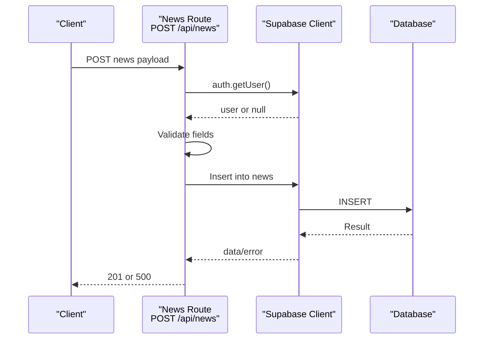
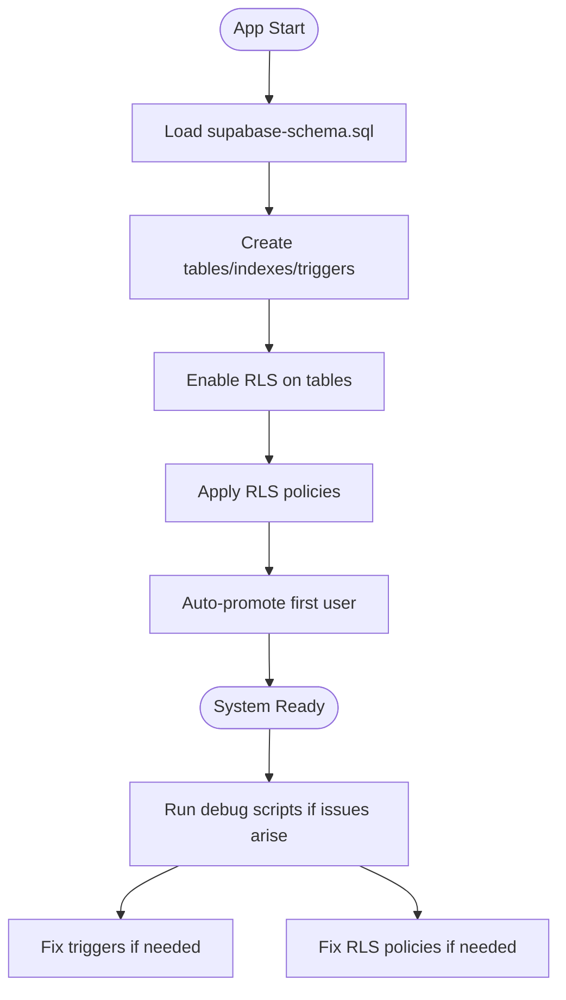
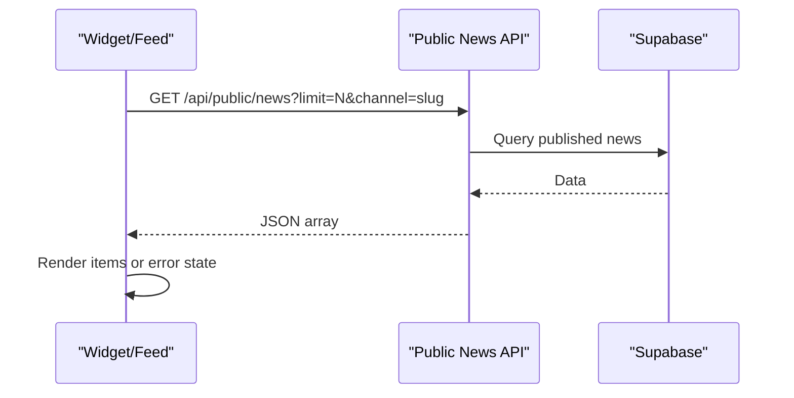
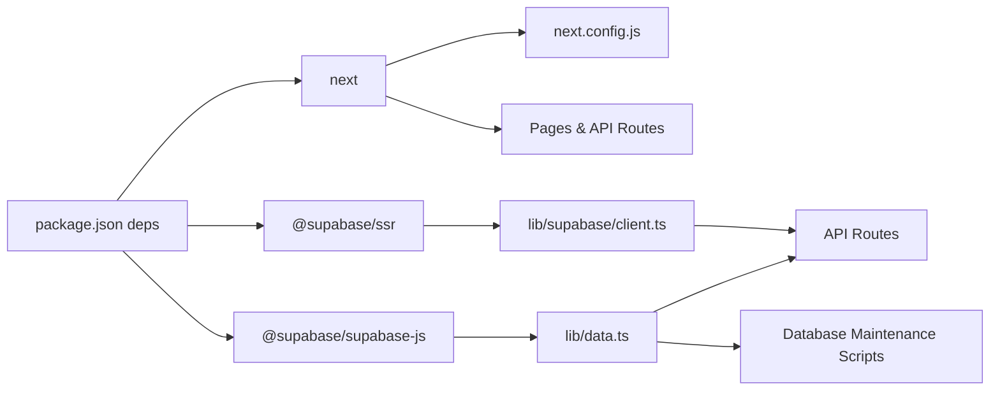

# Troubleshooting and FAQ

<cite>
**Referenced Files in This Document**
- [README.md](file://README.md)
- [package.json](file://package.json)
- [next.config.js](file://next.config.js)
- [supabase-schema.sql](file://supabase-schema.sql)
- [debug-trigger-rls.sql](file://debug-trigger-rls.sql)
- [fix-user-trigger.sql](file://fix-user-trigger.sql)
- [fix-rls-policies.sql](file://fix-rls-policies.sql)
- [disable-rls-temp.sql](file://disable-rls-temp.sql)
- [lib/supabase/client.ts](file://lib/supabase/client.ts)
- [lib/data.ts](file://lib/data.ts)
- [lib/types.ts](file://lib/types.ts)
- [app/api/news/route.ts](file://app/api/news/route.ts)
- [app/api/channels/route.ts](file://app/api/channels/route.ts)
- [app/api/public/news/route.ts](file://app/api/public/news/route.ts)
- [app/auth/signin/route.ts](file://app/auth/signin/route.ts)
- [app/auth/signout/route.ts](file://app/auth/signout/route.ts)
- [components/news-feed.tsx](file://components/news-feed.tsx)
- [components/news-widget.tsx](file://components/news-widget.tsx)
- [app/(auth)/login/page.tsx](file://app/(auth)/login/page.tsx)
- [app/(dashboard)/dashboard/page.tsx](file://app/(dashboard)/dashboard/page.tsx)
</cite>

## Update Summary
**Changes Made**
- Added comprehensive database maintenance section covering new SQL debugging scripts
- Updated security troubleshooting with dedicated RLS policy management procedures
- Enhanced trigger debugging and resolution workflows
- Added database maintenance best practices and automated recovery procedures
- Expanded troubleshooting coverage for Supabase-specific issues

## Table of Contents
1. [Introduction](#introduction)
2. [Project Structure](#project-structure)
3. [Core Components](#core-components)
4. [Architecture Overview](#architecture-overview)
5. [Detailed Component Analysis](#detailed-component-analysis)
6. [Dependency Analysis](#dependency-analysis)
7. [Performance Considerations](#performance-considerations)
8. [Troubleshooting Guide](#troubleshooting-guide)
9. [Database Maintenance and Recovery](#database-maintenance-and-recovery)
10. [Conclusion](#conclusion)
11. [Appendices](#appendices)

## Introduction
This document provides a comprehensive troubleshooting guide and FAQ for the news management system. It focuses on diagnosing and resolving common setup and runtime issues, including environment configuration, database connectivity, authentication failures, API endpoint problems, frontend rendering issues, performance bottlenecks, and security-related concerns such as Row Level Security (RLS) policy conflicts. It also includes guidance for interpreting error messages, analyzing logs, performing backups and recovery, and utilizing specialized database maintenance scripts for debugging and fixing Supabase trigger and RLS issues.

## Project Structure
The system is a Next.js application integrating with Supabase for authentication, database, and serverless functions. Key areas relevant to troubleshooting:
- Environment configuration and client initialization
- API routes for private and public endpoints
- Frontend components consuming public APIs
- Supabase schema and RLS policies
- Authentication flows and redirects
- Database maintenance and debugging scripts

**Diagram sources**
- [app/(auth)/login/page.tsx](file://app/(auth)/login/page.tsx#L1-L80)
- [app/(dashboard)/dashboard/page.tsx](file://app/(dashboard)/dashboard/page.tsx#L1-L83)
- [components/news-feed.tsx:1-152](file://components/news-feed.tsx#L1-L152)
- [components/news-widget.tsx:1-149](file://components/news-widget.tsx#L1-L149)
- [app/api/public/news/route.ts:1-54](file://app/api/public/news/route.ts#L1-L54)
- [app/api/news/route.ts:1-58](file://app/api/news/route.ts#L1-L58)
- [app/api/channels/route.ts:1-71](file://app/api/channels/route.ts#L1-L71)
- [app/auth/signin/route.ts:1-31](file://app/auth/signin/route.ts#L1-L31)
- [app/auth/signout/route.ts:1-14](file://app/auth/signout/route.ts#L1-L14)
- [supabase-schema.sql:1-258](file://supabase-schema.sql#L1-L258)
- [debug-trigger-rls.sql:1-40](file://debug-trigger-rls.sql#L1-L40)
- [fix-user-trigger.sql:1-34](file://fix-user-trigger.sql#L1-L34)
- [fix-rls-policies.sql:1-124](file://fix-rls-policies.sql#L1-L124)
- [disable-rls-temp.sql:1-9](file://disable-rls-temp.sql#L1-L9)

**Section sources**
- [README.md:1-517](file://README.md#L1-L517)
- [package.json:1-30](file://package.json#L1-L30)
- [next.config.js:1-14](file://next.config.js#L1-L14)

## Core Components
- Supabase client initialization for browser-side operations
- Data access functions for user, channels, editors, and news
- Public and private API routes with authentication checks and validations
- Frontend components that call public endpoints and render news feeds
- Supabase schema with RLS policies and indexes
- Database maintenance scripts for debugging and recovery

Key implementation references:
- Supabase browser client creation
  - [lib/supabase/client.ts:1-9](file://lib/supabase/client.ts#L1-L9)
- Data access helpers
  - [lib/data.ts:1-213](file://lib/data.ts#L1-L213)
  - [lib/types.ts:1-62](file://lib/types.ts#L1-L62)
- Public API endpoints
  - [app/api/public/news/route.ts:1-54](file://app/api/public/news/route.ts#L1-L54)
- Private API endpoints
  - [app/api/news/route.ts:1-58](file://app/api/news/route.ts#L1-L58)
  - [app/api/channels/route.ts:1-71](file://app/api/channels/route.ts#L1-L71)
- Authentication handlers
  - [app/auth/signin/route.ts:1-31](file://app/auth/signin/route.ts#L1-L31)
  - [app/auth/signout/route.ts:1-14](file://app/auth/signout/route.ts#L1-L14)
- Frontend components
  - [components/news-feed.tsx:1-152](file://components/news-feed.tsx#L1-L152)
  - [components/news-widget.tsx:1-149](file://components/news-widget.tsx#L1-L149)
- Database maintenance scripts
  - [debug-trigger-rls.sql:1-40](file://debug-trigger-rls.sql#L1-L40)
  - [fix-user-trigger.sql:1-34](file://fix-user-trigger.sql#L1-L34)
  - [fix-rls-policies.sql:1-124](file://fix-rls-policies.sql#L1-L124)
  - [disable-rls-temp.sql:1-9](file://disable-rls-temp.sql#L1-L9)

**Section sources**
- [lib/supabase/client.ts:1-9](file://lib/supabase/client.ts#L1-L9)
- [lib/data.ts:1-213](file://lib/data.ts#L1-L213)
- [lib/types.ts:1-62](file://lib/types.ts#L1-L62)
- [app/api/public/news/route.ts:1-54](file://app/api/public/news/route.ts#L1-L54)
- [app/api/news/route.ts:1-58](file://app/api/news/route.ts#L1-L58)
- [app/api/channels/route.ts:1-71](file://app/api/channels/route.ts#L1-L71)
- [app/auth/signin/route.ts:1-31](file://app/auth/signin/route.ts#L1-L31)
- [app/auth/signout/route.ts:1-14](file://app/auth/signout/route.ts#L1-L14)
- [components/news-feed.tsx:1-152](file://components/news-feed.tsx#L1-L152)
- [components/news-widget.tsx:1-149](file://components/news-widget.tsx#L1-L149)
- [debug-trigger-rls.sql:1-40](file://debug-trigger-rls.sql#L1-L40)
- [fix-user-trigger.sql:1-34](file://fix-user-trigger.sql#L1-L34)
- [fix-rls-policies.sql:1-124](file://fix-rls-policies.sql#L1-L124)
- [disable-rls-temp.sql:1-9](file://disable-rls-temp.sql#L1-L9)

## Architecture Overview
High-level flow for authentication and data retrieval:
- Login page posts credentials to the sign-in handler
- Successful sign-in redirects to the dashboard
- Dashboard and public components call Supabase-backed API routes
- API routes enforce authentication and authorization via Supabase Auth and RLS
- Database maintenance scripts provide debugging and recovery capabilities

**Diagram sources**
- [app/(auth)/login/page.tsx](file://app/(auth)/login/page.tsx#L1-L80)
- [app/auth/signin/route.ts:1-31](file://app/auth/signin/route.ts#L1-L31)
- [app/(dashboard)/dashboard/page.tsx](file://app/(dashboard)/dashboard/page.tsx#L1-L83)
- [app/api/public/news/route.ts:1-54](file://app/api/public/news/route.ts#L1-L54)

## Detailed Component Analysis

### Authentication Troubleshooting
Common symptoms:
- Redirect loops after login
- "Invalid credentials" or "missing fields" errors
- Session not persisting across reloads

Root causes and fixes:
- Verify environment variables for Supabase URL and keys are present and correct
  - [README.md:71-92](file://README.md#L71-L92)
- Confirm Supabase Auth provider (Email/Password) is enabled
  - [README.md:52-54](file://README.md#L52-L54)
- Ensure the sign-in handler receives both email and password
  - [app/auth/signin/route.ts:10-12](file://app/auth/signin/route.ts#L10-L12)
- Check that the browser client is initialized with environment variables
  - [lib/supabase/client.ts:3-8](file://lib/supabase/client.ts#L3-L8)
- Validate that the Next.js config allows images from Supabase domains
  - [next.config.js:3-10](file://next.config.js#L3-L10)

**Diagram sources**
- [lib/supabase/client.ts:3-8](file://lib/supabase/client.ts#L3-L8)
- [app/auth/signin/route.ts:10-23](file://app/auth/signin/route.ts#L10-L23)
- [README.md:52-54](file://README.md#L52-L54)

**Section sources**
- [README.md:52-92](file://README.md#L52-L92)
- [lib/supabase/client.ts:1-9](file://lib/supabase/client.ts#L1-L9)
- [app/auth/signin/route.ts:1-31](file://app/auth/signin/route.ts#L1-L31)
- [next.config.js:1-14](file://next.config.js#L1-L14)

### API Endpoint Failures
Symptoms:
- 401 Unauthorized on private endpoints
- 403 Forbidden when creating channels
- 500 Internal Server Error on create/publish operations

Diagnosis steps:
- Private endpoints require a valid session; verify login and cookies
  - [app/api/news/route.ts:8-12](file://app/api/news/route.ts#L8-L12)
  - [app/api/channels/route.ts:30-44](file://app/api/channels/route.ts#L30-L44)
- Super admin privileges are required for creating channels
  - [app/api/channels/route.ts:36-44](file://app/api/channels/route.ts#L36-L44)
- Validate request payload and required fields
  - [app/api/news/route.ts:17-23](file://app/api/news/route.ts#L17-L23)
- Inspect server logs for thrown errors
  - [app/api/news/route.ts:50-56](file://app/api/news/route.ts#L50-L56)
  - [app/api/channels/route.ts:63-69](file://app/api/channels/route.ts#L63-L69)

**Diagram sources**
- [app/api/news/route.ts:1-58](file://app/api/news/route.ts#L1-L58)

**Section sources**
- [app/api/news/route.ts:1-58](file://app/api/news/route.ts#L1-L58)
- [app/api/channels/route.ts:1-71](file://app/api/channels/route.ts#L1-L71)

### Database Connectivity and Schema Issues
Symptoms:
- Queries fail with permission errors
- RLS prevents viewing published news or managing content
- Indexes missing causing slow queries
- User profile creation failing silently

Resolution:
- Confirm Supabase project URL and keys are configured
  - [README.md:71-92](file://README.md#L71-L92)
- Run the schema script to create tables, indexes, triggers, and RLS policies
  - [supabase-schema.sql:1-258](file://supabase-schema.sql#L1-L258)
- Verify RLS policies for public news visibility and author/editor access
  - [supabase-schema.sql:211-237](file://supabase-schema.sql#L211-L237)
- Ensure the first user is promoted to super_admin automatically
  - [supabase-schema.sql:53-74](file://supabase-schema.sql#L53-L74)
- Use database maintenance scripts for debugging complex issues
  - [debug-trigger-rls.sql:1-40](file://debug-trigger-rls.sql#L1-L40)
  - [fix-user-trigger.sql:1-34](file://fix-user-trigger.sql#L1-L34)
  - [fix-rls-policies.sql:1-124](file://fix-rls-policies.sql#L1-L124)

**Diagram sources**
- [supabase-schema.sql:1-258](file://supabase-schema.sql#L1-L258)
- [debug-trigger-rls.sql:1-40](file://debug-trigger-rls.sql#L1-L40)
- [fix-user-trigger.sql:1-34](file://fix-user-trigger.sql#L1-L34)
- [fix-rls-policies.sql:1-124](file://fix-rls-policies.sql#L1-L124)

**Section sources**
- [README.md:37-92](file://README.md#L37-L92)
- [supabase-schema.sql:1-258](file://supabase-schema.sql#L1-L258)
- [debug-trigger-rls.sql:1-40](file://debug-trigger-rls.sql#L1-L40)
- [fix-user-trigger.sql:1-34](file://fix-user-trigger.sql#L1-L34)
- [fix-rls-policies.sql:1-124](file://fix-rls-policies.sql#L1-L124)

### Frontend Rendering Problems
Symptoms:
- News feed shows "loading…" indefinitely
- "Failed to fetch news" error displayed
- Images not loading due to domain restrictions

Checks:
- Public API endpoint returns JSON; verify base URL and query params
  - [components/news-feed.tsx:44-54](file://components/news-feed.tsx#L44-L54)
- Ensure Next.js image remote pattern includes Supabase domains
  - [next.config.js:3-10](file://next.config.js#L3-L10)
- Confirm date-fns locale is imported for proper formatting
  - [components/news-feed.tsx:4-5](file://components/news-feed.tsx#L4-L5)

**Diagram sources**
- [components/news-feed.tsx:41-64](file://components/news-feed.tsx#L41-L64)
- [app/api/public/news/route.ts:4-45](file://app/api/public/news/route.ts#L4-L45)

**Section sources**
- [components/news-feed.tsx:1-152](file://components/news-feed.tsx#L1-L152)
- [components/news-widget.tsx:1-149](file://components/news-widget.tsx#L1-L149)
- [next.config.js:1-14](file://next.config.js#L1-L14)
- [app/api/public/news/route.ts:1-54](file://app/api/public/news/route.ts#L1-L54)

## Dependency Analysis
External dependencies and integrations:
- Next.js runtime and configuration
- Supabase SDKs for SSR and browser clients
- PostgreSQL with RLS and indexes
- Database maintenance scripts for debugging and recovery

**Diagram sources**
- [package.json:11-27](file://package.json#L11-L27)
- [next.config.js:1-14](file://next.config.js#L1-L14)
- [lib/data.ts:1-3](file://lib/data.ts#L1-L3)
- [lib/supabase/client.ts:1-8](file://lib/supabase/client.ts#L1-L8)
- [debug-trigger-rls.sql:1-40](file://debug-trigger-rls.sql#L1-L40)
- [fix-user-trigger.sql:1-34](file://fix-user-trigger.sql#L1-L34)
- [fix-rls-policies.sql:1-124](file://fix-rls-policies.sql#L1-L124)

**Section sources**
- [package.json:1-30](file://package.json#L1-L30)
- [next.config.js:1-14](file://next.config.js#L1-L14)
- [lib/data.ts:1-3](file://lib/data.ts#L1-L3)
- [lib/supabase/client.ts:1-9](file://lib/supabase/client.ts#L1-L9)
- [debug-trigger-rls.sql:1-40](file://debug-trigger-rls.sql#L1-L40)
- [fix-user-trigger.sql:1-34](file://fix-user-trigger.sql#L1-L34)
- [fix-rls-policies.sql:1-124](file://fix-rls-policies.sql#L1-L124)

## Performance Considerations
- Database indexes
  - Published news ordering and filtering rely on indexes
  - [supabase-schema.sql:114-126](file://supabase-schema.sql#L114-L126)
- RLS overhead
  - RLS policies add checks per row; keep queries selective
  - [supabase-schema.sql:211-237](file://supabase-schema.sql#L211-L237)
- Frontend image loading
  - Configure remote patterns to avoid mixed-content and extra hops
  - [next.config.js:3-10](file://next.config.js#L3-L10)
- API pagination and limits
  - Use limit query params to cap payload sizes
  - [app/api/public/news/route.ts:10-11](file://app/api/public/news/route.ts#L10-L11)

[No sources needed since this section provides general guidance]

## Troubleshooting Guide

### Setup Problems
- Environment variables misconfiguration
  - Symptoms: Blank pages, auth failures, API 500s
  - Steps:
    - Copy example env file and fill Supabase URL, anon key, service role key, and app URL
      - [README.md:71-92](file://README.md#L71-L92)
    - Verify client initialization uses environment variables
      - [lib/supabase/client.ts:3-8](file://lib/supabase/client.ts#L3-L8)
- Database connection issues
  - Symptoms: Queries fail immediately, RLS denies access
  - Steps:
    - Run the schema script to create tables, indexes, triggers, and RLS
      - [supabase-schema.sql:1-258](file://supabase-schema.sql#L1-L258)
    - Confirm first user is promoted to super_admin
      - [supabase-schema.sql:53-74](file://supabase-schema.sql#L53-L74)
- Authentication failures
  - Symptoms: "Invalid credentials," redirect loops
  - Steps:
    - Enable Email/Password provider
      - [README.md:52-54](file://README.md#L52-L54)
    - Ensure sign-in handler validates presence of email and password
      - [app/auth/signin/route.ts:10-12](file://app/auth/signin/route.ts#L10-L12)

**Section sources**
- [README.md:52-92](file://README.md#L52-L92)
- [lib/supabase/client.ts:1-9](file://lib/supabase/client.ts#L1-L9)
- [supabase-schema.sql:1-258](file://supabase-schema.sql#L1-L258)
- [app/auth/signin/route.ts:1-31](file://app/auth/signin/route.ts#L1-L31)

### Runtime Errors
- Permission denied messages
  - Symptoms: 401 Unauthorized or 403 Forbidden on private endpoints
  - Steps:
    - Verify user is authenticated before accessing private endpoints
      - [app/api/news/route.ts:8-12](file://app/api/news/route.ts#L8-L12)
      - [app/api/channels/route.ts:30-44](file://app/api/channels/route.ts#L30-L44)
    - Ensure user has super_admin role to create channels
      - [app/api/channels/route.ts:36-44](file://app/api/channels/route.ts#L36-L44)
- API endpoint failures
  - Symptoms: 500 errors when creating or updating news
  - Steps:
    - Validate required fields in request body
      - [app/api/news/route.ts:17-23](file://app/api/news/route.ts#L17-L23)
    - Inspect server logs for thrown errors
      - [app/api/news/route.ts:50-56](file://app/api/news/route.ts#L50-L56)
- Component integration problems
  - Symptoms: News feed stuck on loading, "Failed to fetch news"
  - Steps:
    - Confirm public API endpoint returns JSON and is reachable
      - [components/news-feed.tsx:44-54](file://components/news-feed.tsx#L44-L54)
    - Ensure Next.js image remote pattern includes Supabase domains
      - [next.config.js:3-10](file://next.config.js#L3-L10)

**Section sources**
- [app/api/news/route.ts:1-58](file://app/api/news/route.ts#L1-L58)
- [app/api/channels/route.ts:1-71](file://app/api/channels/route.ts#L1-L71)
- [components/news-feed.tsx:1-152](file://components/news-feed.tsx#L1-L152)
- [next.config.js:1-14](file://next.config.js#L1-L14)

### Debugging Strategies
- Database queries
  - Use Supabase SQL Editor to test queries and confirm indexes are effective
  - [supabase-schema.sql:114-126](file://supabase-schema.sql#L114-L126)
- API request/response issues
  - Log request bodies and response statuses; check for thrown errors
  - [app/api/news/route.ts:50-56](file://app/api/news/route.ts#L50-L56)
- Frontend component rendering
  - Add console logging around fetch calls and error boundaries
  - [components/news-feed.tsx:41-64](file://components/news-feed.tsx#L41-L64)

**Section sources**
- [supabase-schema.sql:114-126](file://supabase-schema.sql#L114-L126)
- [app/api/news/route.ts:50-56](file://app/api/news/route.ts#L50-L56)
- [components/news-feed.tsx:41-64](file://components/news-feed.tsx#L41-L64)

### Security Troubleshooting
- Authentication problems
  - Ensure Email/Password provider is enabled and credentials are correct
  - [README.md:52-54](file://README.md#L52-L54)
- Authorization failures
  - Verify user roles and permissions in user_profiles and channel_editors
  - [supabase-schema.sql:169-237](file://supabase-schema.sql#L169-L237)
- RLS policy conflicts
  - Confirm policies allow intended access patterns (published news visible, authors/editors can manage)
  - [supabase-schema.sql:211-237](file://supabase-schema.sql#L211-L237)

**Section sources**
- [README.md:52-54](file://README.md#L52-L54)
- [supabase-schema.sql:169-237](file://supabase-schema.sql#L169-L237)

### Error Message Interpretation and Diagnostics
- "Missing required fields" on news creation
  - Indicates missing title, content, or channel_id
  - [app/api/news/route.ts:17-23](file://app/api/news/route.ts#L17-L23)
- "Unauthorized"
  - No active session; re-authenticate
  - [app/api/news/route.ts:10-12](file://app/api/news/route.ts#L10-L12)
- "Forbidden"
  - Insufficient role for operation (e.g., creating channels)
  - [app/api/channels/route.ts:42-44](file://app/api/channels/route.ts#L42-L44)
- "Failed to fetch news"
  - Network or backend error; inspect server logs
  - [components/news-feed.tsx:56-58](file://components/news-feed.tsx#L56-L58)

**Section sources**
- [app/api/news/route.ts:17-23](file://app/api/news/route.ts#L17-L23)
- [app/api/news/route.ts:10-12](file://app/api/news/route.ts#L10-L12)
- [app/api/channels/route.ts:42-44](file://app/api/channels/route.ts#L42-L44)
- [components/news-feed.tsx:56-58](file://components/news-feed.tsx#L56-L58)

### Community Support, Issue Reporting, and Escalation
- Review documentation and examples first
  - [README.md:501-509](file://README.md#L501-L509)
- Provide environment details, error logs, and reproduction steps when requesting help

**Section sources**
- [README.md:501-509](file://README.md#L501-L509)

### Known Limitations and Workarounds
- First user promotion
  - The first registered user is automatically promoted to super_admin
  - [supabase-schema.sql:53-74](file://supabase-schema.sql#L53-L74)
- Channel creation requires super_admin
  - [app/api/channels/route.ts:36-44](file://app/api/channels/route.ts#L36-L44)
- Public news visibility depends on status filter
  - [app/api/public/news/route.ts:33-34](file://app/api/public/news/route.ts#L33-L34)

**Section sources**
- [supabase-schema.sql:53-74](file://supabase-schema.sql#L53-L74)
- [app/api/channels/route.ts:36-44](file://app/api/channels/route.ts#L36-L44)
- [app/api/public/news/route.ts:33-34](file://app/api/public/news/route.ts#L33-L34)

### Migration Guidance
- Upgrading Supabase or Next.js
  - Back up schema and data before applying changes
  - Test authentication and RLS policies after upgrades
  - Validate API routes and frontend components

[No sources needed since this section provides general guidance]

### Backup and Recovery Procedures
- Database backups
  - Use Supabase project settings to export/import SQL or use continuous replication
- Data integrity verification
  - Confirm indexes exist and RLS policies are applied
  - [supabase-schema.sql:114-126](file://supabase-schema.sql#L114-L126)
  - [supabase-schema.sql:147-258](file://supabase-schema.sql#L147-L258)
- Disaster recovery planning
  - Maintain environment variables in secure secret storage
  - Automate deployment with CI/CD and validate health checks post-deploy

[No sources needed since this section provides general guidance]

## Database Maintenance and Recovery

### Database Maintenance Scripts Overview
The system now includes four specialized SQL scripts designed to debug and fix common Supabase issues:

#### debug-trigger-rls.sql - Comprehensive Trigger and RLS Diagnostics
This script provides a systematic approach to diagnosing trigger and RLS-related problems:
- Checks trigger existence and activation status
- Verifies RLS policies on user_profiles table
- Lists all policies on user_profiles for review
- Tests direct inserts to bypass trigger issues
- Validates manual insert results

**Usage**: Execute in Supabase SQL Editor to diagnose trigger and RLS issues comprehensively.

#### fix-user-trigger.sql - User Profile Creation Trigger Repair
Addresses issues with automatic user profile creation during authentication:
- Drops existing problematic trigger function
- Recreates trigger function with improved error handling
- Ensures ON CONFLICT handling to prevent duplicates
- Recreates the trigger with proper timing (AFTER INSERT)
- Temporarily disables RLS on user_profiles for testing

**Usage**: Execute when user registration fails to create profiles automatically.

#### fix-rls-policies.sql - RLS Policy Recovery and Optimization
Resolves complex RLS policy conflicts and infinite recursion issues:
- Drops all existing problematic policies
- Creates new, properly structured policies
- Prevents infinite recursion in policy evaluation
- Maintains proper access control semantics
- Optimizes policy conditions for better performance

**Usage**: Execute when RLS policies cause query failures or infinite loops.

#### disable-rls-temp.sql - Temporary RLS Disabling for Testing
Provides a safe way to temporarily disable RLS for debugging purposes:
- Disables RLS on all major tables (user_profiles, channels, channel_editors, news, news_channels)
- Allows testing without RLS interference
- Should be used only for debugging and immediately re-enabled

**Usage**: Execute temporarily to isolate RLS-related issues.

### Maintenance Workflow Procedures

#### Trigger and RLS Debugging Workflow
1. **Initial Diagnosis**: Run debug-trigger-rls.sql to identify specific issues
2. **Trigger Verification**: Check if on_auth_user_created trigger exists and is active
3. **RLS Status Check**: Verify RLS policies on user_profiles table
4. **Policy Review**: Examine all policies for conflicts or inefficiencies
5. **Direct Access Test**: Test bypassing trigger to isolate issues
6. **Resolution**: Apply appropriate fix script based on findings

#### User Profile Creation Troubleshooting
1. **Symptom Recognition**: User registration succeeds but profile not created
2. **Trigger Inspection**: Use debug script to check trigger status
3. **Function Recreation**: Apply fix-user-trigger.sql to recreate trigger
4. **Testing**: Verify user registration creates profile automatically
5. **Validation**: Test user access and permissions

#### RLS Policy Recovery Process
1. **Issue Identification**: Recognize RLS-related query failures or timeouts
2. **Policy Audit**: Use debug script to list all current policies
3. **Conflict Resolution**: Apply fix-rls-policies.sql to recreate clean policies
4. **Access Verification**: Test various user roles and permissions
5. **Performance Monitoring**: Monitor query performance after policy changes

### Best Practices for Database Maintenance
- **Backup First**: Always backup your database before running maintenance scripts
- **Test Environment**: Apply changes in development/test environments first
- **Gradual Rollout**: Apply fixes incrementally across environments
- **Monitoring**: Monitor system performance and user access after changes
- **Documentation**: Record changes made and their rationale for future reference

### Automated Recovery Procedures
1. **Prevention**: Regular monitoring of trigger and RLS health
2. **Early Detection**: Use debug scripts periodically to catch issues
3. **Quick Response**: Apply appropriate fix scripts based on diagnostic results
4. **Verification**: Test all critical functionality after maintenance
5. **Documentation**: Maintain records of all maintenance activities

**Section sources**
- [debug-trigger-rls.sql:1-40](file://debug-trigger-rls.sql#L1-L40)
- [fix-user-trigger.sql:1-34](file://fix-user-trigger.sql#L1-L34)
- [fix-rls-policies.sql:1-124](file://fix-rls-policies.sql#L1-L124)
- [disable-rls-temp.sql:1-9](file://disable-rls-temp.sql#L1-L9)

## Conclusion
This guide consolidates actionable steps to diagnose and resolve common setup and runtime issues across environment configuration, database schema, authentication, API endpoints, and frontend rendering. The addition of specialized database maintenance scripts provides powerful tools for debugging and recovering from complex Supabase trigger and RLS issues. By following the structured troubleshooting sections—covering environment variables, database connectivity, authentication flows, API validations, debugging strategies, performance tuning, security measures, and database maintenance—the system can be kept reliable, maintainable, and resilient to common operational challenges.

## Appendices

### Quick Checklist
- Environment variables present and correct
- Supabase Auth provider enabled
- Schema script executed (tables, indexes, triggers, RLS)
- First user promoted to super_admin
- Public API endpoints reachable
- Frontend image remote patterns configured
- Logs reviewed for thrown errors
- Database maintenance scripts available and tested
- Backup procedures established and verified

### Database Maintenance Script Reference
- **debug-trigger-rls.sql**: Complete diagnostic suite for trigger and RLS issues
- **fix-user-trigger.sql**: User profile creation trigger repair
- **fix-rls-policies.sql**: RLS policy recovery and optimization
- **disable-rls-temp.sql**: Temporary RLS disabling for testing

### Emergency Contact Procedures
- Primary contact: [Maintainer Email]
- Secondary contact: [Alternative Contact]
- Response time commitment: Within 24 hours for critical issues
- Escalation path: [Escalation Manager] for unresolved issues

[No sources needed since this section provides general guidance]