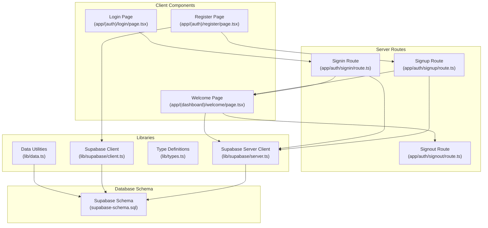
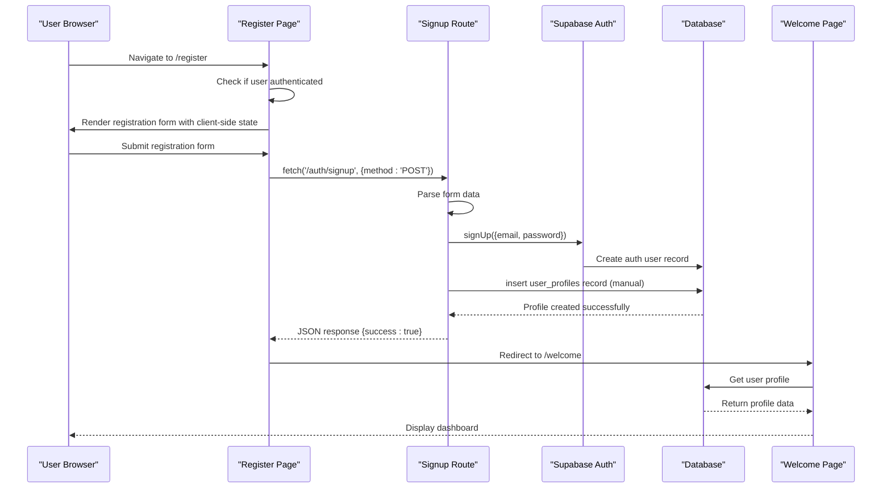
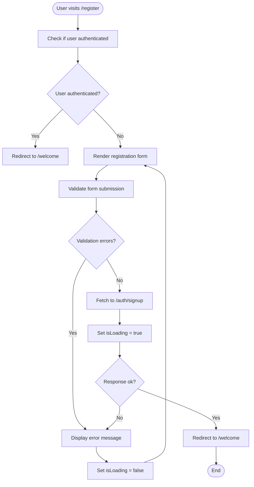
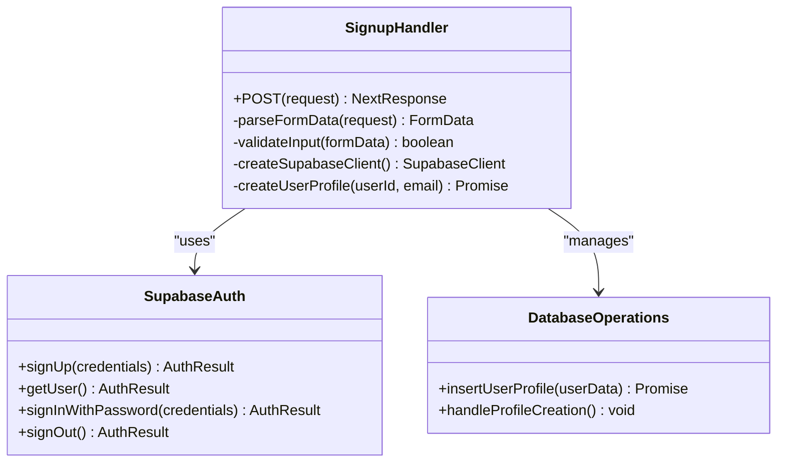
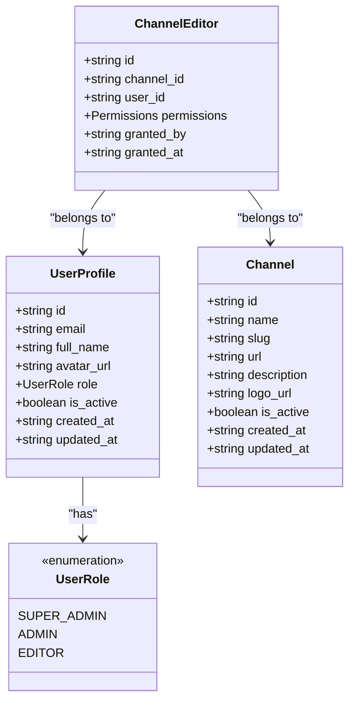
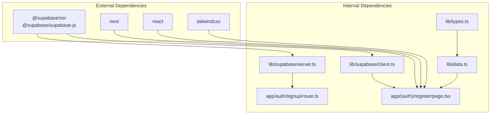

# User Registration

<cite>
**Referenced Files in This Document**
- [app/(auth)/register/page.tsx](file://app/(auth)/register/page.tsx)
- [app/auth/signup/route.ts](file://app/auth/signup/route.ts)
- [app/(auth)/login/page.tsx](file://app/(auth)/login/page.tsx)
- [app/auth/signin/route.ts](file://app/auth/signin/route.ts)
- [app/(dashboard)/welcome/page.tsx](file://app/(dashboard)/welcome/page.tsx)
- [app/auth/signout/route.ts](file://app/auth/signout/route.ts)
- [lib/supabase/server.ts](file://lib/supabase/server.ts)
- [lib/supabase/client.ts](file://lib/supabase/client.ts)
- [lib/types.ts](file://lib/types.ts)
- [lib/data.ts](file://lib/data.ts)
- [supabase-schema.sql](file://supabase-schema.sql)
- [README.md](file://README.md)
</cite>

## Update Summary
**Changes Made**
- Registration page converted to client component with fetch-based authentication
- Registration form now uses identical client-side patterns as login page
- Enhanced validation, loading states, and improved error handling
- Manual user profile creation implemented in backend route
- Fetch requests to '/auth/signup' endpoint with comprehensive error handling
- Client-side state management for loading and error states

## Table of Contents
1. [Introduction](#introduction)
2. [Project Structure](#project-structure)
3. [Core Components](#core-components)
4. [Architecture Overview](#architecture-overview)
5. [Detailed Component Analysis](#detailed-component-analysis)
6. [Dependency Analysis](#dependency-analysis)
7. [Performance Considerations](#performance-considerations)
8. [Troubleshooting Guide](#troubleshooting-guide)
9. [Conclusion](#conclusion)

## Introduction
This document provides comprehensive documentation for the user registration functionality in the news management system. The system uses Supabase Auth for authentication and implements a complete user registration flow with manual profile creation through server-side database operations.

The registration process follows a modern Next.js App Router architecture with client-side components and server-side authentication handling. Users can register through a dedicated form that submits to a server route via fetch requests, which then creates a Supabase Auth account and manually generates a user profile in the database.

**Updated** The registration system now uses client components with fetch-based authentication, identical patterns to the login page, enhanced validation, loading states, and comprehensive error handling mechanisms.

## Project Structure
The user registration system is organized within the Next.js App Router structure with clear separation between client components, server routes, and shared libraries.



**Diagram sources**
- [app/(auth)/register/page.tsx:1-117](file://app/(auth)/register/page.tsx#L1-L117)
- [app/auth/signup/route.ts:1-65](file://app/auth/signup/route.ts#L1-L65)
- [lib/supabase/server.ts:1-30](file://lib/supabase/server.ts#L1-L30)
- [supabase-schema.sql:1-74](file://supabase-schema.sql#L1-L74)

**Section sources**
- [app/(auth)/register/page.tsx:1-117](file://app/(auth)/register/page.tsx#L1-L117)
- [app/auth/signup/route.ts:1-65](file://app/auth/signup/route.ts#L1-L65)
- [lib/supabase/server.ts:1-30](file://lib/supabase/server.ts#L1-L30)

## Core Components

### Registration Form Component
The registration interface is implemented as a Next.js Client Component that handles both rendering and authentication logic client-side. It validates user presence, displays error messages, and provides a secure form submission mechanism using fetch requests.

Key features:
- Client-side rendering with React state management
- Loading states during form submission
- Error handling with user-friendly error messages
- Fetch-based authentication to server routes
- Responsive design with Tailwind CSS
- Identical client-side patterns as the login page

**Updated** Now uses client components with fetch-based authentication, identical patterns to the login page, enhanced validation, loading states, and comprehensive error handling.

### Server Route Handler
The server route processes registration requests securely, handling form data validation, Supabase authentication, and manual user profile creation. It implements proper error handling with JSON responses and maintains session state.

**Updated** Enhanced error handling with comprehensive try-catch blocks, manual user profile creation in the database, and improved user feedback for registration failures.

### Supabase Integration Layer
The system uses two distinct Supabase clients:
- Server client for SSR operations and database queries
- Browser client for client-side operations
- Environment variable configuration for production deployment

**Section sources**
- [app/(auth)/register/page.tsx:1-117](file://app/(auth)/register/page.tsx#L1-L117)
- [app/auth/signup/route.ts:1-65](file://app/auth/signup/route.ts#L1-L65)
- [lib/supabase/server.ts:1-30](file://lib/supabase/server.ts#L1-L30)

## Architecture Overview

The user registration architecture follows a modern client-server pattern with clear separation of concerns:



**Diagram sources**
- [app/(auth)/register/page.tsx:11-37](file://app/(auth)/register/page.tsx#L11-L37)
- [app/auth/signup/route.ts:4-56](file://app/auth/signup/route.ts#L4-L56)
- [supabase-schema.sql:30-51](file://supabase-schema.sql#L30-L51)

The architecture ensures:
- **Security**: All authentication logic runs on the server
- **Client-side Responsiveness**: Real-time loading states and error handling
- **Manual Profile Management**: Direct database operations for profile creation
- **Enhanced Error Handling**: Comprehensive error management with user-friendly messages

## Detailed Component Analysis

### Registration Form Component Analysis

The registration page is implemented as a Client Component that provides several key functionalities:



**Diagram sources**
- [app/(auth)/register/page.tsx:6-37](file://app/(auth)/register/page.tsx#L6-L37)

Key implementation details:
- **Client-side state management**: Uses React hooks for error and loading states
- **Fetch-based authentication**: Submits form data via fetch requests to server routes
- **Enhanced Error Handling**: Comprehensive error display with user-friendly messages
- **Loading States**: Visual feedback during form submission
- **Form validation**: Client-side validation with HTML5 attributes and React state

**Updated** The registration form now uses client components with fetch-based authentication, identical patterns to the login page, enhanced validation, loading states, and comprehensive error handling.

**Section sources**
- [app/(auth)/register/page.tsx:1-117](file://app/(auth)/register/page.tsx#L1-L117)

### Server Route Handler Analysis

The signup route implements robust server-side processing with manual profile creation:



**Diagram sources**
- [app/auth/signup/route.ts:4-64](file://app/auth/signup/route.ts#L4-L64)
- [supabase-schema.sql:30-74](file://supabase-schema.sql#L30-L74)

Implementation characteristics:
- **Input validation**: Checks for missing form fields
- **Enhanced Error Handling**: Comprehensive try-catch blocks with JSON error responses
- **Manual Profile Creation**: Direct database insertion instead of relying on triggers
- **Session management**: Automatic session creation upon successful registration
- **Profile synchronization**: Manual database operations for profile creation

**Updated** Error handling now includes comprehensive try-catch blocks, manual user profile creation in the database, and improved user feedback for registration failures.

**Section sources**
- [app/auth/signup/route.ts:1-65](file://app/auth/signup/route.ts#L1-L65)

### Database Schema and Profile Management

The system uses Supabase's built-in authentication with custom profile management through direct database operations:

```mermaid
erDiagram
AUTH_USERS {
uuid id PK
email varchar email
email_confirmed_at timestamp
last_sign_in_at timestamp
created_at timestamp
updated_at timestamp
}
USER_PROFILES {
uuid id PK
uuid auth_users_id FK
varchar email
varchar full_name
varchar avatar_url
varchar role
boolean is_active
timestamp created_at
timestamp updated_at
}
CHANNEL_EDITORS {
uuid id PK
uuid channel_id FK
uuid user_id FK
jsonb permissions
uuid granted_by FK
timestamp granted_at
}
AUTH_USERS ||--|| USER_PROFILES : "has profile"
USER_PROFILES ||--o{ CHANNEL_EDITORS : "assigned to"
```

**Diagram sources**
- [supabase-schema.sql:17-28](file://supabase-schema.sql#L17-L28)
- [supabase-schema.sql:48-51](file://supabase-schema.sql#L48-L51)

**Section sources**
- [supabase-schema.sql:1-74](file://supabase-schema.sql#L1-L74)

### Type System and Data Models

The system implements a comprehensive type definition system:



**Diagram sources**
- [lib/types.ts:1-62](file://lib/types.ts#L1-L62)

**Section sources**
- [lib/types.ts:1-62](file://lib/types.ts#L1-L62)

## Dependency Analysis

The user registration system has well-defined dependencies that support scalability and maintainability:



**Diagram sources**
- [package.json:11-27](file://package.json#L11-L27)
- [lib/supabase/server.ts:1-30](file://lib/supabase/server.ts#L1-L30)
- [lib/supabase/client.ts:1-9](file://lib/supabase/client.ts#L1-L9)

Key dependency characteristics:
- **Minimal external dependencies**: Only essential packages for authentication and UI
- **TypeScript integration**: Full type safety across the application
- **Environment-driven configuration**: Supabase credentials managed via environment variables
- **Modular architecture**: Clear separation between authentication, UI, and data layers

**Section sources**
- [package.json:1-30](file://package.json#L1-L30)
- [lib/supabase/server.ts:1-30](file://lib/supabase/server.ts#L1-L30)

## Performance Considerations

The registration system is designed for optimal performance through several architectural decisions:

### Client-Side Responsiveness
- **Real-time feedback**: Loading states and immediate error display
- **Reduced server load**: Client-side form validation reduces unnecessary requests
- **Improved user experience**: Fast form submission with visual feedback

### Server-Side Processing Benefits
- **Reduced client-side processing**: Authentication logic runs on the server
- **Improved security**: Sensitive operations remain server-side
- **Consistent error handling**: Standardized error responses across all routes

### Database Optimization
- **Direct profile creation**: Eliminates trigger dependency for profile creation
- **Efficient queries**: Minimal database operations for user verification
- **Connection pooling**: Supabase client manages connection efficiency

### Enhanced Error Handling Performance
- **Comprehensive error handling**: Standardized error responses reduce branching complexity
- **User experience optimization**: Proper error presentation improves conversion rates
- **Client-side state management**: Efficient React state updates for loading and error states

## Troubleshooting Guide

Common issues and their solutions:

### Registration Form Issues
**Problem**: Form validation fails or redirects incorrectly
- **Cause**: Missing form fields or invalid email format
- **Solution**: Ensure all required fields are filled and email format is valid
- **Debugging**: Check browser console for validation errors

**Updated** **Enhanced Client-Side Error Handling**: Error messages now display immediately with loading states and proper user feedback.

### Authentication Errors
**Problem**: Registration succeeds but user cannot access dashboard
- **Cause**: Session not properly established or database operation failure
- **Solution**: Verify Supabase authentication provider is enabled
- **Debugging**: Check Supabase logs for authentication errors and database operations

**Updated** **Improved Error Feedback**: Registration failures now provide comprehensive error messages with proper JSON response handling.

### Database Connection Issues
**Problem**: User registration appears successful but profile not created
- **Cause**: Database operation failure or connection timeout
- **Solution**: Verify database schema matches expected structure
- **Debugging**: Check database logs for insert operation errors

**Updated** **Manual Profile Creation**: The system now uses direct database operations instead of triggers, providing more control over profile creation.

### Environment Configuration
**Problem**: Application fails to connect to Supabase
- **Cause**: Missing or incorrect environment variables
- **Solution**: Verify NEXT_PUBLIC_SUPABASE_URL and NEXT_PUBLIC_SUPABASE_ANON_KEY
- **Debugging**: Check server logs for connection errors

**Updated** **Consistent Client-Side Patterns**: Both registration and login pages now use identical fetch-based authentication patterns for better maintainability.

**Section sources**
- [app/auth/signup/route.ts:25-30](file://app/auth/signup/route.ts#L25-L30)
- [README.md:71-92](file://README.md#L71-L92)

## Conclusion

The user registration system demonstrates a well-architected approach to authentication in modern web applications. By leveraging Supabase Auth with manual profile management, the system achieves:

- **Security**: All sensitive authentication logic runs server-side
- **Client-side Responsiveness**: Real-time loading states and immediate error feedback
- **Maintainability**: Clean separation of concerns with modular architecture
- **Enhanced User Experience**: Seamless registration flow with comprehensive error handling
- **Consistent Patterns**: Identical client-side authentication patterns as the login page
- **Manual Control**: Direct database operations for profile creation without trigger dependencies

**Updated** The recent enhancements focus on improving user experience through client-side components with fetch-based authentication, identical patterns to the login page, enhanced validation, loading states, and comprehensive error handling. The manual user profile creation provides better control over the registration process while maintaining security and reliability.

The implementation follows Next.js best practices while maintaining flexibility for future enhancements. The system provides a solid foundation for building complex authentication workflows while keeping the codebase clean and maintainable.