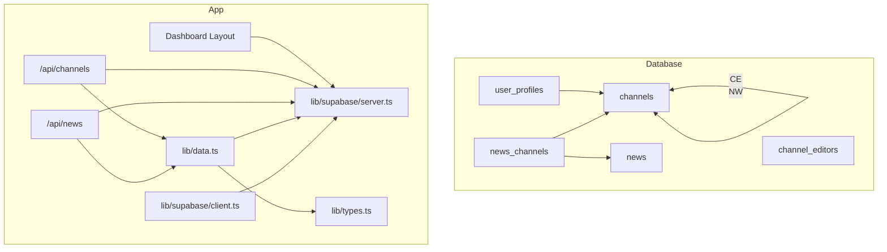
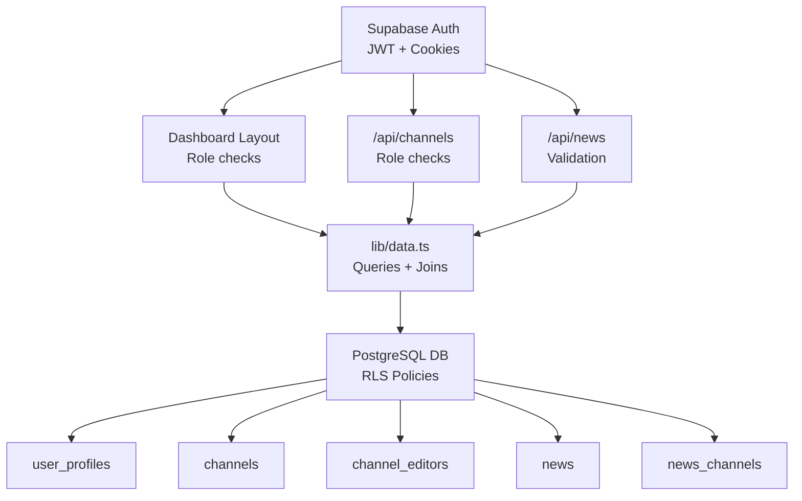
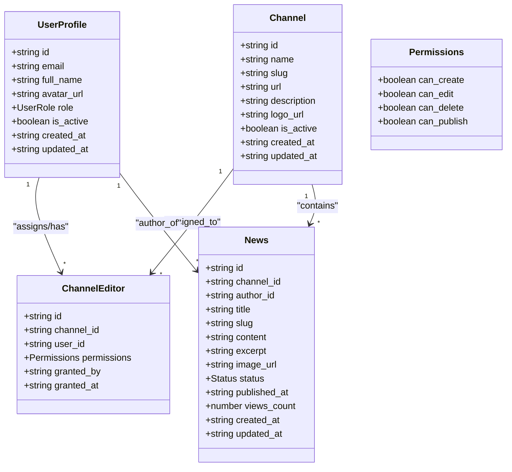
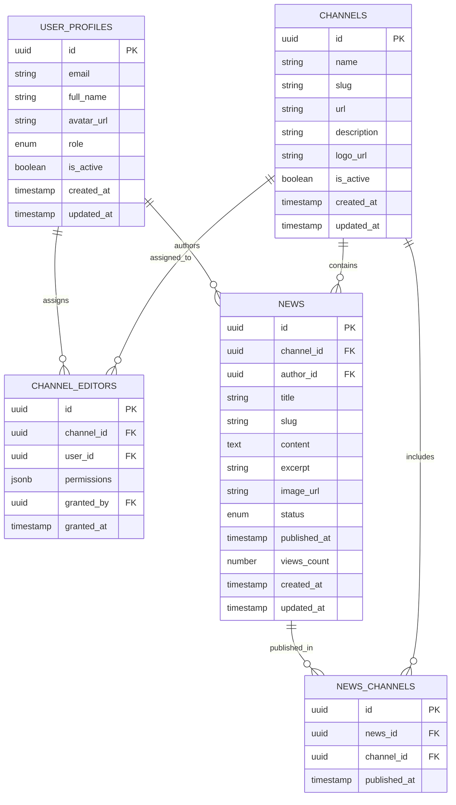
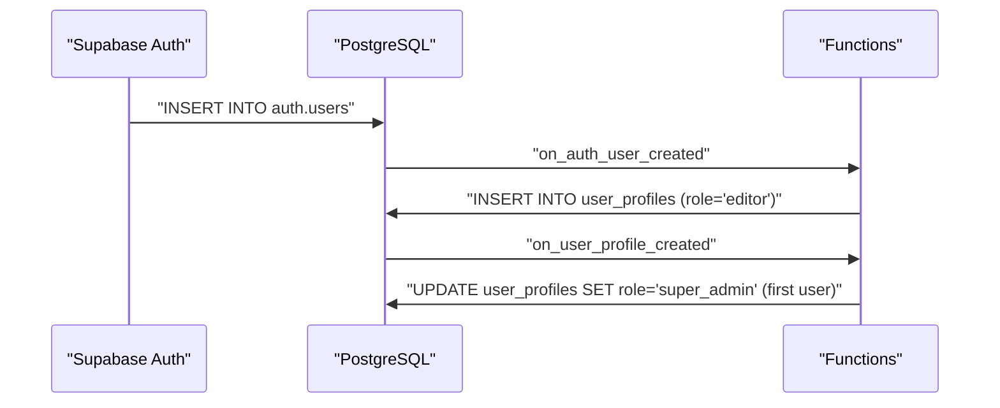
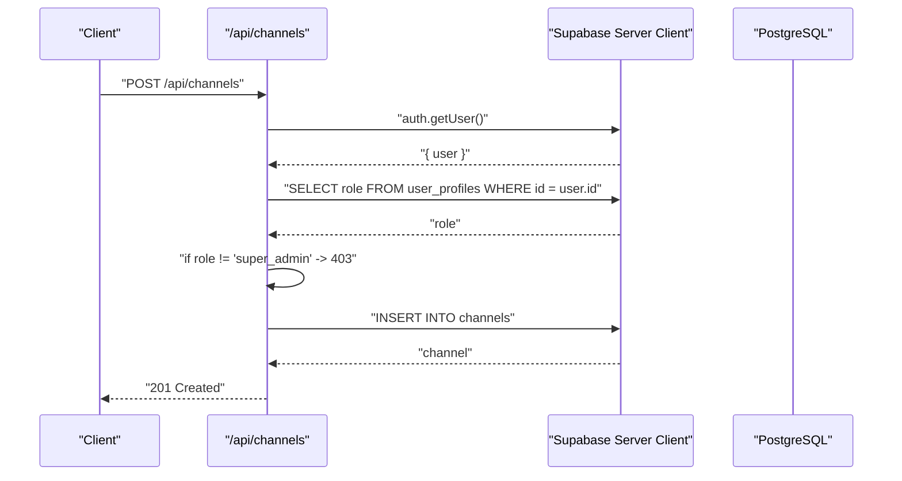
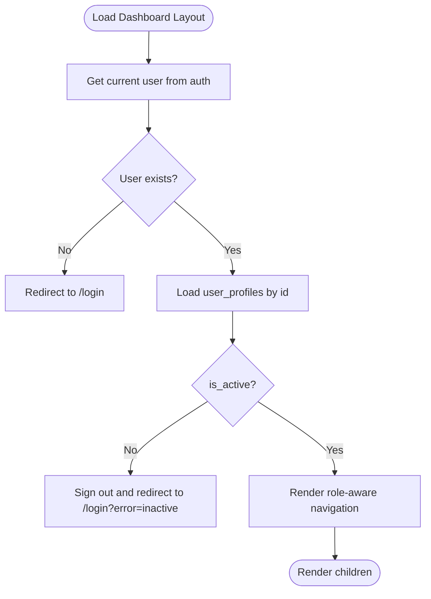
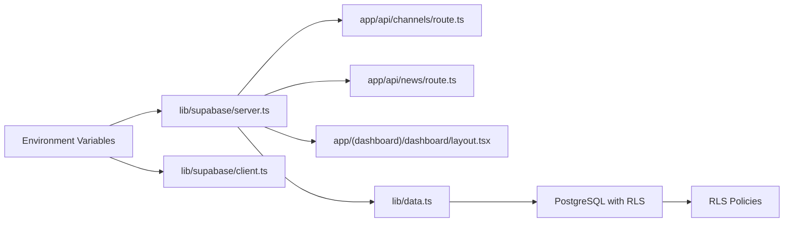

# User Roles and Permissions

<cite>
**Referenced Files in This Document**
- [supabase-schema.sql](file://supabase-schema.sql)
- [types.ts](file://lib/types.ts)
- [server.ts](file://lib/supabase/server.ts)
- [client.ts](file://lib/supabase/client.ts)
- [data.ts](file://lib/data.ts)
- [route.ts](file://app/api/channels/route.ts)
- [route.ts](file://app/api/news/route.ts)
- [layout.tsx](file://app/(dashboard)/dashboard/layout.tsx)
- [page.tsx](file://app/(auth)/login/page.tsx)
- [route.ts](file://app/auth/signin/route.ts)
- [route.ts](file://app/auth/signout/route.ts)
- [ARCHITECTURE.md](file://ARCHITECTURE.md)
- [README.md](file://README.md)
</cite>

## Table of Contents
1. [Introduction](#introduction)
2. [Project Structure](#project-structure)
3. [Core Components](#core-components)
4. [Architecture Overview](#architecture-overview)
5. [Detailed Component Analysis](#detailed-component-analysis)
6. [Dependency Analysis](#dependency-analysis)
7. [Performance Considerations](#performance-considerations)
8. [Troubleshooting Guide](#troubleshooting-guide)
9. [Conclusion](#conclusion)
10. [Appendices](#appendices)

## Introduction
This document explains the role-based access control (RBAC) system used to secure a multi-channel news platform. It covers the three-tier role hierarchy, permission matrix, database-level enforcement via Supabase Row Level Security (RLS), and practical examples of role assignment, permission checks, and access control enforcement in API routes and components. It also documents user profile management, the channel_editor relationship table, and granular permissions per channel.

## Project Structure
The RBAC system spans database definitions, TypeScript types, server-side Supabase client utilities, API routes, and dashboard components:
- Database schema defines tables, RLS policies, and triggers for automatic role assignment.
- Types define the role model and data structures used across the app.
- Server utilities encapsulate Supabase client creation with cookie handling.
- API routes enforce role checks and delegate to shared data utilities.
- Dashboard components render role-aware navigation and enforce session and role checks.

**Diagram sources**
- [supabase-schema.sql:17-127](file://supabase-schema.sql#L17-L127)
- [layout.tsx](file://app/(dashboard)/dashboard/layout.tsx#L1-L90)
- [route.ts:1-71](file://app/api/channels/route.ts#L1-L71)
- [route.ts:1-58](file://app/api/news/route.ts#L1-L58)
- [data.ts:1-213](file://lib/data.ts#L1-L213)
- [types.ts:1-62](file://lib/types.ts#L1-L62)
- [client.ts:1-9](file://lib/supabase/client.ts#L1-L9)
- [server.ts:1-30](file://lib/supabase/server.ts#L1-L30)

**Section sources**
- [supabase-schema.sql:1-247](file://supabase-schema.sql#L1-L247)
- [types.ts:1-62](file://lib/types.ts#L1-L62)
- [server.ts:1-30](file://lib/supabase/server.ts#L1-L30)
- [client.ts:1-9](file://lib/supabase/client.ts#L1-L9)
- [data.ts:1-213](file://lib/data.ts#L1-L213)
- [layout.tsx](file://app/(dashboard)/dashboard/layout.tsx#L1-L90)
- [route.ts:1-71](file://app/api/channels/route.ts#L1-L71)
- [route.ts:1-58](file://app/api/news/route.ts#L1-L58)

## Core Components
- Role hierarchy:
  - super_admin: Full system administration.
  - admin: Channel-specific management.
  - editor: Content creation and editing permissions.
- Permission matrix (high level):
  - Channels: Public viewable; super_admin manages; admin may manage assigned channels depending on UI and policies.
  - News: Published visible to all; authors and editors can view and manage; granular permissions enforced per channel.
  - User profiles: Visible to all; self-update allowed; super_admin manages all.
  - Channel editors: Visible to all; super_admin manages assignments and permissions.
- Implementation:
  - Supabase RLS policies govern access.
  - Supabase auth provides JWT and session cookies.
  - Shared data utilities centralize queries and joins.

**Section sources**
- [types.ts:1-12](file://lib/types.ts#L1-L12)
- [supabase-schema.sql:147-247](file://supabase-schema.sql#L147-L247)
- [README.md:287-302](file://README.md#L287-L302)
- [ARCHITECTURE.md:266-316](file://ARCHITECTURE.md#L266-L316)

## Architecture Overview
The RBAC architecture enforces security across four layers:
1. Authentication: Supabase Auth with JWT and secure cookies.
2. Authorization: Role checks in API routes and UI.
3. Database-level RLS: Policies applied to all tables.
4. API security: Validation, CORS, rate limiting, and SQL injection prevention.

**Diagram sources**
- [route.ts:1-31](file://app/auth/signin/route.ts#L1-L31)
- [layout.tsx](file://app/(dashboard)/dashboard/layout.tsx#L1-L90)
- [route.ts:1-71](file://app/api/channels/route.ts#L1-L71)
- [route.ts:1-58](file://app/api/news/route.ts#L1-L58)
- [data.ts:1-213](file://lib/data.ts#L1-L213)
- [supabase-schema.sql:147-247](file://supabase-schema.sql#L147-L247)

## Detailed Component Analysis

### Role Model and Data Types
- Role type and user profile shape define the role hierarchy and attributes.
- ChannelEditor includes granular permissions per channel.

**Diagram sources**
- [types.ts:1-62](file://lib/types.ts#L1-L62)

**Section sources**
- [types.ts:1-62](file://lib/types.ts#L1-L62)

### Database Schema and RLS Policies
- Tables:
  - user_profiles: stores roles and metadata.
  - channels: site/news sources.
  - channel_editors: many-to-many with permissions JSONB.
  - news: content with status and author.
  - news_channels: many-to-many for multi-channel publishing.
- RLS policies:
  - channels: public select for active channels; super_admin can manage all.
  - user_profiles: select all; self-update; super_admin manages all.
  - channel_editors: select all; super_admin manages all.
  - news: published selectable by all; authors and editors can view/manage; granular edit permission enforced.
  - news_channels: select all; authors/editors can manage via joined news/channel context.

**Diagram sources**
- [supabase-schema.sql:4-127](file://supabase-schema.sql#L4-L127)
- [supabase-schema.sql:147-247](file://supabase-schema.sql#L147-L247)

**Section sources**
- [supabase-schema.sql:4-127](file://supabase-schema.sql#L4-L127)
- [supabase-schema.sql:147-247](file://supabase-schema.sql#L147-L247)

### Role Assignment and Auto-Promotion
- First user created is automatically promoted to super_admin.
- Subsequent users default to editor.
- Triggers and functions manage lifecycle.

**Diagram sources**
- [supabase-schema.sql:30-74](file://supabase-schema.sql#L30-L74)

**Section sources**
- [supabase-schema.sql:30-74](file://supabase-schema.sql#L30-L74)

### Permission Matrix
- Channels:
  - Select: Everyone (active).
  - Manage: super_admin.
- User profiles:
  - Select: Everyone.
  - Update: Self.
  - Manage: super_admin.
- Channel editors:
  - Select: Everyone.
  - Manage: super_admin.
- News:
  - Select: Published.
  - Manage: Author or editor with can_edit on the channel’s permissions.
- News channels:
  - Select: Everyone.
  - Manage: Editors with access to the news’ channel.

**Section sources**
- [supabase-schema.sql:154-247](file://supabase-schema.sql#L154-L247)
- [README.md:287-302](file://README.md#L287-L302)

### API Routes and Access Control Enforcement
- /api/channels:
  - Requires authentication.
  - Checks user role = super_admin.
  - Creates channels with provided fields.
- /api/news:
  - Requires authentication.
  - Validates required fields.
  - Creates draft news with author_id set to current user.

**Diagram sources**
- [route.ts:26-70](file://app/api/channels/route.ts#L26-L70)

**Section sources**
- [route.ts:1-71](file://app/api/channels/route.ts#L1-L71)
- [route.ts:1-58](file://app/api/news/route.ts#L1-L58)

### Dashboard Components and Role-Aware Navigation
- Dashboard layout:
  - Enforces authentication and active status.
  - Loads user profile to display role badge.
  - Renders role-aware navigation links.
- Login page:
  - Redirects authenticated users to dashboard.
  - Handles sign-in form submission.

**Diagram sources**
- [layout.tsx](file://app/(dashboard)/dashboard/layout.tsx#L1-L90)
- [page.tsx](file://app/(auth)/login/page.tsx#L1-L42)

**Section sources**
- [layout.tsx](file://app/(dashboard)/dashboard/layout.tsx#L1-L90)
- [page.tsx](file://app/(auth)/login/page.tsx#L1-L42)

### Supabase Client Utilities
- Server client:
  - Uses Next.js cookies to refresh sessions and maintain auth state.
- Browser client:
  - SSR-friendly client for browser-side operations.

**Section sources**
- [server.ts:1-30](file://lib/supabase/server.ts#L1-L30)
- [client.ts:1-9](file://lib/supabase/client.ts#L1-L9)

### Shared Data Utilities
- getCurrentUser: loads profile for current user.
- getUserChannels: lists channels assigned to a user via channel_editors join.
- getChannelEditors: lists editors for a channel with user details.
- getAllChannels: retrieves active channels.
- getPublishedNews, getNewsById, createNews, updateNews, publishNews: encapsulate queries and joins for news operations.

**Section sources**
- [data.ts:1-213](file://lib/data.ts#L1-L213)

## Dependency Analysis
- Supabase client utilities depend on environment variables for Supabase URL and keys.
- API routes depend on server client and shared data utilities.
- Dashboard layout depends on server client and auth state.
- RLS policies depend on auth.uid() and user_profiles role.

**Diagram sources**
- [server.ts:1-30](file://lib/supabase/server.ts#L1-L30)
- [client.ts:1-9](file://lib/supabase/client.ts#L1-L9)
- [route.ts:1-71](file://app/api/channels/route.ts#L1-L71)
- [route.ts:1-58](file://app/api/news/route.ts#L1-L58)
- [layout.tsx](file://app/(dashboard)/dashboard/layout.tsx#L1-L90)
- [data.ts:1-213](file://lib/data.ts#L1-L213)
- [supabase-schema.sql:147-247](file://supabase-schema.sql#L147-L247)

**Section sources**
- [server.ts:1-30](file://lib/supabase/server.ts#L1-L30)
- [client.ts:1-9](file://lib/supabase/client.ts#L1-L9)
- [route.ts:1-71](file://app/api/channels/route.ts#L1-L71)
- [route.ts:1-58](file://app/api/news/route.ts#L1-L58)
- [layout.tsx](file://app/(dashboard)/dashboard/layout.tsx#L1-L90)
- [data.ts:1-213](file://lib/data.ts#L1-L213)
- [supabase-schema.sql:147-247](file://supabase-schema.sql#L147-L247)

## Performance Considerations
- Indexes on frequently filtered columns (e.g., channels.slug, user_profiles.role, news.status) improve query performance under load.
- Prefer selective queries with filters (e.g., is_active, status) to minimize result sets.
- Use joins in shared utilities to avoid N+1 queries in UI components.

[No sources needed since this section provides general guidance]

## Troubleshooting Guide
Common permission-related issues and resolutions:
- Unauthorized or Forbidden responses from /api/channels:
  - Ensure the user is authenticated and has role = super_admin.
  - Verify the user_profiles role is correctly set.
- Editor cannot manage news:
  - Confirm the editor is assigned to the channel via channel_editors.
  - Verify permissions JSONB includes can_edit = true for the target channel.
- Published news not visible:
  - Ensure news.status = published.
- Self-update errors:
  - Only the profile owner can update their record; confirm the request uses the authenticated user’s id.
- Role badge not updating:
  - Ensure the dashboard layout reloads the user profile after login.

Operational checks:
- Confirm RLS is enabled on all relevant tables.
- Validate triggers for auto-promotion and profile creation are present.
- Check environment variables for Supabase URL and keys.

**Section sources**
- [route.ts:26-44](file://app/api/channels/route.ts#L26-L44)
- [supabase-schema.sql:147-247](file://supabase-schema.sql#L147-L247)
- [layout.tsx](file://app/(dashboard)/dashboard/layout.tsx#L1-L90)

## Conclusion
The RBAC system combines Supabase Auth, role-based checks in API routes, and robust RLS policies to secure multi-channel news management. The three-tier hierarchy (super_admin, admin, editor) is enforced at both the application and database levels, with granular permissions managed per channel through the channel_editors table. Following the best practices outlined here ensures predictable, secure, and maintainable access control.

[No sources needed since this section summarizes without analyzing specific files]

## Appendices

### Practical Examples

- Role assignment:
  - First user registration automatically grants super_admin.
  - Subsequent registrations default to editor.
  - Assign editors to channels and grant granular permissions (can_create, can_edit, can_delete, can_publish).

- Permission checking in API routes:
  - Use auth.getUser() to obtain the current user.
  - Query user_profiles to validate role before performing privileged operations.

- Access control enforcement:
  - RLS policies restrict reads/writes based on role and permissions.
  - Use shared data utilities to centralize queries and joins for consistent behavior.

- User profile management:
  - Profiles are created automatically on sign-up and updated on subsequent requests.
  - Super_admin can manage all profiles; users can update their own profile.

- Channel_editor relationship:
  - Many-to-many mapping between users and channels.
  - Permissions stored as JSONB for flexible, per-channel rights.

**Section sources**
- [supabase-schema.sql:30-74](file://supabase-schema.sql#L30-L74)
- [supabase-schema.sql:76-85](file://supabase-schema.sql#L76-L85)
- [route.ts:26-44](file://app/api/channels/route.ts#L26-L44)
- [data.ts:1-213](file://lib/data.ts#L1-L213)
- [layout.tsx](file://app/(dashboard)/dashboard/layout.tsx#L1-L90)